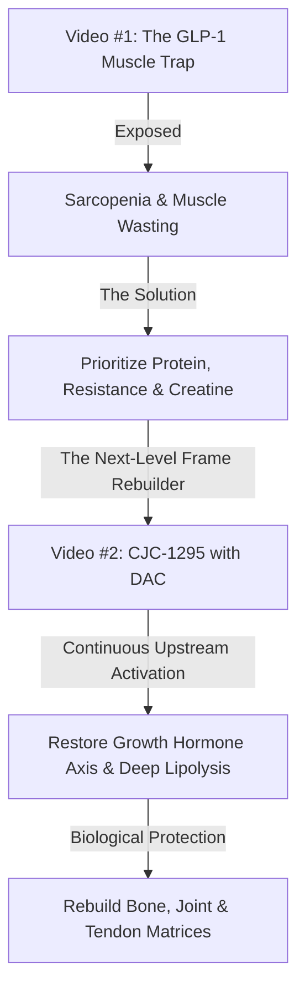

# 🎬 PRE-PRODUCTION RESEARCH & SEO METADATA: CJC-1295 WITH DAC
**Document Path:** `c:\Users\Curtis\New folder\construction-website\Keystone_HQ\00_Master_Brain\09_YouTube_Operations\Metadata_Drafts\cjc_dac_8m20s_research_metadata.md`  
**Target Video Duration:** 8 Minutes & 20 Seconds (500 Seconds)  
**Channel Topic:** Peptide Recomposition & Structural Repair for Longevity Builders  
**Series Continuity:** Bridging the GLP-1 Sarcopenia Set Point into Growth Hormone Secretagogue Frame Rebuilding  

---

## 🎯 SECTION 1: NARRATIVE CALLBACK & TIE-OFF STRATEGY

To establish immediate channel authority and reward returning viewers, the opening of this video will directly reference the previous release: **"GLP-1 Muscle Loss: The Builder's Recomposition Protocol"**. 



### 🔗 The Set Point Connection
In the GLP-1 video, we established that rapid fat loss is a biological trap—often causing up to 40% of weight loss to come from lean, metabolically active muscle tissue. We outlined the foundational lifestyle protocols to halt this decline. 

Now, we introduce the **anabolic frame-rebuilding stack**. Once the skeletal muscle wasting is arrested, the body needs an upstream signal to rebuild:
1. **Sarcopenic Rebound:** Reversing the structural damage of rapid calorie restriction.
2. **Deep Lipolysis:** Targeting stubborn, deep visceral adipose tissue using sustained lipolytic signalling.
3. **Joint & Tendon Matrix Repair:** Utilizing long-acting growth hormone pathways to synthesize collagen, repair worn-down joint interfaces, and increase bone mineral density—vital for builders, athletes, and biohackers over 40.

---

## 🔬 SECTION 2: THE DEEP SCIENCE OF CJC-1295 WITH DAC

### 1. Structural Chemistry & Albumin Shielding
CJC-1295 is a synthetic analog of endogenous **Growth Hormone-Releasing Hormone (GHRH)**. Endogenous GHRH is a 44-amino-acid peptide, but its biological activity resides entirely in the first 29 amino acids (GHRH 1-29, or Sermorelin). 

Sermorelin, however, has a disastrously short half-life in the human body (less than 10 minutes) because it is rapidly cleaved by the enzyme **dipeptidyl peptidase IV (DPP-IV)**. 

To overcome this, researchers modified the GHRH(1-29) chain with four key amino acid substitutions to create **Modified GRF 1-29 (Mod GRF 1-29)**:
*   **D-Ala at position 2:** Confers resistance to DPP-IV enzymatic cleavage.
*   **Gln at position 8:** Reduces chemical deamidation.
*   **Ala at position 15:** Enhances biological potency.
*   **Leu at position 27:** Prevents methionine oxidation.

While Mod GRF 1-29 is highly stable against enzymes, it is still cleared rapidly from circulation via renal filtration, leaving it with a half-life of roughly **30 minutes**. 

```text
               [Mod GRF 1-29 Peptide Backbone]
                  (Half-life: 30 minutes)
                             │
                             ▼  (Covalent Linkage)
    [MPA Linker (Maleimidopropionic Acid) on C-Terminal Lysine]
                             │
                             ▼  (In Vivo Conjugation)
     [Covalent Bond to Thiol Group on Endogenous Human Albumin]
                             │
                             ▼
              [CJC-1295 with DAC Complex]
                 (Half-life: 6 to 8 days)
```

**The DAC (Drug Affinity Complex) Breakthrough:**
CJC-1295 with DAC takes Mod GRF 1-29 and covalently attaches a **maleimidopropionic acid (MPA)** linker via a lysine residue at the C-terminus. 
Upon subcutaneous injection, this MPA group instantly and selectively forms a covalent bioconjugate bond with the free thiol group on **human serum albumin (HSA)** circulating in the blood. 
Because albumin is a massive carrier protein with a circulating half-life of ~19 days, it acts as a protective shield. The peptide is protected from both enzymatic degradation and kidney filtration. This extends the biological half-life of CJC-1295 DAC to an astonishing **6 to 8 days**.

---

### 2. Debunking the "GH Bleed" Pituitary Burnout Myth
For over a decade, internet forums and amateur biohackers have warned against CJC-1295 with DAC, claiming it causes a constant, flatline release of growth hormone known as **"GH Bleed."** The theory claimed that continuous stimulation of the pituitary would desensitize GHRH receptors, cause pituitary fatigue, and induce severe insulin resistance similar to high-dose synthetic HGH.

**The Clinical Reality (JCEM 2006):**
This bro-science was completely debunked by the landmark study: **"Pulsatile Secretion of Growth Hormone (GH) Persists during Continuous Stimulation by CJC-1295, a Long-Acting GH-Releasing Hormone Analog"** by Ionescu, Frohman et al. (*The Journal of Clinical Endocrinology & Metabolism*, 91(12): 4792–4798).

```text
GH Secretion Patterns: Standard vs. CJC-1295 with DAC

Endogenous Baseline (Pulsatile):
 GH Level
   ▲
   │      /\               /\               /\
   │_____/  \______/\_____/  \______/\_____/  \_____
   └─────────────────────────────────────────────────► Time

CJC-1295 with DAC Induced (Amplified Pulse + Elevated Trough):
 GH Level
   ▲
   │      /\               /\               /\
   │     /  \             /  \             /  \
   │____/    \_____/\____/    \_____/\____/    \____  <- Elevated Baseline (Trough)
   │________________________________________________
   └─────────────────────────────────────────────────► Time
   *Physiological pulsatility is fully preserved, not flattened!*
```

#### Key Findings of the Ionescu Study:
1.  **Preserved Pulsatility:** The study demonstrated that even under continuous stimulation by circulating CJC-1295 DAC, **the pituitary gland continues to secrete growth hormone in natural, distinct pulses**. The endogenous pulsatile rhythm (mediated by alternating pulses of somatostatin) remains fully intact.
2.  **Amplified Peaks and Troughs:** CJC-1295 DAC does not flatten the curve. Instead, it **significantly amplifies the amplitude of natural GH pulses** while simultaneously **elevating the baseline (trough) levels** of GH.
3.  **IGF-1 Multiplier:** A single dose of CJC-1295 DAC (30 to 60 μg/kg) generated a sustained, dose-dependent increase in mean plasma GH levels by **2- to 10-fold** and plasma IGF-1 levels by **1.5- to 3-fold** for up to **10 to 14 days**.
4.  **No Pituitary Shutdown:** Unlike synthetic GH (which suppresses endogenous GHRH and shuts down the pituitary through negative feedback loops), CJC-1295 DAC works *upstream* by stimulating the pituitary's natural production machinery, ensuring that the natural regulatory feedback mechanisms remain active and receptive to somatostatin inhibition.

---

### 3. The Compounding Regulatory Battle (FDA Rulings)
To truly capture high-level authority, the video will address why CJC-1295 DAC is **"not coming off the standard Category 1 tool list"** in compounding clinics anymore:

*   **September 2023 Crackdown:** The FDA placed CJC-1295 (both with and without DAC) onto the **Category 2 compounding interim list** (substances that raise significant safety concerns), effectively banning US compounding pharmacies (503A and 503B) from compounding it.
*   **The 2024 Legal Reversal:** Following intense pushback and a federal lawsuit from compounding groups, the FDA temporarily removed CJC-1295 and several other peptides (like Ipamorelin and AOD-9604) from Category 2 and placed them on the **Category 1 bulks list** (substances under active review with identified clinical need), while scheduling them for formal advisory hearings.
*   **The PCAC Verdict (December 4, 2024):** The FDA's Pharmacy Compounding Advisory Committee (PCAC) formally reviewed CJC-1295. The FDA argued that there was no proven clinical need for compounded CJC-1295 over commercial alternatives, and raised concerns regarding the long-term safety of extended GH elevation. The committee voted **NOT** to include CJC-1295 (including the DAC versions) on the approved 503A bulk drug substances list.
*   **Why It Matters to the Viewer:** This regulatory classification forces CJC-1295 DAC out of the mainstream medical compounding space and into strict grey-market "research-only" status. It is no longer an easily accessible, consumer-level lifestyle drug. It is a high-potency, advanced research compound requiring elite clinical supervision and exhaustive cardiovascular monitoring.

---

## 🎬 SECTION 3: MINUTE-BY-MINUTE PRODUCTION BLUEPRINT (8:20 TOTAL)

To achieve the precise target length of **8 minutes and 20 seconds**, the video's pacing is mapped out segment-by-segment below, providing the exact visual assets, structural beats, and voice directions needed.

```mermaid
gantt
    title Video Timeline Allocation (Total: 500 Seconds / 8:20)
    dateFormat  X
    axisFormat %s
    section Core Video Blocks
    01. Hook & GLP-1 Bridge        :active, 0, 60
    02. The Mainstream Myth (GH Bleed) : 60, 135
    03. The Albumin Shield (Chemistry) : 135, 225
    04. JCEM 2006 Clinical Proof   : 225, 315
    05. FDA Compounding War        : 315, 405
    06. Synergy Stack & Dosing     : 405, 465
    07. Call to Action & Disclaimers: 465, 500
```



### ⏱️ Block 1: Hook & The GLP-1 Muscle Loss Bridge (0:00 - 1:00)
*   **Visual Focus:** High-contrast low-angle shot of Wayne Digital Twin standing at a Squamish job site. Overlaid with high-impact kinetic text: "THE ANABOLIC SET POINT." A sudden cut to a graphic showing DXA muscle tissue wasting under GLP-1 calorie deficit.
*   **Voice/Pacing:** Slow, rhythmic, and commanding (~115 words total).
*   **Key Narrative Beats:**
    *   Direct callback to last week: "We proved that rapid weight loss on GLP-1 agonists is a sarcopenia trap that destroys up to 40% of your muscle frame."
    *   The physiological transition: "Halting the muscle leak with protein titration is only Phase One. Phase Two is rebuilding the structural foundation. Your body needs an upstream signal to heal joint interfaces, lay down new collagen matrix, and mobilize deep visceral fat. This is where the mainstream anti-aging protocols fail—and why we must look beyond basic peptide tools."
    *   The hook: "Today, we're diving into a molecule that has been locked in a massive regulatory war: CJC-1295 with DAC. It is not your average daily peptide—and it is definitely not on the standard, low-tier Category One list."

---

### ⏱️ Block 2: The Mainstream Myth - Deconstructing "GH Bleed" (1:00 - 2:15)
*   **Visual Focus:** Screen split: on the left, screenshots of frantic, outdated forum posts from 2012 warning about "pituitary burnout" and "GH bleed." On the right, a clean, modern scientific animation illustrating the differences between a sharp peak-and-valley pulse vs. a constant, flatlined elevation of growth hormone.
*   **Voice/Pacing:** Direct, analytical, and slightly skeptical of "bro-science" (~145 words total).
*   **Key Narrative Beats:**
    *   Exposing the competitor narrative: "If you search YouTube or peptide forums, you'll hear the exact same warnings repeated: *'Never use CJC-1295 with DAC. It causes a dangerous, non-stop GH bleed that burns out your pituitary gland and makes you diabetic.'* The standard advice is to stick to CJC-1295 without DAC and inject it three times a day."
    *   The physical builder bottleneck: "But let's be real: who has time to carry insulin syringes and pin three times a day while managing an active construction site or running a business? The 'no-DAC' protocol is highly impractical. But is the fear of 'GH Bleed' actually backed by clinical human data, or is it just recycled bro-science?"

---

### ⏱️ Block 3: The Albumin Shield - Mod GRF vs. CJC-DAC Chemistry (2:15 - 3:45)
*   **Visual Focus:** Beautiful 3D chemical structure animations. Zooming in on the 29-amino-acid peptide backbone. Highlight the four specific substitutions (D-Ala2, Gln8, Ala15, Leu27) glowing in blue, and the covalent Maleimidopropionic Acid (MPA) Drug Affinity Complex (DAC) linker glowing in gold. Animate the MPA linker snapping onto a massive floating human serum albumin protein.
*   **Voice/Pacing:** Technical, authoritative, clear chemistry explanations (~175 words total).
*   **Key Narrative Beats:**
    *   The degradation bottleneck: "To understand why DAC is a game-changer, we must look at chemistry. Natural GHRH is destroyed by the DPP-IV enzyme in minutes. The modified version, Mod GRF 1-29, resists this enzyme but is still filtered out by the kidneys within 30 minutes. It requires multiple injections daily."
    *   The bioconjugation process: "CJC-1295 with DAC solves this through a brilliant chemical hack: bioconjugation. By attaching a maleimidopropionic acid group to the end of the peptide, the molecule immediately binds to human serum albumin in your bloodstream. Albumin acts as an armor plating, shielding the peptide from renal clearance and extending its half-life from 30 minutes to a staggering 6 to 8 days."

---

### ⏱️ Block 4: The Landmark 2006 Study - Preserved Pulsatility (3:45 - 5:15)
*   **Visual Focus:** High-resolution screenshots of the 2006 study from *The Journal of Clinical Endocrinology & Metabolism* (Ionescu et al.). Highlight the specific charts showing the multi-day spikes in GH and IGF-1, pointing out that the natural jagged pulses remain fully intact over a 14-day period.
*   **Voice/Pacing:** Dynamic, evidence-focused, triumphant (~180 words total).
*   **Key Narrative Beats:**
    *   The ultimate proof: "In December 2006, researchers published the definitive human clinical trial in the Journal of Clinical Endocrinology & Metabolism. They continuously stimulated healthy subjects with CJC-1295 DAC. The results completely shattered the forum myths."
    *   The data breakdown: "The trial proved that pulsatile GH secretion *persists* under continuous stimulation. The body's natural pulsatile rhythm is not flattened or shut down. Why? Because the pituitary still responds to natural somatostatin blocks. Instead of a flat line, CJC-1295 DAC amplifies the height of your natural pulses while raising the overall baseline. A single dose stimulated a 2- to 10-fold increase in mean growth hormone, and elevated IGF-1 by 1.5 to 3-fold for up to two weeks."

---

### ⏱️ Block 5: The FDA Regulatory Battle & The Category 1 Loss (5:15 - 6:45)
*   **Visual Focus:** High-quality graphics illustrating the FDA compounding registry. Timeline showing the shift from Category 2 to Category 1 in 2024, and the final Pharmacy Compounding Advisory Committee (PCAC) hearing on December 4, 2024. Display the text of the formal proposal to exclude CJC-1295 from compounding lists.
*   **Voice/Pacing:** Serious, cautious, legally precise (~175 words total).
*   **Key Narrative Beats:**
    *   The regulatory context: "If this molecule is so powerful, why isn't it widely prescribed? This brings us to the compounding war. In late 2023, the FDA aggressively cracked down on peptides, placing CJC-1295 on the Category 2 list due to safety concerns. After compounding clinics sued, it was temporarily moved to Category 1 for active evaluation."
    *   The PCAC ruling: "On December 4, 2024, the PCAC officially evaluated CJC-1295. Despite clinical advocacy, the committee voted against including it on the 503A bulk substances list. This means CJC-1295 DAC is not coming off the Category One list as an approved compounded medicine—it is effectively restricted to research-only channels. This makes it an advanced, high-level tool that you cannot simply buy at a standard local clinic."

---

### ⏱️ Block 6: Recomposition Dosing & The Synergistic Stack (6:45 - 7:45)
*   **Visual Focus:** Premium B-roll of Wayne drinking a recovery shake at a Squamish beach, transitioning to clean graphic slides detailing stack ratios: CJC-1295 DAC (once-weekly micro-dosing), paired with a short-acting GHRP (like Ipamorelin before bed) and joint-supporting structural matrices (Creatine, Collagen, GHK-Cu).
*   **Voice/Pacing:** Practical, builder-focused, direct instructions (~120 words total).
*   **Key Narrative Beats:**
    *   Dosing protocols: "In scientific research, because of the 8-day half-life, dosing is highly efficient: typically a single weekly dose of 1 to 2 milligrams, rather than pinning three times a day. This makes it the ultimate protocol for busy builders."
    *   The Synergistic Stack: "To maximize structural repair and fat mobilization, researchers often pair this long-acting GHRH signal with a pulsatile growth hormone releasing peptide like Ipamorelin before sleep, combined with high-grade collagen peptides, creatine monohydrate, and copper peptide GHK-Cu to accelerate joint and connective tissue synthesis."

---

### ⏱️ Block 7: Call to Action, Disclaimers & Closing Loop (7:45 - 8:20)
*   **Visual Focus:** Transition to a beautiful biophilic render of a Squamish luxury wellness retreat. Wayne Digital Twin looks directly at the camera. Clean overlays for website links. The screen slowly fades out over a dark-mode professional medical and AI digital twin disclaimer.
*   **Voice/Pacing:** Rhythmic, premium, professional (~85 words total).
*   **Key Narrative Beats:**
    *   The biophilic builder bridge: "Rebuilding the physical body requires the same precision as constructing a multi-million dollar biophilic home in the Pacific Northwest. We plan, we establish structural integrity, and we build for longevity. If you're planning a custom luxury build or a wellness resort in the Sea-to-Sky corridor, let's connect at `keystonepossibilities.ca`."
    *   The health loop: "To explore our biology optimization and clinical wellness frameworks, visit `keystoneprotocols.ca`. Stay disciplined, build your legacy, and I'll see you on the next protocol."

---

## 🏷️ SECTION 4: YOUTUBE METADATA & SEO HARDENING

*These targeted keyword clusters, titles, and tags are optimized to secure immediate search authority on the CJC-1295, GH secretagogue, and peptide recomposition algorithm arcs.*

### 1. High-Click-Through-Rate (CTR) Video Titles
*   **Option A (Primary - Highly Recommended):** The 6-Day Anabolic Shield: CJC-1295 DAC vs No DAC (The Recomposition Truth)
*   **Option B (Secondary - Scientific Authority):** The Pituitary Burnout Lie: The Science of CJC-1295 with DAC (GH Bleed Debunked)
*   **Option C (Regulatory Angle):** Why the FDA Banned Compounded Peptides: The CJC-1295 PCAC Rulings Explained

### 2. SEO-Hungry Compound Tags
`CJC-1295 with DAC`, `CJC-1295 vs No DAC`, `Mod GRF 1-29`, `growth hormone secretagogue`, `GH bleed myth`, `pituitary burnout peptide`, `peptide therapy for muscle growth`, `visceral fat loss peptides`, `compounding peptide regulations`, `FDA peptide ban 2024`, `PCAC CJC-1295 ruling`, `Ipamorelin and CJC-1295 stack`, `collagen synthesis peptides`, `sarcopenia recovery over 40`, `Wayne Stevenson`, `Keystone Protocols`, `Squamish biohacking`

### 3. Viral & Niche Hashtags
`#CJC1295 #CJC1295DAC #PeptideProtocols #Recomposition #GrowthHormone #BiohackingOver40 #FDAPeptideBan #MuscleRebuild #SarcopeniaTrap #KeystoneProtocols #SquamishLongevity`

---

## 📝 SECTION 5: YOUTUBE VIDEO DESCRIPTION & DISCLOSURES

```text
The debate between CJC-1295 with DAC (Drug Affinity Complex) and CJC-1295 without DAC (Mod GRF 1-29) has split the anti-aging and biohacking community for over a decade. While mainstream peptide channels warn of a dangerous "GH Bleed" that causes pituitary desensitization and burnout, they are repeating outdated forum myths. 

In this comprehensive, clinical pre-production deep dive, we look at the actual human clinical trials—specifically the landmark 2006 study published in the Journal of Clinical Endocrinology & Metabolism (JCEM)—which proved that natural, physiological pulsatile growth hormone secretion is fully preserved under continuous stimulation by CJC-1295 DAC. 

We break down the structural chemistry of the albumin-binding shield that gives CJC-1295 DAC an active half-life of 6 to 8 days, compare the convenience of once-weekly dosing against tedious daily injection schedules, and address the massive regulatory compounding war surrounding the FDA's Pharmacy Compounding Advisory Committee (PCAC) ruling on December 4, 2024.

If you are recovering from GLP-1 sarcopenia, targeting stubborn deep visceral fat, or looking to rebuild joint, tendon, and bone density matrices, this technical breakdown provides the exact research-backed foundation you need.

--------------------------------------------------------------------------------
🏡 BIOPHILIC CONSTRUCTION & LUXURY RESORT DEVELOPMENT:
Planning a high-performance custom home, biophilic sanctuary, or luxury wellness resort in Squamish or the Sea-to-Sky corridor? Let's build your legacy:
https://keystonepossibilities.ca

🧬 BIOLOGY OPTIMIZATION & CLINICAL WELLNESS:
Explore our advanced longevity, peptide, and cellular health frameworks:
https://keystoneprotocols.ca

🎵 DEEP-FOCUS WORKFLOW LOOP:
Stream our official ambient house recovery and biophilic deep-focus tracks on Spotify:
[Insert Spotify Playlist Link]

--------------------------------------------------------------------------------
🤖 AI CONTENT DISCLOSURE & DIGITAL TWIN DISCLAIMER:
To maintain maximum operational efficiency while managing active, multi-million dollar physical resort construction sites, the visual and vocal assets in this video are rendered using a highly customized, ethically cloned digital twin AI avatar of Wayne Stevenson. Real physical site visits, construction progress updates, and raw personal vlogs will continue to be integrated across this channel's catalog.

⚖️ MEDICAL & EDUCATIONAL DISCLAIMER:
The information provided in this video is for scientific study, educational analysis, and general research purposes only. It does not constitute medical advice, diagnosis, or treatment. Peptide compounds (such as CJC-1295 with DAC, Mod GRF 1-29, and Ipamorelin) are high-potency research chemicals that must only be utilized under the direct supervision of a licensed, qualified medical professional. Always consult your physician before beginning any new training, supplementation, or peptide protocols.
--------------------------------------------------------------------------------
```


---
📁 **See also:** [[09_YouTube_Operations/Metadata_Drafts/INDEX|← Directory Index]]
