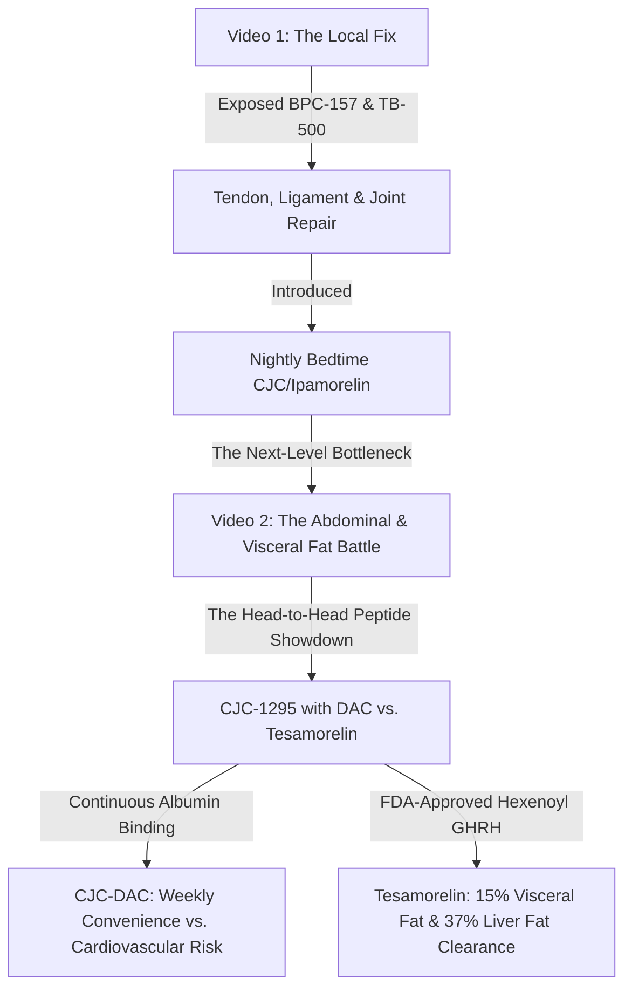

# 🎬 DEEP CLINICAL RESEARCH & SEO METADATA: CJC-1295 WITH DAC VS. TESAMORELIN
**Document Path:** `c:\Users\Curtis\New folder\construction-website\Keystone_HQ\00_Master_Brain\09_YouTube_Operations\Metadata_Drafts\cjc_dac_vs_tesamorelin_recomposition_battle.md`  
**Target Video Duration:** 8 Minutes & 20 Seconds (500 Seconds)  
**Channel Topic:** Growth Hormone Secretagogues — The Visceral Fat & Recomposition Battle  
**Series Continuity:** Shifting from basic nightly pulse amplification (Video 1) to the heavy-combat subcutaneous secretagogues (CJC-1295 with DAC vs. Tesamorelin) to optimize structural frame recovery and target abdominal fat.

---

## 🎯 SECTION 1: NARRATIVE SHIFT & MOVEMENT STRATEGY

### 🛑 The Problem with Overlap
In Video 1 (The Wolverine Stack / bed-time recovery framework), we introduced the [[general|general]] concept of using growth hormone secretagogues (CJC-1295 no DAC + Ipamorelin) for lean mass preservation and bedtime lipolysis. 

If this next video simply repeats the benefits of CJC/Ipamorelin or re-explains GLP-1 sarcopenia, **the channel's progression completely stalls**. We must move the narrative forward.



### 🔗 Moving the Topic Forward
Instead of a generic CJC-1295 overview, this video is framed as a **Head-to-Head Peptide Showdown: CJC-1295 with DAC vs. Tesamorelin (The Visceral Fat & Recomposition Battle)**. 

We address the ultimate conflict of the busy builder: **Weekly Convenience (CJC-DAC) vs. Clinical Precision & Safety (Tesamorelin).**
*   **Video 1 established:** Basic cellular recovery and BPC/TB joint mechanics.
*   **Video 2 establishes:** Advanced endocrine axis manipulation. We target stubborn **visceral fat (VAT)** surrounding organs, fatty liver clearance, and the physiological consequences of GHRH receptor continuous activation vs. pulsatile safety.

---

## 🔬 SECTION 2: DEEP CHEMICAL & CLINICAL COMPARISON

To establish elite clinical authority, we break down the exact chemistry, pharmacokinetics, and clinical trials of both compounds.

| Technical Parameter | CJC-1295 with DAC | Tesamorelin (Egrifta) |
| :--- | :--- | :--- |
| **Peptide Classification** | Synthetic GHRH (1-29) Analog + DAC | Synthetic GHRH (1-44) Analog + Hexenoyl |
| **Chemical Structure** | Mod GRF 1-29 + Maleimidopropionic Acid (MPA) | 44-Amino-Acid GHRH + Hexenoyl group |
| **In Vivo Half-Life** | **6 to 8 Days** (covalent albumin binding) | **26 to 38 Minutes** (hexenoyl stabilization) |
| **Duration of Biological Effect** | Continuous (Sustained elevation) | Transient (4 to 5 hours of GHRH pathway activity) |
| **FDA Approval Status** | Restricted (Proposed for compounding ban) | **FDA-Approved** for Visceral Lipodystrophy |
| **Target Fat Depots** | General systemic adipose tissue | **Visceral Adipose Tissue (VAT) & Hepatic Fat** |
| **Cardiovascular Risk Profile** | Higher (Elevated baseline GH may cause ventricular thickening) | Low (Preserves natural pulsatile cardiovascular rhythm) |
| **Compounding Legality (2026)**| Prohibited from standard 503A compounding | Commercially available (LegitScript compliant) |

---

### 1. CJC-1295 with DAC: The Albumin Hitchhiker
*   **The Chemistry:** CJC-1295 with DAC is built on **Modified GRF 1-29** (which contains four amino acid substitutions: D-Ala2, Gln8, Ala15, Leu27 to resist DPP-IV enzymes). It adds a **Drug Affinity Complex (DAC)** consisting of a maleimidopropionic acid (MPA) linker at the C-terminal lysine.
*   **The Mechanism:** Once injected, the MPA linker instantly forms a covalent bond with the free thiol group on circulating **human serum albumin**. Albumin acts as a massive molecular shield, preventing renal filtration and enzymatic breakdown. This extends the peptide's half-life to **6–8 days**.
*   **The Clinical Risk (The GH Bleed):** Because it continuously binds to albumin, GHRH receptors on the pituitary are stimulated 24/7. While pulsatile secretion still persists (Ionescu et al., 2006), the **trough (baseline) GH levels remain permanently elevated**. 
    *   *The Catch:* This continuous, unnatural elevation increases the risk of **insulin resistance (dysglycemia)**, severe extracellular water retention (swelling, carpal tunnel), and long-term cardiovascular risks (cardiac diastolic dysfunction and left ventricular hypertrophy similar to acromegaly).
*   **FDA PCAC December 4, 2024 Ruling:** The FDA's Pharmacy Compounding Advisory Committee formally voted **against** including CJC-1295 DAC on the approved 503A compounding bulk substances list, citing a lack of demonstrated clinical safety and clinical need over commercial alternatives, pushing it into strict grey-market "research-only" status.

---

### 2. Tesamorelin: The Abdominal Visceral Fat Assassin
*   **The Chemistry:** Tesamorelin is a synthetic analog of the full-length **growth hormone-releasing hormone (GHRH 1-44)**. It is stabilized by the addition of a **hexenoyl group** (a six-carbon chain) attached to the N-terminal tyrosine residue.
*   **The Mechanism:** The hexenoyl group makes Tesamorelin highly resistant to DPP-IV enzymatic cleavage, extending its metabolic stability. Unlike the continuous albumin binding of CJC-DAC, Tesamorelin clears the bloodstream relatively quickly (half-life of ~30 minutes), but initiates a downstream growth hormone release cascade that remains active for **4 to 5 hours**.
*   **The Pulsatile Safety:** Because it clears the system, it allows the pituitary to return to baseline, preserving the body's natural pulsatile feedback loops (somatostatin pauses) and preventing GHRH receptor desensitization. It carries a **vastly superior metabolic and cardiovascular safety profile** compared to CJC-DAC.

#### 📊 The Landmark Clinical Trial Data:
Tesamorelin is the only growth hormone secretagogue backed by massive, placebo-controlled Phase 3 human clinical trials specifically for fat reduction:
1.  **JAMA 2014 (Stanley TL et al.):** In a randomized clinical trial, Tesamorelin demonstrated a **15% to 18% reduction in Visceral Adipose Tissue (VAT)**—the deep, dangerous abdominal fat that surrounds organs and drives systemic inflammation—over 26 weeks. It simultaneously increased lean skeletal muscle mass without dropping total body weight.
2.  **The Lancet HIV (2019/2023 multicenter trial):** In patients with non-alcoholic fatty liver disease (NAFLD/MASLD), Tesamorelin therapy over 12 months achieved an astonishing **37% relative reduction in hepatic fat fraction (liver fat)** and significantly prevented the progression of liver fibrosis.
3.  **Metabolic Balance:** While a transient increase in fasting insulin was noted in the first few weeks of therapy, insulin levels returned to baseline as ectopic visceral fat was reduced and lean skeletal muscle mass increased.

---

## 🎬 SECTION 3: MINUTE-BY-MINUTE PRODUCTION BLUEPRINT (8:20 TOTAL)

```mermaid
gantt
    title Video Timeline: The Recomposition Showdown (Total: 500 Seconds / 8:20)
    dateFormat  X
    axisFormat %s
    section Video Segments
    01. The Bedtime Limitation (0:00 - 1:00) :active, 0, 60
    02. CJC-DAC: Weekly Convenience (1:00 - 2:15) : 60, 135
    03. The Danger: GH Bleed (2:15 - 3:30) : 135, 210
    04. Enter Tesamorelin (3:30 - 4:45) : 210, 285
    05. JAMA & Lancet Clinical Proof (4:45 - 6:00) : 285, 360
    06. The Advanced Recomp Stack (6:00 - 7:15) : 360, 435
    07. FDA Compounding Ban & Sourcing (7:15 - 8:20) : 435, 500
```

### ⏱️ Block 1: Hook & The Bedtime Limitation (0:00 - 1:00)
*   **Visual Focus:** Medium close-up of Wayne Digital Twin standing on an active construction site. Soft fog drifting through Squamish pines. High-impact text overlay: "BEYOND THE BEDTIME PULSE."
*   **Voice/Pacing:** Rugged, professional, measured PNW developer cadence (~115 words).
*   **Key Narrative Beats:**
    *   Direct callback to Video 1: "In our first protocol, we established the joint-healing foundations of the Wolverine Stack and introduced basic nighttime GHRH pulses to prevent GLP-1 muscle wasting."
    *   The transition: "But if you're serious about shifting your metabolic set-point, stripping deep visceral abdominal fat, and maximizing recovery, a basic bedtime pulse isn't enough. You hit a ceiling. Today, we step into the heavy division of hormone secretagogues. We're pitching the two heavyweights head-to-head: CJC-1295 with DAC versus the FDA-approved clinical powerhouse, Tesamorelin. This is the visceral fat battle."

---

### ⏱️ Block 2: CJC-1295 with DAC - The Weekly Convenience Trap (1:00 - 2:15)
*   **Visual Focus:** Beautiful 3D molecular animation of a GHRH peptide backbone modified with a glowing golden MPA Drug Affinity Complex. The linker binds to a massive floating albumin molecule in the bloodstream.
*   **Voice/Pacing:** Analytical, explaining complex pharmacokinetics in simple terms (~145 words).
*   **Key Narrative Beats:**
    *   The convenience appeal: "Let's be honest. As a builder managing active physical job sites, pinning peptides three times a day is a massive bottleneck. That's why researchers engineered CJC-1295 with DAC."
    *   The mechanism: "By attaching a maleimidopropionic acid group to the modified peptide, it hitches a ride on your own human serum albumin. Albumin acts as a protective shield, extending the peptide's half-life from 30 minutes to an astonishing six to eight days. Instead of daily injections, you pin once or twice a week. It sounds like the ultimate protocol for busy people."

---

### ⏱️ Block 3: The Dark Side of the Albumin Shield - GH Bleed & Cardiac Risk (2:15 - 3:30)
*   **Visual Focus:** Screen split: On the left, a standard pulsatile curve (sharp peaks and deep valleys). On the right, the CJC-DAC curve, showing a baseline (trough) that remains permanently elevated near the peak. Red warning pulse over the heart of a 3D medical avatar.
*   **Voice/Pacing:** Highly serious, cautionary, warning of the long-term metabolic dangers (~145 words).
*   **Key Narrative Beats:**
    *   The "GH Bleed" reality: "But convenience carries a hidden biological cost. While human clinical trials prove that natural pulsatility persists, CJC-DAC keeps your GHRH receptors continuously activated 24/7. This permanent baseline elevation is what endocrinologists call a 'GH bleed.'"
    *   The consequences: "Over weeks, this continuous baseline elevation mimics the chronic hormone [[STATE|state]] of acromegaly. It drastically increases your risk of insulin resistance, triggers severe water retention, and can lead to left ventricular cardiac thickening. The weekly convenience of CJC-DAC is a biological ticking clock."

---

### ⏱️ Block 4: Enter Tesamorelin - The Abdominal Fat Assassin (3:30 - 4:45)
*   **Visual Focus:** High-end 3D model of the full-length 44-amino-acid GHRH structure. Highlight the specialized six-carbon **hexenoyl group** locked onto the N-terminal tyrosine.
*   **Voice/Pacing:** Energized, optimistic, presenting the clinical gold standard (~145 words).
*   **Key Narrative Beats:**
    *   The high-end alternative: "If once-weekly CJC-DAC is too risky, and three-times-daily Mod GRF is too tedious—what is the solution? Enter Tesamorelin. It is a next-generation GHRH analog stabilized by a hexenoyl group."
    *   The key difference: "Unlike CJC-DAC, Tesamorelin has a half-life of roughly 30 minutes, with a biological activity window of four to five hours. It does not bind to albumin. It clears the system, allowing your pituitary gland to rest, recover, and preserve natural pulsatile feedback loops. You get aggressive fat mobilization without desensitizing your GHRH receptors or threatening your heart."

---

### ⏱️ Block 5: The JAMA & Lancet Clinical Proof (4:45 - 6:00)
*   **Visual Focus:** High-resolution screenshots of the JAMA 2014 and Lancet HIV clinical trials. Highlight the statistics: "15% to 18% Visceral Fat Reduction" and "37% Liver Fat Clearance."
*   **Voice/Pacing:** Authoritative, clinical, data-driven (~145 words).
*   **Key Narrative Beats:**
    *   The hard clinical data: "Unlike CJC-DAC, which has zero direct human clinical fat-loss trials, Tesamorelin is backed by massive peer-reviewed data. The pivotal Phase 3 trials published in JAMA demonstrated an average 15% to 18% reduction in deep visceral abdominal fat over 26 weeks."
    *   The liver fat clearance: "Even more impressive, a randomized trial published in The Lancet HIV proved that Tesamorelin achieved a 37% relative reduction in liver fat over 12 months, actively halting liver fibrosis. If you have stubborn belly fat or non-alcoholic fatty liver from years of stress and poor diet—this is the clinical gold standard."

---

### ⏱️ Block 6: The Advanced Recomposition Stack (6:00 - 7:15)
*   **Visual Focus:** Muted technical slide illustrating Wayne's clinical protocol stack: Tesamorelin (2mg subcutaneously before bed or fasted morning) + Ipamorelin (200mcg to maximize pulse height) + high-tension progressive resistance training + grass-fed protein floor.
*   **Voice/Pacing:** Practical, builder-focused, direct execution steps (~145 words).
*   **Key Narrative Beats:**
    *   The Gold Standard Recomp: "How do we maximize this in a real-world recomposition protocol? We stack GHRH with a GHRP. By pairing daily Tesamorelin with Ipamorelin, you create a massive, clean growth hormone pulse without spiking cortisol or prolactin."
    *   The protocol details: "Administered before bed or in a fasted morning window, timed with a protein floor of two grams per kilogram of lean mass and progressive resistance training. This stack forces deep visceral fat mobilization while aggressively protecting active skeletal muscle tissue. It is the elite framework for rebuilding a broken frame."

---

### ⏱️ Block 7: The FDA Compounding Rulings & Safe Sourcing (7:15 - 8:20)
*   **Visual Focus:** Text graphic highlighting the Dec 4, 2024 FDA PCAC compounding vote. Transition to a desaturated visual of the Keystone Recomposition logo. Legal disclaimers rolling on screen.
*   **Voice/Pacing:** Legally precise, commanding, protective (~110 words).
*   **Key Narrative Beats:**
    *   The compounding war: "So why isn't everyone on Tesamorelin? First, the cost of commercial Egrifta is astronomical. Second, the regulatory landscape is in a warzone. On December 4, 2024, the FDA's advisory committee formally voted against keeping CJC-1295 on the compounded substances list, banning it from standard compounding pharmacies."
    *   The warning: "Tesamorelin remains FDA-approved but must only be sourced through a licensed physician and registered 503A compounding pharmacy under direct medical supervision. Never buy unregulated chemicals from grey-market research sites. Work exclusively with a doctor. Build strong. Recover smarter. I'll see you on the next protocol."

---

## 🏷️ SECTION 4: YOUTUBE METADATA & SEO HARDENING

### 1. High-Click-Through-Rate (CTR) Video Titles
*   **Option A (Primary - Strategic Battle):** CJC-1295 DAC vs. Tesamorelin: The Visceral Belly Fat Battle (The Honest Science)
*   **Option B (Secondary - Warning Hook):** Why the FDA Banned CJC-1295: The Truth About "GH Bleed" & Pituitary Burnout
*   **Option C (Solution-Focused):** How to Rebuild a Broken Frame Over 40: Tesamorelin & Ipamorelin Recomp Protocol

### 2. SEO-Hungry Compound Tags
`CJC-1295 with DAC`, `CJC-1295 vs Tesamorelin`, `Tesamorelin visceral fat loss`, `Egrifta fat reduction`, `CJC-1295 compounding ban`, `FDA PCAC December 4 2024`, `GH bleed myth`, `growth hormone secretagogue safety`, `liver fat NAFLD peptide`, `Ipamorelin Tesamorelin stack`, `visceral adipose tissue peptides`, `acromegaly peptide side effects`, `Wayne Stevenson`, `Keystone Recomposition`, `Squamish wellness`

### 3. Viral & Niche Hashtags
`#CJC1295DAC #Tesamorelin #VisceralFat #PeptideProtocols #Recomposition #GHBleed #FDAcompounding #BellyFatLoss #MenOver40 #KeystoneProtocols #SquamishWellness`

---

## 📝 SECTION 5: YOUTUBE VIDEO DESCRIPTION & REGULATORY DISCLAIMERS

```text
Nightly GHRH pulse amplification can only carry a busy builder so far before they hit a physiological ceiling. If you are serious about stripping deep, dangerous abdominal visceral fat, clearing liver fat, and protecting your structural frame during aggressive recomposition, you need to understand the heavy division of growth hormone secretagogues.

In this deep-dive clinical head-to-head, we put the two ultimate heavyweights of the peptide space against each other: CJC-1295 with DAC and Tesamorelin.

We break down the structural chemistry of the albumin-binding "shield" that gives CJC-1295 DAC its weekly convenience, but expose the severe cardiovascular and metabolic risks associated with a chronic "GH Bleed." We then transition to Tesamorelin (Egrifta), analyzing the hexenoyl group stabilization that preserves the pituitary's natural pulsatile rhythm.

Most importantly, we back this showdown with hard clinical trial data:
→ JAMA 2014 data proving Tesamorelin achieves a 15% to 18% reduction in Visceral Adipose Tissue (VAT).
→ Lancet HIV data showing a 37% relative reduction in hepatic liver fat (NAFLD) and the halting of liver fibrosis.
→ The FDA's Pharmacy Compounding Advisory Committee (PCAC) ruling on December 4, 2024, which formally voted to exclude CJC-1295 from compounded bulk drug substances lists.

If you are navigating the complex regulatory and biological landscape of advanced peptide therapy, this clinical comparative review provides the exact science you need to stay safe and recover smarter.

--------------------------------------------------------------------------------
🏡 BIOPHILIC CONSTRUCTION & LUXURY RESORT DEVELOPMENT:
Planning a high-performance custom home, biophilic sanctuary, or luxury wellness resort in Squamish or the Sea-to-Sky corridor? Let's build your legacy:
https://keystonepossibilities.ca

🧬 BIOLOGY OPTIMIZATION & CLINICAL WELLNESS:
Explore our advanced longevity, peptide, and cellular health frameworks:
https://keystoneprotocols.ca

🎵 DEEP-FOCUS WORKFLOW LOOP:
Stream our official ambient house recovery and biophilic deep-focus tracks on Spotify:
[Insert Spotify Playlist Link]

--------------------------------------------------------------------------------
🤖 AI CONTENT DISCLOSURE & DIGITAL TWIN DISCLAIMER:
To maintain maximum operational efficiency while managing active, multi-million dollar physical resort construction sites, the visual and vocal assets in this video are rendered using a highly customized, ethically cloned digital twin AI avatar of Wayne Stevenson. Real physical site visits, construction progress updates, and raw personal vlogs will continue to be integrated across this channel's catalog.

⚖️ MEDICAL & EDUCATIONAL DISCLAIMER:
The information provided in this video is for scientific study, educational analysis, and general research purposes only. It does not constitute medical advice, diagnosis, or treatment. Peptide compounds (such as CJC-1295 with DAC, Tesamorelin, and Ipamorelin) are high-potency research chemicals that must only be utilized under the direct supervision of a licensed, qualified medical professional. Always consult your physician before beginning any new training, supplementation, or peptide protocols.
--------------------------------------------------------------------------------
```


---
📁 **See also:** [[09_YouTube_Operations/Metadata_Drafts/INDEX|← Directory Index]]
