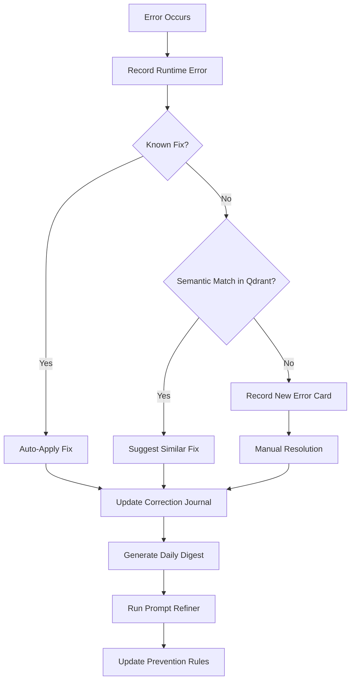

# Core Python Infrastructure

> [[master|Master]] [[wiki/index|index]] of all Keystone Python systems. See also: Agent Fleet · [[Master_Docs/INTEGRATION_MAP|Integration Map]] · Empire [[STATE|State]]

<!-- CONTEXT: Infrastructure And Evolution / Self-Evolution Engine -->
## Self-Evolution Engine
- **self_evolution** — The central self-healing brain. Structured error recording with pattern detection, correction journal (error→fix mappings), daily digest consolidation, stale error pruning, health scoring, weekly log compaction. CLI: `--health`, `--digest`, `--compact`, `--prune`, `--patterns`, `--test`.
- **evaluation_harness** — Sandboxed test execution for dynamic skills. Runs fixture assertions in isolated subprocesses.
- **security_sandbox** — AST-level code validator. Blocks dangerous imports, network calls, and file mutations before any dynamic code is deployed.
- **prompt_refiner** — DSPy-inspired auto-refinement of prevention rules from the correction journal. Generates `refined_prevention_rules.json`.

<!-- CONTEXT: Infrastructure And Evolution / Memory & Knowledge -->
## Memory & Knowledge
- **dream_engine** — Biologically-inspired memory consolidation (Ebbinghaus forgetting curves). Scores, consolidates, prunes, and promotes memories overnight. CLI: `--dream`, `--score`, `--consolidate`, `--prune`, `--report`.
- **working_memory** — Ephemeral key-value store with TTL expiration. SQLite-backed (`working_memory.db`).
- **hybrid_retrieval** — Combined vector (Qdrant) + keyword search for brain queries.
- **brain_evolver** — Evolves the brain's vector DB by ingesting new documents, chunking, and embedding.

<!-- CONTEXT: Infrastructure And Evolution / Overnight Research -->
## Overnight Research
- **`overnight_research_daemon.py`** — Queue-driven Chrome Deep Research automation. Manages credit timing (30 prompts/5hr window), persists [[STATE|state]] to `credit_state.json`, generates morning reports. CLI: `--start`, `--dry-run`, `--status`, `--report`, `--next-batch`.

<!-- CONTEXT: Infrastructure And Evolution / Content & Publishing -->
## Content & Publishing
- **`content_engine_mcp.py`** — MCP server exposing content creation tools (script writing, SEO optimization, thumbnail prompts).
- **`social_publisher.py`** — Multi-platform social media publishing (YouTube, Facebook, Instagram, TikTok, LinkedIn). Routes Protocol brand through Recomposition tokens.
- **`social_oauth_manager.py`** — OAuth flow manager for all social platforms. Handles token acquisition, refresh, and multi-brand routing.
- **`youtube_mcp.py`** — YouTube Data API v3 operations: upload, metadata update, playlist management. Uses `CHANNEL_TOKEN_MAP` for brand-specific token routing.
- **`youtube_api_manager.py`** — Lower-level YouTube API wrapper.
- **`youtube_researcher_mcp.py`** — YouTube research and competitive analysis via the youtube-researcher MCP.
- **`video_hosting_bridge.py`** — Bridge between local video files and hosting platforms.

<!-- CONTEXT: Infrastructure And Evolution / Fleet Orchestration -->
## Fleet Orchestration
- **fleet_orchestrator** — Manages the 13-agent fleet: dispatching tasks, monitoring status, preventing overlap, health checks.
- **sovereign_coordinator** — Higher-level coordination across all subsystems. Ties together self-evolution, fleet orchestration, and brand guardian.
- **brand_guardian** — Enforces brand consistency across all outputs. Validates tone, visuals, and messaging against the Brand Constitution.
- **multiplexer_sync** — Syncs dynamic skills to the MCP multiplexer for [[hot|hot]]-reloading.

<!-- CONTEXT: Infrastructure And Evolution / Utilities -->
## Utilities
- **`competitor_intel.py`** — Competitive intelligence gathering and analysis.
- **`linkedin_leads.py`** — LinkedIn B2B lead generation and outreach automation.
- **`meta_oauth_all.py`** — Meta (Facebook/Instagram) OAuth for all brands.
- **`youtube_oauth_all.py`** — YouTube OAuth for all channels under curtis4vancouver@gmail.com.
- **`sync_daemon.py`** — Background sync daemon for keeping brain and fleet [[STATE|state]] consistent.
- **`mock_test_suite.py`** — Comprehensive mock tests for all subsystems.
- **`resolve_automation.py`** — DaVinci Resolve automation helpers.
- **`eyes_capture.py`** — Visual capture and analysis tooling.

---

# Self-Evolution Cycle

**Key Files:**
- `correction_journal.json` — 18 error→fix entries covering YouTube uploads, TikTok OAuth, Meta API, Windows encoding, token management, and content formatting.
- `refined_prevention_rules.json` — 18 auto-generated prevention rules derived from the journal.
- Health score is calculated as: `max(0, 100 - (recent_7d_errors × 10))`.

---
📁 **See also:** [[Master_Docs/INDEX|← Directory Index]]
