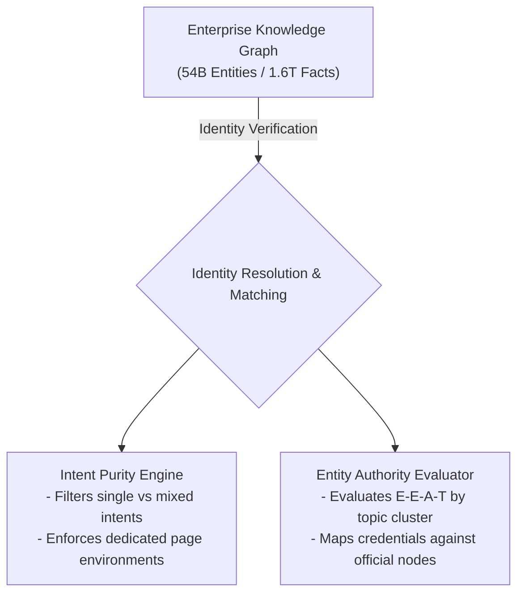
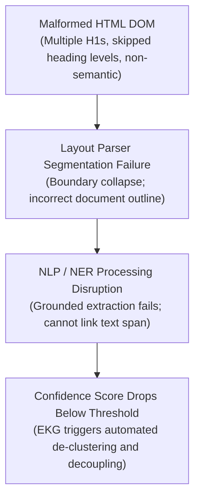

# Technical Playbook: Algorithmic Entity-First Indexing and Knowledge Graph Restoration

<!-- CONTEXT: Entity Indexing And Knowledge Graph Restoration / Mid-2026 Search [[ARCHITECTURE|Architecture]]: Entity-First Indexing and Algorithmic Core Updates -->
## Mid-2026 Search Architecture: Entity-First Indexing and Algorithmic Core Updates

The search landscape in mid-2026 is defined by the complete sunset of keyword-centric indexing models in favor of semantic entity-first architectures. Under Google's December 2025 Core Update, which ushered in the "Recalibration Era," and the January 2026 Core Update, known as the "Authenticity Update," Google's systems no longer evaluate isolated web pages or query-to-keyword string matches. Instead, the search engine indexes information as a unified, interconnected web of real-world entities, attributes, and relationships managed by a massive Knowledge Graph consisting of approximately 54 billion entities and 1.6 trillion facts.

This transition has shifted search optimization from traditional rankings to "digital reputation engineering," where websites must serve as referenceable, highly summarizable sources for AI-generated search engines and traditional retrieval systems simultaneously. Modern search visibility is governed by three primary algorithmic paradigms that dictate how entity authority is calculated and preserved across the web [[wiki/index|index]].



<!-- CONTEXT: Entity Indexing And Knowledge Graph Restoration / Intent Purity and Topic Architecture -->
### Intent Purity and Topic Architecture
Search results are filtered through a highly refined intent-matching engine that rewards rigid site structure and penalizes pages attempting to fulfill multiple, conflicting user intents. Pages trying to execute transactional, informational, and navigational roles simultaneously are systematically diluted in organic visibility.

Instead, the algorithm rewards content architecture that isolates user intent, forcing B2B brands to structure their websites so that educational assets, service descriptions, and biographical pages reside in separate, dedicated directories. To rank in this environment, a page must target a single, clearly defined user intent, aligning its layout and message with Google's structural expectations.

<!-- CONTEXT: Entity Indexing And Knowledge Graph Restoration / Domain Authority Transition to Entity Authority -->
### Domain Authority Transition to Entity Authority
Traditional domain-level E-E-A-T (Experience, Expertise, Authoritativeness, Trustworthiness) has given way to hyper-specific, topic-by-topic validation mechanisms. Under the February 2026 Discover Core Update, Google explicitly tightened this aperture, evaluating expertise strictly by content cluster rather than broad domain authority.

An executive's real-world history, verified credentials, and organizational affiliations are cross-referenced against authoritative external databases to prove that a human with first-hand experience generated the content. If an executive is not programmatically reconciled as a trusted entity within a specific niche, the content they author struggles to rank, regardless of the hosting domain’s legacy backlink profile.

<!-- CONTEXT: Entity Indexing And Knowledge Graph Restoration / Summarizability and Citation Currency -->
### Summarizability and Citation Currency
With search generative engines and AI Overviews processing 47% to 64% of all search queries, ranking first on the traditional Search Engine Results Page (SERP) no longer guarantees click-through traffic. Digital visibility is instead denominated in citation currency—namely, qualifying as an authoritative, referenceable source that AI [[AGENTS|agents]] can easily parse, summarize, and cite.

To win these citations, content must be structured using answer-first writing with highly explicit data, logical heading structures, and expert attributions, allowing Google's large language models (LLMs) to retrieve clean semantic chunks.

| Algorithmic Vector | Keyword-Centric Search (Legacy) | Entity-First Indexing (Mid-2026) |
| :--- | :--- | :--- |
| **Primary Indexing Unit** | Textual string and keyword density matching. | Semantic entity nodes, attributes, and relationships. |
| **Authority Evaluation** | Domain-level backlink profiles and PageRank. | Topic-specific entity authority and credential verification. |
| **User Intent Matching** | Query-to-content matching with mixed-intent pages. | Intent Purity filtering with dedicated content environments. |
| **AI/SGE Visibility** | High rankings in organic search results. | Citation placement in AI Overviews and answer engines. |
| **Performance Gate** | Basic technical accessibility and rendering. | Layout-aware chunking and strict Core Web Vitals. |

Technical performance metrics serve as structural prerequisites for entity evaluation. Google’s mobile-first indexing, which became strictly mobile-only in July 2024, enforces precise performance thresholds.

Websites failing to meet these thresholds experience reduced crawl budgets, meaning updated entity declarations may remain unparsed for weeks. These baselines require a Largest Contentful Paint (LCP) under 2.0 to 2.5 seconds, an Interaction to Next Paint (INP) under 200 milliseconds, and a Cumulative Layout Shift (CLS) of less than 0.1.

---

<!-- CONTEXT: Entity Indexing And Knowledge Graph Restoration / Anatomy of H-Tag Breakage and NLP De-Clustering -->
## Anatomy of H-Tag Breakage and NLP De-Clustering

The degradation of the personal Knowledge Panel for Wayne Stevenson following an accidental HTML H-tag structural modification on his bio page is a direct consequence of how Google’s layout-aware parsing pipelines operate.

To understand why a simple heading level mismatch causes a complete de-reconciliation of an executive's Knowledge Graph entity, one must analyze the physical interaction between document layout, natural language processing (NLP) models, and [[Brand_Constitution/protocol/IDENTITY|identity]] resolution algorithms.



<!-- CONTEXT: Entity Indexing And Knowledge Graph Restoration / Layout-Aware Document Chunking Mechanics -->
### Layout-Aware Document Chunking Mechanics
Google's primary crawling agent utilizes a headless rendering browser based on a recent version of Chrome to execute JavaScript and evaluate the Document Object Model (DOM). During ingestion, the parsing engine does not merely read text; it activates a layout-aware document chunking configuration. This parser uses HTML structural elements—specifically headings (`<h1>` through `<h6>`), paragraphs, lists, and tables—to define the boundaries of content sections.

This layout parsing allows Google's retrieval-augmented generation (RAG) and indexing engines to segment a document into semantically coherent "layout entities". All text within a single chunk is algorithmically constrained to originate from the same layout block, ensuring that heading hierarchies serve as the structural framework for informational retrieval.

<!-- CONTEXT: Entity Indexing And Knowledge Graph Restoration / NLP Entity Extraction and Grounding Failures -->
### NLP Entity Extraction and Grounding Failures
Once the layout parser determines document boundaries, it feeds these structured chunks into NLP entity extraction models, such as Google's open-source LangExtract library or custom Named Entity Recognition (NER) models. These neural network architectures analyze syntax trees, parts of speech, and surrounding context to identify proper nouns and classify them into entity categories.

A core component of this extraction is "grounding"—the process of linking the extracted person or brand entity to their precise coordinate within the physical layout of the document. When an H-tag hierarchy is accidentally broken (e.g., skipping from an `<h2>` straight to an `<h4>`, deploying multiple `<h1>` tags, or nesting heading levels non-sequentially), the layout parser's segmentation boundaries collapse.

Rather than extracting a clean "definitional opener" chunk linking the person to the organization (such as "Wayne Stevenson is the CEO of Keystone [[possibilities|Possibilities]]"), the parser groups the text into a fragmented, non-semantic block. Because the NLP models cannot locate clean, bounded headers to assign relationship edges, the grounding step fails, and the contextual relationship between the executive and the business is obscured.

<!-- CONTEXT: Entity Indexing And Knowledge Graph Restoration / The Core Entity Reconciliation Failure -->
### The Core Entity Reconciliation Failure
This structural failure triggers a sharp drop in the algorithm's confidence score. In the context of Kalicube’s entity framework, entity authority is governed by a three-tiered model: **Claim**, **Frame**, and **Prove**.

*   **The Claim:** The self-declared structured data and content layout on the "Entity Home" (the executive's official biography page).
*   **The Frame:** How independent, authoritative third-party sources describe and contextualize the entity across the web.
*   **The Prove:** The corroborating, high-confidence database records (such as Wikidata, government business registries, and verified social channels) that validate the claim.

When the structural layout of the Entity Home collapses due to malformed H-tags, the "Claim" is corrupted. The matching confidence score drops below the established threshold, and the Enterprise Knowledge Graph (EKG) engine assumes a potential [[Brand_Constitution/protocol/IDENTITY|identity]] mismatch. To prevent the generation of duplicate or hallucinated entity associations, the engine executes a de-reconciliation cycle, separating Wayne Stevenson's node from Keystone Possibilities and causing the personal Knowledge Panel to drop from search results.

---

<!-- CONTEXT: Entity Indexing And Knowledge Graph Restoration / Designing the Semantic Entity Bridge: Schema.org JSON-LD Blueprint -->
## Designing the Semantic Entity Bridge: Schema.org JSON-LD Blueprint

To permanently repair and lock the semantic relationship between Wayne Stevenson, Keystone Possibilities, and their distributed digital footprints, a deeply nested, validate-ready Schema.org JSON-LD script is required. This markup acts as an API endpoint of structured declarations that Google can ingest without ambiguity, isolating the data layer from any potential presentation-layer HTML errors.

The implementation utilizes the `@graph` array format to establish a series of interconnected nodes using explicit global identifiers (`@id`). This markup links the WordPress site, the YouTube channel, the Spotify podcast, and official corporate registry data using ISO-compliant entity identifiers.

```json
{
  "@context": "https://schema.org",
  "@graph": [
    {
      "@type": "Organization",
      "@id": "https://www.keystonepossibilities.com/#organization",
      "name": "Keystone Possibilities",
      "url": "https://www.keystonepossibilities.com/",
      "logo": {
        "@type": "ImageObject",
        "@id": "https://www.keystonepossibilities.com/#logo",
        "url": "https://www.keystonepossibilities.com/wp-content/uploads/logo.png"
      },
      "sameAs": [
        "https://www.crunchbase.com/organization/keystone-possibilities",
        "https://www.linkedin.com/company/keystone-possibilities"
      ],
      "leiCode": "984500F83C1B6D2A9E54",
      "founder": {
        "@id": "https://www.keystonepossibilities.com/wayne-stevenson/#person"
      }
    },
    {
      "@type": "Person",
      "@id": "https://www.keystonepossibilities.com/wayne-stevenson/#person",
      "name": "Wayne Stevenson",
      "jobTitle": "CEO",
      "worksFor": {
        "@id": "https://www.keystonepossibilities.com/#organization"
      },
      "url": "https://www.keystonepossibilities.com/wayne-stevenson/",
      "image": {
        "@type": "ImageObject",
        "@id": "https://www.keystonepossibilities.com/wayne-stevenson/#portrait",
        "url": "https://www.keystonepossibilities.com/wp-content/uploads/wayne-stevenson.jpg"
      },
      "sameAs": [
        "https://www.linkedin.com/in/wayne-stevenson",
        "https://www.youtube.com/@keystonepossibilities",
        "https://open.spotify.com/show/keystonepossibilities",
        "https://www.wikidata.org/wiki/Q87654321"
      ],
      "knowsAbout": [
        "Metabolic Health",
        "Peptide Protocols",
        "Body Recomposition",
        "Biohacking",
        "Construction Project Management"
      ]
    },
    {
      "@type": "ProfilePage",
      "@id": "https://www.keystonepossibilities.com/wayne-stevenson/#profile",
      "url": "https://www.keystonepossibilities.com/wayne-stevenson/",
      "mainEntity": {
        "@id": "https://www.keystonepossibilities.com/wayne-stevenson/#person"
      }
    },
    {
      "@type": "PodcastSeries",
      "@id": "https://www.keystonepossibilities.com/podcast/#podcast",
      "name": "The Keystone Possibilities Podcast",
      "webFeed": "https://www.keystonepossibilities.com/feed/podcast/",
      "sameAs": "https://open.spotify.com/show/keystonepossibilities",
      "creator": {
        "@id": "https://www.keystonepossibilities.com/wayne-stevenson/#person"
      },
      "publisher": {
        "@id": "https://www.keystonepossibilities.com/#organization"
      }
    }
  ]
}
```

The construction of this semantic bridge requires isolating the properties of [[Brand_Constitution/protocol/IDENTITY|identity]] equivalence from those of topical relevance:

| Schema Property | Structural Target | Algorithmic Purpose | Strategic Implementation Rules |
| :--- | :--- | :--- | :--- |
| `sameAs` | Wikidata, Wikipedia, LinkedIn, Crunchbase, verified social media channels. | Declares absolute [[Brand_Constitution/protocol/IDENTITY|identity]] equivalence across external profiles to resolve entity nodes. | Must point only to authoritative, highly stable URLs representing the exact same individual or business. |
| `knowsAbout` | Industry categories, concepts, specific skills, or defined search entities. | Establishes domain authority and reinforces E-E-A-T relevance within target topics. | Use plain text strings or reference established Wikidata entity URIs to remove semantic ambiguity. |
| `mainEntity` | Person or Organization nodes within `ProfilePage` schema. | Identifies the primary entity a profile page is dedicated to describing. | Essential for B2B executive bios to prove the biographical intent of the target page. |
| `leiCode` | Organization schema representing registered business entities. | Provides the Legal Entity Identifier (ISO 17442) for financial and corporate alignment. | Must match official business registry records exactly to satisfy regulatory and B2B entity checks. |
| `webFeed` | `PodcastSeries` schema linked to Spotify or Apple Podcasts. | Points directly to the RSS or Atom feed associated with the creative series. | Ensures the search engine can fetch, parse, and credit new episodes directly to the creator node. |

By implementing this graph structure, B2B brands establish an "Entity Home". Typically placed on the executive's bio page or the company's About page, the Entity Home serves as the canonical coordinate where search bots, algorithms, and human evaluators initialize their understanding of the brand and its leadership.

While the website "educates" the [[wiki/index|index]], the structured data "declares" the relationships, allowing Google to construct an explicit entity map that resists layout changes.

---

<!-- CONTEXT: Entity Indexing And Knowledge Graph Restoration / Google Search Console Execution & Force-Reconciliation Playbook -->
## Google Search Console Execution & Force-Reconciliation Playbook

Re-establishing the decoupled relationship between Wayne Stevenson and Keystone Possibilities in Google’s real-time [[wiki/index|index]] requires a sequence of technical procedures utilizing Google Search Console (GSC) and Google Cloud Enterprise Knowledge Graph APIs.

<!-- CONTEXT: Entity Indexing And Knowledge Graph Restoration / Step 1: Technical Remediation & Real-Time Inspection -->
### Step 1: Technical Remediation & Real-Time Inspection
First, reorganize the WordPress template for Wayne Stevenson’s profile page to restore heading order, ensuring that there is exactly one `<h1>` tag matching the page title, and that all sub-headings proceed in sequential order without skipping levels. Deploy the constructed `@graph` JSON-LD payload directly in the `<head>` of the page, avoiding dynamic tag managers to ensure immediate parsing.

Open GSC, navigate to the URL Inspection tool, enter the bio page URL, and click **Test Live URL**. Analyze the rendered DOM and structured data output to confirm that no critical markup errors or warnings remain.

<!-- CONTEXT: Entity Indexing And Knowledge Graph Restoration / Step 2: Forcing Indexation & Crawling Priorities -->
### Step 2: Forcing Indexation & Crawling Priorities
Once the live test validates the page, click **Request Indexing** in the URL Inspection window. This action forces the URL into a high-priority crawl queue, prompting Googlebot to schedule an immediate visit to parse the corrected document layout and the updated JSON-LD markup.

To reinforce this, access the Sitemaps report in GSC and submit the updated XML sitemap containing the corrected `<lastmod>` timestamp for the profile page. This step alerts Google's crawl-scheduling system that the page's content has changed, expediting re-indexing.

<!-- CONTEXT: Entity Indexing And Knowledge Graph Restoration / Step 3: Initiating GSC "Validate Fix" Sequence -->
### Step 3: Initiating GSC "Validate Fix" Sequence
To resolve any structured data errors previously logged by Google, navigate to the Enhancements or Rich Results section in GSC, select the flagged error, and click **Validate Fix**. This starts the tracking process and initiates an immediate, real-time check of sample URLs. The validation then transitions through a series of automated status gates:

```
┌──────────────┐      ┌───────────────┐      ┌──────────────┐      ┌────────────┐
│ Not Started  ├─────►│    Started    ├─────►│ Looking Good ├─────►│   Passed   │
└──────────────┘      └───────┬───────┘      └──────────────┘      └────────────┘
                              │
                              ▼
                      ┌───────────────┐
                      │    Failed     │ (Requires inspection and re-validation)
                      └───────────────┘
```

*   **Not Started:** GSC has logged the error, and no active validation attempt has been requested.
*   **Started:** The initial sweep of a small subset of the affected pages has passed, and Google has placed the remaining URLs into a queue for systematic recrawling.
*   **Looking Good:** Googlebot’s continuous checks are passing without detecting the error on any processed URLs.
*   **Passed:** Every known instance of the error has been verified as resolved, clearing the error flag from the site's profile.
*   **Failed:** A crawl has detected a remaining instance of the issue, halting the validation cycle and requiring further manual debugging.

<!-- CONTEXT: Entity Indexing And Knowledge Graph Restoration / Step 4: [[Troubleshooting|Troubleshooting]] Structured Data Errors -->
### Step 4: Troubleshooting Structured Data Errors
If the validation cycle encounters errors, use the following troubleshooting guide to resolve specific GSC structured data mismatches:

| Flagged GSC Error Type | Algorithmic Root Cause | Technical Remediation Procedure |
| :--- | :--- | :--- |
| **Update property [property_name] to match value known to Google** | The crawler found a match in the Knowledge Graph, but a specific property value (such as founder or name) differs from what is known. | Audit the JSON-LD payload to ensure all values match the spelling, punctuation, and casing found in Wikidata or official registries. Avoid HTML escaping and remove unnecessary punctuation. |
| **Entity type seems incorrect: Should probably be [suggested_type]** | The structured data type provided in the web markup conflicts with the structural archetype indexed by Google. | Transition the page to the suggested Schema.org type, removing conflicting properties and adding recommended attributes of the newly designated type. |
| **Set a value for [property_name] to match the item known to Google** | Google suspects a high-probability entity match but lacks enough structural clues to resolve [[Brand_Constitution/protocol/IDENTITY|identity]] ambiguity. | Add the missing property suggested by GSC directly to the JSON-LD payload to confirm the match. |
| **Entity has insufficient information to match - add more recommended fields** | The web entity lacks enough non-required properties to allow Google to perform reconciliation. | Expand the markup to include recommended, high-context properties such as `sameAs`, `alumniOf`, `parentOrganization`, and `knowsAbout`. |
| **Multiple feed entities seem to match the same entity known to Google** | Duplicate entries have been detected across multiple pages or structured feeds, pointing to the same Knowledge Graph node. | Eradicate duplicate configurations, ensure all `@id` parameters are globally unique, stable, and format-valid URIs. |

<!-- CONTEXT: Entity Indexing And Knowledge Graph Restoration / Step 5: Enterprise Knowledge Graph Reconciliation Job Setup -->
### Step 5: Enterprise Knowledge Graph Reconciliation Job Setup
For organizations utilizing the Google Cloud Enterprise Knowledge Graph API, programmatic reconciliation of big data records can bypass slow organic crawler queues. This is done by executing an Enterprise Knowledge Graph reconciliation job to resolve any fragmented entity duplicates across corporate datasets:

1.  **Prepare BigQuery Tables:** Export the executive's professional history and the company's registration files into a BigQuery table, ensuring all columns are mapped to Schema.org standards.
2.  **Configure the Schema Mapping File:** Map the data columns to standard Schema.org Person and Organization types. Ensure that the `@id` URIs are completely unique and aligned with the values declared in the web JSON-LD.
3.  **Configure Advanced Options:** Set the clustering algorithm to use parallel hierarchical agglomerative clustering (affinity clustering). Set the clustering iterations in the range of 1 to 5, where higher values group more aggressively to eliminate duplicate profiles.
4.  **Tune Clustering Hyperparameters:** Set the connected component clustering weight threshold between 0.6 and 1.0 to define the precision of matches. Enable geocoding separation to prevent the algorithm from merging entities operating in different physical regions.
5.  **Run the Job:** Execute the reconciliation job via the Google Cloud Console, allowing up to 24 hours for the system to process the records, merge duplicate nodes, and update the reconciled entities in Google's cloud database.

---

<!-- CONTEXT: Entity Indexing And Knowledge Graph Restoration / Knowledge Panel Re-Claiming, Ownership Binding, and Permanent Locking -->
## Knowledge Panel Re-Claiming, Ownership Binding, and Permanent Locking

Claiming and locking a Knowledge Panel establishes a verified administrative connection between the executive and the Knowledge Graph, enabling the organization to propose changes and prevent future structural degradation.

<!-- CONTEXT: Entity Indexing And Knowledge Graph Restoration / The Google Search Console Instant-Claim Bypass -->
### The Google Search Console Instant-Claim Bypass
While Google allows representatives to claim a Knowledge Panel through a manual submission form containing government-issued photo IDs and logged-in social media screenshots, there is a technical bypass to expedite the process.

If the person claiming the panel is a verified owner of the official Entity Home website in Google Search Console, or if they are the primary owner of the official YouTube channel linked to the entity, Google's systems can bypass the manual review phase. This allows the user to log in via their GSC-associated Google account and instantly claim the personal Knowledge Panel, granting immediate editing and feedback capabilities.

<!-- CONTEXT: Entity Indexing And Knowledge Graph Restoration / The Core Validation Verification Process -->
### The Core Validation Verification Process
If the GSC instant-claim bypass is unavailable, the manual claiming process must be executed precisely to prevent rejection by human reviewers:

1.  **Retrieve the Entity KGMID:** Locate the Knowledge Graph Machine ID (KGMID) by searching the executive's name in the Google Cloud Enterprise Knowledge Graph API Explorer. Copy the unique ID (e.g., `/g/11y_xxxxxx`).
2.  **Initialize Verification:** Search the target name on Google, find the panel, click the three-dots menu in the top-right corner, select **Claim this knowledge panel**, and click **GET VERIFIED**. Ensure you are signed in using the long-term personal Gmail account intended to manage the panel.
3.  **Upload Identification Artifacts:** Upload a high-resolution, unmirrored photo of the applicant holding their passport. Submit five full-screen, unedited screenshots of logged-in social dashboards showing administrative control (e.g., the WordPress backend, LinkedIn profile edit screen, or YouTube Studio) with the browser's URL bar fully visible.
4.  **Draft the Factual Bio Explanation:** Provide a professional, third-person explanation detailing the executive’s role, major company milestones, certifications, and media features, and submit the claim for review.
5.  **Establish Multi-User Governance:** Once approved, navigate to `https://www.google.com/search/contributions/manage` to manage the panel's access. Invite trusted team members and assign explicit roles—such as Owner, Manager, or Contributor—to ensure stable, long-term administration of the verified entity.

```
┌──────────────────────────────┐
│  Phase 1: Structure (M1-M2)  │ ──► Deploy nested JSON-LD and clean up H-tag outline.
└──────────────┬───────────────┘
               │
               ▼
┌──────────────────────────────┐
│   Phase 2: Citation (M2-M6)  │ ──► Secure earned media with consistent company bios.
└──────────────┬───────────────┘
               │
               ▼
┌──────────────────────────────┐
│  Phase 3: Authority (M4-M9)  │ ──► Connect entity to Wikidata and Everybody Wiki.
└──────────────┬───────────────┘
               │
               ▼
┌──────────────────────────────┐
│   Phase 4: Locking (M12+)    │ ──► Monitor panel health and manage GSC governance.
└──────────────────────────────┘
```

This structural setup must operate as part of a long-term entity-building strategy. Building stable entity authority requires moving through four phases over a 12-month period:

*   **Phase 1: Structured Data Setup (Months 1-2):** Deploy nested JSON-LD schema across the website, organize heading hierarchies, and submit updated XML sitemaps to secure a clean site structure.
*   **Phase 2: Press and Citation Density (Months 2-6):** Build consistent citations across multiple authoritative external news platforms and trade publications. This creates a pattern of consistent mentions that helps search engine crawlers verify the brand's self-declared claims.
*   **Phase 3: Wikidata and Alternative Wiki Profiling (Months 4-9):** Build and reference a structured Wikidata profile or utilize alternative platforms like Everybody Wiki. These databases provide structured, referential data that Google’s Knowledge Graph ingests directly to verify [[Brand_Constitution/protocol/IDENTITY|identity]] and resolve relationships.
*   **Phase 4: Knowledge Graph Recognition & Locking (Months 12+):** Monitor search appearances, claim the generated Knowledge Panel via Google Search Console or manual verification, and set up multi-user governance to prevent future de-clustering.


---
📁 **See also:** [[Master_Docs/INDEX|← Directory Index]]

**Related:** [[knowledge_panel_and_gsc_indexing]]
