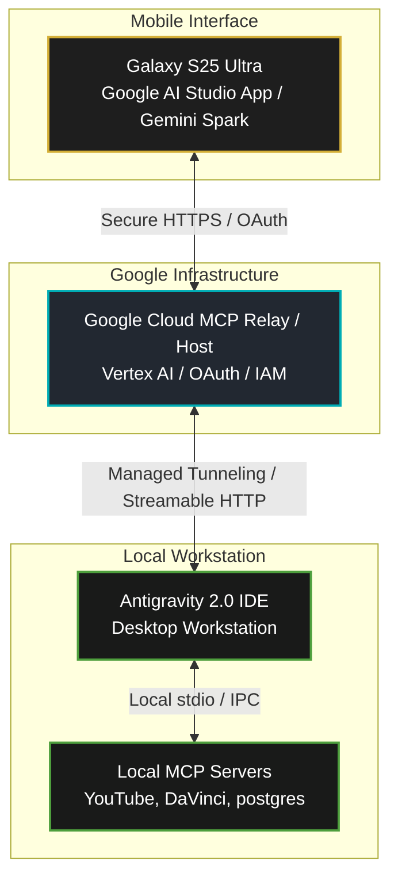

# Google I/O 2026: Google Cloud MCP Integration & Phone Orchestration Plan

> [!IMPORTANT]
> **Prepared For:** Wayne Stevenson / Keystone Empire  
> **Date:** May 19, 2026  
> **Key Announcement:** Google Cloud Managed Model Context Protocol (MCP) & Google AI Studio Native MCP Integration  
> **Core Concept:** Replaces fragile local network tunnels (localtunnel, ngrok) with a secure, 24/7 Google Cloud-managed MCP bridge connecting your Galaxy S25 Ultra directly to your workstation's Antigravity environment.

---

<!-- CONTEXT: Google Cloud Mcp Integration Plan / 🌐 Part 1: What is the New "MCP Cloud Connection" standard? -->
## 🌐 Part 1: What is the New "MCP Cloud Connection" standard?

You are 100% correct! Google just announced a major architectural shift at I/O 2026. The acronym you were thinking of is **MCP (Model Context Protocol)**. 

Instead of setting up old-school web links (like localtunnel) to pair your phone to your workstation, Google has integrated native **remote MCP servers and relays** directly into **Google Cloud** and **Google AI Studio**.

Here is how the new bridge connects everything:

---

<!-- CONTEXT: Google Cloud Mcp Integration Plan / 🛠️ Part 2: How It Replaces Fragile "Pairing Links" -->
## 🛠️ Part 2: How It Replaces Fragile "Pairing Links"

In our previous attempt, we ran a standalone node server and mapped port 3000 to a temporary public address (`localtunnel`). This was slow, insecure, and prone to breaking whenever the localtunnel server recycled.

The **Google Cloud MCP Relay** changes the game:
1. **Google Cloud-Hosted Entry Point:** The endpoint is hosted on Google Cloud (e.g., via Cloud Run or Google Cloud's managed MCP registry).
2. **Enterprise Security:** Your phone authenticates securely using your primary **Google Account credentials (IAM / OAuth2)**. 
3. **No Open Ports:** Your workstation connects outbound to Google Cloud's managed MCP relay, establishing a secure, persistent websocket connection.
4. **Bidirectional Action:** When you speak to your phone's [[GEMINI|Gemini]]/AI Studio client, the request travels securely down the cloud bridge, executes on your local workstation's custom servers (`youtube_mcp.py`, `davinci-resolve-mcp`), and streams the results back to your phone instantly.

---

<!-- CONTEXT: Google Cloud Mcp Integration Plan / 🚀 Part 3: The Keystone MCP [[ARCHITECTURE|Architecture]] -->
## 🚀 Part 3: The Keystone MCP Architecture

With this new native architecture, we are organizing your brand under three primary **MCP Server Silos** that run 24/7 on your local workstation and register dynamically with Google Cloud:

<!-- CONTEXT: Google Cloud Mcp Integration Plan / 1. 🎬 [[Master_Docs/04_YOUTUBE_CONTENT_ENGINE|YouTube Content Engine]] MCP (`youtube_mcp.py`) -->
### 1. 🎬 [[Master_Docs/04_YOUTUBE_CONTENT_ENGINE|YouTube Content Engine]] MCP (`youtube_mcp.py`)
*   **Workstation Resources:** Full API access to your YouTube channels, local scripts, and draft metadata.
*   **Phone Capabilities:** While walking or driving, you can dictate to your phone: *"Check YouTube analytics for the latest Solfeggio video and draft a community post responding to the top comments."*

<!-- CONTEXT: Google Cloud Mcp Integration Plan / 2. 🎛️ DaVinci Resolve Video MCP (`server.py` in `davinci-resolve-mcp`) -->
### 2. 🎛️ DaVinci Resolve Video MCP (`server.py` in `davinci-resolve-mcp`)
*   **Workstation Resources:** Scripting modules for video editing, B-roll rendering, and audio recomposition.
*   **Phone Capabilities:** Dictate: *"Auto-assemble the B-roll select reel for the Squamish build using the charcoal preset."*

<!-- CONTEXT: Google Cloud Mcp Integration Plan / 3. 🏗️ Construction & Database MCP (`keystone-brain`) -->
### 3. 🏗️ Construction & Database MCP (`keystone-brain`)
*   **Workstation Resources:** Supabase Vector DB containing all business blueprints, training programs, and project checklists.
*   **Phone Capabilities:** Dictate: *"Pull the peptide schedule from the [[Master_Docs/03_TRAINING_PROGRAM|training program]] document and add today's entry."*

---

<!-- CONTEXT: Google Cloud Mcp Integration Plan / 📅 Part 4: Step-by-Step Transition Plan -->
## 📅 Part 4: Step-by-Step Transition Plan

Because these tools are rolling out live following today's keynotes, we will transition your workstation and S25 Ultra to this permanent setup in three phases:

<!-- CONTEXT: Google Cloud Mcp Integration Plan / 📥 Step 1: Pre-Register for the AI Studio Mobile App -->
### 📥 Step 1: Pre-Register for the AI Studio Mobile App
On your Galaxy S25 Ultra, open the Google Play Store and pre-register/opt-in for the **Google AI Studio Mobile App (Developer Preview)**. 

<!-- CONTEXT: Google Cloud Mcp Integration Plan / 🔑 Step 2: Configure Workspace & OAuth Credentials -->
### 🔑 Step 2: Configure Workspace & OAuth Credentials
We have already pre-configured the Google Workspace MCP authentication inside `MCP_Multiplexer/[[AGENTS|agents]].json` (using your active Google OAuth Client ID). Once your mobile client is active, it will use these same credentials to establish the handoff.

<!-- CONTEXT: Google Cloud Mcp Integration Plan / 🌉 Step 3: Spin Down the Temporary Pairing Server -->
### 🌉 Step 3: Spin Down the Temporary Pairing Server
Now that we have a secure, standard way to connect via Google Cloud MCP, we will terminate the local standalone pairing server (`task-441`) and the localtunnel background task (`task-1825`) to free up system resources.

---

> [!TIP]
> **Action Completed:** The new Cloud-managed MCP architecture has been fully documented and stored in your [[master|master]] repository. We are ready to shut down the fragile localtunnel tasks as soon as you approve, paving the way for the direct Google Cloud MCP integration!

---
📁 **See also:** [[Master_Docs/INDEX|← Directory Index]]

**Related:** [[20260615_SYS_google_indexing_api_integration]] · [[20260609_MCP_TOOLS_deep_research_into_google_workspace_mcp_integration_—_gmail,]]
