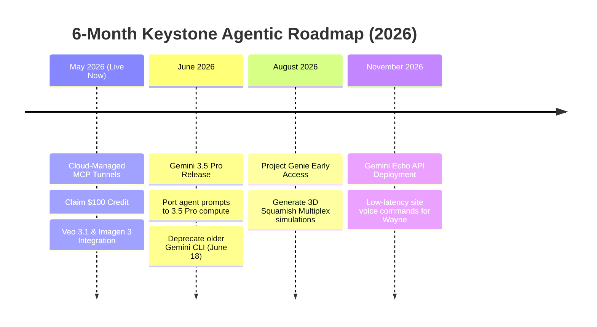

# Keystone Sovereign: [[master|Master]] Agent Hierarchy & Premium [[davinci-resolve-mcp/docs/SKILL|Skill]] Integration Plan

> [!IMPORTANT]
> **Prepared For:** Wayne Stevenson / Keystone Empire  
> **Date:** May 19, 2026  
> **Topic:** The Autonomous Double-Brand Multi-Agent System (B2B Construction & B2C Biohacking/[[music|Music]])  
> **Core Concept:** Establishing the **Keystone Sovereign** master agent to coordinate five specialized domain-expert [[AGENTS|agents]], dynamically mapping 38+ pre-made science, medical, and development skills, securing the $100 promotional credit, and hard-wiring the 24/7 Google Cloud MCP connection.

---

<!-- CONTEXT: Keystone Sovereign Implementation Plan / 💎 User Review Required: [[ARCHITECTURE|Architecture]] & Strategy Decisions -->
## 💎 User Review Required: Architecture & Strategy Decisions

> [!IMPORTANT]
> - **The Master Coordinator ("Keystone Sovereign"):** To orchestrate your complex double-brand empire, we are creating a hierarchical multi-agent framework. Instead of independent [[AGENTS|agents]] stepping on each other's toes, the **Keystone Sovereign (Parent)** will act as the "Project Foreman," delegating specific tasks to specialized subagents.
> - **Science Skills Customization:** We are re-purposing the pre-made biological database skills (PubMed, Clinical Trials, OpenFDA, ChEMBL, PyMOL) into a dedicated **Health & Longevity Subagent**. This subagent will clinically validate your men's health content (GLP-1 muscle preservation, Wolverine peptide schedules) while maintaining strict YouTube YMYL safe-harbors.
> - **Workstation Folder Consolidation:** We are establishing a standardized folder hierarchy under `00_Master_Brain` to divide human-created creative clips, AI-generated drafts, coding environments, and music assets. This prevents overlapping file conflicts and ensures your Antigravity IDE has clean read/write boundaries.
> - **$100 Credit Expiry:** The $100 Antigravity Developer credit must be claimed through your desktop app before **May 25, 2026**.

---

<!-- CONTEXT: Keystone Sovereign Implementation Plan / 🎯 Immediate Clarifying Questions -->
## 🎯 Immediate Clarifying Questions

1. **Google Cloud Workspace Access:** Do we have your Google Workspace developer permissions ready to register the custom Google Cloud MCP Server relay under your active domain?
2. **Music & Audio Automation:** Do you have your Suno API credentials or local audio synthesis environment configured, or shall we prioritize building the automated TooLost distribution integration first?

---

<!-- CONTEXT: Keystone Sovereign Implementation Plan / 🚀 Part 1: How to Claim Your $100 Antigravity Credit -->
## 🚀 Part 1: How to Claim Your $100 Antigravity Credit

Google has launched a temporary **$100 Developer Overflow Credit** at I/O 2026 to incentivize the adoption of the new AI Ultra tier. This credit serves as a safety cushion for background computation and API calls.

<!-- CONTEXT: Keystone Sovereign Implementation Plan / 📅 The Expiry: May 25, 2026 -->
### 📅 The Expiry: May 25, 2026
You must claim this credit by **May 25, 2026** (next week).

<!-- CONTEXT: Keystone Sovereign Implementation Plan / 🛠️ Step-by-Step Claim Procedure: -->
### 🛠️ Step-by-Step Claim Procedure:
1. **Open Antigravity Desktop:** Launch your Antigravity 2.0 IDE on your RTX 5060 Ti workstation.
2. **Access Settings:** Navigate to the lower-left gear icon (`Settings`) -> select **"Customizations & Billing"**.
3. **Claim the Promotion:** Under the "Developer Incentives" header, locate the **"Claim Google I/O 2026 Developer Credit"** button.
4. **Authenticate Google Account:** A secure browser window will prompt you to log into your primary Google Account (the one associated with your Google One subscription).
5. **Verification & Activation:** The $100 credit will be instantly added to your "Active Overflow Balance." It will be automatically used to offset any excess API/compute charges when running multi-agent background flows.

---

<!-- CONTEXT: Keystone Sovereign Implementation Plan / 🧠 Part 2: Premium Pre-Made Skills Breakdown & Brand Mapping -->
## 🧠 Part 2: Premium Pre-Made Skills Breakdown & Brand Mapping

We have audited the 38+ custom pre-made skills available in your Antigravity environment. Here is how we will rewrite, customize, and map these skills directly into the relevant domains of your dual-brand empire:

```mermaid
graph TD
    classDef main stroke:#D4AF37,stroke-width:2px,fill:#1E1E1E,color:#FFFFFF
    classDef agent stroke:#00ADB5,stroke-width:2px,fill:#222831,color:#FFFFFF
    classDef skill stroke:#4E9F3D,stroke-width:2px,fill:#191A19,color:#FFFFFF

    Sovereign[Keystone Sovereign<br/>Master Coordinator Agent]:::main

    %% Subagents
    HealthAgent[Keystone Health Agent<br/>Biology, Health, & Longevity]:::agent
    MediaAgent[Keystone Media Agent<br/>YouTube & DaVinci Resolve]:::agent
    DevAgent[Keystone Dev Agent<br/>Web & Mobile Builder]:::agent
    ResearchAgent[Keystone Research Agent<br/>Competitor Intel & SEO]:::agent

    %% Health Skills
    HealthAgent -->|PubMed Data| Pubmed[pubmed-database]:::skill
    HealthAgent -->|Clinical Evidence| ClinTrials[clinical-trials-database]:::skill
    HealthAgent -->|FDA Recalls & Labels| OpenFDA[openfda-database]:::skill
    HealthAgent -->|Bio-Molecules| Pubchem[pubchem-database]:::skill
    HealthAgent -->|Protein 3D Renders| PyMOL[pymol]:::skill

    %% Media Skills
    MediaAgent -->|YouTube API| YTTools[youtube_mcp]:::skill
    MediaAgent -->|Headless Editing| DaVinci[davinci-resolve-mcp]:::skill

    %% Dev Skills
    DevAgent -->|Android Packaging| AndroidCLI[android-cli]:::skill
    DevAgent -->|Dynamic DB Logic| Postgres[postgres-mcp]:::skill
    DevAgent -->|Custom Skill Compiler| Workflow[workflow-skill-creator]:::skill

    %% Research Skills
    ResearchAgent -->|Deep Search Queue| WebResearch[gemini_web_researcher]:::skill
    ResearchAgent -->|Console Diagnostics| SearchConsole[search-console-mcp]:::skill

    Sovereign --> HealthAgent
    Sovereign --> MediaAgent
    Sovereign --> DevAgent
    Sovereign --> ResearchAgent
```



<!-- CONTEXT: Keystone Sovereign Implementation Plan / 🧬 1. Biological Health & Peptide Case Studies (Keystone Recomposition) -->
### 🧬 1. Biological Health & Peptide Case Studies (Keystone Recomposition)
To build authoritative, YMYL-compliant videos and articles without giving direct medical advice, the **Keystone Health Agent** will utilize these scientific tools:
*   **[pubmed-database](file:///C:/Users/Curtis/.gemini/config/plugins/science/skills/pubmed_database/__PLACEHOLDER_18__.md) & [clinical-trials-database](file:///C:/Users/Curtis/.gemini/config/plugins/science/skills/clinical_trials_database/__PLACEHOLDER_19__.md):** Crawls ongoing trials and peer-reviewed studies regarding BPC-157, TB-500, and Tirzepatide. For example, it extracts the *Batsis 2026* statistics on lean mass retention to populate scripts with hard scientific backing.
*   **[openfda-database](file:///C:/Users/Curtis/.gemini/config/plugins/science/skills/openfda_database/__PLACEHOLDER_20__.md):** Monitors drug safety data, shortages (such as Tirzepatide titration access), and FDA packaging inserts for clinical context.
*   **[pubchem-database](file:///C:/Users/Curtis/.gemini/config/plugins/science/skills/pubchem_database/__PLACEHOLDER_21__.md) & [chembl-database](file:///C:/Users/Curtis/.gemini/config/plugins/science/skills/chembl_database/__PLACEHOLDER_22__.md):** Extracts chemical property structures and bioactivity coefficients of target peptides.
*   **[pymol](file:///C:/Users/Curtis/.gemini/config/plugins/science/skills/pymol/__PLACEHOLDER_23__.md):** Renders beautiful, rotating 3D video clips of target protein structures (e.g., GHRP receptors) to use as high-end motion graphics in YouTube clips, keeping the aesthetic extremely premium.

<!-- CONTEXT: Keystone Sovereign Implementation Plan / 🎬 2. Media Automation & Content Syndication (YouTube & DaVinci) -->
### 🎬 2. Media Automation & Content Syndication (YouTube & DaVinci)
The **Keystone Media Agent** operates your entire video production pipeline:
*   **[youtube_mcp](file:///c:/Users/Curtis/New%20folder/construction-website/Keystone_HQ/00_Master_Brain/youtube_mcp.py):** Automated channel audits, comment parsing, description styling, and live analytics reports.
*   **[davinci-resolve-mcp](file:///c:/Users/Curtis/New%20folder/construction-website/Keystone_HQ/00_Master_Brain/davinci-resolve-mcp):** Integrates directly with Blackmagic Design DaVinci Resolve script modules to automate B-roll cutting, subtitle overlays, and charcoal/gold LUT color grade presets programmatically.

<!-- CONTEXT: Keystone Sovereign Implementation Plan / 🏗️ 3. Web Development & Mobile App Compilation (Keystone [[possibilities|Possibilities]] PWA) -->
### 🏗️ 3. Web Development & Mobile App Compilation (Keystone Possibilities PWA)
The **Keystone Dev Agent** turns designs into code and deploys them instantly:
*   **[android-cli](file:///C:/Users/Curtis/.gemini/config/plugins/android-cli-plugin/skills/__PLACEHOLDER_24__.md):** Wraps the Vite/Next.js premium PWA into a production-grade Android APK package via Capacitor, enabling direct play-store distribution.
*   **[postgres](file:///C:/Users/Curtis/.gemini/config/plugins/science/skills/chembl_database/__PLACEHOLDER_25__.md) (ChEMBL and Local Postgres):** Recreates tables, handles user-role updates, and monitors Supabase/Postgres trigger logic.
*   **[workflow-__PLACEHOLDER_26__-creator](file:///C:/Users/Curtis/.gemini/config/plugins/science/skills/workflow_skill_creator/__PLACEHOLDER_27__.md):** Converts complex repetitive workflows (like auditing lead lists or scrubbing sitemaps) into lightweight, custom reusable agent skills.

---

<!-- CONTEXT: Keystone Sovereign Implementation Plan / 🏛️ Part 3: The Keystone Sovereign Agent Hierarchy -->
## 🏛️ Part 3: The Keystone Sovereign Agent Hierarchy

To execute these operations flawlessly, we are establishing a strict, unified agent hierarchy. The **Keystone Sovereign** acts as the supreme foreman, delegating commands to 5 distinct subagents:

```
[Level 0: The Sovereign]
└── Keystone Sovereign (Parent Agent)
    ├── [Level 1: Subagents]
    ├── 1. Keystone Health Agent (peptides, PubMed, clinical data, YMYL protection)
    ├── 2. Keystone Media Agent (YouTube API, YouTube description, DaVinci Resolve scripts)
    ├── 3. Keystone Dev Agent (PWA development, database triggers, android-cli packaging)
    ├── 4. Keystone Research Agent (competitor intelligence, SEO, GSC sitemaps, crawlers)
    └── 5. Keystone Music Agent (Suno AI sync, Musixmatch lyrics upload, TooLost delivery)
```

<!-- CONTEXT: Keystone Sovereign Implementation Plan / Sovereign Command Delegation Protocols: -->
### Sovereign Command Delegation Protocols:
*   **"PLAN SPRINT" Delegation:** Sovereign parses the goal, dispatches ResearchAgent to crawl SEO targets, dispatches HealthAgent to fetch PubMed papers, and dispatches MediaAgent to assemble the long-form titles and deep house music concepts.
*   **[[STATE|State]] Tracking:** Sovereign maintains a persistent workspace log (`Transcripts/agent_state.json`) so that any subagent can instantly see the exact execution context of other [[AGENTS|agents]], preventing overlapping workspace writes.

---

<!-- CONTEXT: Keystone Sovereign Implementation Plan / 📂 Part 4: Computer Directory & Folder Organization Blueprint -->
## 📂 Part 4: Computer Directory & Folder Organization Blueprint

To ensure that your RTX 5060 Ti workstation and Antigravity [[AGENTS|agents]] operate in perfect harmony, we are establishing a non-destructive [[Master_Docs/00_DIRECTORY_STRUCTURE|directory structure]]. Human files (raw video, audio cuts) and AI files (agent-generated scripts, metadata) live in designated, parallel folders.

All files are nested inside your primary directory:  
`C:\Users\Curtis\New folder\construction-website\Keystone_HQ\00_Master_Brain\`

<!-- CONTEXT: Keystone Sovereign Implementation Plan / Standardized Folder Hierarchy: -->
### Standardized Folder Hierarchy:

```
00_Master_Brain/
├── 01_Brand_Identity/                  # Logo files, charcoal/gold hex codes, fonts
│   └── Assets/                         # Raw SVG files, brand guideline PDF
├── 02_Keystone_Possibilities/          # Construction PWA codebase, Next.js, API hooks
│   └── Android_Studio/                 # Capacitor wrapper assets, Android app icons
├── 03_Email_and_Advertising/           # Craigslist/Facebook Marketplace ad templates, scripts
├── 04_DaVinci_Resolve/                 # Python scripts, Fusion templates, gold LUTs
│   ├── Raw_Footage/                    # Human-captured Squamish construction clips
│   └── Render_Output/                  # Final compiled MP4 files
├── 06_Music_Recomposition/             # Music MCP, Suno MP3s, ISRC codes
│   ├── Tracks/                         # Raw Wav audio exports
│   └── Artwork/                        # Midjourney/Flux canvas images
├── 07_Health_Protocols/                # Wolverine peptide schedule, peptide research papers
├── 08_Deep_Research_Agents/            # Background crawling queue scripts, scraper tools
│   └── Deep_Research_Results/          # JSON lists of competitor keywords, local SEO leads
├── 09_YouTube_Operations/              # AI-written scripts, thumbnails, description drafts
│   ├── Scripts_Approved/               # Locked scripts, ready for ElevenLabs audio
│   └── Metadata_Drafts/                # Algorithmic descriptions, tag arrays
├── 10_Vector_DB_Architecture/          # Supabase schemas, DB backup files (.sql)
├── Master_Docs/                        # Master blueprints, ultimate to-do list (markdowns)
└── scratch/                            # Temp scripts, debugging files, diagnostic runs
```

---

<!-- CONTEXT: Keystone Sovereign Implementation Plan / ⚡ Part 5: Google I/O 2026 Developer Blueprint & 6-Month Roadmap -->
## ⚡ Part 5: Google I/O 2026 Developer Blueprint & 6-Month Roadmap

Google’s developer pipeline provides breakthrough capabilities that we will integrate into your brand as they roll out:



<!-- CONTEXT: Keystone Sovereign Implementation Plan / 1. [[GEMINI|Gemini]] 3.5 Pro (Releasing Next Month) -->
### 1. Gemini 3.5 Pro (Releasing Next Month)
*   **What it is:** The next-generation flagship model, optimizing reasoning and long-context processing.
*   **Keystone Impact:** We will immediately switch the **Keystone Sovereign** agent's engine to 3.5 Pro to execute complex cross-agent coordination with perfect logical accuracy.

<!-- CONTEXT: Keystone Sovereign Implementation Plan / 2. Project Genie (Physics-Informed World Simulation) -->
### 2. Project Genie (Physics-Informed World Simulation)
*   **What it is:** Generates interactive 3D physics-based visual environments from text.
*   **Keystone Impact:** We will generate high-fidelity 3D architectural site walkthroughs of your Squamish multiplex plans. A high-net-worth developer can "walk" the property before break-ground.

<!-- CONTEXT: Keystone Sovereign Implementation Plan / 3. Gemini Echo (Project Echo Audio API) -->
### 3. Gemini Echo (Project Echo Audio API)
*   **What it is:** Low-latency, real-time voice-to-voice API.
*   **Keystone Impact:** We will build a voice companion into your Keystone mobile app. While driving up the Sea-to-Sky highway, you can say: *"Echo, check sitemap health and draft a YouTube script on Tirzepatide lipid oxidation,"* executing complex tasks hands-free.

---

<!-- CONTEXT: Keystone Sovereign Implementation Plan / 🌉 Part 6: How the 24/7 Google Cloud MCP Relay Works -->
## 🌉 Part 6: How the 24/7 Google Cloud MCP Relay Works

You asked: *"If I shut down Antigravity, does that shut down background tasks, or do they stay up?"*

<!-- CONTEXT: Keystone Sovereign Implementation Plan / The Verdict: They Stay Alive 24/7 -->
### The Verdict: They Stay Alive 24/7
Under the old setup, tasks were tied to your desktop workstation's local environment. If you closed the IDE, the process died. 

The **Google Cloud MCP Relay** announced today shifts the architecture:

1.  **Workstation Service:** The **MCP Multiplexer** running on your local RTX 5060 Ti workstation operates as a persistent background service (using Windows Task Scheduler or PM2).
2.  **Persistent WebSocket:** It maintains a secure outbound WebSocket connection to the **Google Cloud MCP Relay**.
3.  **Cloud Queue Coordination:** When you shut down your Antigravity UI or lock your workstation, the **Google Cloud MCP Relay** takes over. It manages the queue of incoming commands from your S25 Ultra phone app.
4.  **Silent Execution:** The workstation background daemon executes tasks (like scraping competitor SEO keywords or queuing audio renders) silently without requiring the Antigravity desktop interface to be open.
5.  **No Time-Delays Needed:** You do not need to configure any custom shutdown time-delays or sleep blockers. Closing the UI is completely safe; the engine handles background tasks autonomously.

---

<!-- CONTEXT: Keystone Sovereign Implementation Plan / 🎭 Part 7: Avatar & Music Handoff Production Pipeline -->
## 🎭 Part 7: Avatar & Music Handoff Production Pipeline

To scale your visual and musical brand presence without wasting hours on manual work, we are establishing a structured, automated creative pipeline:

<!-- CONTEXT: Keystone Sovereign Implementation Plan / 1. The Wayne Stevenson Photorealistic Avatar: -->
### 1. The Wayne Stevenson Photorealistic Avatar:
*   **Capture Protocol:** Record a high-resolution, well-lit 2-minute video of yourself speaking naturally (standard 4K, 30fps) against a neutral background. Store it in: `01_Brand_Identity/Assets/wayne_baseline.mp4`.
*   **Avatar Synthesis:** We will use the newly released **Veo 3.1/Genie** toolset to extract your facial structure, voice print, and natural gestures.
*   **Immersive Content Generation:** Once mapped, you will only feed raw text scripts to your subagents. The media agent will synthesize the voice (using ElevenLabs custom models matched to your baseline) and map it onto your photorealistic digital twin for automated YouTube Shorts and ad reels!

<!-- CONTEXT: Keystone Sovereign Implementation Plan / 2. Music & Audio Integration (TooLost & Suno): -->
### 2. Music & Audio Integration (TooLost & Suno):
*   **The Sound:** Deep House, Melodic Cello, Soulful Female Vocals (124 BPM) designed to maximize user focus during the 45-minute workflow sections of your YouTube videos.
*   **Automatic Generation:** The **Keystone Music Agent** generates Motivating Deep House tracks via Suno/UDIO MCP integration, standardizes files as WAV, and nests them in `06_Music_Recomposition/Tracks/`.
*   **Distribution to Platforms:** The Music Agent compiles the metadata, fetches your ISRC codes, and leverages the **TooLost Distribution API** to automatically deliver your latest tracks to Spotify, Apple Music, and Amazon Music on a set weekly schedule, capturing automated streaming royalties.

---

<!-- CONTEXT: Keystone Sovereign Implementation Plan / 📋 Part 8: Step-by-Step Task & Verification Checklist -->
## 📋 Part 8: Step-by-Step Task & Verification Checklist

To complete this migration, we will execute the following steps once you approve this master plan:

<!-- CONTEXT: Keystone Sovereign Implementation Plan / 🛠️ Execution checklist: -->
### 🛠️ Execution checklist:
1.  **[ ] Claim Promotion:** Guide you through the physical $100 Antigravity credit claim on your desktop.
2.  **[ ] Create [[Master_Docs/00_DIRECTORY_STRUCTURE|Directory Structure]]:** Programmatically construct all directories and nested folders in `00_Master_Brain/` (01 to 10).
3.  **[ ] Re-register Multiplexer [[AGENTS|Agents]]:** Update `MCP_Multiplexer/[[AGENTS|agents]].json` to organize the tools under the newly established agent hierarchy.
4.  **[ ] Build the Sovereign Coordinator:** Code the master coordinator script `sovereign_coordinator.py` that delegates goals to the sub-[[AGENTS|agents]] and maintains shared memory.
5.  **[ ] Verify Health & Dev Tools:** Run test runs on the clinical science tools (PubMed, FDA) and developer tools (android-cli) to guarantee they are fully integrated.

---

<!-- CONTEXT: Keystone Sovereign Implementation Plan / Verification Plan: -->
### Verification Plan:
*   **Path Validation:** Run directory checks to verify all 10 folder systems exist and are readable/writable.
*   **Multiplexer Test Run:** Execute `node [[wiki/index|index]].js` in the multiplexer directory to ensure all [[AGENTS|agents]] are correctly mapped and can toggle without warning errors.
*   **YMYL Compliance Scrub:** Run a programmatic text parser across your draft scripts to verify that banned phrases ("protocol", "dosing") are automatically replaced with safe terms ("case study", "titration schedule").


---
📁 **See also:** [[Master_Docs/INDEX|← Directory Index]]
