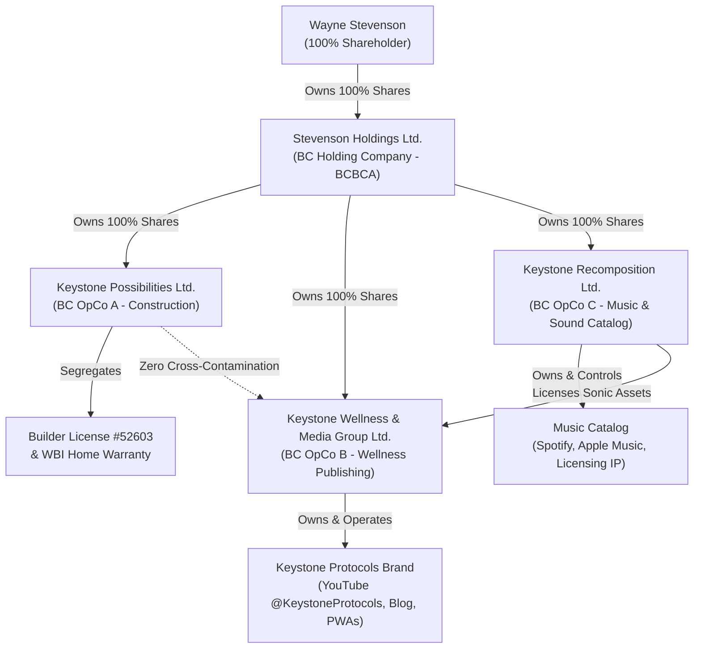

# 17. Corporate Asset Shielding & Custom Voice IP Blueprint
**An Exhaustive Legal Memorandum and Strategic Operational Framework for Wayne Stevenson and Keystone [[possibilities|Possibilities]] Ltd.**

---

## Executive Summary

This blueprint establishes a highly sophisticated, defensible, and legally insulated structure for the professional and creative assets of Wayne Stevenson. As a Certified Licensed Residential Builder in British Columbia ([[davinci-resolve-mcp/venv/Lib/site-packages/uvicorn-0.46.0.dist-info/licenses/LICENSE|License]] #52603) operating a custom luxury construction firm (**Keystone Possibilities Ltd.**), a melodic sound designer (**Keystone Recomposition**), and an active researcher of metabolic health and experimental peptide protocols (**Keystone Protocols**), the founder operates at a unique cross-section of high-value commercial construction, artistic sound production, and high-liability health publishing.

To scale these ventures safely and organically, this document outlines a **Triple-Shield [[ARCHITECTURE|Architecture]]**:
1. **Intellectual Property Shield:** A comprehensive analysis of Canadian and British Columbia intellectual property laws (statutory and common-law) regarding the protection, monetization, and enforcement of custom synthetic voice clones (e.g., ElevenLabs).
2. **Corporate Asset Shield:** A multi-entity corporate restructuring plan under the *British Columbia Business Corporations Act* (BCBCA) utilizing a parent Holding Company (HoldCo) to completely segregate the high-liability longevity publishing assets from the multi-million dollar assets, licensing status, and home warranty standing of the construction operating company.
3. **Health Compliance & Disclaimer Shield:** An ironclad, Health Canada-compliant, and BC commercial law-aligned regulatory disclaimer and Terms of Service (ToS) designed to frame wellness content strictly as educational scientific research, shifting 100% of physical risk to the user and capping all corporate liabilities.

---

## PART I: Custom Voice Synthesis & IP Rights in BC and Canada

### 1. The Technology & The Legal Challenge
The deployment of a high-fidelity synthetic clone of Wayne Stevenson’s voice (created via platforms like ElevenLabs) for video narration, audiobooks, and automated social syndication represents a major operational efficiency. However, generative voice synthesis occupies a legal frontier that outpaces traditional statutory intellectual property regimes. Protecting a "digital twin’s" voice model, the training inputs, and the synthetic outputs requires a coordinated approach leveraging copyright, trademark, and common-law torts in British Columbia.

---

### 2. Copyright Protection under the *Copyright Act* (R.S.C. 1985, c. C-42)

Under Canadian law, a human voice in its natural, unrecorded [[STATE|state]] is **not** protected by copyright. Copyright requires an "original work" of authorship fixed in a tangible medium of expression.

```
[Raw Human Voice] ───────> (Not Copyrightable: Natural physiological sound)
[Recorded Audio File] ───> (Copyrightable: Protected as a "Sound Recording")
[ElevenLabs Voice Model] ──> (Contractual & Proprietary Trade Secret Protection)
[Synthetic Speech Output] ──> (Copyrightable only if human authorship is proven)
```

#### A. Protection of training inputs (The "Source Code" of the Voice)
The original audio recordings of Wayne Stevenson's voice used to train the ElevenLabs model (e.g., high-quality podcast interviews, raw narrative voiceovers) are fully protected under the *Copyright Act* as **"Sound Recordings"** (Section 2 and Section 18).
*   **Ownership:** As the performer and maker of the sound recording, Wayne Stevenson (or his designated media corporation) holds the exclusive right to reproduce, publish, or [[davinci-resolve-mcp/venv/Lib/site-packages/uvicorn-0.46.0.dist-info/licenses/LICENSE|license]] these audio files.
*   **Enforcement:** Any unauthorized scraping, downloading, or ingestion of Wayne's recorded voice by third parties to train a rival AI model constitutes direct copyright infringement.

#### B. Protection of the AI Voice Model (The Weights and Biases)
The proprietary algorithm and the customized "voice profile" generated by ElevenLabs do not fit neatly into the definition of a literary or artistic work. Under Canadian law, this is protected primarily as a **Trade Secret** and through **Contractual Restraints** set out in the platform's Terms of Service. The digital voice model file itself cannot be registered for copyright, but unauthorized access or theft of the model constitutes a breach of contract and misappropriation of confidential information.

#### C. Protection of the Synthetic Output Files
The synthetic audio generated by entering text into ElevenLabs ("Outputs") faces a critical hurdle under Canadian copyright law: **the requirement of human authorship**. 
*   In *CCH Canadian Ltd. v. Law Society of Upper Canada* (2004 SCC 13), the Supreme Court of Canada established that an "original" work must originate from an author, must not be copied, and must be the product of an exercise of **[[davinci-resolve-mcp/docs/SKILL|skill]] and judgment** that is more than a mere mechanical exercise.
*   **Strategic Action:** Fully automated, one-click text-to-speech outputs may lack sufficient human authorship to be copyrightable. To secure copyright protection over synthetic voiceovers, the production workflow must demonstrate active human intervention. Wayne Stevenson must personally write the underlying script (securing copyright in the literary work), direct the pacing, inflections, and emotional cues of the AI model, and actively edit, mix, and [[master|master]] the resulting audio file. This elevates the final output to a copyrightable **derivative musical or dramatic work**.

---

### 3. Trademark Protection under the *Trademarks Act* (R.S.C. 1985, c. T-13)

Following the comprehensive 2019 amendments to the Canadian *Trademarks Act*, the statutory definition of a "trademark" was expanded to include non-traditional marks, explicitly including **"sounds"** (Section 2).

```
                      SOUND TRADEMARK REQUIREMENTS
                      
        ┌────────────────────────────────────────────────────────┐
        │  1. Non-Traditional Mark: Must be a distinct sound     │
        └───────────────────────────┬────────────────────────────┘
                                    │
                                    ▼
        ┌────────────────────────────────────────────────────────┐
        │  2. Graphic Representation: Formatted as MP3 and wave  │
        └───────────────────────────┬────────────────────────────┘
                                    │
                                    ▼
        ┌────────────────────────────────────────────────────────┐
        │  3. Acquired Distinctiveness: Public uniquely links    │
        │     the sound to "Keystone" goods or services          │
        └────────────────────────────────────────────────────────┘
```

#### A. Can a voice clone be registered as a sound trademark?
In theory, yes. An applicant can submit an audio file (typically an MP3/WAV file under 5MB) along with a precise description of the sound. However, the legal threshold for registering a natural speaking voice or a generic synthetic voice clone as a trademark is extraordinarily high:
*   **The Distinctiveness Hurdle (Section 12 and Section 32):** The applicant must prove that the vocal sound has acquired **"inherent or acquired distinctiveness."** This means that when the average Canadian consumer hears the specific vocal timbre or speaking cadence, they instantly associate it uniquely with a single commercial source of goods or services (similar to the MGM Lion's roar or the Intel chime).
*   A [[general|general]] narrative voice used to read educational content or construction updates will be rejected by the Canadian Intellectual Property Office (CIPO) as lacking distinctiveness, as it is viewed as a functional medium of communication rather than a source identifier.

#### B. Practical Recommendation
Do not seek trademark registration for the raw voice clone itself. Instead, focus trademark budgets on securing traditional word and design marks for the corporate identifiers:
*   **"KEYSTONE PROTOCOLS"** (Class 41: Educational services in metabolic health; Class 44: Wellness consulting).
*   **"KEYSTONE RECOMPOSITION"** (Class 9: Sound recordings; Class 41: Sound engineering, entertainment services).
*   **"KEYSTONE POSSIBILITIES"** (Class 37: Custom home building, structural contracting, construction project management).

---

### 4. The Common-Law Tort of Passing Off in British Columbia

The primary legal weapon to combat unauthorized commercial voice cloning in Canada is the common-law tort of **Passing Off**. This tort prevents a competitor from misrepresenting their goods or services as those of another, or implying a false commercial association.

Under the classic three-part test established by the Supreme Court of Canada in *Ciba-Geigy Canada Ltd. v. Apotex Inc.* [1992] 3 S.C.R. 120, Wayne Stevenson must establish three elements to block an unauthorized voice clone:

| Passing Off Element | Legal Definition | Application to Custom Voice Clones |
| :--- | :--- | :--- |
| **1. Goodwill or Reputation** | The plaintiff possesses a localized or national reputation/goodwill associated with their name, brand, or persona. | Wayne Stevenson must prove his voice has recognized commercial value in BC's construction, wellness, or [[music|music]] sectors. |
| **2. Deceptive Misrepresentation** | The defendant has made a misrepresentation to the public, knowingly or recklessly, leading to public confusion. | The unauthorized use of a voice clone to narrate a competitor’s ad, creating a false impression of endorsement. |
| **3. Actual or Potential Damage** | The plaintiff has suffered or is highly likely to suffer economic loss, dilution of brand value, or loss of control over their reputation. | Diversion of luxury home builds to a competitor, unauthorized sales of coaching, or reputational damage. |

---

### 5. The Common-Law Tort of Appropriation of Personality

Distinct from passing off, British Columbia common law recognizes the proprietary tort of **Appropriation of Personality**. This tort prevents the unauthorized commercial exploitation of a person's name, image, likeness, or other core identifiers of their persona for another's commercial gain.

*   **Key Precedents:** In *Krouse v. Chrysler Canada Ltd.* (1973) and *Athans v. Canadian Adventure Camps Ltd.* (1977), Canadian courts established that an individual has a proprietary right in the exclusive commercial marketing of their personality.
*   In *Athans*, the court ruled that the unauthorized commercial use of a stylized drawing of a water-skier, which was instantly recognizable as the plaintiff, constituted a violation of his proprietary right.
*   **Application to Voice Cloning:** A person's voice is one of the most intimate and recognizable components of their personality. The unauthorized commercial deployment of a high-fidelity synthetic clone of Wayne Stevenson’s voice to sell a product, endorse a service, or narrate commercial videos constitutes a clear appropriation of his personality. This allows for immediate injunctive relief to take down the media, alongside compensatory and punitive damages.

---

### 6. The British Columbia *Privacy Act* (R.S.B.C. 1996, c. 373)

In addition to common-law torts, British Columbia provides a statutory cause of action under the *Privacy Act* for the unauthorized commercial exploitation of [[Brand_Constitution/protocol/IDENTITY|identity]].

*   **Section 3(1):** *"It is a tort, actionable without proof of damage, for a person, knowingly, without a claim of right, to use the name or portrait of another for the purpose of advertising or promoting the sale of, or other trading in, property or services."*
*   **Analyzing the term "Portrait":** While the statute uses the historical word "portrait" (traditionally interpreted as a visual image or photograph), modern British Columbia courts interpret privacy and [[Brand_Constitution/protocol/IDENTITY|identity]] protections dynamically. However, because statutory interpretation can be highly literal, the statutory tort of Section 3 should be pleaded **in tandem** with the broader, more flexible common-law tort of appropriation of personality, which easily encompasses vocal likeness and synthetic voice replicas.

---

### 7. ElevenLabs Licensing & Contractual Guardrails

To prevent the unauthorized leakage, training, or commercial exploitation of Wayne Stevenson's voice clone, strict contractual terms must govern all platform interactions and third-party partnerships.

```
                          CONTRACTUAL GUARDRAILS
                          
 ┌──────────────────────┐   Licenses Voice    ┌──────────────────────┐
 │    WAYNE STEVENSON   │────────────────────>│    KEYSTONE MEDIA    │
 │ (Voice Rights Holder)│<────────────────────│ (Licensed Operator)  │
 └──────────────────────┘   Strict Covenants  └──────────────────────┘
            │                                            │
            ▼                                            ▼
   [Revocation Right:                      [Technical Security:
    Wayne can terminate and                 Mandatory MFA, no API
    demand deletion at will]                key sharing, isolated models]
```

#### A. Direct Platform Safeguards (ElevenLabs Setup)
*   **Strict Access Control:** The ElevenLabs master account must utilize hardware-based Multi-Factor Authentication (MFA) and be registered under a secure, isolated corporate email address.
*   **API Key Management:** The developer API keys for ElevenLabs must never be committed to public repositories (such as GitHub) or shared with third-party freelancers. All voice synthesis scripts must reference keys stored in encrypted local environment variables.
*   **No Public Sharing:** In the ElevenLabs dashboard, the custom voice model must be kept strictly **Private** and never shared to the public Voice Library, preventing third parties from utilizing the model for their own generations.

#### B. Inter-Entity Custom Voice Licensing Agreement (Template Covenants)
If the custom voice model is licensed from Wayne Stevenson (as an individual) to the wellness operating company, a formal **Synthetic Voice Licensing Agreement** must be executed. This agreement must incorporate the following ironclad covenants:
1.  **Strict Purpose Limitation:** The licensee is granted a non-exclusive, non-transferable, revocable [[davinci-resolve-mcp/venv/Lib/site-packages/uvicorn-0.46.0.dist-info/licenses/LICENSE|license]] to utilize the voice model *solely* for generating educational narration for the official "@KeystoneProtocols" YouTube channel, related PWAs, and authorized podcasts.
2.  **Absolute Revocation Right:** The licensor (Wayne Stevenson) retains the unilateral, unrestricted right to terminate the [[davinci-resolve-mcp/venv/Lib/site-packages/uvicorn-0.46.0.dist-info/licenses/LICENSE|license]] at any time without notice, requiring the immediate deletion of the voice model from the licensee’s platforms and the destruction of all raw synthetic output files.
3.  **Prohibition of Sub-licensing or Transfer:** The licensee is strictly prohibited from selling, sub-licensing, renting, or transferring access to the voice model, the underlying training audio, or the API keys to any third party.
4.  **Content Restrictions:** The voice clone must never be used to synthesize content that violates Health Canada regulations, constitutes medical advice, contains defamatory, political, or adult material, or violates any Canadian law.

---

## PART II: Corporate Entity Structural Architecture & Asset Shielding

### 1. The Critical Mismatch in Risk Profiles

A single lawsuit can destroy a business. In Wayne Stevenson's portfolio, the assets and liabilities of the active business entities are highly incompatible:

```
[HIGH-VALUE ASSETS & WARRANTY LIABILITY]       [HIGH-LITIGATION REGULATORY LIABILITY]
      Keystone Possibilities Ltd.                    Keystone Protocols
  * Holds General Contractor License             * Discusses experimental peptides
  * Mandatory 2-5-10 Year Warranties             * Off-label drug protocols
  * Multi-million dollar luxury build cash       * Direct-to-consumer health advice
```

*   **Keystone Possibilities Ltd.** operates in a capital-intensive, highly regulated sector. It holds a valuable General Contractor [[davinci-resolve-mcp/venv/Lib/site-packages/uvicorn-0.46.0.dist-info/licenses/LICENSE|License]] (#52603) and must secure mandatory 2-5-10 year home warranties under the BC *Homeowner Protection Act*. It holds significant cash reserves, commercial general liability (CGL) insurance, equipment, and active construction contracts.
*   **Keystone Protocols** operates a public video channel and blog discussing experimental peptides (BPC-157, TB-500), research chemicals, and off-label longevity protocols (Tirzepatide/Mounjaro). This activity carries extreme regulatory risk from Health Canada (under the *Food and Drugs Act*) and product liability risk if a user suffers an adverse physiological event (such as systemic infection from improper peptide reconstitution).

If these two activities are commingled under a single corporate entity, or if Wayne Stevenson operates them as a sole proprietorship, **a single lawsuit from an injured blog reader will result in the seizure of the construction company’s cash reserves, equipment, and real property, and the immediate revocation of the Licensed Builder status.**

Conversely, a structural defect claim or a subcontractor dispute on a West Vancouver construction site could freeze the bank accounts of the wellness brand and halt the distribution of Wayne's music catalog. Complete legal and financial segregation is mandatory.

---

### 2. The Triple-Entity Holding Company (HoldCo) Blueprint

To achieve absolute asset insulation, Wayne Stevenson must implement a classic **HoldCo/OpCo** corporate structure under the *British Columbia Business Corporations Act* (BCBCA).



#### A. Stevenson Holdings Ltd. (The Parent "Vault")
*   **Status:** A private holding company incorporated in British Columbia.
*   **Ownership:** 100% owned and controlled by Wayne Stevenson.
*   **Role:** Holds 100% of the common shares of the three operating companies (OpCos). It does not engage in public-facing operations, does not sign construction contracts, and does not publish media. Its sole purpose is to hold shares and safely accumulate corporate surplus.

#### B. Operating Company A: Keystone Possibilities Ltd. (The Construction Shield)
*   **Status:** Active operating company incorporated in BC.
*   **Assets:** Holds BC Builder [[davinci-resolve-mcp/venv/Lib/site-packages/uvicorn-0.46.0.dist-info/licenses/LICENSE|License]] #52603, WBI National Home Warranty standing, general contracting contracts, structural tools, and operating cash.
*   **Operational Boundary:** Restricted exclusively to custom luxury home building, commercial renovations, and construction project management. It must have **zero** legal, financial, or promotional connection to wellness, music, or peptide research.

#### C. Operating Company B: Keystone Wellness & Media Group Ltd. (The Media Shield)
*   **Status:** Active operating company incorporated in BC.
*   **Assets:** Owns the domain `keystoneprotocols.com` (or `keystonerecomposition.com`), the YouTube channel `@KeystoneProtocols`, the intellectual property of the *Keystone Protocol* digital products, and handles all e-commerce transactions via Shopify.
*   **Operational Boundary:** Acts as the sole corporate publisher of the wellness blog and seller of metabolic programs. If a reader sues for damages arising from a peptide article, the lawsuit can target **only** this entity. Because this company holds negligible physical assets (only digital IP, web code, and minimal operational cash), the financial exposure is completely capped, leaving the construction assets and builder [[davinci-resolve-mcp/venv/Lib/site-packages/uvicorn-0.46.0.dist-info/licenses/LICENSE|license]] untouched.

#### D. Operating Company C: Keystone Recomposition Ltd. (The Creative Vault)
*   **Status:** Active operating company incorporated in BC.
*   **Assets:** Owns the copyrights to the musical catalog (*L'Architettura del Domani*, *Iron Ice*, "Week Zero"), receives royalty streams from Spotify, Apple Music, and YouTube Music, and holds the verified Official Artist Channel (OAC) credentials.
*   **Operational Boundary:** Manages music publishing, licensing, and sonic branding. It licenses ambient tracks to OpCo B for background audio, establishing a clean, cross-entity commercial flow.

---

### 3. The Legal Mechanics of Asset Protection & Inter-Corporate Dividends

The HoldCo structure provides an exceptionally robust asset protection mechanism under the Canadian *Income Tax Act* (Section 112(1)):

1.  **Tax-Free Cash Transfers:** Under Section 112(1) of the *Income Tax Act*, active operating companies can pay dividends up to the parent Holding Company entirely **tax-free**, provided the corporations are "connected" (which is satisfied here since HoldCo owns 100% of the OpCos).
2.  **The Weekly Sweep:** Keystone Possibilities Ltd. and Keystone Wellness & Media Group Ltd. should maintain only the minimum necessary working capital in their active corporate accounts to cover immediate operational expenses (e.g., payroll, supplier invoices, short-term materials).
3.  **Surplus Insulation:** At regular intervals (weekly or monthly), all excess profit must be declared as a dividend and wired to the bank account of Stevenson Holdings Ltd.
4.  **Creditor Immunity:** Once the cash resides in Stevenson Holdings Ltd., it is legally insulated. If a structural construction claim hits OpCo A, or a product liability claim hits OpCo B, the creditors can sue only the specific OpCo. They cannot access the cash in the parent HoldCo, nor can they access the assets of the sister OpCos, because they are entirely separate legal persons.

---

### 4. Maintaining Strict Corporate Hygiene (Evading the "Alter Ego" Doctrine)

To prevent opposing lawyers from "piercing the corporate veil" and claiming that these companies are a mere sham or the personal "alter ego" of Wayne Stevenson (citing *Transamerica Life Insurance Co. of Canada v. Canada Life Assurance Co.*), Wayne must practice flawless corporate hygiene.

```
                         CORPORATE HYGIENE RULES
                         
 ┌──────────────────────┐   Separate Banking  ┌──────────────────────┐
 │   OPCO A: BUILDER    │◄───────────────────►│   OPCO B: WELLNESS   │
 │ Separate Visa & Cheq │                     │ Separate Visa & Cheq │
 └──────────────────────┘                     └──────────────────────┘
            │                                            │
            ▼                                            ▼
   [Paid by OpCo A only:                       [Paid by OpCo B only:
    WBI Warranty, Lumber,                       HeyGen, ElevenLabs,
    Contractor Insurance]                       Web Hosting, Stripe]
```

*   **Separate Banking and Credit Cards:** Every corporation must maintain its own dedicated business checking account and commercial credit cards. Never pay for a wellness software subscription (like HeyGen, ElevenLabs, or web hosting) using a Keystone Possibilities Ltd. credit card. Never deposit custom construction project payments into the wellness store's Stripe account.
*   **Arms-Length Inter-Company Agreements:** All transactions between the entities must be formal, written, and executed at fair market value:
    *   *Music Licensing:* Keystone Recomposition Ltd. must execute a simple **Master Synchronization [[davinci-resolve-mcp/venv/Lib/site-packages/uvicorn-0.46.0.dist-info/licenses/LICENSE|License]]** with Keystone Wellness & Media Group Ltd., granting permission to use "Week Zero" and other ambient catalog tracks as background music in health videos for a nominal fee (e.g., $1.00 per year or a percentage of AdSense).
    *   *Management Services:* If Stevenson Holdings Ltd. provides administrative oversight, simple management service agreements must be put in place, complete with monthly invoices.
*   **Public-Facing Disclosures:** The footers of the wellness websites, Terms of Service, and YouTube channel descriptions must explicitly declare the corporate operator. 
    *   *Footer Text:* `"© 2026 Keystone Wellness & Media Group Ltd. All rights reserved. The website keystonerecomposition.com and YouTube channel @KeystoneProtocols are owned and operated by Keystone Wellness & Media Group Ltd."`
*   **Separate Tax Filings and Minutes:** File separate annual Corporate Income Tax Returns (T2) for all four corporations. Maintain up-to-date corporate minute books, annual shareholder resolutions, and director registries for each company at the designated registered office in British Columbia.

---

## PART III: Compliant Legal Disclaimer & Terms of Service (ToS) Blueprint

### 1. Navigating the Health Canada Regulatory Environment

In Canada, substances like BPC-157, TB-500, and ipamorelin are classified as **unapproved new drugs** or **prescription drugs** on the Health Canada Prescription Drug List. Under the *Food and Drugs Act* (R.S.C. 1985, c. F-27) and its regulations:
*   It is strictly illegal to sell, import for sale, or advertise unapproved prescription substances for human consumption or therapeutic use.
*   Presenting "protocols," dosing schedules, or reconstitution instructions targeted at humans is viewed by regulators as the illegal advertising and promotion of unapproved drugs, exposing the publisher to severe fines, search-and-seizure operations, and criminal prosecution.
*   Tirzepatide (Mounjaro) is approved strictly as a prescription drug for Type 2 Diabetes (and weight management). Writing about its off-label use for lifestyle longevity must avoid any implication that the website is prescribing, dispensing, or facilitating unauthorized distribution.

To bypass regulatory enforcement and defeat civil product liability claims, the website and video channels must implement a complete **Legal Reframing Strategy**.

---

### 2. The "Scientific & In Vitro Research" Framing Strategy

The core strategy is to completely decouple the content from human application. The platform must never recommend that a human ingest, inject, or otherwise consume these substances. Instead, all content must be legally framed as **scientific literature reviews of in vitro (laboratory) and animal (in vivo) research**.

```
                           THE LEGAL REFRAMING
                           
 [Illegal Promotion] ──> "Use BPC-157 at 250mcg daily to heal your tendon."
 
 [Compliant Review] ───> "Published in vitro studies analyze the cell-migration
                          effects of pentadecapeptide BPC-157 in laboratory
                          culture dishes at concentrations of..."
```

*   **The Subject:** The subject of the research is the chemical compound itself, analyzed inside a laboratory setting.
*   **The Protocol:** Any "protocol" or "dosing breakdown" discussed is presented strictly as a transcript or structural breakdown of the *methodology used by third-party academic researchers in published scientific literature*, not as a recommendation for personal use.
*   **The Disclaimer Hook:** Every video and article must prominently [[STATE|state]] that the compounds discussed are strictly **"Research Chemicals"** and are **"Not for Human Consumption."**

---

### 3. Exhaustive Custom Medical Disclaimer Draft

*The following disclaimer must be displayed prominently in the footer of every page on the wellness platform, in the video description of every YouTube upload, and inside the opening pages of any downloadable PDF ebooks.*

```markdown
### 🚨 IMPORTANT LEGAL & MEDICAL DISCLAIMER: FOR SCIENTIFIC RESEARCH PURPOSES ONLY

#### 1. SCOPE OF CONTENT
All content, text, data, graphics, videos, audio, and materials (collectively, the "Content") available on this platform (including but not limited to the website keystonerecomposition.com, the YouTube channel @KeystoneProtocols, and all downloadable materials) are presented strictly for educational, historical, and scientific research analysis. The Content is focused entirely on the scientific literature surrounding in vitro (laboratory) and animal (in vivo) research regarding experimental chemical compounds, peptides, and off-label pharmaceuticals. 

#### 2. DISCLOSURE OF OPERATOR STATUS & NO DOCTOR-PATIENT RELATIONSHIP
The primary host and author of this Content, Wayne Stevenson, is a Licensed Residential Builder in the Province of British Columbia (License #52603) and an independent scientific researcher. Wayne Stevenson is NOT a licensed medical doctor, physician, pharmacist, nurse, dietician, or healthcare provider. Under no circumstances does the access, consumption, or interaction with the Content establish a doctor-patient, practitioner-client, or professional relationship between you and Wayne Stevenson, Keystone Wellness & Media Group Ltd., or any of their affiliates.

#### 3. NOT MEDICAL ADVICE
The Content is not intended to be, and must not be taken, relied upon, or interpreted as professional medical advice, diagnosis, treatment, prescription, or therapeutic recommendation. Do not use the information on this website or in these videos to diagnose, treat, cure, or prevent any disease, injury, or physical condition. Always seek the advice of a qualified, licensed medical physician or endocrinologist with any questions you may have regarding a medical condition, prescription medication, or therapeutic recovery protocol. Never disregard professional medical advice or delay seeking it because of something you have read or watched on this platform.

#### 4. HEALTH CANADA & FDA STATUS OF EXPERIMENTAL SUBSTANCES
The chemical compounds and peptides discussed on this platform (including but not limited to BPC-157, TB-500, ipamorelin, Melanotan II, and various growth hormone secretagogues) are classified under Canadian law (the *Food and Drugs Act* and the *Controlled Drugs and Substances Act*) and United States law as experimental research chemicals. These compounds are NOT approved by Health Canada, the United States Food and Drug Administration (FDA), or any other regulatory body for human consumption, clinical use, therapeutic application, or veterinary use. 

#### 5. IN VITRO & LABORATORY USE ONLY
Any discussion of "protocols," "dosing schedules," "reconstitution," or "syringes" refers strictly and exclusively to the experimental methodologies documented in peer-reviewed academic literature for in vitro cell cultures or laboratory animal models. These compounds are toxic to humans if ingested or injected. Any personal application, human consumption, or self-administration of these research chemicals is highly dangerous, carries unknown short-term and long-term health risks (including but not limited to organ failure, severe allergic reactions, cellular mutations, and death), and is strongly advised against. 

#### 6. ASSUMPTION OF RISK & NO WARRANTY
If you choose to disregard this disclaimer and apply any of the scientific research discussed in the Content to human subjects, you do so entirely at your own risk. The website operators, authors, publishers, and distributors assume zero liability for any personal injury, adverse health outcomes, systemic complications, legal penalties, or financial damages arising from your actions. All Content is provided "as is" without warranties of any kind, either express or implied, regarding accuracy, completeness, or scientific currency.
```

---

### 4. Exhaustive Custom Terms of Service (ToS) & Liability Shield

*This document must be accepted by users before they can purchase the $97 "Keystone Protocol" digital book, access premium membership areas, or download materials.*

```markdown
## TERMS OF SERVICE & USER LIABILITY AGREEMENT

*Last Updated: May 21, 2026*

Welcome to Keystone Protocols. This website and its services (the "Service") are owned and operated by **Keystone Wellness & Media Group Ltd.**, a corporation organized under the laws of the Province of British Columbia, Canada. 

By accessing this Service, purchasing any digital products, or downloading materials, you ("the User") agree to be bound by the following Terms of Service and Liability Shield. If you do not agree to these terms, you are strictly prohibited from using this Service.

### 1. AGE REQUIREMENT & RESTRICTION
The Service discusses experimental research chemicals and off-label scientific literature that is not suitable for minors. You must be at least nineteen (19) years of age (the legal age of majority in the Province of British Columbia) to access this Service, purchase any products, or interact with the Content. By using this Service, you represent and warrant that you are at least 19 years of age.

### 2. INTELLECTUAL PROPERTY & AI VOICE CLONING RIGHTS
All materials, scripts, videos, sound recordings, and synthetic media (including the customized synthetic voice clone of Wayne Stevenson used to narrate Content) are the exclusive property of Keystone Wellness & Media Group Ltd. or its licensors, protected under the Canadian *Copyright Act* and international treaty. 
*   You are granted a limited, personal, non-exclusive, non-transferable, revocable license to view and read the Content for personal, non-commercial educational purposes only.
*   You are strictly prohibited from scraping, copying, downloading, or harvesting any audio, video, or text files from this Service for the purpose of training artificial intelligence models, generating voice clones, or creating derivative synthetic media. Any violation will trigger immediate statutory damages under the *Copyright Act* and constitute a tortious appropriation of personality.

### 3. ASSUMPTION OF THE RISK & RELEASE OF LIABILITY
The User acknowledges that the Service discusses experimental, highly unstandardized research chemicals (such as BPC-157 and TB-500) that carry unknown physiological risks. The User represents that they are an independent researcher or adult consumer who assumes **100% of the risk** of accessing, reading, and evaluating the scientific literature presented.

To the maximum extent permitted by applicable law, you hereby release, waive, acquit, and forever discharge **Keystone Wellness & Media Group Ltd.**, its parent holding company, its sister corporations (including **Keystone Possibilities Ltd.** and **Keystone Recomposition Ltd.**), its directors, officers, employees, agents, and Wayne Stevenson personally, from any and all claims, demands, damages, actions, causes of action, or suits of any kind, whether in contract, tort (including negligence), or statutory liability, arising from or related to your use of the Service, your reliance on the Content, or any personal injury, illness, adverse medical event, or death resulting from your application of the research discussed herein.

### 4. BC LAW LIMITATION OF LIABILITY
Under no circumstances shall Keystone Wellness & Media Group Ltd., its affiliates, or Wayne Stevenson be liable to you or any third party for any direct, indirect, incidental, special, consequential, exemplary, or punitive damages, including but not limited to loss of profits, loss of health, personal injury, medical costs, or business interruption, arising out of or in connection with the Service or the Content.

IN NO EVENT SHALL THE TOTAL AGGREGATE LIABILITY OF KEYSTONE WELLNESS & MEDIA GROUP LTD. FOR ALL CLAIMS ARISING UNDER THIS AGREEMENT EXCEED THE EXACT AMOUNT PAID BY YOU TO KEYSTONE WELLNESS & MEDIA GROUP LTD. FOR THE SPECIFIC DIGITAL PRODUCT OR SERVICE GIVING RISE TO THE CLAIM, OR THE SUM OF **TEN CANADIAN DOLLARS ($10.00 CAD)**, WHICHEVER IS GREATER.

### 5. INDEMNIFICATION
You agree to defend, indemnify, and hold completely harmless Keystone Wellness & Media Group Ltd., its parent, sister corporations, directors, officers, employees, and Wayne Stevenson from and against any and all claims, damages, obligations, losses, liabilities, costs, debt, and expenses (including but not limited to reasonable legal fees on a solicitor-and-client basis) arising from:
1. Your access to and use of the Service or Content;
2. Your violation of any term of these Terms of Service;
3. Your human application, administration, ingestion, or injection of any experimental peptides, research chemicals, or off-label protocols discussed in the Content;
4. Any regulatory investigation, enforcement action, or fine levied by Health Canada or any other regulatory body resulting from your actions or distribution of the materials.

### 6. GOVERNING LAW & EXCLUSIVE JURISDICTION
These Terms of Service, the Medical Disclaimer, and your relationship with the Service shall be governed by, construed, and enforced in accordance with the **laws of the Province of British Columbia and the federal laws of Canada** applicable therein, without regard to its conflict of law principles.

You and Keystone Wellness & Media Group Ltd. agree that any litigation, arbitration, dispute resolution, or legal proceeding arising out of or relating to these Terms shall be submitted to the **exclusive jurisdiction of the courts of the Province of British Columbia**, and you agree to attorn to the personal jurisdiction of the courts located in Vancouver or Squamish, British Columbia, for the resolution of all such disputes, waiving any objection based on forum non conveniens.

### 7. SEVERABILITY & ENTIRE AGREEMENT
If any provision of these Terms of Service or the Medical Disclaimer is found to be unlawful, void, or for any reason unenforceable by a court of competent jurisdiction in British Columbia, then that provision shall be deemed severable from these Terms and shall not affect the validity and enforceability of any remaining provisions. This Agreement constitutes the entire agreement between the User and Keystone Wellness & Media Group Ltd. regarding the use of the Service.
```

---

## PART IV: Concrete Action Plan & Implementation Checklist

To deploy this asset protection and IP strategy, the following technical and legal tasks must be completed in order:

```
[RESTRICTION & FORMATION] ──> [BANKING & HYGIENE] ──> [CONTRACTS & TOS] ──> [IP & COMPLIANCE]
- Incorporate HoldCo      - Open separate bank   - Synchronize licensing  - Implement disclaimers
- Form Wellness OpCo      - Isolate Credit cards  - Sign synchronization   - Deploy scientific frame
- Segregate Builder       - Set up separate accounting - Lock down ElevenLabs - Secure trademarks
```

- [ ] **Step 1: Corporate Formation & Restructuring**
  * Retain a qualified British Columbia corporate solicitor to incorporate **Stevenson Holdings Ltd.** (HoldCo) and **Keystone Wellness & Media Group Ltd.** (Wellness OpCo).
  * Transfer 100% of the shares of **Keystone Possibilities Ltd.** (Builder OpCo) and the newly formed entities to HoldCo in exchange for holding shares, executing tax-deferred rollovers under Section 85 of the *Income Tax Act* if asset transfers are required.
- [ ] **Step 2: Establish Separate Banking Infrastructure**
  * Open entirely separate business checking accounts and commercial credit cards for the new Wellness OpCo at a Canadian chartered bank (e.g., TD, RBC, or BMO).
  * Ensure the payment gateways for the PWA and Shopify store (Stripe, PayPal) deposit funds directly into the Wellness OpCo bank account.
- [ ] **Step 3: Draft and Execute Inter-Company Agreements**
  * Execute the Master Synchronization and Licensing Agreement between **Keystone Recomposition Ltd.** and **Keystone Wellness & Media Group Ltd.** for the use of background music assets.
  * Execute the Custom Voice Licensing Agreement between Wayne Stevenson (individual) and the Wellness OpCo.
- [ ] **Step 4: Implement Website and Channel Disclosures**
  * Copy and paste the **Medical Disclaimer** into the footer of `keystonerecomposition.com`, the YouTube channel descriptions for `@KeystoneProtocols`, and the opening pages of all downloadable PDFs.
  * Enable the mandatory "Altered Content" and "Synthetic/Cloned Voice" checkboxes during all YouTube uploads to maintain strict compliance with YouTube's YMYL and Inauthentic Content Policies.
- [ ] **Step 5: Lock Down Custom Voice Clone Security**
  * Enable hardware-token MFA on the ElevenLabs account.
  * Ensure all code referencing the ElevenLabs API is stored in secure local environment variables (`.env` files) rather than hardcoded scripts.
  * Register the primary word trademarks (**KEYSTONE PROTOCOLS**, **KEYSTONE RECOMPOSITION**) with CIPO to lock down brand [[Brand_Constitution/protocol/IDENTITY|identity]] in Canada.


---
📁 **See also:** [[Research_Archives/10_Tax_Legal_Corporate/INDEX|← Directory Index]]

**Related:** [[12_corporate_asset_shielding_model]]
