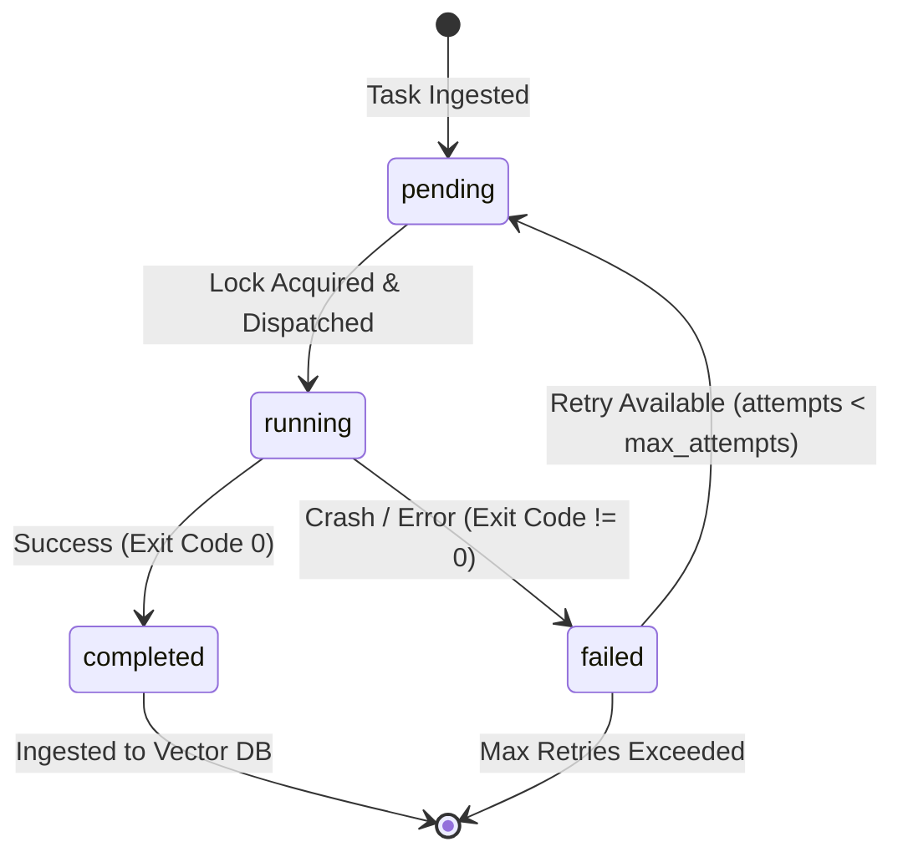

# Keystone Brain — keystone_unified

**Exported:** 2026-06-14 09:33
**Vectors:** 13866
**Exported Entries:** 200

---

## Entry 1
**Source:** .[[AGENTS|agents]]/skills/seo-geo/references/google-docs-summary.md
**Created:** 2026-06-14T09:23:25.777981Z

## Reference

- https://developers.google.com/search
- https://developers.google.com/search/docs/fundamentals/seo-starter-guide

---

## Entry 2
**Source:** Research_Archives/[[DeepDive_24_1781284945823|DeepDive_24_1781284945823]].md
**Created:** 2026-06-14T09:17:59.427290Z

### [Best AI Video Generators in 2026 - Free & Paid Ranked](https://pixflow.net/blog/best-ai-video-generator/)
Start with <strong>Google Veo 3.1 if you want the strongest all-around quality</strong>. Pick Runway if your job is ads or client deliverables that need tight creative control. Choose Pika if you are publishing daily to Reels, TikTok, or Shorts.

---

---

## Entry 3
**Source:** [[SCRAPED_GOOGLE_DOCS|SCRAPED_GOOGLE_DOCS]].md
**Created:** 2026-06-14T09:15:24.298547Z

* Localized Content Strategy: Consider creating blog posts or resource articles addressing topics relevant to building or renovating specifically in the Squamish/Sea to Sky area. Examples include articles on navigating Squamish building permits, local architectural trends, sustainable building practices in BC, case studies of local projects, or features on local suppliers and partners. These posts establish local expertise and provide opportunities to internally link back to relevant service or portfolio pages, distributing SEO authority.

For builders and developers, the portfolio is not just a gallery; it's tangible proof of capability, quality, and style. Optimizing these portfolio pages with location-specific keywords (e.g., "Squamish custom home gallery," "Whistler renovation portfolio") serves a vital dual function. Firstly, it directly targets potential clients searching for examples of work completed within their specific geographic area. Secondly, it provides powerful signals to Google that the business has demonstrable experience and actively completes projects in those locations (Squamish, Sea to Sky, Whistler). This reinforces local relevance far more effectively than simply listing service areas on a contact page, turning visual showcases into strategic local SEO assets.

4.3. Winning the Click: Writing Effective Meta Titles & Descriptions

---

## Entry 4
**Source:** Research_Archives/01_Agent_Architecture/[[20260522_hermes_beater_implementation_blueprint|20260522_hermes_beater_implementation_blueprint]].md
**Created:** 2026-06-14T09:18:19.296209Z

## What Makes This Better Than Hermes

| Capability | Hermes | Our System |
|---|---|---|
| Mobile access | None | Telegram bridge with webhook |
| [[.agents/skills/seo-geo/SKILL|Skill]] extraction | Manual only | Auto-triggered at 8+ tool calls |
| Prompt optimization | Static prompts | GEPA Pareto evolution |
| Memory management | Unbounded growth | 3-tier consolidation |
| Trajectory capture | None | JSONL + Langfuse |
| User modeling | Preference-based | Dialectical reasoning patterns |
| Self-improvement loop | None | GEPA + [[.agents/skills/seo-geo/SKILL|skill]] extraction + trajectory feedback |

---

*Report generated by Keystone Overnight Research Agent, May 22, 2026.*

---

## Entry 5
**Source:** Research_Archives/05_Video_Production/[[8_1_DaVinci_Resolve_Workflow|8_1_DaVinci_Resolve_Workflow]].md
**Created:** 2026-06-14T09:20:09.622059Z

By architecting a disciplined multi-track environment, editors can logically manage the sheer volume of generative variations. Through the surgical application of cubic speed ramps, AI-driven optical flow interpolations, and Fusion-based spatial masking transitions, the temporal and physical discontinuities inherent to current AI models are effectively obfuscated. Finally, by wrapping these volatile assets in a rigid ACEScct mathematical color pipeline, utilizing precision sidechain audio ducking for narrative clarity, and executing a deliberate, multi-stage encoding workflow tailored to specific platform ingestion behaviors, post-production professionals can successfully elevate disparate, hallucinatory AI outputs into stable, compelling cinematic narratives ready for global distribution.

---

## Entry 6
**Source:** Research_Archives/[[20260613_YOUTUBE_GROWTH_managing_multiple_youtube_channels_under_one_google_account_|20260613_YOUTUBE_GROWTH_managing_multiple_youtube_channels_under_one_google_account_]].md
**Created:** 2026-06-14T09:17:36.637449Z

YouTube's Policy on Circumventing Terminations is aggressively enforced, stipulating that if a single channel is terminated for violating community guidelines, the owner is strictly and permanently prohibited from creating, possessing, or operating any other channels on the platform. This enforcement is not isolated to the specific offending channel; it acts as an infection that spreads across the entire [[IDENTITY|identity]] matrix. The automated enforcement systems utilize sophisticated identity fingerprinting—including device matching, IP address correlation, and crucially, linked Google AdSense accounts—to map an individual's complete digital network.

---

## Entry 7
**Source:** 09_YouTube_Operations/Scripts_Approved/[[klow_vs_glow_8m30s_studio_black|klow_vs_glow_8m30s_studio_black]].md
**Created:** 2026-06-14T09:23:06.196705Z

### SCENE 37 (6:00 – 6:10)

```
THIS IS THE SCRIPT:
Wayne says: "Now here is the critical nuance that most channels skip entirely. These branded stack names, GLOW and KLOW, are marketing terminology. They are not clinical designations."

THIS IS THE VIDEO PROMPT:
A premium cinematic tight close-up on face, static of me standing against a solid matte black studio background. Stoic, serious warning delivery. Direct eye contact. Reference the picture for clothes.
```

---

## Entry 8
**Source:** Research_Archives/08_SEO_Website/[[2_1_Google_Business_Profile|2_1_Google_Business_Profile]].md
**Created:** 2026-06-14T09:20:38.972932Z

As a successful construction company expands geographically to serve new markets, the Google Business Profile [[ARCHITECTURE|architecture]] must scale flawlessly alongside it. However, expanding a local digital footprint is fraught with algorithmic peril. Google violently polices the map pack for geographic spam, duplicate listings, and illegitimate satellite offices, utilizing automated systems to suspend violators instantly.   

Service-Area Businesses (SAB) vs. Storefront Operations

A contractor must definitively classify their operational model according to Google's strict guidelines. If the company exclusively visits the customer at their location (e.g., roofing, landscaping, emergency plumbing), it must be classified as a Service-Area Business (SAB). SABs must clear their primary business address from public view and rely strictly on defining their geographic territories. An SAB profile is restricted to a maximum of 20 service areas, and the boundaries of the overall claimed area must not exceed a 2-hour driving radius from the central operational hub.   

Conversely, if the contractor operates a design center, showroom, or physical office where customers are received during stated business hours, it qualifies as a Storefront (or a Hybrid business, if they also dispatch technicians to the field). Storefronts project much stronger proximity signals and visibility, but face intense, rigorous verification scrutiny to prove they are accessible to the public.

---

## Entry 9
**Source:** Research_Archives/09_Social_Media/[[20260522_meta_reels_publishing_complete|20260522_meta_reels_publishing_complete]].md
**Created:** 2026-06-14T09:20:52.070216Z

## 3. Token Management <a name="token-management"></a>

---

## Entry 10
**Source:** Research_Archives/03_YouTube_Scripts/[[20260609_YOUTUBE_SCRIPTS_deep_research_into_conversational_interview-style_youtube_sc|20260609_YOUTUBE_SCRIPTS_deep_research_into_conversational_interview-style_youtube_sc]].md
**Created:** 2026-06-14T09:19:06.581070Z

Lex Fridman: The "First Principles" Academic Framework

Operating within a highly intellectual sphere, Lex Fridman's methodology contrasts with Rogan's informal style, leaning closer to a semi-scripted academic framework while maintaining conversational fluidity. Fridman, an MIT research scientist whose work spans autonomous driving systems and deep reinforcement learning, prepares through grueling academic immersion.   

Fridman's preparation process is meticulous. If interviewing a biologist, such as Michael Levin, he will consume dozens of technical papers on bio-electricity prior to the meeting; if interviewing a physicist, he reviews foundational equations to ensure he understands the underlying mechanics. He approaches interviews with bullet points and a structural framework, representing a heavily "scripted" intellectual outline, even if the exact phrasing of the questions remains improvised.

---

## Entry 11
**Source:** Research_Archives/[[DeepDive_9_1781284921387|DeepDive_9_1781284921387]].md
**Created:** 2026-06-14T09:18:03.976917Z

### [Qdrant: The Ultimate Guide to the High-Performance Open-Source Vector Database | martinuke0's Blog](https://martinuke0.github.io/posts/2026-01-06-qdrant-the-ultimate-guide-to-the-high-performance-open-source-vector-database/)
Each collection can be configured with specific vector parameters (size, distance metric: cos<strong>ine, Euclidean, dot product).[1][4] ... Dense vectors for [[general|general]] embeddings. Sparse vectors for</strong> efficient text retrieval (e.g., TF-IDF).[2] Multi-vectors ...

---

## Entry 12
**Source:** Research_Archives/02_MCP_Tools/[[20260522_mcp_ecosystem_mcp_server_security_best_practices_and_access_control|20260522_mcp_ecosystem_mcp_server_security_best_practices_and_access_control]].md
**Created:** 2026-06-14T09:18:49.832498Z

# MultiAuth evaluates the server proxy first, followed by the fallback verifiers
hybrid_auth = MultiAuth(
    server=OAuthProxy(
        issuer_url="https://sso.keystone.com/oauth",
        client_id=os.environ.get("YOUTUBE_PROXY_CLIENT_ID"),
        client_secret=os.environ.get("YOUTUBE_PROXY_SECRET"),
        base_url="https://mcp.youtube-ops.keystone.com",
    ),
    verifiers=,
)

mcp = FastMCP("YouTube Operations Server", auth=hybrid_auth)


This hybrid approach ensures the primary discovery surface remains clean—advertising only one set of OAuth metadata—while seamlessly permitting specialized internal agents to bypass the interactive proxy by presenting tokens signed by the internal infrastructure issuer.   

4. Infrastructure-Layer Gateways and Access Control Policy

Establishing verifiable identity is merely the precursor to enforcing fine-grained authorization. A fundamental weakness observed in early agentic systems is the reliance on "vibe governance"—the practice of utilizing system prompts to dictate what an autonomous agent should or should not do. System engineers would instruct agents with prompts such as, "You must not delete financial records without human approval." However, large language models are inherently non-deterministic. They can be trivially coerced via prompt injection to ignore these textual instructions, bypassing the intended security boundaries entirely.

---

## Entry 13
**Source:** Research_Archives/13_Chrome_Automation/[[20260522_chrome_automation_browser_tab_lifecycle_management_for_long-running_automation|20260522_chrome_automation_browser_tab_lifecycle_management_for_long-running_automation]].md
**Created:** 2026-06-14T09:21:50.208249Z

To permanently eradicate the zombie process vulnerability, it is a strict architectural mandate to inject a lightweight, specialized init system directly into the container's execution chain. The recognized industry standard tool for this specific purpose is tini. Acting as a proxy PID 1, tini reliably passes execution signals to the underlying application and, crucially, actively monitors and reaps any orphaned child processes, completely eliminating process table leakage.   

Furthermore, selecting the correct foundational OS image is critical for browser stability. Utilizing standard glibc-based Slim Linux images (such as node:22-bullseye-slim) is strongly advised over highly stripped Alpine Linux variants. Alpine Linux utilizes the musl libc implementation. Because official Google Chrome binaries are compiled against glibc, attempting to run them on musl introduces subtle rendering artifacts, missing font dependencies, and severe performance degradation.   

The implementation of this architecture within a Dockerfile requires precise, sequential configuration. The environment must install tini, securely download the official Google Chrome stable binary rather than relying on bundled, outdated Chromium packages, and set the entrypoint appropriately to wrap the execution.

Reference Infrastructure Dockerfile Configuration:

Dockerfile

---

## Entry 14
**Source:** Research_Archives/[[20260613_YOUTUBE_GROWTH_youtube_analytics_api_and_performance_optimization_in_2026__|20260613_YOUTUBE_GROWTH_youtube_analytics_api_and_performance_optimization_in_2026__]].md
**Created:** 2026-06-14T09:17:41.602152Z

These application programming interfaces provide the required telemetry for an autonomous artificial intelligence agent to monitor performance, diagnose content failures, and autonomously implement programmatic A/B testing protocols. Building a system to govern these processes involves managing complex OAuth 2.0 authentication flows, navigating stringent API deprecation policies, resolving real-time data anomalies, and establishing statistically rigorous testing frameworks. This exhaustive report details the technical specifications, comprehensive Python implementation strategies, and analytical frameworks required to programmatically extract, analyze, and act upon YouTube channel analytics data, tailored specifically for the operational deployment of the Keystone Sovereign architecture.

---

## Entry 15
**Source:** Content_Production/[[POSS_001_GOOGLE_FLOW_SEGMENTS|POSS_001_GOOGLE_FLOW_SEGMENTS]].md
**Created:** 2026-06-14T09:16:00.311898Z

## Wayne standing and talking ON SCREEN 100% of the time. B-roll overlays added in DaVinci Resolve post-production only.

---

---

## Entry 16
**Source:** Content_Production/[[SCRIPT_001_BROLL_SHOT_LIST|SCRIPT_001_BROLL_SHOT_LIST]].md
**Created:** 2026-06-14T09:16:01.342999Z

## 📊 SUMMARY

| Category | Count | Flow Workflow |
|----------|-------|---------------|
| 🟢 Clinical Data / Charts | 14 | Just generate |
| 🟢 Molecular / Cellular Animations | 10 | Just generate |
| 🟢 Graphics / Disclaimers / CTA | 8 | Just generate |
| 🟢 Food / Supplement Photography | 4 | Just generate |
| 🟢 Construction Metaphors (no person) | 4 | Just generate |
| 🔴 **Job Site B-Roll (YOU in it)** | **5** | **Drop avatar ref in** |
| 🔴 **Gym B-Roll (YOU in it)** | **3** | **Drop avatar ref in** |
| 🟢 Abstract / Pattern Interrupt | 2 | Just generate |
| **TOTAL** | **50** | **42 just generate / 8 with your ref** |

---

---

## Entry 17
**Source:** [[GEO_AEO_IMPLEMENTATION_PLAYBOOK|GEO_AEO_IMPLEMENTATION_PLAYBOOK]].md
**Created:** 2026-06-14T09:15:23.214465Z

## PART 3: AEO (ANSWER ENGINE OPTIMIZATION)

---

## Entry 18
**Source:** Master_Docs/[[21_RECOMPOSITION_PRODUCTION_BIBLE|21_RECOMPOSITION_PRODUCTION_BIBLE]].md
**Created:** 2026-06-14T09:16:28.641832Z

## 13. PUBLISHED CONTENT ARCHIVE

> **PURPOSE**: Every published video is logged here so that new scripts can reference previous episodes, avoid repeating topics, and maintain the serialized storyline.

---

## Entry 19
**Source:** 09_YouTube_Operations/Scripts_Approved/[[cjc_dac_vs_tesamorelin_8m20s_studio_black|cjc_dac_vs_tesamorelin_8m20s_studio_black]].md
**Created:** 2026-06-14T09:22:52.051623Z

Today we step into the heavy division of growth hormone secretagogues. We are pitching the two absolute heavyweights head to head: CJC twelve ninety-five with DAC versus the FDA-approved clinical powerhouse, Tesamorelin. This is the visceral fat battle. In our last protocol, we established the Wolverine Stack foundations, the bedtime pulse, and the joint-healing framework. But if you are serious about melting deep abdominal visceral fat, a basic nighttime pulse will not get it done. You hit a ceiling. I am not a doctor. Talk to yours before you implement a damn thing from this video. This is strictly research. Let me show you exactly where the science separates these two compounds and why it matters for your entire cardiovascular system. Let us start with the convenience play. CJC twelve ninety-five with DAC sounds like a builder's dream. You pin once or twice a week instead of daily. Here is how the chemistry works. They attach a drug affinity complex to the peptide backbone using maleimidopropionic acid. Once injected, that linker instantly forms a covalent bond with your circulating human serum albumin. Albumin acts as a massive biological shield, preventing renal filtration and enzyme breakdown. That extends the half-life from thirty minutes to six to eight days. Sounds incredible right? One shot and your growth hormone stays elevated for a full week. But convenience always carries a hidden biological cost. This is the part that nobody in the peptide community talks about honestly. Because CJC DAC binds permanently to albumin, your GHRH receptors stay continuously activated twenty-four seven. Your baseline growth hormone trough never drops back to zero. Endocrinologists call this a GH bleed. Over weeks and months, this chronic elevation mimics the hormonal state of acromegaly. You are looking at insulin resistance, severe water retention, swollen hands, and the real kicker, left ventricular cardiac thickening. The weekly convenience of CJC DAC is a biological ticking clock on your heart. So what is the alternative if daily pinning three times is too much and weekly CJC DAC is too dangerous? Enter Tesamorelin. This is a completely different animal. Tesamorelin is a full-length forty-four amino acid GHRH analog stabilized with a hexenoyl group on the N-terminal tyrosine. Unlike CJC DAC, it does not bind to albumin. It has a half-life of roughly thirty minutes with a biological activity window of four to five hours. It clears your system, allowing the pituitary gland to rest and preserve natural pulsatile feedback loops. You get aggressive fat mobilization without desensitizing your receptors or threatening your damn heart. And here is what separates Tesamorelin from every other secretagogue on the market. It has actual massive peer-reviewed clinical trial data. The pivotal trials published in JAMA in twenty fourteen demonstrated a fifteen to eighteen percent reduction in deep visceral adipose tissue over twenty-six weeks. That is the dangerous belly fat surrounding your organs driving systemic inflammation. It simultaneously increased lean skeletal muscle mass without dropping total body weight. Even more impressive, a randomized trial in The Lancet HIV proved Tesamorelin achieved a thirty-seven percent relative reduction in liver fat over twelve months. It actively halted progression of liver fibrosis. If you have been carrying stubborn belly fat or non-alcoholic fatty liver from years of stress, this is the clinical gold standard backed by hard data. CJC DAC has zero direct human clinical fat loss trials. Zero. Now let me show you how we integrate this into a real-world advanced recomposition stack. You pair daily Tesamorelin with Ipamorelin. Tesamorelin floods the GHRH signal, Ipamorelin hits the ghrelin receptor. Together they create a massive clean growth hormone pulse without spiking cortisol or prolactin. Administered before bed in a fasted state, minimum two hours since your last meal. Stack that with a protein floor of two grams per kilogram of lean body mass and four heavy resistance training sessions per week. This is the elite framework for rebuilding a broken frame from the inside out. So why isn't everyone on Tesamorelin already? Two reasons. First, commercial Egrifta costs are astronomical. Second, the regulatory landscape is a complete warzone right now. On December fourth twenty twenty-four, the FDA advisory committee formally voted against keeping CJC twelve ninety-five on the compounded bulk substances list. That pushes it into strict grey market research-only status. Tesamorelin remains FDA-approved but must be sourced through a licensed physician and a registered five-oh-three A compounding pharmacy. Never buy unregulated chemicals from grey market research websites. Work exclusively with a doctor who monitors your labs. Build strong. Recover smarter. Stream the Keystone Recomposition recovery tracks on Spotify to lock in your training focus. I will see you on the next protocol.

---

## Entry 20
**Source:** Research_Archives/[[20260613_AGENT_ARCH_observability_and_monitoring_for_autonomous_ai_agent_systems|20260613_AGENT_ARCH_observability_and_monitoring_for_autonomous_ai_agent_systems]].md
**Created:** 2026-06-14T09:17:08.276708Z

Global Token Burn Rate: Measured in Tokens Per Minute (TPM) and visually juxtaposed against the daily operational budget to prevent cost overruns.

Fleet Semantic Stability Index: A normalized aggregate of the Sliced-Wasserstein distance scores across all active vector memory namespaces (Construction, YouTube, Health). A score approaching the critical 1.0 threshold indicates severe, fleet-wide memory degradation and an immediate loss of factual grounding.   

Tier 2: System Anomaly and Stuck-State Matrix
Instead of displaying raw error logs, the mid-tier of the dashboard visualizes system interventions.

Intervention Rate Tracker: A time-series bar chart illustrating the frequency of OnToolErrorHook recoveries and PC-ESCAPE perturbations. Consistently high intervention rates indicate that the execution environment has drifted from the agent's system instructions, or that an external dependency (like the FHIR server) is fundamentally broken.   

Loop Risk Heatmap: A visual matrix that correlates specific tools with duplicate action triggers. For instance, if the YouTube agent's upload_video_metadata tool consistently triggers the loop detector, the engineering team can immediately identify where to refine the agent's system prompt or clarify the tool's input schema.

Tier 3: The Trace Level (Debugging)

---

## Entry 21
**Source:** .agents/skills/seo-geo/references/seo-checklist.md
**Created:** 2026-06-14T09:23:27.587997Z

## Priority Levels

| Level | Meaning | Action |
|-------|---------|--------|
| **P0** | Critical | Must fix immediately - blocks indexing or causes major issues |
| **P1** | Important | Should fix soon - significant impact on rankings |
| **P2** | Recommended | Nice to have - improves visibility and user experience |

---

---

## Entry 22
**Source:** .agents/skills/banner-creator/SKILL.md
**Created:** 2026-06-14T09:23:19.358182Z

## Workflow

---

## Entry 23
**Source:** Research_Archives/14_Gemini_Platform/[[20260522_gemini_platform_update|20260522_gemini_platform_update]].md
**Created:** 2026-06-14T09:22:02.558312Z

### Implementation Checklist
1. Place static content (system prompts, reference docs) at prompt START for implicit cache hits
2. Use explicit caching with appropriate TTL for large, reusable contexts
3. Implement exponential backoff with jitter for retry logic
4. Route tasks to cheapest capable model (Flash-Lite -> Flash -> Pro)
5. Use Batch API for any non-real-time workload
6. Monitor quotas in GCP Console; set alerts at 70-80% utilization
7. Consider Standard/Flex inference tiers over Priority when latency is not critical

---

---

## Entry 24
**Source:** .learnings/insights/[[2026-06-07-daily-digest|2026-06-07-daily-digest]].md
**Created:** 2026-06-14T09:23:15.942601Z

## Correction Journal Stats
- Total errors tracked: 0
- Total fixes applied: 0
- Auto-healed: 0
- Auto-heal rate: 0.0%

---

## Entry 25
**Source:** .agents/skills/seo-geo/references/seo-checklist.md
**Created:** 2026-06-14T09:23:27.587997Z

## Content Strategy

---

## Entry 26
**Source:** 09_YouTube_Operations/Scripts_Approved/[[ghk_cu_ozempic_face_broll_prompts|ghk_cu_ozempic_face_broll_prompts]].md
**Created:** 2026-06-14T09:22:59.244467Z

#### 🖼️ PICTURE 40: SKIN ELASTICITY IMPROVEMENT (6:39 – 6:41)
```text
A premium 4K cinematic before-and-after split frame of facial skin. Left side labeled "WEEK 0" shows loose, less elastic texture in cool blue tones. Right side labeled "WEEK 8" shows noticeably tighter, more elastic skin in warm copper-gold tones. Clean white dividing line. Dark background.
```

---

## Entry 27
**Source:** Research_Archives/Recovered_From_Qdrant/[[MUSIC_001_session_2026-06-09|MUSIC_001_session_2026-06-09]].md
**Created:** 2026-06-14T09:22:31.756915Z

# Recovery date: 2026-06-14

---

---

## Entry 28
**Source:** Research_Archives/01_Agent_Architecture/[[20260522_autonomous_skill_creation_patterns|20260522_autonomous_skill_creation_patterns]].md
**Created:** 2026-06-14T09:18:14.915736Z

### Phase 1: Brainstorming (Mandatory)

An iterative conversation across 5 rounds:
- **Round 1**: Understand the workflow (inputs, outputs, frequency)
- **Round 2**: Flexibility and error handling per step
- **Round 3**: Dependencies -- cross-reference existing installed skills to avoid reimplementation
- **Round 4**: Scope, shape, and whether code is needed (CLI pattern vs. instruction-only)
- **Round 5**: Optional test case for validation

---

## Entry 29
**Source:** Research_Archives/07_Coding_Optimization/[[20260607_CODING_OPT_advanced_rag_pgvector_hnsw_optimization|20260607_CODING_OPT_advanced_rag_pgvector_hnsw_optimization]].md
**Created:** 2026-06-14T09:20:24.024254Z

Metadata should not be viewed as an adjunct to the vector but as a first-class citizen of the retrieval process. Enrichment techniques include injecting the document title, summary, or section path directly into the chunk text before embedding, as well as storing these attributes in relational columns for pre-filtering.   

The parent-child retrieval pattern is a high-leverage optimization for agentic LLMs. In this architecture, the system embeds small, highly specific segments (children) to ensure pinpoint retrieval accuracy. However, upon a match, the database returns the larger encompassing document or a surrounding window of text (the parent) to the LLM. This provides the model with sufficient context for complex reasoning while avoiding the "noise" of retrieving large, less-relevant chunks.   

Minimizing Latency for Agentic LLM Architectures

Agentic workflows involve multiple sequential LLM calls, tool executions, and state updates, making the database the critical path for total system latency. If each step in an agent's reasoning loop requires a 50ms database trip, a five-step chain consumes 250ms in overhead alone.   

Consolidating Round-Trips via Transactional SQL

---

## Entry 30
**Source:** Research_Archives/[[DeepDive_2_1781284910151|DeepDive_2_1781284910151]].md
**Created:** 2026-06-14T09:18:00.937715Z

### [10 Best MCP Servers for Developers in 2026 | Publora](https://publora.com/blog/10-best-mcp-servers-for-developers-2026)
... <strong>Publora is the go-to MCP server for social media</strong>. It connects AI agents to 11+ social platforms — Instagram, LinkedIn, X (Twitter), Threads, Telegram, Facebook, TikTok, YouTube, Mastodon, Bluesky, and Pinterest — through a single MCP ...

---

---

## Entry 31
**Source:** Research_Archives/Recovered_From_Qdrant/[[9.4_instagram_reels_requirements|9.4_instagram_reels_requirements]].md
**Created:** 2026-06-14T09:22:26.440009Z

#### 2. Watch Time, Completion Rate, and the Three-Second Hook
Secondary only to sharing velocity is the raw retention graph. The algorithm continuously measures exactly how long users linger on a video, with a draconian emphasis on whether they watch past the crucial 3-second mark. A high "skip rate" within the first 2 to 3 seconds is the fastest known mechanism to halt algorithmic distribution entirely.

Because data indicates that more than half of all Reels are consumed initially with the sound muted, establishing immediate visual movement or deploying high-contrast, on-screen text hooks within the central safe zone during the first two seconds is absolutely mandatory to prevent the user from swiping away. Furthermore, the algorithm deeply values completion rate and looping behavio

ks within the central safe zone during the first two seconds is absolutely mandatory to prevent the user from swiping away. Furthermore, the algorithm deeply values completion rate and looping behavior. If a user watches 95% or more of a video, or allows a short video to loop and rewatch seamlessly, the system flags the content as highly engaging and pushes it outward to broader clusters of demographically similar lookalike audiences.

---

## Entry 32
**Source:** .agents/skills/seo-geo/references/geo-research.md
**Created:** 2026-06-14T09:23:25.126432Z

## Key Findings

---

## Entry 33
**Source:** Research_Archives/08_SEO_Website/[[07_local_seo_civil_construction|07_local_seo_civil_construction]].md
**Created:** 2026-06-14T09:20:25.450100Z

Before initiating an official appeal, contractors must execute a rigorous internal audit. The vital first step involves a complete security sweep of the account. If an agency contagion event is suspected, the contractor must use the Google service restriction tool to identify penalized accounts and immediately remove any third-party SEO agencies or external managers from the list of users. A contractor can recover a profile exponentially faster by excising a flagged agency before filing the appeal. Any unauthorized or inaccurate changes that triggered the suspension (such as incorrect categorization or a foreign address injection) must be reverted to the true operational data.   

Once the profile is isolated and scrubbed of violating data, the firm must compile an unassailable dossier of "real-world proof." Google's manual reviewers rely heavily on physical documentation to approve reinstatements. The official Sterling Sky protocol mandates preparing four exact documents for submission:

Business Registration: Official provincial or municipal incorporation documents.

Business Licenses: Trade-specific operational licenses for the municipality.

Tax Certificates: Recent documentation proving active tax status.

Utility Bills: Critical proof of location, including electricity, commercial internet, or water bills explicitly bearing the exact business name and the claimed address.

---

## Entry 34
**Source:** Research_Archives/16_Wellness_Retreat/[[Mexico_Longevity_Investment_Pitch|Mexico_Longevity_Investment_Pitch]].md
**Created:** 2026-06-14T09:22:17.659582Z

Core Motivations: Capitalizing on the $15 trillion "silver economy" fueled by Baby Boomers, the wealthiest generation in human history, who control upwards of $84 trillion in wealth. They seek investments that address the massive, impending supply shortfall in age-friendly, health-oriented real estate and senior living alternatives. They understand that healthcare and hospitality are rapidly converging.   

Pitch Resonance: Frame the $1.55M compound not as a standalone hotel, but as a pilot or flagship model for a scalable longevity hospitality brand. Highlight how integrating preventive healthcare into real estate attracts an incredibly affluent, long-staying demographic that views longevity out-of-pocket expenses as non-discretionary rather than luxury. Demonstrate how the boutique model can be franchised or syndicated once the proof-of-concept is validated in Mexico.   

3.4 Avatar 4: The Impact & ESG Angel Investor

This demographic sees longevity and wellness through the lens of Environmental, Social, and Governance (ESG) criteria. They aim to fund innovations that advance social progress, improve community healthspan, and utilize sustainable architecture. They want their capital to generate both a financial return and a measurable positive impact on the planet.

---

## Entry 35
**Source:** Content_Production/[[SHORT_002_CREATINE_LIES|SHORT_002_CREATINE_LIES]].md
**Created:** 2026-06-14T09:16:07.028594Z

### CLIP A1 — THE HOOK
```
Wayne says: Your creatine label says take twenty grams a day for a loading phase. That is a lie designed to make you buy more tubs faster. Standing against pure black background. Camera starts on extreme close-up of eyes then pulls back to medium shot. Single hard key light from camera-right creating half-face shadow. Intense skeptical expression breaking into knowing smirk. No subtitles.
```

---

## Entry 36
**Source:** Research_Archives/03_YouTube_Scripts/[[20260609_YOUTUBE_SCRIPTS_deep_research_into_what_makes_ai-generated_youtube_scripts_s|20260609_YOUTUBE_SCRIPTS_deep_research_into_what_makes_ai-generated_youtube_scripts_s]].md
**Created:** 2026-06-14T09:19:07.420187Z

Professional YouTube strategists emphasize the absolute necessity of a "Spikey POV" (Point of View)—a strongly held, highly unique opinion that challenges conventional wisdom and provokes audience thought. Human creators succeed on algorithm-driven platforms by taking firm stances, sharing controversial theories, or expressing definitive, personal preferences. Artificial intelligence struggles immensely with this concept. Because LLMs are rigorously fine-tuned by their developers for safety, helpfulness, and strict neutrality, their scripts are inherently diplomatic and deeply centrist. They consistently present perfectly balanced points, weigh both sides of an argument equally, and hesitate to take a definitive, polarizing stance. This algorithmic hedging—frequently evidenced by phrases like "while it has its drawbacks, it also presents valuable opportunities"—results in a script completely devoid of passion, edge, or authorial authority. Without a specific, personal opinion or a polarizing claim to rally around or argue against, the video fails to generate emotional investment or drive community comments from the audience.

---

## Entry 37
**Source:** Research_Archives/04_YT_Analytics/[[20260522_youtube_algorithm_youtube_shorts_vs_long-form_strategy_for_channel_growth_2026|20260522_youtube_algorithm_youtube_shorts_vs_long-form_strategy_for_channel_growth_2026]].md
**Created:** 2026-06-14T09:19:25.026035Z

The YouTube backend evenly distributes impressions across the variants and measures the "watch-time share"—the proportion of total watch time driven by viewers who clicked each specific variant. This is a critical distinction: the algorithm actively prioritizes satisfaction and session length over empty, clickbait CTR. Once a statistically significant winner is determined, a process that can take up to two weeks depending on the baseline impression volume, the platform permanently applies the winning combination to the video.   

API [[Limitations|Limitations]] and Third-Party Solutions

Despite the power of the native "Test & Compare" feature, the YouTube Data API v3 does not natively support configuring or initializing these tests programmatically via the videos.update or videos.insert endpoints. The API documentation currently lacks any exposed parameters to pass an array of thumbnails for A/B testing evaluation. To execute fully autonomous A/B testing, the Keystone Sovereign agent must utilize third-party pipeline integrations or construct highly custom scheduling logic.   

Workflow Orchestration and The ThumbnailTest API

For absolute automation, the agent can orchestrate the process using third-party APIs purpose-built for this exact workflow constraint.

---

## Entry 38
**Source:** Master_Docs/[[AUDIOBOOK_BUNDLE_BLUEPRINT|AUDIOBOOK_BUNDLE_BLUEPRINT]].md
**Created:** 2026-06-14T09:16:33.997187Z

### Component C: The Builder's Recomposition Dashboard (Notion Template)
*A functional project-management dashboard for their body. This bridges the audiobook from "passive listening" to "active software".*
* **Macro Calculator Sheet:** Quick calculation of exact protein, carb, and fat targets based on lean mass.
* **Biomarker Audit Tracker:** A table to log blood draw metrics (Testosterone, SHBG, HbA1c, ApoB) over time.
* **Weekly Project Logs:** Stand-up style logs for workout performance and progress photos.

---

---

## Entry 39
**Source:** Research_Archives/01_Agent_Architecture/[[20260609_AGENT_ARCH_research_the_google_adk_(agent_development_kit)_and_antigrav|20260609_AGENT_ARCH_research_the_google_adk_(agent_development_kit)_and_antigrav]].md
**Created:** 2026-06-14T09:18:36.244649Z

First, the Health Domain Orchestrator utilizes its internal subagents to draft and finalize a medically verified article, passing all internal Model Armor checks. Next, it utilizes the A2A protocol to invoke the Media Domain Agent. The Health Orchestrator [[.agents/skills/banner-creator/references/formats|formats]] the verified text into a strict Pydantic payload, as dictated by the Media Agent's published AgentCard. The Health Orchestrator does not send its entire internal conversation history, its reasoning trace, or any underlying medical reference data; it strictly acts as a client calling an external tool.   

The Media Agent receives the A2A request on its exposed port. It then spawns its own internal subagents within its isolated VPC to generate a script adaptation, produce thumbnail graphics, and schedule the video for YouTube publication. Upon completion of these tasks, the Media Agent returns an A2A success payload back to the Health Orchestrator.

---

## Entry 40
**Source:** Master_Docs/Gemini_Pro_Instructions/[[04_SEVENTY_NEW_RESEARCH_TOPICS|04_SEVENTY_NEW_RESEARCH_TOPICS]].md
**Created:** 2026-06-14T09:22:39.990818Z

### 37. 🟡 [SEO] Programmatic SEO for Construction Niches
```
Research programmatic SEO strategies for construction companies in 2026. How to automatically generate hundreds of location-specific and service-specific landing pages (e.g., "custom home construction in Whistler", "renovation permits in Squamish"). Include template structures, keyword patterns, and WordPress implementation methods that avoid Google's thin content penalties.
```

---

---

## Entry 41
**Source:** Research_Archives/13_Chrome_Automation/[[20260522_overnight_scheduler_daemon|20260522_overnight_scheduler_daemon]].md
**Created:** 2026-06-14T09:21:57.406425Z

### State Transition Diagram
The status column must undergo deterministic state transitions during the lifecycle of the overnight run:



---

---

## Entry 42
**Source:** Research_Archives/[[DeepDive_16_1781284932608|DeepDive_16_1781284932608]].md
**Created:** 2026-06-14T09:17:57.753382Z

### [Playwright vs. Puppeteer: Browser Automation Tools](https://testgrid.io/blog/playwright-vs-puppeteer/)
<strong>Puppeteer is faster since it directly uses the Chrome DevTools Protocol</strong>. Puppeteer has a modern API that is quite easy to use, especially for developers comfortable with JavaScript.

---

## Entry 43
**Source:** Research_Archives/03_YouTube_Scripts/[[20260610_YOUTUBE_SCRIPTS_deep_research_into_the_'niche_t'_youtube_title_format_and_si|20260610_YOUTUBE_SCRIPTS_deep_research_into_the_'niche_t'_youtube_title_format_and_si]].md
**Created:** 2026-06-14T09:19:10.841539Z

This paradigm shift demands a sophisticated, deterministic approach to metadata engineering, specifically in the programmatic construction of video titles. The algorithm now evaluates a video's merit by comprehensively analyzing transcripts, on-screen visuals, and textual metadata to build a multidimensional profile of the video's intent. Consequently, the title serves a dual, often conflicting purpose. It must simultaneously satisfy semantic parsing engines for correct topical indexing and trigger immediate psychological engagement in human viewers navigating saturated algorithmic feeds. Optimizing click-through rates (CTR) through precise title structures is identified as the single highest-leverage optimization an autonomous system can execute, given its exceptionally high ratio of impact to computational effort. For an autonomous AI agent system such as Keystone Sovereign, mastering this dual-purpose metadata architecture across disparate verticals—ranging from localized construction services to global health and [[music|music]] empires—is the foundational prerequisite for programmatic growth.   

The Genesis and Application of the "Niche T" Strategy

---

## Entry 44
**Source:** Research_Archives/02_MCP_Tools/[[20260522_mcp_ecosystem_anthropic_mcp_protocol_updates_and_new_features_2026|20260522_mcp_ecosystem_anthropic_mcp_protocol_updates_and_new_features_2026]].md
**Created:** 2026-06-14T09:18:48.194378Z

# Deep Research: Anthropic MCP protocol updates and new features 2026
**Domain:** Mcp Ecosystem
**Researched:** 2026-05-22 00:27
**Source:** Google Deep Research via Chrome Automation

---

Architecting the Agentic Enterprise: An Exhaustive Analysis of Model Context Protocol Innovations and Implementation Strategies for 2026

The orchestration of highly autonomous, multi-domain artificial intelligence systems requires an infrastructure that transcends basic application programming interfaces. For a systemic entity like the Keystone Sovereign—an autonomous agentic framework tasked with the concurrent management of a physical construction enterprise, a high-volume portfolio of YouTube media channels, and a regulated health content network—the limiting factor is no longer the reasoning capabilities of large language models. Rather, the bottleneck lies within the connectivity, context management, and security of their execution environments. The Model Context Protocol has emerged as the definitive standard addressing this integration bottleneck.

---

## Entry 45
**Source:** SCRAPED_GOOGLE_DOCS.md
**Created:** 2026-06-14T09:15:24.298547Z

## 5. THE SONIC UNIVERSE & COPYRIGHT PROTECTION

* **East Bending Aesthetics:** Music is Deep House / Hard Techno infused with Middle Eastern acoustics (sitar/scales) layered over clinical Solfeggio frequencies (396Hz, 111Hz, 528Hz).

* **AI Music Copyright (March 2nd Ruling Shield):** Suno is the base, but Wayne retains 100% legal copyright through a "Hybrid Workflow." Wayne writes 100% of his own lyrics (e.g., 'Laundry Room Birthday'), separates stems, and mixes/masters in DaVinci Resolve. 

* **Psychoacoustic Mixing Protocol:** To maximize Audience View Duration (AVD), apply a **300Hz Low-Pass filter** to the music/Solfeggio frequencies (keeps the rumble deep) and a **500Hz High-Pass filter** to the voiceover (ensures stoic clarity).

---

## Entry 46
**Source:** Research_Archives/[[20260613_YOUTUBE_GROWTH_youtube_playlist_optimization_strategy_for_discoverability_a|20260613_YOUTUBE_GROWTH_youtube_playlist_optimization_strategy_for_discoverability_a]].md
**Created:** 2026-06-14T09:17:52.339716Z

"title": title,
            "description": description
        },
        "status": {
            "privacyStatus": "public"
        }
    }
    
    # Conditionally tag the playlist as a podcast for YouTube Music syndication
    if is_podcast:
        body["status"] = "enabled"

    request = youtube.playlists().insert(
        part="snippet,status",
        body=body
    )
    response = request.execute()
    return response['id'] # Returns the unique YouTube Playlist ID for future referencing

Managing Playlist Items and Positional Sorting

Inserting a video into an existing playlist requires calling the playlistItems.insert endpoint. The agent constructs a JSON request body containing the destination playlistId and a nested resourceId object that strictly specifies kind: "youtube#video" and the unique global videoId of the target asset.   

The Positional Sorting Constraint and the "Insertion Sort" Problem

A critical operational constraint for the Keystone Sovereign agent involves the specific methodology for reordering videos within a series. The YouTube Data API v3 does not support batching or bulk updates for playlist item positions.

---

## Entry 47
**Source:** Research_Archives/[[20260613_VIDEO_PROD_automated_subtitle_and_caption_generation_in_davinci_resolve|20260613_VIDEO_PROD_automated_subtitle_and_caption_generation_in_davinci_resolve]].md
**Created:** 2026-06-14T09:17:23.011036Z

# Dynamically append module path based on operating system
if sys.platform.startswith('win'):
    sys.path.append(r"C:\ProgramData\Blackmagic Design\DaVinci Resolve\Support\Developer\Scripting\Modules")
elif sys.platform.startswith('darwin'):
    sys.path.append("/Library/Application Support/Blackmagic Design/DaVinci Resolve/Developer/Scripting/Modules")
else:
    sys.path.append("/opt/resolve/Developer/Scripting/Modules")

try:
    import DaVinciResolveScript as dvr_script
except ImportError:
    sys.exit("CRITICAL: DaVinciResolveScript module not found. Verify scripting environment variables.")

def initialize_resolve_api(timeout: float = 15.0):
    """
    Initializes the Resolve API with strict timeout parameters to prevent IPC lockups
    during autonomous agent execution loops.
    """
    result = [None]
    error = [None]
    
    def connect():
        try:
            result = dvr_script.scriptapp("Resolve")
        except Exception as e:
            error = e
            
    api_thread = threading.Thread(target=connect, daemon=True)
    api_thread.start()
    api_thread.join(timeout=timeout)
    
    if api_thread.is_alive():
        raise TimeoutError("Resolve API IPC connection timed out after {} seconds.".format(timeout))
    if error:
        raise error
    return result

---

## Entry 48
**Source:** Research_Archives/[[20260613_AGENT_ARCH_multi-agent_coordination_patterns_for_autonomous_ai_systems_|20260613_AGENT_ARCH_multi-agent_coordination_patterns_for_autonomous_ai_systems_]].md
**Created:** 2026-06-14T09:17:07.626249Z

The Coordinator Agent manages a specialized suite of subagents organized to navigate municipal permitting automatically.   

When a new project is initiated via the CRM, an Intake Agent is spawned to compile foundational project data. It delegates to parallel Research Agents operating in the Inherit [[.agents/rules/workspace|workspace]] mode (as their task is strictly read-only analysis). One Research Agent cross-references the architectural drawings against the newly mandated BC Building Code seismic lateral load bracing requirements, ensuring structural designs account for high seismic hazard values. Concurrently, another Research Agent accesses Squamish municipal zoning maps to evaluate specific geotechnical hazards, such as floodplain liquefaction risks during shallow quakes, and weather-specific vulnerabilities dictating stringent rim joist air sealing requirements against wind-driven rain.   

A specialized Code Compliance Agent is simultaneously dispatched to calculate the building's operational greenhouse gas emissions, guaranteeing the architectural plans meet Level 1 of the Zero Carbon Step Code.   

Squamish Work Permit Types Managed by Submission Agent 

	Operational Trigger
Form A - Street Occupancy	Placement of storage bins, temporary sidewalk closures, construction trailers on municipal property.
Form B - Performing Work on District Property	Work on District infrastructure, remediation testing requiring drilling, underground utility works.

---

## Entry 49
**Source:** Research_Archives/DeepDive_24_1781284945823.md
**Created:** 2026-06-14T09:17:59.427290Z

### [Best AI Video Generators in 2026: 10 Tools Tested and Compared | Hedra Blog - Hedra](https://www.hedra.com/blog/best-ai-video-generators)
Budget-friendly options include Pika ($10/month), and · Hedra ($10/month). For the most cost-conscious approach, Wan2.2 is free to run locally on your own hardware. High-end options include Sora 2 Pro ($200/month via ChatGPT Pro) and enterprise plans from Google. Google Veo 3.1 currently leads for overall cinematic quality with native 4K output and synchronized audio. Runway Gen-4.5 holds the top position on independent benchmarks for text-to-video generation with an Elo score of 1,247.

---

---

## Entry 50
**Source:** Brand_Constitution/[[BRAND_VOICE|BRAND_VOICE]].md
**Created:** 2026-06-14T09:15:45.124425Z

### Vocabulary

- **Say:** addition, secondary suite, ADU, laneway home, coach house, build
- **Don't say:** project, development, unit (too clinical)
- **Say:** homeowner, folks, neighbours
- **Don't say:** consumers, clients, end-users

---

---

## Entry 51
**Source:** Research_Archives/04_YT_Analytics/[[20260522_youtube_api_channel_switching|20260522_youtube_api_channel_switching]].md
**Created:** 2026-06-14T09:19:25.969599Z

### Quota Calculations for Multi-Channel Pipelines
If your pipeline manages 3 separate brand channels (e.g., Keystone HQ, Keystone Construction, Keystone Health) and attempts to upload 3 Shorts per day per channel:
* $3 \text{ channels} \times 3 \text{ videos} = 9 \text{ videos/day}$
* $9 \text{ uploads} \times 1,600 \text{ units} = 14,400 \text{ units}$
* This immediately exceeds the 10,000 daily quota limit, triggering a `quotaExceeded` error!

---

## Entry 52
**Source:** Research_Archives/Recovered_From_Qdrant/9.4_instagram_reels_requirements.md
**Created:** 2026-06-14T09:22:26.440009Z

ollaborative Reels that feature physical "tours" of neighboring businesses or tag regional tourism hotspots, effectively embedding the brand into the digital fabric of the locality. By marrying precise geographical tags with the linguistic SEO optimization of the caption (e.g., repeatedly using terms like "Squamish small business" or "Sea to Sky corridor"), algorithms synthesize the visual, audio, and text data to deliver the Reel directly to the screens of local consumers.

---

---

## Entry 53
**Source:** SCRAPED_GOOGLE_DOCS.md
**Created:** 2026-06-14T09:15:24.298547Z

#### **TASK 1: Peptide/Wolverine Stack Top 10**


**[Rank] 1 - [Title] I Analyzed the Wolverine Stack Evidence—Here's What I Found (BPC-157 & TB500 Peptides)**  

- **[Description Excerpt]** Curious if the Wolverine Stack really lives up to the hype? In this episode, Dr. Chris Raynor breaks down common myths around BPC-157 and TB-500 so you can separate fact from fiction and make smarter decisions about your recovery...  

- **[Tags]** #drchrisraynor, #surgeonexplains, #internarmy, #wolverinestack, #peptides, #recovery.


**[Rank] 2 - [Title] The “Wolverine Stack” | A Doctor Explains This Advanced Peptide Recovery Protocol**  

- **[Description Excerpt]** In this video, Dr. Joel Cherdack explains how the “Wolverine Stack” is a powerful peptide combination designed to support rapid healing and recovery from injuries...  

- **[Tags]** #peptides, #recovery, #wolverinestack, #bpc157, #tb500.


**[Rank] 3 - [Title] Wolverine Peptide Stack, BPC-157 and TB-500 Explained**  

- **[Description Excerpt]** Dr. Michael Mueller explains the science behind the Wolverine Stack and how it can help with injury recovery and muscle growth by enhancing the body's natural repair mechanisms...  

- **[Tags]** #bpc157, #tb500, #peptides, #healing, #fitness.


**[Rank] 4 - [Title] BPC-157 & TB-500: The Truth About the Wolverine Stack**

---

## Entry 54
**Source:** Research_Archives/02_MCP_Tools/[[20260522_fastmcp_custom_servers|20260522_fastmcp_custom_servers]].md
**Created:** 2026-06-14T09:18:43.430242Z

# Add retry middleware for transient failures
mcp.add_middleware(RetryMiddleware(
    max_retries=3,
    backoff_factor=2.0
))
```

---

## Entry 55
**Source:** Research_Archives/02_MCP_Tools/20260612_video_editing_mcps.md
**Created:** 2026-06-14T09:19:02.687426Z

DaVinci Resolve Studio’s underlying architecture provides a uniquely stable and robust foundation for MCP integration. Unlike other NLE ecosystems that rely heavily on asynchronous event bridging and clunky internal extensions, Resolve's native Python and Lua APIs allow for direct, synchronous, single-process execution. It is critical to establish a foundational requirement: external scripting capabilities are strictly gated behind the paid DaVinci Resolve Studio license (specifically version 18.5 and above). The free edition of the software does not expose external scripting API access—except internally via the Fusion console—rendering the free tier fundamentally incompatible with direct MCP agent control from external applications. Furthermore, the application preferences must be explicitly configured to allow external scripting using the "Local" network setting to permit the MCP server to bind to the active instance.   

2.1 The samuelgursky/davinci-resolve-mcp Implementation

The most comprehensive, robust, and widely adopted open-source solution in this ecosystem is the samuelgursky/davinci-resolve-mcp project. This server distinguishes itself by providing 100% coverage of the official Resolve Scripting API, encapsulated within intelligently guarded workflow helpers that prevent destructive application states and protect the integrity of the user's project.

---

## Entry 56
**Source:** Research_Archives/04_YT_Analytics/20260522_youtube_algorithm_viral_hook_patterns_analysis_for_health_and_construction_con.md
**Created:** 2026-06-14T09:19:22.275534Z

Prior to late 2025, the YouTube algorithm heavily weighted raw audience retention and click-through rate (CTR) independently as its primary ranking signals. The Browse feed categorized videos by broad topical categories such as "health," "gaming," or "woodworking." However, the comprehensive 2026 update shifted this mechanism entirely to cluster videos based on viewer watch history patterns. This means the system now identifies micro-niches within a user's interests and serves content accordingly. The implication for content generation is profound: generic content optimized for a broad, general audience is aggressively filtered out because it fails to align cleanly with tight watch-history clusters. An autonomous system must therefore generate highly focused, niche-specific content to allow the algorithm to accurately cluster and match the channel's output with a dedicated audience.

---

## Entry 57
**Source:** .learnings/insights/gemini_pro_execution_log_20260610.md
**Created:** 2026-06-14T09:23:18.694490Z

## Set 01: Brain Optimization & Bootstrap
- **Status:** In Progress
- **Actions Taken:**
  - Updated `keystone_brain_v2_mcp.py` to support hybrid search using Qdrant with `fastembed` (Dense model: `BAAI/bge-small-en-v1.5`, Sparse model: `prithivida/Splade_PP_en_v1`).
  - Added temporal recency filtering (last 30 days) to `search_master_brain`.
  - Consolidated and organized `Research_Archives` files by moving misplaced files from `Master_Docs/Research_Archives/` to their appropriate subfolders in `Research_Archives/`.
  - Archived `local_vector_db` into `deprecated_scripts`.
  - Added `markdown_aware_chunk` and `reingest_all_data` logic to `brain_evolver.py` for semantic chunking and started full database re-ingestion.
  - Added Phase 4 to 8 in the `keystone-session-bootstrap` [[.agents/skills/seo-geo/SKILL|skill]].
  - Created `.agents/rules/` directory containing `workspace.md`, `mcp_tools.md`, and `token_routing.md` to ensure a consistent context for the master brain.

---

## Entry 58
**Source:** 09_YouTube_Operations/Scripts_Approved/klow_vs_glow_8m30s_studio_black.md
**Created:** 2026-06-14T09:23:06.196705Z

### SCENE 24 (3:50 – 4:00)

```
THIS IS THE SCRIPT:
Wayne says: "It suppresses the inflammatory cascade driving the flare, and simultaneously fights the microbial overgrowth that perpetuates the cycle. Two problems, one molecule."

THIS IS THE VIDEO PROMPT:
A premium cinematic low-angle, slow zoom-in of me standing against a solid matte black studio background. Stoic, authoritative delivery. Finger count gesture. Reference the picture for clothes.
```

---

## Entry 59
**Source:** Master_Docs/20_SOCIAL_MEDIA_INFRASTRUCTURE_MASTER.md
**Created:** 2026-06-14T09:16:26.402420Z

### Meta Token Lifespan
- Short-lived token: ~1 hour
- Long-lived token: **60 days** (stored in `social_tokens.json`)
- Page Access Tokens derived from long-lived UAT are effectively **never-expiring** (as long as the page permissions remain granted)

---

## Entry 60
**Source:** Research_Archives/02_MCP_Tools/01_mcp_and_workstation_optimization.md
**Created:** 2026-06-14T09:18:40.521089Z

The DevContext server introduces a paradigm shift by tracking the developer's "intent history," rather than just parsing the Git commit history. This capability relies on a rigorous rule sequence codified in the .mdc files that the LLM is forced to follow during its execution loop. At the start of any new session, the LLM must invoke the initialize_conversation_context tool exactly once to load prior architectural decisions from the local SQLite store. During active execution, as files are iteratively modified, the LLM invokes update_conversation_context, and utilizes retrieve_relevant_context when it encounters unfamiliar domains within the repository. Upon resolving a complex bug or finalizing a major feature sprint, the LLM is strictly instructed to call record_milestone_context, saving a highly compressed summary of the logical solution back to the MCP memory store. Finally, the loop closes with a mandatory call to finalize_conversation_context to securely write the exact session state to disk. This strict adherence to a context lifecycle transforms the IDE from a stateless, localized assistant into an active, continuous collaborator capable of recalling architectural compromises made weeks prior.   

Step-by-Step Configuration of the Advanced Agentic Workstation

---

## Entry 61
**Source:** Research_Archives/17_BC_Construction/20260523_BC_Construction_Marketing_Playbook.md
**Created:** 2026-06-14T09:22:18.471617Z

### Internal Budget Distribution
- **30-40%:** Digital Advertising (Google Ads, PPC, LSA)
- **15-25%:** SEO and Content Architecture
- **10-15%:** Meta/Instagram (Visual Proof)
- **8-15%:** Local media and PR
- **8-10%:** Email marketing and drip campaigns
- **5-7%:** Reputation management
- **2-5%:** MarTech Stack (CRM, tracking)

---

## Entry 62
**Source:** Content_Production/SCRIPT_001_GLP1_MUSCLE_LOSS_BUILDER_BLUEPRINT.md
**Created:** 2026-06-14T09:16:03.450581Z

### 🎬 SEGMENT 6: STEP 2 — THE AKT-mTOR SWITCH (4:15 – 5:29)

**[VISUAL: Black room. Text overlay: "STEP 2: THE CELLULAR SWITCH". Molecular animation slide appears — glowing Akt-mTOR signaling pathway on dark blue matrix.]**

**Wayne:**
> "Step two is resistance training. And I don't mean going for a jog. I don't mean a thirty-minute walk. I mean heavy compound lifts with progressive overload."

> "The American College of Sports Medicine published their updated position paper confirming that heavy resistance training is the single most effective way to activate the Akt-em-tor (Akt-mTOR) pathway. This is the cellular mechanism that tells your body: preserve muscle, burn fat. Without this signal, your body will digest your muscle tissue for energy. It doesn't know the difference between a famine and a GLP-one prescription."

**[B-ROLL @ 4:55: 2-sec Google Flow still — Wayne performing controlled heavy deadlift, dark gym, muted clinical lighting. Ken Burns zoom-in to face showing effort.]**

> "Three to four sessions per week. Compound movements — squats, deadlifts, rows, overhead press. Heavy enough that the last two reps feel like they might not happen. That's the signal. That's the switch."

**[B-ROLL @ 5:15: 2-sec Google Flow still — Close-up of hands chalking up before a barbell pull. Dark, moody. Ken Burns.]**

---

---

## Entry 63
**Source:** Master_Docs/Gemini_Pro_Instructions/04_SEVENTY_NEW_RESEARCH_TOPICS.md
**Created:** 2026-06-14T09:22:39.990818Z

### 59. 🟢 [MUSIC] Sync Licensing for AI-Generated Music
```
Research sync licensing opportunities for AI-generated music in 2026. Can AI music be placed in TV shows, commercials, podcasts, and video games? What platforms facilitate sync deals (Musicbed, Artlist, Epidemic Sound)? What are the legal ownership implications? Include revenue expectations and submission requirements.
```

---

## Entry 64
**Source:** 09_YouTube_Operations/Scripts_Approved/klow_vs_glow_8m30s_studio_black.md
**Created:** 2026-06-14T09:23:06.196705Z

### SCENE 21 (3:20 – 3:30)

```
THIS IS THE SCRIPT:
Wayne says: "KPV directly addresses that by calming the inflammatory response in the gut lining while simultaneously promoting mucosal repair. It is not masking the symptom. It is fixing the tissue."

THIS IS THE VIDEO PROMPT:
A premium cinematic slow walk toward camera from medium shot to close-up of me against a solid matte black studio background. Stoic, authoritative delivery. Confident stride with purposeful hand gesture. Reference the picture for clothes.
```

---

## Entry 65
**Source:** Research_Archives/16_Wellness_Retreat/18_wellness_economics_mexico_expansion.md
**Created:** 2026-06-14T09:22:15.812807Z

+--------------------+                  +--------------------+
                          |     HNW LPs        |                  |   WAYNE'S ENTITY   |
                          |   $3,800,000       |                  |     $200,000       |
                          +--------------------+                  +--------------------+
```

---

## Entry 66
**Source:** Research_Archives/11_Security/[[20260522_security_hardening_windows_11_pro_firewall_configuration_for_developer_workstat|20260522_security_hardening_windows_11_pro_firewall_configuration_for_developer_workstat]].md
**Created:** 2026-06-14T09:21:34.069603Z

Additionally, PowerShell introduces the ability to manage rules on remote developer workstations via the -CimSession parameter, a capability that is not dynamically possible in netsh. For environments managing multiple workstations via Active Directory Group Policy Objects (GPOs), modifying rules one-by-one directly on the domain controller can overload the network. The PowerShell NetSecurity module introduces GPO caching through the Open-NetGPO and Save-NetGPO cmdlets. This allows an administrator to load a GPO session locally, apply all necessary rule creations or modifications to the cached object, and then commit the changes simultaneously, drastically reducing the load on the domain controller.   

Implementing CIS Benchmark Baselines

Establishing a secure foundation requires aligning the workstation with recognized cybersecurity standards. As of April 2026, the Center for Internet Security (CIS) published the Windows 11 STIG Benchmark v1.1.0 and the Windows 11 Enterprise Benchmark v5.0.1. These benchmarks represent a consensus-driven effort by global cybersecurity experts to define prescriptive configuration baselines.   

The CIS benchmarks are structured into two primary profiles:

Level 1 Profile: Recommends essential basic security requirements that can be configured on any system with minimal operational interruption or reduced functionality.

---

## Entry 67
**Source:** Master_Docs/[[MEDIA_PRODUCTION_MCP_BLUEPRINT|MEDIA_PRODUCTION_MCP_BLUEPRINT]].md
**Created:** 2026-06-14T09:16:44.728551Z

### Audio Export Automations
The export phase is fully automated through the server's `Project` category. Once the signal chain is complete, the LLM can trigger a target-loudness normalization phase using `loudness_normalize`. This process applies a programmatic gain offset to bring the entire program to a specified integrated loudness target:
*   $$\text{Target} = -16 \text{ LUFS (Podcasts)}$$
*   $$\text{Target} = -14 \text{ LUFS (Spotify / Apple Books)}$$

Following normalization, the project is rendered and written to disk via dedicated export pipelines supporting WAV, MP3, FLAC, OGG, and AIFF file [[.agents/skills/banner-creator/references/formats|formats]].

---

---

## Entry 68
**Source:** Research_Archives/[[DeepDive_13_1781284927755|DeepDive_13_1781284927755]].md
**Created:** 2026-06-14T09:17:57.241727Z

### [Memory scaling for AI agents | Databricks Blog](https://www.databricks.com/blog/memory-scaling-ai-agents)
The memory system must scope retrieval and updates appropriately: surface organizational knowledge broadly while keeping individual context private, respecting permissions and ACLs. MemAlign is our exploration into what a simple memory framework can look like for AI agents. It stores past interactions as episodic memories, uses an LLM to distill them into generalized rules and patterns (semantic memories), and retrieves the most relevant entries at inference time to guide the agent.

---

---

## Entry 69
**Source:** Master_Docs/[[16_OPERATIONALIZING_AGENTIC_ECOSYSTEMS|16_OPERATIONALIZING_AGENTIC_ECOSYSTEMS]].md
**Created:** 2026-06-14T09:16:21.573908Z

# 16. Operationalizing Agentic Ecosystems: Leveraging Metaphorical Branding, Vector-Gated Discovery, and the Model Context Protocol for Enterprise Monetization

---

## Entry 70
**Source:** Research_Archives/[[20260613_AGENT_ARCH_future-proofing_ai_agent_architectures_in_2026__what_archite|20260613_AGENT_ARCH_future-proofing_ai_agent_architectures_in_2026__what_archite]].md
**Created:** 2026-06-14T09:17:00.484552Z

# This captures all prompt parameters, exact token usage, and structured outputs natively.
OpenAIInstrumentor().instrument()

---

## Entry 71
**Source:** 09_YouTube_Operations/Scripts_Approved/klow_vs_glow_8m30s_studio_black.md
**Created:** 2026-06-14T09:23:06.196705Z

### SCENE 10 (1:30 – 1:40)

```
THIS IS THE SCRIPT:
Wayne says: "Together, these three create what most people call the Wolverine Stack. GHK-Cu rebuilds the collagen scaffolding. BPC-157 drives the blood vessel formation. TB-500 handles cellular migration."

THIS IS THE VIDEO PROMPT:
A premium cinematic medium close-up, subtle pull-back of me standing against a solid matte black studio background. Stoic, authoritative delivery. Active hand gestures connecting concepts. Reference the picture for clothes.
```

---

## Entry 72
**Source:** Content_Production/[[SCRIPT_003_SHORT_CJC_VS_TESAMORELIN|SCRIPT_003_SHORT_CJC_VS_TESAMORELIN]].md
**Created:** 2026-06-14T09:16:06.197679Z

### 📋 SCENE 2 (0:10 - 0:20): WALKING (Cedar Deck Tracking)
```text
THIS IS THE SCRIPT:
The clean clinical alternative? Tess-ah-more-lin. It preserves your natural pulsatile rhythm while dropping dangerous visceral abdominal organ fat by up to fifteen percent in peer-reviewed case studies.

THIS IS THE VIDEO PROMPT:
A premium cinematic low-angle tracking shot of me walking slowly across the modern cedar deck of the house with the ocean in the background.
Reference the picture for the background.
```

---

---

## Entry 73
**Source:** Research_Archives/20260613_AGENT_ARCH_observability_and_monitoring_for_autonomous_ai_agent_systems.md
**Created:** 2026-06-14T09:17:08.276708Z

Budget Thresholds (The Safety Net): The system establishes hard constraints on the maximum allowable tool calls per session (e.g., a cap of 15 calls), maximum reasoning steps, and maximum wall-clock time.   

Duplicate Action Detection: The monitoring system hashes the arguments of every outgoing tool call. If the exact same action is attempted multiple times in a row without any intervening alteration to the environment, the system forcefully interrupts the execution.

Oscillation Detection: The system monitors the history of code edits or state changes to detect A → B → A patterns, preventing the agent from oscillating between two flawed states.   

Progress-Based Detection Layer: The Execution Monitor tracks phase progress through the task lifecycle. If the agent continues to generate reasoning tokens but the task phase remains stagnant (e.g., it is still in the "planning" phase after 20 steps), the monitor flags an anomalous stuck state.   

4.3 Implementing the PC-ESCAPE Paradigm

When a loop is successfully detected, naive interventions—such as simply prompting the agent to "stop" or "try a different approach"—are typically insufficient, as the agent will likely repeat its error using slightly altered syntax. The Keystone Sovereign architecture utilizes advanced perturbation principles derived from PC-ESCAPE (Problem-Solving External Shift Operators for Agent Continuity Evaluation and Problem-Escape).

---

## Entry 74
**Source:** Master_Docs/[[BLOG_001_MOUNJARO_MUSCLE_LOSS_PROTOCOL|BLOG_001_MOUNJARO_MUSCLE_LOSS_PROTOCOL]].md
**Created:** 2026-06-14T09:16:35.308925Z

* **Hydration Drawdown:** Rapid drops in caloric and carbohydrate intake lead to systemic glycogen depletion. Since glycogen bonds to water in a 1:3 ratio, depleting glycogen draws a massive amount of water out of intracellular space. This water loss is read as a reduction in lean tissue.

---

## Entry 75
**Source:** Research_Archives/01_Agent_Architecture/[[20260609_AGENT_ARCH_deep_research_on_conversation-to-conversation_knowledge_tran|20260609_AGENT_ARCH_deep_research_on_conversation-to-conversation_knowledge_tran]].md
**Created:** 2026-06-14T09:18:30.615755Z

# The query embedding would be generated by the local inference engine (e.g., Ollama/llama.cpp)

---

## Entry 76
**Source:** Research_Archives/12_Branding_Marketing/[[20260522_low_cost_branding_programmatic_micro-influencer_outreach_and_automated_brand_a|20260522_low_cost_branding_programmatic_micro-influencer_outreach_and_automated_brand_a]].md
**Created:** 2026-06-14T09:21:39.124624Z

The architecture of programmatic micro-influencer outreach in May 2026 is no longer defined by slow, manual spreadsheet management and tedious email drafting; it has evolved into a high-frequency, deterministic computational discipline. By integrating Modash and Phyllo for algorithmic discovery and authenticated data collection, Smartlead and Unipile for resilient, multi-channel communication, and Rewardful for automated financial provisioning, an autonomous AI agent system like Keystone Sovereign transitions brand building from a massive, labor-intensive capital expense to an optimized, low-cost API request cycle.

Long-term systemic success requires uncompromising adherence to digital compliance—specifically navigating the nuances of CASL's B2B exemptions and respecting Google's aggressive 0.3% spam thresholds—coupled with the strategic orchestration of webhooks via n8n or Relay.app to ensure the agent operates in an autonomous, reactive closed-loop system. When engineered properly according to these standards, this technical stack yields near-infinite scalability, empowering an autonomous agent to execute deep local market penetration and expansive global media domination simultaneously.

---
*Auto-ingested into Keystone Brain Vector DB*

---

## Entry 77
**Source:** Master_Docs/[[11_KEYSTONE_WELLNESS_ARCHITECTURE|11_KEYSTONE_WELLNESS_ARCHITECTURE]].md
**Created:** 2026-06-14T09:16:15.447030Z

### 1. The Inauthentic Content Policy (Enacted July 15, 2025)
*   **The Regulatory Shift:** Formerly the "repetitious content" policy, this mandate explicitly targets mass-produced, template-driven videos that rely on automated processes to replace, rather than assist, human creativity.
*   **Monetization Bar:** High volumes of near-duplicate videos—such as static slideshows with generic AI voiceovers or automated scripts reading rephrased blog posts—are systematically demonetized or rejected from the YouTube Partner Program (YPP).
*   **Platform Requirement:** Content must demonstrate clear **"human transformative value."** The creator must actively guide the editorial direction, inject personal insights, structure original narratives, and perform rigorous fact-checking.

---

## Entry 78
**Source:** Research_Archives/20260613_YOUTUBE_GROWTH_youtube_playlist_optimization_strategy_for_discoverability_a.md
**Created:** 2026-06-14T09:17:52.339716Z

This exhaustive research report dissects the 2026 YouTube algorithm updates, the strategic structuring of playlists for maximum session depth, advanced playlist Search Engine Optimization (SEO) tactics, the engineering of high-conversion playlist landing pages, and the programmatic automation of playlist management via the YouTube Data API v3.

The 2026 YouTube Algorithm Paradigm: Session Contribution Over Raw Metrics

The foundational philosophy of the YouTube algorithm has transitioned significantly from previous operational models. The central algorithmic query has shifted from "what keeps people watching the longest" to "what leaves this specific person most satisfied right now". This philosophical shift, driven by advanced machine learning models and qualitative user feedback loops, requires a complete reevaluation of how digital content is linked, sequenced, and presented to the end consumer.   

The Mathematics and Mechanics of Session Contribution

In previous iterations of the platform, the algorithm primarily rewarded raw accumulated minutes of watch time and high initial click-through rates. In 2026, the primary ranking signal is heavily weighted by post-watch behavior, qualitative satisfaction surveys, and session continuation. The internal logic utilized by the recommendation engine can be conceptually understood through a multifactorial relationship where raw watch time is multiplied by satisfaction signals to yield an overall session contribution score.

---

## Entry 79
**Source:** Research_Archives/09_Social_Media/[[20260521_self_correction_tonight_meta_graph_api_facebook_page_selection_during_oauth_re-authe|20260521_self_correction_tonight_meta_graph_api_facebook_page_selection_during_oauth_re-authe]].md
**Created:** 2026-06-14T09:20:50.859023Z

The server-side Node.js implementation for this critical exchange requires communicating directly with the /oauth/access_token endpoint.   

JavaScript
// Node.js implementation for token exchange lifecycle [45, 46]
const axios = require('axios');

async function exchangeForLongLivedToken(shortLivedToken) {
    const url = 'https://graph.facebook.com/v26.0/oauth/access_token';
    try {
        const response = await axios.get(url, {
            params: {
                grant_type: 'fb_exchange_token',
                client_id: process.env.META_CLIENT_ID,
                client_secret: process.env.META_CLIENT_SECRET,
                fb_exchange_token: shortLivedToken
            }
        });
        
        const longLivedToken = response.data.access_token;
        const secondsUntilExpiration = response.data.expires_in;
        
        console.log(`Token exchanged successfully. Valid for ${secondsUntilExpiration} seconds.`);
        
        // Proceed to enumerate the newly accessible assets
        await enumerateAccessiblePages(longLivedToken);
        
        return longLivedToken; 
    } catch (error) {
        console.error('Token Exchange Failed. Target API rejected the request:', error.response.data);
        throw error;
    }
}

---

## Entry 80
**Source:** Research_Archives/08_SEO_Website/2_1_Google_Business_Profile.md
**Created:** 2026-06-14T09:20:38.972932Z

Behavioral and engagement signals continue to climb in algorithmic importance. Local results disproportionately reward brands that “look alive” and consistently interact with their customers. Metrics such as click-through rates (CTR), mobile clicks-to-call, requests for driving directions, dwell time on the profile, and photo views are continuously measured by Google's systems. A passive profile with excellent baseline data will easily be outranked by a profile with slightly lower traditional metrics but highly active weekly post engagement, continuous photo uploads, and rapid message response times. Interestingly, the 2026 algorithm even tracks in-store visits via Android or Google Maps mobile app location detection, integrating physical foot traffic into the behavioral ranking model.   

For the first time in the history of local search, social media engagement has been officially recognized as a direct visibility driver. A localized, consistent social footprint across external platforms validates the business entity and supports discovery within the fragmented local ecosystem. Consistent, localized social activity boosts both awareness and discoverability, proving to the search engine that the business entity is active and trusted by the community.

---

## Entry 81
**Source:** Research_Archives/10_Tax_Legal_Corporate/[[12_corporate_asset_shielding_model|12_corporate_asset_shielding_model]].md
**Created:** 2026-06-14T09:21:22.625731Z

Furthermore, isolating IP within a Canadian-controlled IPCo provides profound tax advantages in the context of corporate exits and succession planning. Individual Canadian residents may utilize the Lifetime Capital Gains Exemption (LCGE), which allows for tax-free treatment on up to $1.25 million of capital gains realized from the sale of shares of a Qualified Small Business Corporation (QSBC). To achieve QSBC status, strict asset tests apply. At the time of sale, at least 90% of the corporation's assets must be used principally in an active business carried on primarily in Canada. Furthermore, throughout the preceding 24 months, more than 50% of the corporation's assets must meet this active Canadian business test, and the shares must have been owned by the vendor or a related party.   

If a Canadian enterprise expands globally, holding foreign operations within the main corporate structure can dilute the percentage of Canadian active business assets, instantly disqualifying the shares from the lucrative LCGE. By separating the IP into a Canadian IP HoldCo and licensing it to foreign subsidiaries (ForeignCos) conducting operations abroad, the IP HoldCo maintains a high concentration of active Canadian business assets. This structural foresight ensures that an eventual exit event or sale of the IP entity can heavily utilize the LCGE for substantial tax savings, insulating the founders' wealth from both operational risk and unnecessary taxation.

---

## Entry 82
**Source:** Research_Archives/03_YouTube_Scripts/[[6_2_YouTube_Scriptwriting_Best_Practices|6_2_YouTube_Scriptwriting_Best_Practices]].md
**Created:** 2026-06-14T09:19:17.642635Z

For extensive educational documentaries spanning 15 to 30 minutes, maintaining retention requires structural organization that goes far beyond micro-interruptions. Viewers embarking on a long-form session must feel a continuous sense of progression, forward momentum, and narrative evolution. Without a clear structural roadmap, the sheer volume of dense educational information can easily overwhelm the audience, leading to cognitive fatigue and early abandonment.   

Scriptwriters solve this through rigorous chapter architecture. Long-form scripts must be divided into clearly defined, labeled blocks of information. Each chapter transition serves as a massive macro pattern interrupt. The script should explicitly call for a distinct 10-second visual cue, title card, or full-screen graphic to signal a definitive shift in topic.

---

## Entry 83
**Source:** Research_Archives/20260613_YOUTUBE_GROWTH_youtube_analytics_api_and_performance_optimization_in_2026__.md
**Created:** 2026-06-14T09:17:41.602152Z

# Deep Research: YouTube Analytics API and performance optimization in 2026: How to programmatically extract, analyze, and act on YouTube channel analytics? Cover the YouTube Analytics API v2, key metrics to track (RPM, CPM, CTR, average view duration, audience retention), automated reporting, identifying underperforming content, and A/B testing strategies. Include Python code for pulling analytics data and generating weekly performance reports.
**Domain:** Youtube Growth
**Researched:** 2026-06-13 02:55
**Source:** Google Deep Research via Chrome Automation

---

---

## Entry 84
**Source:** Research_Archives/Recovered_From_Qdrant/[[deep_research_20260609_AGENT_ARCH_mandatory_skill_loading|deep_research_20260609_AGENT_ARCH_mandatory_skill_loading]].md
**Created:** 2026-06-14T09:22:28.889125Z

Function Middleware	FunctionInvocationContext	Intercepts tool calls. Contains function, arguments, session, metadata, and result.	Validating tool parameters, transforming results, blocking unauthorized actions.
Ch

leware	FunctionInvocationContext	Intercepts tool calls. Contains function, arguments, session, metadata, and result.	Validating tool parameters, transforming results, blocking unauthorized actions.
Chat Middleware	ChatContext	Intercepts raw IChatClient requests. Contains chat_client, messages, and options.	Appending specific system prompt suffixes directly before the network call to the LLM.
The Chain of Responsibility and MiddlewareTermination

MAF implements a strict chain-of-responsibility pattern. When multiple middleware instances are registered, they form a sequential chain. Each middleware function is expected to mutate a shared context object directly and then explicitly invoke the provided await call_next() callback to pass control down the chain to the subsequent middleware or the final execution target.  

Crucially, middleware in MAF can terminate execution early by setting the context.result attribute and explicitly raising a MiddlewareTermination exception. In non-streami

e final execution target.

---

## Entry 85
**Source:** Research_Archives/01_Agent_Architecture/20260522_autonomous_skill_creation_patterns.md
**Created:** 2026-06-14T09:18:14.915736Z

## 2. How Hermes Creates Skills Autonomously

The Hermes agent (Nous Research) implements a **closed learning loop** for autonomous [[.agents/skills/seo-geo/SKILL|skill]] extraction:

---

## Entry 86
**Source:** Research_Archives/Recovered_From_Qdrant/[[2.3_review_strategy|2.3_review_strategy]].md
**Created:** 2026-06-14T09:22:21.078253Z

Industry data suggests that responding to every review—positive, neutral, and negative—within a strict 24 to 48-hour window is one of the highest-leverage local marketing disciplines available to a service business. Public responses validate the effort expended by the reviewer, signal high levels of accountability to prospective clients researching the business, and frequently serve to de-escalate volatile situations, leading to the revision or removal of negative ratings.   

When formulating responses, businesses must utilize structured, professional templates that maintain brand voice and address specific context. As established previously, the practice of injecting forced keywords into owner responses for SEO purposes must be entirely avoided, as it offers zero algorithmic benefit and degrades the conversational authenticity of the profil

e practice of injecting forced keywords into owner responses for SEO purposes must be entirely avoided, as it offers zero algorithmic benefit and degrades the conversational authenticity of the profile.   

Operational Response Templates and Protocols

Different categories of reviews require vastly different psychological approaches and linguistic structures.

Sentiment Category	Strategic Objective of the Response	Standardized Response Template

---

## Entry 87
**Source:** Research_Archives/13_Chrome_Automation/[[20260522_chrome_automation_handling_captchas_and_bot_detection_in_automated_browsing|20260522_chrome_automation_handling_captchas_and_bot_detection_in_automated_browsing]].md
**Created:** 2026-06-14T09:21:52.932962Z

The configuration requires passing a specific JSON payload via the CapSolver SDK. The type must be explicitly declared, and optional metadata parameters, such as the action and cdata attributes, can be pulled from the target HTML to increase the token's authenticity.   

CapSolver Parameter	Data Type	Requirement	Operational Description
type	String	Required	

Defines the task type. Must be set strictly to AntiTurnstileTaskProxyLess.


websiteURL	String	Required	

The full URL address of the target webpage where the Turnstile challenge is hosted.


websiteKey	String	Required	

The Cloudflare Turnstile site key belonging to the target site, embedded within the site's script tags.


metadata.action	String	Optional	

The value of the data-action attribute of the Turnstile element, if present in the target DOM (e.g., "login").


metadata.cdata	String	Optional	

The value of the data-cdata attribute of the Turnstile element, if present.

  

The following script details the comprehensive programmatic approach to resolving a Turnstile challenge and subsequently injecting the returned clearance token into the automation session.

Python

---

## Entry 88
**Source:** Research_Archives/15_Content_Pipeline/[[6_1_AI_Assisted_Research_Verification|6_1_AI_Assisted_Research_Verification]].md
**Created:** 2026-06-14T09:22:09.035262Z

### 3.2 Methodological Divergence Between Preprints and Peer Review

The danger of relying on preprints for medical protocols lies in the prolonged window of unverified exposure. A comprehensive 2024 scoping review analyzed thousands of preprints against their subsequently peer-reviewed versions. The review determined that the median time gap between a preprint posting and its formal peer-reviewed publication spans approximately 11.5 months. This nearly year-long gap represents a substantial window where media, analysts, and clinicians might base decisions on potentially flawed data.

While the primary outcomes, endpoints, and general conclusions of health-related preprints remain largely consistent with their finalized peer-reviewed versions, the peer review process drives crucial improvements in methodological transparency. Specifically, peer-reviewed articles exhibit significantly improved reporting standards regarding the disclosure of funding sources and conflicts of interest—elements that are critical for evaluating the potential bias of a clinical claim. Therefore, preprints should be treated as preliminary indicators of scientific direction, not as authoritative sources for health protocols.

---

## Entry 89
**Source:** Research_Archives/08_SEO_Website/[[Construction_Blog_SEO_Deep_Research|Construction_Blog_SEO_Deep_Research]].md
**Created:** 2026-06-14T09:20:49.500746Z

## WHAT AI CAN AND CANNOT DO ON YOUR BLOG

---

## Entry 90
**Source:** Master_Docs/[[HERMES_BRAIN_TRANSPLANT_REFERENCE|HERMES_BRAIN_TRANSPLANT_REFERENCE]].md
**Created:** 2026-06-14T09:16:41.815826Z

### Taxonomy (20+ types)
auth, auth_permanent, billing, rate_limit, overloaded, server_error,
timeout, context_overflow, payload_too_large, image_too_large,
model_not_found, content_policy_blocked, format_error, thinking_signature, unknown

---

## Entry 91
**Source:** Research_Archives/[[20260613_AGENT_ARCH_episodic_memory_systems_for_persistent_ai_agents_in_2026__wh|20260613_AGENT_ARCH_episodic_memory_systems_for_persistent_ai_agents_in_2026__wh]].md
**Created:** 2026-06-14T09:16:59.454016Z

Windsurf utilizes an architecture known as Cascade Memory to establish persistent project-level awareness. Cascade generates memories automatically when it encounters useful context, saving them locally in the .codeium/windsurf/memories/ directory (meaning they do not consume cloud API credits). Cascade strictly segregates memory by [[.agents/rules/workspace|workspace]]; memories from one project are mathematically isolated from another. Explicit procedural constraints are managed via global_rules.md (applied across all workspaces) or local .windsurf/rules/ directories.   

As the platforms merged into Windsurf 2.0 (the precursor to Devin Desktop), the architectural focus shifted to the "Agent Command Center". The paradigm shifted from a developer pairing with a single agent to a developer orchestrating dozens of agents simultaneously across local and cloud environments. To manage context at this scale, the platform introduced Spaces. A Space acts as a definitive memory boundary. Any new session—whether a local UI prototyper or a cloud API provisioner—spawned within a Space immediately inherits the entire episodic context, pull request history, and file states accumulated by that Space, enabling rapid horizontal scaling of autonomous labor.   

9.3 Open-Source Sovereignty: Letta and Cognee

For self-hosted, sovereign enterprise deployments that refuse proprietary cloud lock-in, open-source frameworks provide robust alternatives.

---

## Entry 92
**Source:** Research_Archives/[[20260613_AGENT_ARCH_model_context_protocol_(mcp)_tool_orchestration_optimization|20260613_AGENT_ARCH_model_context_protocol_(mcp)_tool_orchestration_optimization]].md
**Created:** 2026-06-14T09:17:06.506820Z

Authorization has also undergone rigorous hardening to align with OAuth 2.0 and OpenID Connect (OIDC) enterprise standards. Remote server implementations must now validate the iss (issuer) parameter on auth responses to prevent sophisticated mix-up attacks (SEP-2468). Clients must explicitly specify their OpenID Connect application_type during dynamic client registration (SEP-837), and the specification now formally documents refresh token lifecycles (SEP-2207) and scope accumulation during step-up authentication (SEP-2350). By moving away from optional, informal authentication patterns, the 2026 specification ensures that access to sensitive health data or financial construction ledgers remains cryptographically secure and auditable.   

JSON Schema 2020-12 Integration

To ensure precision in tool execution, the specification has upgraded all tool input and output schemas to full JSON Schema 2020-12 compliance (SEP-2106). While input schemas must maintain a root constraint of type: "object", they now natively support advanced composition logic, including oneOf, anyOf, allOf, conditionals, and deep references ($ref, $defs). This allows engineers to design highly complex, nested validation rules for tool parameters. However, implementations are explicitly warned not to automatically dereference external $ref URIs and must enforce strict computational limits on schema validation time to prevent denial-of-service vectors targeting the validation engine.

---

## Entry 93
**Source:** Research_Archives/12_Branding_Marketing/[[AI_Advertising_Strategy_Deep_Research|AI_Advertising_Strategy_Deep_Research]].md
**Created:** 2026-06-14T09:21:47.698542Z

### What TO Do
- Use **real job site footage** as primary creative (time-lapses, walkthroughs)
- Use AI for **editing, pacing, resizing** across placements
- Use AI for **conceptual visualization** of potential lot transformations
- Include customer testimonials (real people, real projects)
- Display BC license number, WCB coverage, insurance details

---

## Entry 94
**Source:** .agents/skills/seo-geo/SKILL.md
**Created:** 2026-06-14T09:23:22.626097Z

### Step 5: Validate & Monitor

**Schema Validation:**
```bash

---

## Entry 95
**Source:** Research_Archives/10_Tax_Legal_Corporate/05_bc_dividend_salary_tax_model.md
**Created:** 2026-06-14T09:21:17.530245Z

#### Tier 1: Maximum Benefit Retention
Families possessing an AFNI of $30,176 or less receive the absolute maximum benefit. The reduction calculation is bypassed entirely.
- **Reduction**: $0

---

## Entry 96
**Source:** Research_Archives/13_Chrome_Automation/20260522_overnight_scheduler_daemon.md
**Created:** 2026-06-14T09:21:57.406425Z

### Process Isolation and Execution Sandboxing
* **Decoupled Main Execution**: The daemon runner must not run actual research logic within its own thread. Instead, it must spawn tasks in isolated subprocesses or branch them to autonomous worker subagents. This ensures that a syntax error, network deadlock, or segmentation fault in a single task cannot crash the main scheduling loop.
* **Non-Blocking Sleep**: Standard `time.sleep()` blocks the entire thread, halting checks for active subagent messages or cancellation signals. The run loop should instead use asynchronous timers or brief sleep periods (e.g., 1-second ticks) inside a loop that actively checks for OS termination signals (`SIGINT`/`SIGTERM`).

---

## Entry 97
**Source:** Research_Archives/05_Video_Production/20260522_davinci_resolve_fusion_scripting_for_text_overlays_and_lower_thirds_automati.md
**Created:** 2026-06-14T09:19:53.429847Z

# Trigger processing exclusively for the targeted job
project.StartRendering(job_id)


.   

Crucial Lifecycle Note: Deprecated rendering methods in older versions of the API allowed for execution via integer-based indices (e.g., StartRendering(1)). Best practices as of the current API strictly mandate the use of the unique string UUIDs (job_id) returned by the AddRenderJob() method. Attempting to use index-based rendering will trigger an unsupported function error in modern environments.   

Headless Command Line Interface Execution (-nogui)

For purely autonomous operations where the host machine acts as a dedicated, rack-mounted render node, painting the graphical user interface (GUI) is an unnecessary expenditure of GPU and CPU overhead. DaVinci Resolve can be executed from the command line in a completely headless mode.   

By launching the Resolve executable with specific command line flags, the system initializes its core processing engine and Python listener daemons without launching the visual interface.   

Bash

---

## Entry 98
**Source:** Research_Archives/17_BC_Construction/BC_Building_Code_Memory_Integration.md
**Created:** 2026-06-14T09:22:19.811423Z

### Integrating BIM Ontology and 3D Context

For high-end firms, the AI agent system often needs to interface with Building Information Modeling (BIM) data. The blueprint recommends using a "BIM Ontology" such as the Building Topology Ontology (BOT) or a simplified version of ifcOWL to represent the physical building. By linking the physical entities in the BIM model (e.g., an IfcWall) to the Requirement nodes in the Knowledge Graph, the agent can perform automated compliance checks.

This integration allows the Project Manager agent to identify that a specific wall in the 3D model is designated as a "Braced Wall Panel" but does not meet the 150 mm o.c. nailing requirement specified in the code. The agent uses SPARQL or Cypher queries to "bridge" the gap between the building's geometry and its regulatory obligations, providing a level of oversight that is virtually impossible for human estimators to achieve manually on complex, multi-unit projects.

---

## Entry 99
**Source:** Master_Docs/11_KEYSTONE_WELLNESS_ARCHITECTURE.md
**Created:** 2026-06-14T09:16:15.447030Z

### 2. Revenue Projection Model (100k Monthly Views / 50k Subscribers)

| Revenue Stream | Performance Metrics & Assumptions | Projected Monthly Revenue |
| :--- | :--- | :--- |
| **YouTube AdSense** | 100,000 views at a US-centric RPM of $5.00 | $500.00 (5.65% of total) |
| **Premium Brand Sponsorships** | 2 dedicated integrations per month at a flat rate of $1,500 | $3,000.00 (33.9% of total) |
| **High-Margin Digital Products** | 50 monthly sales of the $97 *Keystone Protocol* (0.1% conversion) | $4,850.00 (54.8% of total) |
| **Affiliate Marketing & SaaS** | 1% of viewers purchase tools/ingredients ($5 commission) | $500.00 (5.65% of total) |
| **Total Monthly Revenue** | **100,000 Monthly Views / 50k Subscribers** | **$8,850.00** |

*   *Key Takeaway:* Direct-to-consumer digital programs and brand sponsorships account for **nearly 90% of the brand's income**, reinforcing the absolute need to optimize content for trust and high-intent conversions.

---

---

## Entry 100
**Source:** Content_Production/SHORT_003_RETATRUTIDE_MUSCLE_LOSS.md
**Created:** 2026-06-14T09:16:07.502561Z

## 🎬 SECTION 1: VIDEO CLIPS (Omni Flash · 10s · 9:16)

> **Settings**: Video mode → Omni Flash → 10 seconds → 9:16 → 1x
> **Wayne clips**: Attach avatar ("me"). No chair.
> **Victoria clips**: Attach character (Victoria). No chair.

---

---

## Entry 101
**Source:** Research_Archives/01_Agent_Architecture/20260521_self_learning_patterns_prompt_self-optimization_techniques_without_human_interventi.md
**Created:** 2026-06-14T09:18:10.133332Z

While evolutionary methods rely heavily on heuristic population dynamics and survival-of-the-fittest selection pressures, Reinforcement Learning provides a mathematically rigorous framework for continuous policy optimization. Methods operating in this domain seek to discover algorithms that can efficiently map state spaces to optimal discrete actions.

4.1 RLPrompt and the Soft Q-Learning Paradigm

The RLPrompt framework represents a definitive methodology for applying reinforcement learning to discrete prompt optimization. Rather than attempting to update the massive billions of parameters within a target language model, RLPrompt formulates a highly parameter-efficient policy network. This auxiliary network—often a Multi-Layer Perceptron attached to a frozen, smaller encoder like RoBERTa—is trained to generate the discrete tokens of the prompt sequentially, one token at a time.

---

## Entry 102
**Source:** Content_Production/LONG_005_RETATRUTIDE_FINAL_FLOW.md
**Created:** 2026-06-14T09:15:52.500893Z

### 📋 CLIP A26 — VICTORIA

```
THIS IS THE SCRIPT:
Victoria says: But protein alone didn't save that creator's muscle. He was probably eating. So what else needs to be in place?

THIS IS THE VIDEO PROMPT:
Victoria. KEEP EXACT CLOTHES ON THE AVATAR, DO NOT CHANGE THEM. Standing at a 30-degree angle or less, facing mostly front. Pure black background. Camera holds steady. One eyebrow raised, skeptical, active hand gestures. No subtitles.
```

---

## Entry 103
**Source:** Research_Archives/02_MCP_Tools/20260522_mcp_ecosystem_mcp_server_security_best_practices_and_access_control.md
**Created:** 2026-06-14T09:18:49.832498Z

# Define highly granular, least-privilege scopes required for basic tool discovery
scopes_env = os.environ.get("JWT_REQUIRED_SCOPES", "health.records:read")
required_scopes = scopes_env.split(",")

---

## Entry 104
**Source:** Research_Archives/15_Content_Pipeline/13_omi_dynamic_video_automation.md
**Created:** 2026-06-14T09:22:05.947736Z

The technical architecture of these wearables—often built on platforms utilizing Python, FastAPI, and OpenAI-compatible APIs—allows for seamless integration with external rendering engines. Through advanced API bridging, the contextual data harvested by the wearable can be dynamically routed into visual generation prompts. For example, if a wearable detects that a user is discussing a specific cosmetic product while walking in a park, an automated workflow can immediately trigger the visual API to generate a targeted portrait video loop. The API would logically composite the 3D Digital Twin of the discussed cosmetic product against an AI-generated background of a sunny park, utilizing the precise "Malibu Blue" lighting parameters to match the user's real-world context.   

This level of integration relies on technologies like the Model Context Protocol (MCP) for data retrieval, Integration Apps for live synchronization, and robust Developer APIs for deep automation. The resulting synergy transforms static visual marketing into an adaptive, context-aware digital engagement strategy, executing highly personalized visual responses driven by real-world biometric and environmental data. Furthermore, robust communication APIs, such as Twilio's Video API, provide the necessary infrastructure to stream these generated visual elements directly into live video calls or custom interactive platforms, maintaining low-latency delivery of high-fidelity 3D content.

---

## Entry 105
**Source:** Research_Archives/05_Video_Production/20260610_VIDEO_PROD_research_the_legal_and_copyright_status_of_ai-generated_vide.md
**Created:** 2026-06-14T09:20:03.331960Z

Content distribution on digital platforms is inherently borderless, yet compliance and liability are increasingly fractured across regional jurisdictions. An autonomous system managing global content channels must dynamically adjust its metadata, disclosure protocols, and risk profiles based on the varying legal matrices of the European Union, the United States, and Canada.

3.1. The European Union AI Act: Article 50 and Stringent Transparency

The European Union has established the world's most aggressive and comprehensive regulatory posture regarding synthetic media through the EU AI Act. Specifically, Article 50 of the Act enforces sweeping, mandatory transparency obligations for both providers (the entities building the AI models) and deployers (the entities using the AI to publish content) of generative AI systems.

---

## Entry 106
**Source:** Research_Archives/20260613_VIDEO_PROD_automated_color_grading_and_lut_application_in_davinci_resol.md
**Created:** 2026-06-14T09:17:18.611583Z

Markers: Markers are frame-specific data points. GetMarkers() returns a deeply nested dictionary mapped by frameId, containing keys for 'color', 'duration', 'note', and 'name'. The Keystone system can use a script to scan for markers named "Face Tracking Required" and automatically generate a Power Window on that specific frame. Markers are added via AddMarker(frameId, color, name, note, duration) and purged using DeleteMarkersByColor(color) or DeleteMarkerAtFrame(frameNum).   

Clip Colors: The UI color of the clip block itself is managed via GetClipColor(), SetClipColor(colorName), and ClearClipColor(). Setting a clip color to "Green" is the standard programmatic indication that a final pass grade has been successfully applied and validated.   

Take Selectors: In complex pipelines where multiple variations of a shot exist, the API handles takes via GetTakesCount(), GetTakeByIndex(idx), SelectTakeByIndex(idx), and FinalizeTake(). The AI can loop through takes, perform a programmatic contrast analysis, and select the best exposure utilizing SelectTakeByIndex().   

Node Graph Manipulation and Color Science

The mathematical engine driving color alteration in DaVinci Resolve is the NodeGraph. Every visual adjustment, from primary wheels to secondary qualifiers and Film Look Creator plugins, is represented as a node within this graph.

Extracting and Indexing the Node Graph

---

## Entry 107
**Source:** Research_Archives/04_YT_Analytics/20260610_YT_ANALYTICS_deep_research_into_youtube_shorts_strategy_for_channel_growt.md
**Created:** 2026-06-14T09:19:32.131574Z

Extended Shorts (1 to 3 Minutes)	60+ seconds	>40% (Estimated)	Capable of generating massive total watch time, but highly susceptible to mid-video drop-off if pacing slows.

In 2026, YouTube officially expanded the maximum length of a categorized Short up to 3 minutes (180 seconds), provided the aspect ratio remains vertical (9:16). While the three-minute format allows for deeper storytelling, empirical data suggests that the optimal sweet spot for balancing algorithmic leverage and automated production efficiency remains between 30 and 45 seconds. A 30-second Short that achieves an 85% completion rate will consistently outperform a 60-second Short with a 50% completion rate, despite generating less absolute watch time, because the completion signal overrides the raw duration in the vertical feed context.   

Videos that successfully clear these rigid watch-time gates are subsequently processed through "Topic Clustering." In this tertiary phase, the neural network maps the video's entity graph—derived from optical character recognition (OCR) of on-screen text, automated audio transcripts, and the behavioral history of the seed audience—and matches it to highly specific intent clusters. If the topic match is clean, the Short enters the long-tail discovery phase, continuing to accumulate organic views for three to six weeks after initial publication.   

3. Funnel Architecture: Converting Shorts Viewers to Long-Form Subscribers

---

## Entry 108
**Source:** Master_Docs/veo_3_filmmaking_guide.md
**Created:** 2026-06-14T09:16:49.910933Z

## Omission Protocols: The Mechanics of Negative Prompting

Do not use conversational language like "no walls" in the main prompt (it increases the probability of walls). Use a comma-separated list of nouns and adjectives in the negative prompt UI or appended syntax.

*   *Universal Quality Control Tokens:* `text overlays, watermarks, captions, subtitles, words on screen, cartoon, illustration, painting, low resolution artifacts, compression noise, bad lip sync, artificial lighting, deformed hands, extra limbs, unnatural movements, camera shake`

---

## Entry 109
**Source:** Research_Archives/01_Agent_Architecture/20260609_AGENT_ARCH_deep_research_on_conversation-to-conversation_knowledge_tran.md
**Created:** 2026-06-14T09:18:30.615755Z

# Execute a pre-filtered hybrid search [62, 63]
filtered_results = (
    table.search(query_embed)
   .where("(domain IN ('construction')) AND (project_status = 'active')")
   .limit(5)
   .select(["text", "metadata", "domain"])
   .to_arrow()
)


By applying the .where() clause, LanceDB filters the Arrow-native columns prior to executing the nearest-neighbor search over the vector index, guaranteeing domain isolation at the database level.   

2. Configuring Sovereign LLM Integration via Mem0 and Qdrant

To process facts within these domains, the architecture must bypass proprietary cloud APIs (such as OpenAI) entirely, routing inference and embedding to local models. Mem0 allows for dynamic configuration mapping to achieve this.

Python

---

## Entry 110
**Source:** Research_Archives/20260613_AGENT_ARCH_embedding_model_selection_for_ai_agent_memory_systems_in_mid.md
**Created:** 2026-06-14T09:16:57.518443Z

# Example insertion process (assuming 'vector_array' is output from FastEmbed)

---

## Entry 111
**Source:** Research_Archives/20260613_AGENT_ARCH_instruction_drift_prevention_in_long-running_ai_agent_sessio.md
**Created:** 2026-06-14T09:17:04.069517Z

Mitigation Strategy: The system must rely heavily on Semi-Formal Reasoning and CALYREX Structural Anchoring. The agent must be structurally forced to generate explicit logical certificates that reference specific regulatory building codes before it can execute any tool that approves site action or disburses funds.   

Financial Integrity: Automated General Ledger (GL) coding tasks require intense precision. To avoid miscategorization risk—where 8-12% coding errors can devastate financial reporting—the system must utilize a highly specialized Correction Journal. When a human financial supervisor corrects a GL code, the logic is immediately appended to the journal, allowing the agent's autonomous accuracy to systematically improve from an initial 92% deployment baseline to a robust 96-98% over a six-month period, reducing month-end reclassification journal entries by up to 75%.   

7.2 Domain 2: YouTube Channel & Media Empire

The media and content domain requires the maintenance of highly specific creative personas, precise formatting for SEO optimization, and dynamic responsiveness to platform trends. Drift here manifests as a loss of unique "voice," a reversion to the bland baseline LLM tone, or failure to format outputs for downstream video production tools.

---

## Entry 112
**Source:** Content_Production/LONG_005_RETATRUTIDE_BUILDER_VERDICT.md
**Created:** 2026-06-14T09:15:46.136558Z

### 📋 CLIP A21 — VICTORIA (Bridge)
```text
THIS IS THE SCRIPT:
Victoria says: So if ret-a-tru-tide is even more aggressive and people already lose forty percent muscle how do you protect the structure?

THIS IS THE VIDEO PROMPT:
Standing against pure black background Medium close-up. Camera pushes in slowly. Leaning in direct question. No subtitles.
```

---

---

## Entry 113
**Source:** Research_Archives/09_Social_Media/20260522_social_token_rotation_monitoring.md
**Created:** 2026-06-14T09:21:01.566006Z

# === Wayne Stevenson Brand ===
WAYNE_STEVENSON_TIKTOK_CLIENT_KEY=ws_tiktok_key
WAYNE_STEVENSON_TIKTOK_CLIENT_SECRET=ws_tiktok_secret
WAYNE_STEVENSON_META_APP_ID=ws_meta_app_id
WAYNE_STEVENSON_META_APP_SECRET=ws_meta_app_secret
WAYNE_STEVENSON_LINKEDIN_CLIENT_ID=ws_linkedin_id
WAYNE_STEVENSON_LINKEDIN_CLIENT_SECRET=ws_linkedin_secret

---

## Entry 114
**Source:** Research_Archives/01_Agent_Architecture/20260522_antigravity_custom_skills.md
**Created:** 2026-06-14T09:18:11.711472Z

# Initialize paths
resolve_skill_imports()

---

## Entry 115
**Source:** Master_Docs/PWA_CLONE_FACTORY.md
**Created:** 2026-06-14T09:16:46.794722Z

# 1. Install CLI
npm install -g @bubblewrap/cli

---

## Entry 116
**Source:** Research_Archives/DeepDive_28_1781284952392.md
**Created:** 2026-06-14T09:18:00.632786Z

## Brave Search Intelligence (2026)

---

## Entry 117
**Source:** Content_Production/SCRIPT_001_GLP1_MUSCLE_LOSS_BUILDER_BLUEPRINT.md
**Created:** 2026-06-14T09:16:03.450581Z

### 🎬 SEGMENT 10: CTA + SERIES TEASE + CLOSE (8:00 – 8:20)

**[VISUAL: Black room. Wayne leans back slightly. Calm. Authoritative. Music (deep house instrumental) begins fading in underneath.]**

**Wayne:**
> "That's the Builder Blueprint. We don't look for shortcuts. We build systems."

> "Next week, I'm going deep on the peptide stack that changed my recovery — BPC-one-fifty-seven and TB-five-hundred. The science, the risks, the data, and what I found. You're not going to want to miss that one."

> "If you're on a GLP-one and you're serious about keeping your muscle — subscribe and hit the bell. New protocols drop every Tuesday and Thursday at five-thirty AM."

> "And if you need a clean training soundtrack — the link for our official deep house mix is in the description."

> "Build strong. Recover smarter. I'll see you in the next one."

**[VISUAL: 4-second fade to Keystone Recomposition minimal logo on desaturated dark background. Subscribe button animation overlay. Music fades.]**

---

---

## Entry 118
**Source:** Research_Archives/04_YT_Analytics/20260610_YT_ANALYTICS_deep_research_into_youtube_search_console_and_google_search_.md
**Created:** 2026-06-14T09:19:30.941538Z

import googleapiclient.discovery
import googleapiclient.errors
from google.oauth2.credentials import Credentials

---

## Entry 119
**Source:** Research_Archives/01_Agent_Architecture/20260609_AGENT_ARCH_research_the_concept_of_'mandatory_skill_loading'_in_ai_agen.md
**Created:** 2026-06-14T09:18:35.032768Z

Historically, the dominant paradigm for agent architecture involved injecting all potential skills, tool descriptions, and operational rules into the primary system prompt at the initiation of the session. This monolithic approach inevitably leads to "context overflow," attention dilution, and systemic instruction drift. As the token count expands, the attention mechanism within the underlying Transformer architecture struggles to assign appropriate weight to critical constraints, leading to instances where the agent hallucinates tool inputs or entirely ignores safety protocols.   

To mitigate this fundamental limitation, modern orchestration frameworks separate the generative capabilities of the model from the regulatory boundaries of the system. This separation is achieved through the implementation of middleware and lifecycle hooks, specifically designed as "pre-action" or "before-run" interception points. These hooks operate strictly outside the LLM's probabilistic space, providing rigid, deterministic enforcement boundaries.

---

## Entry 120
**Source:** Research_Archives/12_Branding_Marketing/creative_media_playbook.md
**Created:** 2026-06-14T09:21:48.098797Z

### Global Lyric APIs: Musixmatch vs. The Spotify Ecosystem

To extract timestamped lyric data, automation scripts must interface with APIs that deliver specialized subtitle [[.agents/skills/banner-creator/references/formats|formats]], primarily the LRC (Lyric Resource) or DFXP [[.agents/skills/banner-creator/references/formats|formats]]. These files contain the text strings paired with millisecond-accurate time tags indicating exactly when the phrase should appear on screen. Two primary ecosystems exist for retrieving this data: the official commercial route via Musixmatch, and the community-driven route leveraging Spotify's internal infrastructure.

**The Musixmatch API Infrastructure:**
Musixmatch operates as the dominant global platform and B2B provider for licensed lyric distribution, powering the lyric interfaces of major streaming services. Accessing their REST API requires a developer authentication key passed as a standard URL parameter (`apikey=YOUR_API_KEY`) in every GET request.

The system features robust querying and filtering capabilities designed for catalog matching. Developers can search for specific tracks using query parameters like `q_track` (song title), `q_artist`, and `q_lyrics`. To ensure the script only returns usable data for video generation, boolean filters such as `f_has_subtitle` and `f_is_instrumental` can be applied to exclude tracks lacking synchronized timing files.

---

## Entry 121
**Source:** Content_Production/LONG_005_RETATRUTIDE_BUILDER_VERDICT.md
**Created:** 2026-06-14T09:15:46.136558Z

### Title
```
Retatrutide Is Coming — Is Your Foundation Ready? | Builder's Protocol Deep Dive
```

---

## Entry 122
**Source:** Research_Archives/12_Branding_Marketing/Hybrid_AI_Human_Strategy_Deep_Research.md
**Created:** 2026-06-14T09:21:49.349451Z

### 3. AI vs Human — The Numbers

| Metric | AI Videos | Human Videos |
|---|---|---|
| First 10s bounce rate | **18% lower** (AI wins) | Higher |
| Short-form completion (<60s) | **23% higher** (AI wins) | Lower |
| Long-form watch time (5+ min) | Lower | **34% higher** (Human wins) |
| Emotional response | 1x | **3.2x stronger** |
| Subscriber conversion | 1x | **2.1x higher** |
| Shares | 1x | **47% more** |

---

## Entry 123
**Source:** .learnings/dream_logs/2026-06-04_0920-dream-report.md
**Created:** 2026-06-14T09:23:14.302773Z

# Dream Engine Consolidation Report

---

## Entry 124
**Source:** SCRAPED_GOOGLE_DOCS.md
**Created:** 2026-06-14T09:15:24.298547Z

3. The Brain Dump: Raw voice-to-text notes from the Squamish job site. The Output: The Architect ingests these and generates optimized YouTube Titles, Descriptions, an SEO Blog Post, and Social Media Captions.

3. THE INFRASTRUCTURE & APP PIPELINE (GitHub + WP Pusher + Jules)

Wayne's digital empire is secured by a Continuous Integration / Continuous Deployment (CI/CD) pipeline.

* The Structure: Handled by GitHub and WP Pusher. Wayne's live WordPress sites automatically update when code is merged into the main branch.

* The Coder (Jules): Jules is Wayne's free AI Developer agent. Jules writes code to fix Google Search Console errors, injects JSON-LD Schema to link Wayne's companies in the Google Knowledge Graph, and builds custom software.

* The Software Goal: Jules is tasked with building a Progressive Web App (PWA) Client Portal attached to WordPress. This bypasses the Apple App Store (saving the 30% fee) and allows clients to buy and access the "Keystone Protocol E-Manual" and bio-tracking tools with a persistent login.

4. BIOLOGICAL REBUILD PROTOCOL (5-Month Cycle)

* The Golden Rule: 200g daily protein floor to prevent sarcopenic obesity.

* The 5-Month Peptide Cadence:

   * Morning (Fasted): 250mcg BPC-157 + 1.2mg GHK-Cu.

   * Mid-Day (Mon/Wed/Fri/Sun): 1.25mg TB-500 (5mg weekly total).

   * Night (Empty Stomach): 200mcg CJC-1295 (no DAC) / Ipamorelin (5 Days On, 2 Days Off).

5. YOUTUBE YMYL COMPLIANCE (Avoiding Strikes)

---

## Entry 125
**Source:** Research_Archives/08_SEO_Website/2_3_Review_Strategy.md
**Created:** 2026-06-14T09:20:40.557081Z

Canada's Anti-Spam Legislation is globally recognized as one of the most prescriptive, sweeping, and punitive frameworks governing digital communications. The legislation was designed to promote trust in the digital economy by strictly regulating how businesses communicate electronically. Penalties for non-compliance are severe, reaching up to $10 million for corporate entities and invoking potential personal liability for directors and corporate officers. The constitutionality of CASL has been repeatedly upheld by the Federal Court of Appeal, solidifying its position as a central pillar of Canadian business law.   

CASL applies strictly to "Commercial Electronic Messages" sent to an electronic address. This broad definition encompasses traditional email marketing, SMS text messaging, and direct messaging on social media platforms. A review request sent via email or text is inherently classified as a Commercial Electronic Message because it implicitly encourages participation in a commercial activity and promotes the public reputation of the business. To legally dispatch a review request via these electronic channels to a Canadian resident, a business must definitively satisfy three mandatory conditions: obtaining prior consent, providing clear identification information, and offering a functional unsubscribe mechanism.   

The fundamental pillar of CASL is the consent framework, which is bifurcated into two distinct categories: Express Consent and Implied Consent.

---

## Entry 126
**Source:** Research_Archives/02_MCP_Tools/20260609_MCP_TOOLS_deep_research_into_mcp_servers_for_social_media_management_—.md
**Created:** 2026-06-14T09:18:55.134781Z

Integrating these disparate MCP servers into live, production-grade enterprise environments exposes several universal technical constraints. System architects must carefully navigate issues surrounding multimedia content types, the physical deployment of the server itself, and the philosophical evolution of API access.

Content Type Support and Media Provenance

Social media is inherently a multimedia-driven environment. While MCP servers handle standard JSON text manipulation effortlessly, dealing with high-resolution images and massive video files requires highly specific transport mechanisms. As noted with the Pipeboard Meta Ads server, direct file streaming through an LLM's context window is impossible. The architecture must instead rely on asynchronous file uploads directly from the server to the host platform, exchanging the raw file for a cryptographic image hash, which the LLM then utilizes as a reference ID.

---

## Entry 127
**Source:** Research_Archives/05_Video_Production/20260522_davinci_resolve_api_reference.md
**Created:** 2026-06-14T09:19:45.415139Z

## 10. Timeline Object <a name="timeline-object"></a>

| Method | Returns | Description |
|---|---|---|
| `GetName()` | String | Timeline name |
| `SetName(name)` | Bool | Rename timeline |
| `GetStartFrame()` | Int | Start frame of timeline |
| `GetEndFrame()` | Int | End frame of timeline |
| `GetTrackCount(trackType)` | Int | Count tracks: "audio", "video", "subtitle" |
| `GetItemListInTrack(trackType, index)` | [TimelineItem] | Get clips in track (1-based) |
| `AddMarker(frameId, color, name, note, duration, customData)` | Bool | Add timeline marker |
| `GetMarkers()` | {frameId: {info}} | Get all markers |
| `DeleteMarkersByColor(color)` | Bool | Delete markers by color |
| `DeleteMarkerAtFrame(frameNum)` | Bool | Delete specific marker |
| `DeleteMarkerByCustomData(customData)` | Bool | Delete by custom data |
| `GetSetting(settingName)` | String/Dict | Get timeline setting (empty = all) |
| `SetSetting(settingName, value)` | Bool | Set timeline setting |
| `InsertGeneratorIntoTimeline(generatorName)` | TimelineItem | Insert generator (e.g., "Solid Color") |
| `InsertFusionGeneratorIntoTimeline(generatorName)` | TimelineItem | Insert Fusion generator |
| `InsertTitleIntoTimeline(titleName)` | TimelineItem | Insert title template |
| `InsertFusionTitleIntoTimeline(titleName)` | TimelineItem | Insert Fusion title template |
| `GrabStill()` | GalleryStill | Capture still from current frame |
| `GrabAllStills(stillFrameSource)` | [GalleryStill] | Grab all stills |

---

## Entry 128
**Source:** Brand_Constitution/shared/AVATAR_RULES.md
**Created:** 2026-06-14T09:22:46.568835Z

### Protocol — Power Pose

```
SUBJECT: My [[AVATAR-WAYNE|avatar Wayne]] Stevenson, reference to my picture,
         power pose, arms crossed or hands on hips
SETTING: Dark premium gym environment, minimal equipment visible
LIGHTING: Dramatic side lighting, Rembrandt style, moody
EXPRESSION: Intense, focused, determined
COMPOSITION: Wayne centre-left, large text overlay space on right side
STYLE: Cinematic fitness photography
BRAND: Protocol palette (dark #0A0A0A, gold #D4A843)
```

---

## Entry 129
**Source:** Research_Archives/02_MCP_Tools/20260609_MCP_TOOLS_research_how_to_build_a_custom_mcp_server_from_scratch._what.md
**Created:** 2026-06-14T09:18:56.114056Z

Beyond execution error handling, the server must provide continuous telemetry directly to the host application to assist in auditing and debugging. The injected FastMCP Context object exposes asynchronous logging methods, allowing the server to transmit debug, informational, warning, and critical error messages.   

Invoking these methods routes the telemetry through the JSON-RPC transport back to the client application, making the logs visible in standard inspection interfaces or developer consoles. This verbosity is rigorously controlled via environment variables; configuring the default minimum log level dictates the severity threshold for messages broadcasted across the network, while independent boolean toggles can disable the logging pipeline entirely or enable rich formatting for complex tracebacks.   

Environment Variable	Type	Operational Function
FASTMCP_LOG_ENABLED	Boolean	Acts as the primary kill-switch to enable or disable the entire FastMCP logging telemetry pipeline.
FASTMCP_CLIENT_LOG_LEVEL	String	Establishes the minimum severity threshold (e.g., debug, info, warning) for messages transmitted to the client.
FASTMCP_ENABLE_RICH_LOGGING	Boolean	Toggles rich formatting for server-side log output, converting plain Python logs into formatted diagnostic data.
FASTMCP_ENABLE_RICH_TRACEBACKS	Boolean	Enables advanced, deeply nested traceback visualization for critical server crashes.
Practical Implementation: Building a REST API Wrapper Server

---

## Entry 130
**Source:** Master_Docs/20_SOCIAL_MEDIA_INFRASTRUCTURE_MASTER.md
**Created:** 2026-06-14T09:16:26.402420Z

# Enqueue a new post:
python social_publisher.py --enqueue --brand recomposition --platforms linkedin,facebook,instagram --content "Your post text"
```

---

---

## Entry 131
**Source:** Research_Archives/05_Video_Production/[[20260610_VIDEO_PROD_deep_research_into_google_flow_batch_processing_and_automati|20260610_VIDEO_PROD_deep_research_into_google_flow_batch_processing_and_automati]].md
**Created:** 2026-06-14T09:20:00.093856Z

While highly cost-effective and capable of maintaining complex character consistency pipelines via its internal database tracking of _video_media_id UUIDs, FlowKit's reliance on a physical Chrome window presents limitations. The Chrome extension must be loaded and actively connected; if the browser crashes or is closed, the entire generation pipeline halts immediately. Furthermore, if Google detects an anomaly and throws a PUBLIC_ERROR_UNUSUAL_ACTIVITY flag, the agent must execute a diagnostic command to clear cookies and force a manual re-authentication. Consequently, while FlowKit is a powerful local tool, it is better suited for dedicated, monitored local rendering workstations rather than purely ephemeral, headless cloud server deployments.   

Queuing 70+ Prompts: Advanced Batch Processing Architecture

The core operational challenge posed by the requirements of the Keystone Sovereign system—queuing 70 or more prompts simultaneously without manual intervention—is primarily a function of congestion control and rate limit adherence. Because the Veo 3.1 production endpoints enforce a strict limit of 10 concurrent jobs and 50 requests per minute , submitting 70 raw prompts concurrently will immediately result in catastrophic pipeline failure. Generating video is inherently slow; therefore, the agent cannot afford to block its own processing threads while waiting for 70 videos to render sequentially.

---

## Entry 132
**Source:** Research_Archives/01_Agent_Architecture/[[02_Zero_Hallucination_Protocol|02_Zero_Hallucination_Protocol]].md
**Created:** 2026-06-14T09:18:06.831691Z

## Plain Text Schema Engineering for Model Adherence

The effectiveness of a tool-use agent depends heavily on the "harness" around the model, which governs how tool information is retrieved and interpreted.

For production-grade agents in Antigravity, the "Tool Use" pattern should favor deterministic validation over probabilistic guessing.

---

## Entry 133
**Source:** SCRAPED_GOOGLE_DOCS.md
**Created:** 2026-06-14T09:15:24.298547Z

## May 2025.docx

May 2025


1 May, Thursday

2 May, Friday

3 May, Saturday

4 May, Sunday

5 May, Monday

6 May, Tuesday

7 May, Wednesday

8 May, Thursday

9 May, Friday

10 May, Saturday

11 May, Sunday

12 May, Monday

13 May, Tuesday

14 May, Wednesday

15 May, Thursday

16 May, Friday

17 May, Saturday

18 May, Sunday

19 May, Monday

20 May, Tuesday

21 May, Wednesday

22 May, Thursday

23 May, Friday

24 May, Saturday

25 May, Sunday

26 May, Monday

27 May, Tuesday

28 May, Wednesday

29 May, Thursday

30 May, Friday

31 May, Saturday

---

---

## Entry 134
**Source:** Research_Archives/16_Wellness_Retreat/[[16_biophilic_resort_jv_blueprint|16_biophilic_resort_jv_blueprint]].md
**Created:** 2026-06-14T09:22:14.744491Z

### 4. LEGAL & CAPITAL PROTECTION FRAMEWORKS
To legally secure the JV capital and protect the land assets, three legal frameworks must be executed:

1.  **Securities Act Exemptions (BCSC):**
    *   *The Challenge:* Public solicitation of investment capital requires a registered prospectus, which costs upwards of $100,000 and takes 6–12 months.
    *   *The Solution:* We raise the $2,700,000 LP capital exclusively under the **Accredited Investor Exemption (National Instrument 45-106, Section 2.3)** or the **Friends, Family, and Business Associates Exemption (Section 2.5)**. This legally exempts the project from prospectus filing requirements, allowing us to close the capital pool using simple, clean Subscription Agreements and a Private Placement Memorandum (PPM).
2.  **Section 219 Land Title Act Covenant:**
    *   The District of Squamish will require a **Section 219 Covenant** registered on the property title as a condition of the Steep Slope DPA.
    *   This covenant legally binds the current and all future owners to maintain the geotechnical safety measures (e.g., annual inspections of rock-anchor integrity and maintaining the rockfall netting) and preserves the designated environmental/riparian zones in perpetuity.
3.  **Title Insurance & Survey Requirements:**

---

## Entry 135
**Source:** Research_Archives/15_Content_Pipeline/[[yt_dlp_mcp_integration_guide|yt_dlp_mcp_integration_guide]].md
**Created:** 2026-06-14T09:22:12.926585Z

## Future Outlook: Agentic Media Intelligence

The integration of media extraction engines into the Model Context Protocol represents the beginning of a broader trend toward comprehensive digital world models. As AI agents gain the ability to perceive and interact with rich media content in real-time, the need for standardized, secure interfaces like MCP will only increase. Future iterations of media extraction servers will likely incorporate more advanced "Software 2.0" capabilities, such as automated scene segmentation, visual sentiment analysis, and multi-modal grounding directly at the server level, providing higher-order insights to the host LLM and reducing the bandwidth required for raw media transfer.

By strictly adhering to the architectural principles of isolation, secure process management, and standardized communication, developers can build robust media intelligence foundations that empower the next generation of AI applications to see, hear, and understand the vast world of digital media.

---

## Entry 136
**Source:** Research_Archives/16_Wellness_Retreat/[[2026-06-08_wellness_retreat_strategy|2026-06-08_wellness_retreat_strategy]].md
**Created:** 2026-06-14T09:22:17.233782Z

Recent structural changes to the digital footprint—specifically the forced separation of the health vertical from the Official Artist Channel (OAC)—have created severe algorithmic turbulence. Furthermore, the deployment of synthetic media through an AI digital twin introduces complex regulatory and algorithmic compliance requirements established by YouTube in 2026.

---

---

## Entry 137
**Source:** Research_Archives/DeepDive_24_1781284945823.md
**Created:** 2026-06-14T09:17:59.427290Z

### [15 best AI video creation platforms for scaling content production in 2026](https://monday.com/blog/ai-agents/ai-for-video-creation/)
AI Playground with multi-model generation: Access to multiple leading text-to-video models — including Google Veo 3.1, Sora 2, Kling, Luma, and Runway — directly inside the editor, with outputs immediately available for trimming, captioning, and publishing.

---

---

## Entry 138
**Source:** Research_Archives/05_Video_Production/[[20260610_VIDEO_PROD_deep_research_into_google_veo_3.1_video_generation_—_prompt_|20260610_VIDEO_PROD_deep_research_into_google_veo_3.1_video_generation_—_prompt_]].md
**Created:** 2026-06-14T09:20:01.603996Z

2. LLM Scripting Node (GPT-4 / [[GEMINI|Gemini]] 1.5 Pro): An API call is made to a large language model configured with a strict system prompt. It takes the basic "idea" from the spreadsheet and automatically expands it into a highly detailed narrative script.   

3. Prompt Optimization Node: This secondary processing step [[.agents/skills/banner-creator/references/formats|formats]] the generated script into strict JSON, ensuring it perfectly matches the 7-Component Prompt Structure. It mathematically injects the specific camera control syntax (e.g., (thats where the camera is)), applies the explicit negative prompts for subtitle prevention, and translates any complex terminology into phonetic spellings for the audio engine.   

4. Generation Node (Veo 3.1 HTTP Request): A POST request is directed to the Google Vertex endpoint or an aggregator like fal.ai or Kie.ai. This node transmits the optimized prompt, the reference image URLs, and the core parameters (e.g., aspectRatio: "9:16"). The system captures the operation_name returned by the asynchronous API.   

5. Polling Loop Node: Because AI video generation is a long-running process taking several minutes, n8n must loop an HTTP GET request to the operation status endpoint every 15-30 seconds. The workflow halts progression until the JSON response confirms the done field has returned true.

---

## Entry 139
**Source:** Master_Docs/[[Keystone_Sovereign_Implementation_Plan|Keystone_Sovereign_Implementation_Plan]].md
**Created:** 2026-06-14T09:16:43.325001Z

### 📅 The Expiry: May 25, 2026
You must claim this credit by **May 25, 2026** (next week).

---

## Entry 140
**Source:** Research_Archives/[[DeepDive_36_1781284965567|DeepDive_36_1781284965567]].md
**Created:** 2026-06-14T09:18:02.077039Z

## Brave Search Intelligence (2026)

---

## Entry 141
**Source:** Research_Archives/08_SEO_Website/Construction_Blog_SEO_Deep_Research.md
**Created:** 2026-06-14T09:20:49.500746Z

### ✅ AI Allowed (Top of Funnel)
- Blog headers and thematic mood boards
- Conceptual "what-if" Bill 44 multiplex renders
- Virtual staging of empty completed builds
- Pre-construction visualization options for clients
- Material/facade variation studies

---

## Entry 142
**Source:** Master_Docs/[[deep_research_targets|deep_research_targets]].md
**Created:** 2026-06-14T09:16:40.146461Z

## Group 2: Production & Automation
**3. DaVinci Resolve Python Automation Mastery**
> *"Activate Deep Research. Analyze the complete Python API documentation for DaVinci Resolve 18.6+. I am building a zero-human-intervention MCP agent for a YouTube channel. I need a [[master|master]] blueprint for a Python script that can: automatically lay out semantic B-roll on video track 1, generate text overlays on video track 2 based on script chunks, and automatically trigger the final render queue to a specific folder. Provide the exact Python timeline object methods, code structures, and identify any known undocumented limitations of the Resolve API."*

**4. Suno AI API & Music Generation (Keystone Recomposition)**
> *"Activate Deep Research. Analyze the absolute latest capabilities of the Suno AI API (or equivalent state-of-the-art music generation APIs). I need a blueprint for a Python MCP server that can autonomously generate deep house / lo-fi tracks, fetch the separated stems (bass, drums, melody), and properly tag the metadata for YouTube Official Artist Channel (OAC) distribution. Provide the exact endpoints, rate limits, and authentication flows."*

---

## Entry 143
**Source:** Brand_Constitution/BRAND_VOICE.md
**Created:** 2026-06-14T09:15:45.124425Z

### Core Attributes

- **Expertise without ego.** Wayne has 25+ years of construction experience. Let the knowledge show, not the ego.
- **Plain-language building code.** Translate BC Building Code, Bill 44, STEP Code into language a homeowner can act on.
- **Sea-to-Sky corridor focus.** Reference Squamish, Whistler, Pemberton, Lions Bay — the communities Wayne serves.
- **Solution-first.** Every piece of content should answer: "What should the homeowner do next?"

---

## Entry 144
**Source:** Research_Archives/01_Agent_Architecture/[[20260522_antigravity_skills_directory|20260522_antigravity_skills_directory]].md
**Created:** 2026-06-14T09:18:12.706821Z

{hashtag_string} #Keystone #Construction #Longevity
"""
    return metadata

@mcp.tool()
def run_audiobook_audit(shopify_store_url: str) -> str:
    """
    Runs a diagnostic check on a Shopify audiobook digital delivery funnel.
    Args:
        shopify_store_url: Absolute URL of the target Shopify instance.
    """
    # In production, this checks webhook triggers for digital downloads.
    audit_results = {
        "store": shopify_store_url,
        "digital_delivery_app": "Sky Pilot / Digital Downloads",
        "webhook_status": "ACTIVE",
        "average_conversion_rate": "3.8%",
        "trending_categories": ["longevity_audiobooks", "peptide_guidebooks"],
        "issues_found": 0
    }
    return json.dumps(audit_results, indent=2)

if __name__ == "__main__":
    # Start the MCP server process
    mcp.run()
```

---

---

## Entry 145
**Source:** Research_Archives/14_Gemini_Platform/20260522_gemini_platform_vertex_ai_agent_garden_for_custom_agent_deployment.md
**Created:** 2026-06-14T09:22:03.670158Z

Within the ADK code, developers retrieve these governed tools using the ApiRegistry class. This connector relies on Google Cloud Application Default Credentials (ADC) and assumes the runtime service account holds the requisite permissions (roles/mcp.toolUser and apiregistry.viewer). By defining a header_provider function, developers can dynamically inject required project headers into the API calls.   

Python
from google.adk.tools.api_registry import ApiRegistry

def header_provider(context):
    """Dynamically inject required headers for authentication."""
    return {"x-goog-user-project": "keystone-production-environment"}

---

## Entry 146
**Source:** Research_Archives/20260613_YOUTUBE_GROWTH_building_a_youtube-to-website_traffic_loop_for_seo_in_2026.md
**Created:** 2026-06-14T09:17:35.357917Z

If the autonomous system embeds a health optimization video halfway down a dense, 3000-word article regarding mitochondrial science, Google's parser will classify the video as "supplementary" or "complementary" to the text, actively rejecting it from the video indexing pipeline. Furthermore, embedding multiple videos of equal structural weight on a category or archive page guarantees de-indexing for all of them, as the algorithm cannot isolate a singular primary focus. Therefore, the architectural solution requires generating a dedicated, template-driven "Watch Page" layout for every YouTube asset imported into the system, placing the player container at the absolute top of the visual hierarchy.   

Performance Optimization and Lazy Loading Frameworks

While placing the video player above the fold is necessary for algorithmic indexing, it introduces a severe conflict with Core Web Vitals and page speed performance metrics. A standard YouTube iframe injection initiates the synchronous download of multiple tracking scripts, external stylesheets, and heavy player frameworks. This execution collectively imposes an initial page load penalty exceeding 500 kilobytes before the user has even interacted with the element. This massive asset bloat drastically damages the Largest Contentful Paint (LCP) and Time to Interactive (TTI) metrics, ultimately resulting in a suppression of overall domain authority.

---

## Entry 147
**Source:** .agents/skills/google-flow-script-format/SKILL.md
**Created:** 2026-06-14T09:23:20.060854Z

## Rule 5: Google Flow Production Workflow (MCP)

---

## Entry 148
**Source:** Master_Docs/SOVEREIGN_MEMORY_ARCHITECTURE.md
**Created:** 2026-06-14T09:16:48.100252Z

## 2. Dynamic Memory Folder Mapping

We organize your local `00_Master_Brain` directory to support this multi-agent compartment structure:

*   **`c:\Users\Curtis\New folder\construction-website\Keystone_HQ\00_Master_Brain\Master_Docs\STATE_OF_THE_EMPIRE.md`**  
    *This is the central update area.* It houses the global master plan, system roadmaps, current operational states, and completed milestones. 
*   **`02_Keystone_Possibilities/`**  
    The compartment for white-label PWA builds, dynamic schemas, and database files.
*   **`Audiobook/` & `06_Music_Recomposition/`**  
    The compartment for ElevenLabs settings, WAV/MP3 stems, Shopify integrations, and Spotify metadata.
*   **`08_Deep_Research_Agents/`**  
    Holds raw historical research text so it doesn't clutter active programming memory.

---

---

## Entry 149
**Source:** SCRAPED_GOOGLE_DOCS.md
**Created:** 2026-06-14T09:15:24.298547Z

### **MASTER_LOG_COMPETITORS.txt**


---

---

## Entry 150
**Source:** Content_Production/SCRIPT_001_GLP1_MUSCLE_LOSS_BUILDER_BLUEPRINT.md
**Created:** 2026-06-14T09:16:03.450581Z

### Topics Already Covered (Anti-Overlap Registry)
After this script is published, the following topics are **claimed** and must not be repeated in future scripts:
- STEP-1 trial lean mass loss data (45% stat)
- SURMOUNT-1 tirzepatide lean mass data
- UC Davis liver shrinkage commentary
- The "quarter fat-free mass rule" concept
- The 4-step Builder Blueprint overview (protein / resistance / creatine / GHK-Cu)
- "Ozempic Face" as an intro concept (can be expanded in Episode 4 / GHK-Cu deep dive)

Future episodes can **reference** these briefly ("As we covered in Episode 1...") but must not re-teach them in full.

---

---

## Entry 151
**Source:** .learnings/dream_logs/2026-05-28_2253-dream-report.md
**Created:** 2026-06-14T09:23:14.152470Z

### Health Assessment
> [!NOTE]
> Memory health is normal. Regular consolidation cycles will maintain quality.

---
*Generated by Dream Engine v1.0 at 2026-05-28T22:53:50.449955*

---

## Entry 152
**Source:** Research_Archives/DeepDive_17_1781284934280.md
**Created:** 2026-06-14T09:17:57.951549Z

### [How to Build a Dynamic Web Scraper App with Playwright and React: A Step-by-Step Guide](https://www.freecodecamp.org/news/build-a-dynamic-web-scraper-app-with-playwright-and-react/)
How do you know which selector to use? This is where it gets tricky. You have to manually inspect the DOM tree of the target website and determine what would work best. That’s the case unless the site provides an API specifically designed for scrapers. Here is how this looks like in practice. This is a screenshot from the Airbnb website:

---

---

## Entry 153
**Source:** 09_YouTube_Operations/Scripts_Approved/ghk_cu_ozempic_face_8m30s_studio_black.md
**Created:** 2026-06-14T09:22:56.336006Z

### SCENE 7 (1:00 – 1:10)

```
THIS IS THE SCRIPT:
Wayne says: "Published data shows an average eleven percent reduction in superficial facial fat and a seven percent decrease in deep facial tissue among GLP-1 patients losing weight aggressively."

THIS IS THE VIDEO PROMPT:
A premium cinematic tight close-up on face, static of me standing against a solid matte black studio background. Stoic, data-driven delivery. Slight head nod on key numbers. Reference the picture for clothes.
```

---

## Entry 154
**Source:** Research_Archives/20260613_AGENT_ARCH_google_antigravity_agent_sdk_2026__what_are_the_most_advance.md
**Created:** 2026-06-14T09:17:01.756731Z

By anchoring the entire system architecture in the strict decoupling of the Python control plane from the Go execution harness, and rigorously applying dynamic self-reflection loops and expansive MCP integrations, Keystone Sovereign is uniquely positioned to operate autonomously, iteratively evolving its own intelligence and operational capacity at scale.

---
*Auto-ingested into Keystone Brain Vector DB*

---

## Entry 155
**Source:** Research_Archives/20260613_AGENT_ARCH_how_do_the_most_advanced_ai_agent_frameworks_in_2026_impleme.md
**Created:** 2026-06-14T09:17:02.969764Z

This "Write, Catch, Fix, Merge" loop delegates the metacognitive burden of code verification to parallel systems. It fundamentally shifts the human bottleneck from writing code to simply reviewing the final verified outcome, paving the way for Devin 2.0's "Agent-Native [[.agents/rules/workspace|workspace]]," which blends deep human collaboration with autonomous task execution. Real-world applications of this architecture have proven highly effective; for example, Nubank utilized Devin to refactor an eight-year-old monolithic architecture, achieving 8-12x efficiency gains and over 20x cost savings by delegating the repetitive migration tasks to the agent network.   

Google Antigravity

Google Antigravity represents the pinnacle of multi-agent, artifact-driven orchestration in 2026. Replacing the earlier Gemini CLI, the Antigravity ecosystem consists of a flagship standalone desktop application, a unified command-line interface built in Go for high velocity and asynchronous background workflows, and a robust programmatic Python SDK powered by the Gemini 3.5 Flash harness.   

Verification through Artifacts

Antigravity rejects the premise that humans should monitor raw tool calls or scroll through endless terminal logs to verify an agent's reasoning. Delegating work requires immense trust, and reading raw logs is tedious. Instead, self-awareness and task progression are documented through highly structured deliverables known as Artifacts.

---

## Entry 156
**Source:** Research_Archives/05_Video_Production/8_2_DaVinci_Scripting_API.md
**Created:** 2026-06-14T09:20:10.491126Z

Media files are introduced to the project utilizing the ImportMedia() method. This method is highly versatile and accepts either a list of absolute string file paths pointing to the host's storage volume, or a list of dictionaries containing more granular ingest instructions, such as overriding the start and end indices for image sequences. High-volume ingest pipelines must efficiently target and populate specific media bins to prevent database clutter. The API permits the creation and targeting of subfolders via the AddSubFolder() and SetCurrentFolder() methods applied to the parent Folder object.   

The algorithmic procedure typically begins by retrieving the ProjectManager, fetching the current Project, and initializing the MediaPool. From there, the script calls GetRootFolder() to establish a base coordinate within the media pool. If the script requires a dedicated bin for B-roll, it executes media_pool.AddSubFolder(root_folder, "B_Roll"), sets the newly created folder as the active destination via SetCurrentFolder(), and subsequently invokes ImportMedia().   

Implementing Proxy Media Architectures

---

## Entry 157
**Source:** Research_Archives/04_YT_Analytics/20260610_YT_ANALYTICS_deep_research_into_youtube_search_console_and_google_search_.md
**Created:** 2026-06-14T09:19:30.941538Z

Finally, the deployment of immutable, policy-compliant structured data is non-negotiable. Web properties managed by the agent must stringently adhere to the latest schema definitions, retiring deprecated attributes and fully integrating the VideoObject schema with the updated interactionStatistic property. By strategically deploying Clip and SeekToAction markup for Video Carousels, and explicitly nesting media within HealthTopicContent structures for YMYL domains to satisfy E-E-A-T requirements, the agent guarantees that the portfolio is perfectly formatted for ingestion by Google's Knowledge Graph. Orchestrating these components via sophisticated Python-driven API pipelines ensures continuous, self-optimizing search visibility across both traditional indexing algorithms and generative AI models, maximizing the operational efficiency and total organic reach of the managed digital empires.

---
*Auto-ingested into Keystone Brain Vector DB*

---

## Entry 158
**Source:** Research_Archives/04_YT_Analytics/20260522_youtube_algorithm_viral_hook_patterns_analysis_for_health_and_construction_con.md
**Created:** 2026-06-14T09:19:22.275534Z

# Example Execution
generate_programmatic_video("https://my-agent-storage.s3.amazonaws.com/raw_construction_b_roll.mp4")

Pipeline 2: Remotion and Serverless AWS Lambda Rendering

While Shotstack excels in managing JSON-based REST interactions and straightforward media stitching, Remotion offers an entirely different paradigm. Remotion is a powerful framework that allows developers to create real MP4 videos utilizing React, a foundational frontend technology. This framework is unparalleled when the autonomous agent requires tight integration with existing codebases, or needs to generate highly complex, data-driven animations utilizing the full spectrum of web technologies, including CSS, HTML Canvas, SVG, and WebGL.

---

## Entry 159
**Source:** Research_Archives/01_Agent_Architecture/OTS_Command_Center_Deep_Research.md
**Created:** 2026-06-14T09:18:40.406274Z

# Strategic Analysis of Over-The-Shoulder "Command Center" [[.agents/skills/banner-creator/references/formats|Formats]]

---

## Entry 160
**Source:** Research_Archives/05_Video_Production/AI_Video_Reference_Photo_Pipeline_Deep_Research.md
**Created:** 2026-06-14T09:20:11.497459Z

### Keystone Recomposition (Music Videos)
- Use Veo 3.1 or Hailuo 3.0 for cinematic ambient visuals
- Generate: you DJing, studio shots, beach sunset scenes
- Hailuo 3.0's 20-second clips ideal for music video sequences

---

## Entry 161
**Source:** Research_Archives/20260613_AGENT_ARCH_google_antigravity_agent_sdk_2026__what_are_the_most_advance.md
**Created:** 2026-06-14T09:17:01.756731Z

The operational scope of Keystone Sovereign requires interactions with diverse external systems: a PostgreSQL database for construction supply chains, a cloud analytics platform for YouTube metrics, and a secure document store for the health content empire. Hardcoding API clients for each of these disparate systems into the Python agent loop creates unmanageable technical debt and brittle integrations.

The Google Antigravity SDK natively resolves this integration nightmare through comprehensive support for the Model Context Protocol (MCP). MCP acts as a universal bridge—a standard interface that allows the foundational model to securely interact with local databases, cloud data warehouses, and third-party software-as-a-service platforms without requiring custom, hardcoded Python wrappers for every endpoint.   

By connecting MCP servers, the Antigravity agent gains direct access to live, data-aware infrastructure. The SDK supports both stdio and streamable HTTP transport layers for MCP connections, routing all external tool invocations through the same unified execution pipeline and HookRunner policies that govern built-in local tools. This ensures that external database queries are subjected to the exact same security perimeters and telemetry hooks as local shell commands.

---

## Entry 162
**Source:** Research_Archives/03_YouTube_Scripts/20260609_YOUTUBE_SCRIPTS_deep_research_into_conversational_interview-style_youtube_sc.md
**Created:** 2026-06-14T09:19:06.581070Z

The cardinal rule of natural dialogue in scriptwriting is "Show, Don't Tell". Novice writers frequently use dialogue to artificially inject exposition, resulting in characters detailing obvious information ("info-dumping") that halts the conversational flow and bores the audience. Authentic dialogue is not a literal, word-for-word replication of mundane small talk; rather, it is a curated "simulated reality". It contains subtext—an underlying message, emotion, or tension that is implicit rather than explicitly stated.   

To simulate this reality, writers must intentionally fracture standard grammatical structures. In reality, people rarely speak in perfect, grammatically correct sentences or deliver long, uninterrupted monologues. They rely heavily on colloquialisms, regional expressions, and contractions. Sentence lengths must vary wildly, mimicking the unpredictable rhythm of human thought—some sentences short and punchy, others rambling and detailed. Furthermore, realistic dialogue often involves frequent, minor ideological conflicts or differences in perspective that drive the conversation forward. Without a catalyst for change or an emotional stake, a dialogue devolves into a static philosophical tract.

---

## Entry 163
**Source:** Master_Docs/Gemini_Pro_Instructions/05_RECOMPOSITION_WEBSITE_SEO_GEO.md
**Created:** 2026-06-14T09:22:41.568071Z

## PHASE 10: VERIFICATION

---

## Entry 164
**Source:** .learnings/insights/2026-06-10-daily-digest.md
**Created:** 2026-06-14T09:23:16.330263Z

# 📊 Daily Self-Evolution Digest — 2026-06-10

---

## Entry 165
**Source:** Research_Archives/08_SEO_Website/2_4_Local_Link_Building.md
**Created:** 2026-06-14T09:20:41.514573Z

North/West Vancouver	Business Advocate / High-FTE Tier	$1,900+	$1,000 in digital advertising/sponsorship credits; enhanced directory placement.
Academic Infrastructure and Vocational Pathways: The.EDU Advantage

Links originating from educational institutions—specifically those utilizing .edu or university-level .ca domains—have historically been the holy grail of link building due to their immense domain authority, strict editorial control, and high barrier to entry. For construction companies in British Columbia, partnering with local academic and vocational institutions provides unparalleled backlink power while simultaneously addressing the construction industry's ongoing skilled labor shortage.

Capilano University (North Vancouver & Squamish Campuses)

Capilano University maintains major, expanding campuses in both North Vancouver and Squamish, making it the premier academic target for localized link equity in these specific regional corridors. Engaging with the university provides several distinct pathways for digital integration.

---

## Entry 166
**Source:** Research_Archives/20260613_AGENT_ARCH_instruction_drift_prevention_in_long-running_ai_agent_sessio.md
**Created:** 2026-06-14T09:17:04.069517Z

This comprehensive research report explicitly details the state-of-the-art engineering methodologies utilized in production systems to arrest instruction drift. By exhaustively dissecting the specific failure modes that induce cognitive degradation—including context compaction data loss, tool output flooding, and sophisticated indirect prompt injection vectors—this analysis provides a foundational understanding of the threat landscape. Furthermore, the report delineates actionable, code-level mitigations, encompassing structural system prompt anchoring via the CALYREX transformer architecture, multi-tiered context compaction paradigms utilized by frameworks like Claude Code and OpenCode, continuous instruction reinsertion middleware, and the deployment of self-healing correction journals. These architectural paradigms are strictly necessary to maintain the operational sovereignty and reliability of high-stakes, multi-domain AI agents.   

2. The Pathology of Instruction Drift: Diagnostic Failure Modes

Instruction drift is not a singular, instantaneous event but rather a cluster of distinct, progressive failure modes that manifest under the specific mechanical stresses of continuous agentic loops. To engineer effective mitigation protocols, architects must first precisely understand the root causes of this cognitive degradation.

2.1 Context Compaction, Token Budget Exhaustion, and Tool Output Flooding

---

## Entry 167
**Source:** Research_Archives/05_Video_Production/20260610_VIDEO_PROD_deep_research_into_google_flow_batch_processing_and_automati.md
**Created:** 2026-06-14T09:20:00.093856Z

# Constructing a multi-modal request tailored for the health content empire
prompt_text = "Extreme close-up of a physician in a modern clinic explaining cardiovascular health, gesturing clearly. Cinematic lighting, 4k resolution."

---

## Entry 168
**Source:** SCRAPED_GOOGLE_DOCS.md
**Created:** 2026-06-14T09:15:24.298547Z

* Complete ALL profile sections accurately (NAP, Categories, Service Areas, Hours, Description, Services, Attributes). Ensure NAP consistency with website.

   * Upload high-quality logo, cover photo, and initial project/team photos.

* [ ] Google Search Console (GSC) & Google Analytics 4 (GA4) Setup:

   * Add and verify the website property in GSC.

   * Set up GA4 property and install tracking code on website.

   * Submit XML Sitemap URL (from SEO plugin) to GSC (Index > Sitemaps).

   * Configure Internal IP Address filtering in GA4 (Admin > Data Streams / Data Filters).

* [ ] Initial Keyword Research:

   * Identify core services and combine with location modifiers (Squamish, Sea to Sky, Whistler).

   * Include "BC Certified" and quality-related terms.

Phase 2: Content & On-Page Optimization (Weeks 2-6)

* [ ] Homepage Optimization: Optimize meta title, meta description, H1 tag, and body content for primary local keywords and brand identity.

* [ ] Service Page Development: Create/Optimize dedicated pages for key services (e.g., Custom Builds, Renovations). Target specific local keywords in titles, headers, content, meta tags, and image alt text.

* [ ] Portfolio Page Development: Create/Optimize portfolio pages showcasing completed projects in Squamish/Sea to Sky. Use location-specific keywords in descriptions and image alt text.

* [ ] Schema Markup Implementation:

   * Configure LocalBusiness schema (via SEO plugin) with accurate NAP, hours, geo-coordinates.

---

## Entry 169
**Source:** Research_Archives/05_Video_Production/20260610_VIDEO_PROD_deep_research_into_google_flow_batch_processing_and_automati.md
**Created:** 2026-06-14T09:20:00.093856Z

Raw, disjointed video generation represents only the first phase of digital production. The Keystone Sovereign agent's YouTube verticals and health content channels require extended runtimes, perfect visual consistency across multiple cuts, and integrated voiceovers to engage audiences effectively.

Enforcing Character Consistency via Ingredient Mapping

A foundational weakness of historical generative video models has been the inability to maintain a character's physical appearance or clothing across disparate scenes. The Google Flow platform natively solves this visual drift via the "Ingredients" feature. Programmatically, this process requires mapping specific, pre-approved image assets (e.g., the precise face and uniform of an AI health professional) and passing them as deterministic references to the model.   

When utilizing the direct Vertex API or proxy wrappers, this is achieved by supplying an array of previously generated or uploaded mediaIds or Google Cloud Storage URIs. Up to three distinct reference images can be provided per generation request. By injecting these exact same three mediaIds into all 70 prompts dispatched to the Cloud Task queue, the agent enforces absolute character identity, facial geometry, and stylistic consistency across the entire batch sequence, ensuring the AI physician looks identical in scene 1 and scene 70.   

Deep Video Chaining and Scene Extension

---

## Entry 170
**Source:** Research_Archives/20260613_YOUTUBE_GROWTH_youtube_community_building_and_engagement_strategies_for_sma.md
**Created:** 2026-06-14T09:17:43.075285Z

## The Algorithmic Ecosystem: Generative AI, Semantic Context, and the Small Creator Boost

In late 2025 and moving fully into 2026, YouTube fundamentally overhauled its recommendation engine by integrating Google’s Gemini multimodal artificial intelligence infrastructure at the core of its processing logic. This transition marks the absolute obsolescence of traditional search engine optimization techniques, such as keyword stuffing, algorithmic gaming, and deceptive tagging. The algorithm now operates by executing deep semantic analyses of video and audio content, mapping nuanced viewer psychology to highly specific, granular content profiles.

---

## Entry 171
**Source:** Research_Archives/01_Agent_Architecture/20260522_autonomous_skill_creation_patterns.md
**Created:** 2026-06-14T09:18:14.915736Z

### Anatomy of a [[.agents/skills/seo-geo/SKILL|Skill]] Directory

```text
skill-name/
  SKILL.md          # Required: YAML metadata + markdown instructions
  scripts/          # Optional: Executable code (Python, Bash, etc.)
  references/       # Optional: Documentation, API schemas
  assets/           # Optional: Templates, images, config files
```

---

## Entry 172
**Source:** Research_Archives/05_Video_Production/20260522_davinci_resolve_batch_render_queue_management_and_output_path_configuration.md
**Created:** 2026-06-14T09:19:51.403350Z

A critical infrastructure consideration for deployments engineered in 2026 involves strict Python version compatibility. The DaVinci Resolve scripting bridge, specifically the DaVinciResolveScript.py module, relies heavily on the legacy imp module to dynamically load the fusionscript dynamic-link library (DLL) on Windows or the shared object (SO) on Linux and macOS. The imp module was officially deprecated in Python 3.4 and completely removed from the standard library in Python 3.12.   

Consequently, attempting to initialize the DaVinci Resolve API utilizing Python 3.12 or any subsequent iteration will result in an immediate ImportError and application crash. While modern Python standards dictate the use of importlib, developers attempting to circumvent this limitation using ctypes.CDLL frequently encounter failures due to the proprietary name mangling of the scriptapp function within Blackmagic Design's compiled binaries. To ensure pipeline stability, the host environment must strictly enforce the use of Python 3.10.x or Python 3.11.x, often managed via dedicated virtual environments. Maintaining a strictly version-controlled Python 3.10 environment guarantees compatibility with the existing bridging architecture.   

Defining the Scripting Environment Variables

---

## Entry 173
**Source:** Master_Docs/Google_Cloud_MCP_Integration_Plan.md
**Created:** 2026-06-14T09:16:40.515874Z

### 🔑 Step 2: Configure [[.agents/rules/workspace|Workspace]] & OAuth Credentials
We have already pre-configured the Google [[.agents/rules/workspace|Workspace]] MCP authentication inside `MCP_Multiplexer/agents.json` (using your active Google OAuth Client ID). Once your mobile client is active, it will use these same credentials to establish the handoff.

---

## Entry 174
**Source:** Research_Archives/01_Agent_Architecture/20260522_antigravity_custom_skills.md
**Created:** 2026-06-14T09:18:11.711472Z

## 4. Safety Policies & Tool Registration

To allow your agent to execute tools exposed by custom skills or external Model Context Protocol (MCP) servers, you must explicitly declare dynamic grants inside the agent's **Safety Policy**.

---

## Entry 175
**Source:** Research_Archives/20260613_YOUTUBE_GROWTH_youtube_community_building_and_engagement_strategies_for_sma.md
**Created:** 2026-06-14T09:17:43.075285Z

Complementing this baseline algorithmic shift is the "Hype" feature, introduced to directly support channels operating under the 500,000-subscriber threshold. This mechanism allows highly engaged, loyal fans to essentially upvote or "hype" a video within the first week of publication, pushing it onto regional and niche-specific leaderboards. This operates as a secondary algorithmic bypass. It amplifies visibility driven by hardcore community sentiment, even if the broad-market click-through rate or average view duration metrics fall below the typical thresholds required for viral distribution. Consequently, building a hyper-loyal micro-community is statistically and mathematically more viable for triggering breakout algorithmic growth than attempting to capture a generalized, passive, and loosely affiliated mass audience.

---

## Entry 176
**Source:** Research_Archives/01_Agent_Architecture/20260522_hermes_beater_implementation_blueprint.md
**Created:** 2026-06-14T09:18:19.296209Z

# --- FastAPI Webhook Server ---
TELEGRAM_TOKEN = os.getenv("TELEGRAM_TOKEN")
WEBHOOK_SECRET = os.getenv("TELEGRAM_WEBHOOK_SECRET", "keystone-secret-token")
WEBHOOK_URL = os.getenv("WEBHOOK_URL", "https://your-domain.com/telegram-webhook")

bot_app = ApplicationBuilder().token(TELEGRAM_TOKEN).build()
bot_app.add_handler(CommandHandler("start", cmd_start))
bot_app.add_handler(CommandHandler("status", cmd_status))
bot_app.add_handler(MessageHandler(filters.TEXT & (~filters.COMMAND), handle_message))

app = FastAPI()

@app.on_event("startup")
async def startup():
    await bot_app.initialize()
    await bot_app.bot.set_webhook(
        url=WEBHOOK_URL,
        secret_token=WEBHOOK_SECRET
    )
    logger.info("Webhook registered at %s", WEBHOOK_URL)

@app.post("/telegram-webhook")
async def telegram_webhook(request: Request):
    secret = request.headers.get("X-Telegram-Bot-Api-Secret-Token")
    if secret != WEBHOOK_SECRET:
        raise HTTPException(status_code=403, detail="Unauthorized")
    data = await request.json()
    update = Update.de_json(data, bot_app.bot)
    await bot_app.process_update(update)
    return {"status": "ok"}

---

## Entry 177
**Source:** Research_Archives/02_MCP_Tools/20260609_MCP_TOOLS_research_mcp_servers_for_davinci_resolve_studio_automation._.md
**Created:** 2026-06-14T09:18:56.926928Z

The definitive and most feature-complete implementation currently available is the samuelgursky/davinci-resolve-mcp repository. This implementation provides 100% coverage of the official DaVinci Resolve Scripting API, effectively mapping 336 out of 336 documented API methods for LLM consumption. The project supports both macOS and Windows, utilizes a WebSocket-based API for real-time communication where applicable, and ships with a local browser control panel for inspecting the NLE's state.   

Other forks and variants exist within the community to address specific deployment requirements. The Tooflex/davinci-resolve-mcp repository offers a streamlined alternative that exposes core functionalities like timeline manipulation, media ingest, and Fusion composition access. Similarly, apvlv/davinci-resolve-mcp emphasizes project management and advanced scripting execution via its execute_python and execute_lua tools. For enterprise environments, specialized distributions such as Positronikal/davinci-mcp-professional package the server as a pre-configured Claude Desktop Extension, enabling immediate, zero-configuration deployment on macOS and Windows. Finally, DigitalWorkflowCompany/resolve-mcp targets DaVinci Resolve version 20 compatibility, exposing 76 compound tools and 20 resources specifically optimized for automated dailies creation and composite workflows. Ultimately, all these solutions operate by wrapping the identical underlying Blackmagic Design Python Scripting API.

---

## Entry 178
**Source:** Research_Archives/09_Social_Media/20260522_social_media_automation_instagram_reels_programmatic_publishing_with_custom_cover_fr.md
**Created:** 2026-06-14T09:20:58.110370Z

Integrating the Meta Graph API for programmatic Instagram Reels publishing demands strict adherence to systemic constraints, an intimate understanding of multi-state state-machine logic, and proactive adaptation to evolving version ecosystems like v25.0. An autonomous agent designed to scale a multifaceted digital enterprise across construction and health sectors must treat Meta's API not merely as a static endpoint, but as a highly volatile, strictly governed environment requiring continuous real-time telemetry, intelligent exponential backoff modeling, and precise asset pre-processing.

The transition from standard URL processing to binary resumable uploads is mandatory for enterprise reliability, despite the heavily obfuscated header cryptography requirements. Furthermore, as international regulatory frameworks evolve, the capability to programmatically verify and inject AI provenance metadata (C2PA) directly into rendering pipelines will transition from a secondary feature to an absolute operational necessity to avoid account suppression. By isolating authentication lifecycles via permanent System User Tokens, leveraging intelligent cross-platform middleware SDKs, and implementing rigorous, self-healing container polling architectures, autonomous orchestration platforms can achieve the unbroken, high-volume content distribution required to dominate the short-form digital markets of 2026.

---
*Auto-ingested into Keystone Brain Vector DB*

---

## Entry 179
**Source:** Research_Archives/11_Security/20260522_security_hardening_antivirus_recommendations_that_don't_interfere_with_developm.md
**Created:** 2026-06-14T09:21:29.626655Z

To optimize developer workflows handling Python scripts, NodeJS dependencies, and containerized databases, applying the "Performance Focus" mode to paths like /node_modules/, /*.jar, and C:\ProgramData\DockerDesktop\ yields massive performance restorations. However, the use of "Performance Focus Extended" creates a substantial security gap; supply chain security must be pristine if this mode is activated, as SentinelOne will ignore potentially malicious child processes spawned by a compromised compiler.   

For maximum security posture, hash-based exclusions are vastly superior to path or name exclusions. A SHA-256 hash exclusion ensures that only the explicitly approved, verified version of a compiler or execution environment is permitted to bypass inspection. This effectively neutralizes advanced persistent threats where malware renames itself to masquerade as an excluded developer tool (e.g., a malicious payload disguised as calc.exe or msbuild.exe residing in an excluded directory).   

CrowdStrike Falcon: Sensor Exclusions and Telemetry

The CrowdStrike Falcon sensor relies primarily on behavioral machine learning, Indicators of Attack (IOAs), and integrated cloud threat intelligence, offering an architecture fundamentally distinct from traditional file-scanning antivirus engines. Consequently, the heavy directory exclusions typically required by legacy AV to maintain developer performance are rarely necessary for CrowdStrike deployments.

---

## Entry 180
**Source:** Research_Archives/08_SEO_Website/1_3_Technical_SEO_Audit_Checklist.md
**Created:** 2026-06-14T09:20:32.328184Z

Absolute URLs: Hreflang declarations must utilize fully qualified, absolute URLs—including the https:// protocol and the domain name—never relative paths.   

Bidirectional Linking (Reciprocity): Hreflang implementation requires absolute reciprocity. If an English page points to a Spanish variant, the Spanish variant must contain a return hreflang tag pointing back to the exact English page. Missing return links will confuse search engines and cause the entire cluster of tags to be ignored.   

Self-Referencing Tags: Every page in the cluster must include a self-referencing hreflang tag pointing to itself, alongside the tags pointing to its linguistic alternatives.   

ISO Standards Validation: Language codes must strictly follow the ISO 639-1 standard. Region codes must only be appended if targeting specific geographical dialects (e.g., en-GB for British English versus en-US for American English) and must adhere to ISO 3166-1 Alpha 2.   

8.3 Multilingual Sitemaps and AI Localization

At scale, hreflang tags can be implemented directly into the HTML <head>, via HTTP headers, or within the XML sitemap using <xhtml:link /> annotations. Regardless of the chosen method, it must be applied consistently to avoid conflicting [[DIRECTIVES|directives]]. For massive enterprise sites, generating separate sitemap index files containing dedicated XML sitemaps for each target language ensures crawler efficiency.

---

## Entry 181
**Source:** Research_Archives/09_Social_Media/20260522_meta_reels_publishing_complete.md
**Created:** 2026-06-14T09:20:52.070216Z

#  USAGE EXAMPLE

---

## Entry 182
**Source:** Research_Archives/09_Social_Media/9_3_TikTok_Upload_Requirements.md
**Created:** 2026-06-14T09:21:09.830839Z

To circumvent crippling legal liabilities, businesses are generally expected to exclusively utilize tracks sourced from the CML, which are pre-cleared for global, platform-native commercial marketing use. Upon uploading a file containing custom audio, business accounts are prompted with a mandatory "Music Usage Confirmation" to verify they hold the requisite rights to any non-CML audio embedded in the media. Failure to secure these rights results in automated algorithmic muting, immediate content takedowns, and potential litigation from rightsholders. Furthermore, CML licenses are strictly platform-specific; audio cleared for TikTok cannot be downloaded and syndicated to a YouTube or Facebook ad campaign without acquiring separate authorization.

---

## Entry 183
**Source:** Content_Production/MUSIC_002_ANA_STEVENSON_DJ_SET_V2.md
**Created:** 2026-06-14T09:15:55.707039Z

## Keystone Recomposition Music — Music Video

---

---

## Entry 184
**Source:** Research_Archives/20260613_YOUTUBE_GROWTH_managing_multiple_youtube_channels_under_one_google_account_.md
**Created:** 2026-06-14T09:17:36.637449Z

Conversely, the YouTube Reporting API is a bulk extraction tool explicitly designed for heavy data warehousing and complex business intelligence integrations. It does not support real-time querying; instead, it operates asynchronously. The autonomous system schedules a reporting job, and YouTube generates massive, comprehensive datasets overnight that must be downloaded as flat files. This API provides deeply granular data that the real-time Analytics API cannot access, such as precise playlist audience retention curves, subtitle usage statistics, and highly specific asset revenue metrics. Crucially, the Reporting API utilizes a different schema, employing lowercase naming with underscores, such as video_id and ad_type.   

Automating the Data Pipeline

For the Keystone Sovereign system managing three diverse channels, the optimal architecture employs a hybrid data pipeline. The Analytics API is utilized for real-time dashboarding and immediate tactical adjustments, while the Reporting API is scheduled to feed the central data lake for long-term machine learning analysis regarding macro audience demographics and detailed revenue attribution.

---

## Entry 185
**Source:** .learnings/insights/2026-06-04-daily-digest.md
**Created:** 2026-06-14T09:23:15.702363Z

- ✅ [image_generation_violation] Updated 05_protocol_script_studio/[[.agents/skills/seo-geo/SKILL|SKILL]].md to permanently mandate custom copy-pasteable Google Flow prompts and enforce the clothing + background reference workflow. (2026-05-27)

---

## Entry 186
**Source:** Master_Docs/Gemini_Pro_Instructions/05_RECOMPOSITION_WEBSITE_SEO_GEO.md
**Created:** 2026-06-14T09:22:41.568071Z

## Bottom Line
[Summary with "consult your healthcare provider"]

---

## Entry 187
**Source:** Content_Production/LONG_005_RETATRUTIDE_FINAL_FLOW.md
**Created:** 2026-06-14T09:15:52.500893Z

### 📋 CLIP A13 — WAYNE (MINE)

```
THIS IS THE SCRIPT:
Wayne says: Compare that to my results. tir-zep-a-tide showed twenty-two percent. sem-a-glu-tide fifteen to seventeen. ret-a-tru-tide is incrementally stronger.

THIS IS THE VIDEO PROMPT:
Wayne. KEEP EXACT CLOTHES ON THE AVATAR, DO NOT CHANGE THEM. Standing at a 30-degree angle or less, facing mostly front. Pure black background. Medium shot. Relaxed posture, analytical hand gestures comparing levels. No subtitles.
```

---

## Entry 188
**Source:** 09_YouTube_Operations/Scripts_Approved/klow_vs_glow_broll_prompts.md
**Created:** 2026-06-14T09:23:08.923537Z

#### 🖼️ PICTURE 20: GLP-1 GUT DISTRESS (3:19 – 3:21)
```text
A high-contrast clinical data visualization showing "GLP-1 Side Effects" on a dark background. Bar chart showing nausea, cramping, and gut inflammation as the top three complaints, highlighted in red-orange. Clean minimal typography, medical infographic aesthetic. 16:9 aspect ratio.
```

---

## Entry 189
**Source:** Research_Archives/08_SEO_Website/4_2_Blog_Content_Strategy.md
**Created:** 2026-06-14T09:20:47.015084Z

Closely aligned with the missing-middle densification authorized by Bill 44 is the highly significant August 2024 update to the British Columbia Building Code (BCBC). Through Ministerial Order BA 2024 03, the province officially permitted Single Egress Stair (SES) designs in residential buildings up to six storeys in height. Previously, B.C.'s building code, which had remained largely unchanged on this matter since 1998, mandated at least two egress stairwells for any building three storeys or higher.   

This code update presents a massive content opportunity for builders targeting developers or investors. Removing the second stairwell requirement allows for more efficient floor plates, accommodating larger multi-bedroom layouts suitable for families and making construction viable on smaller, narrow lots where land assembly was previously impossible.   

However, the regulatory trade-off involves rigorous, advanced fire safety mechanisms that must be clearly communicated to prospective clients. An SES building must:

Be fully sprinklered utilizing an automatic system conforming to NFPA 13 standards (NFPA 13R or 13D systems are strictly not permitted), and all balconies and decks must also be sprinklered.   

Limit occupancy strictly to a maximum of four dwelling units and 24 persons per floor, with travel distance to the exit not exceeding 25 meters from any part of the floor area.

---

## Entry 190
**Source:** Research_Archives/02_MCP_Tools/20260609_MCP_TOOLS_research_mcp_servers_for_music_production_and_audio_—_spotif.md
**Created:** 2026-06-14T09:18:58.095642Z

Bandcamp remains the premier digital platform for direct-to-fan sales, physical merchandise routing, and independent label distribution. The leosakharoff-bandcamp-mcp server provides a direct, Python-based integration that enables Claude or other LLMs to seamlessly interact with Bandcamp's ecosystem. It enables natural language queries such as "Discover top electronic vinyl releases," which the MCP translates into precise backend API requests, returning structured data regarding genre tags, physical format availability, and global popularity. The server exposes multiple tools, including bandcamp_search, bandcamp_get_album, bandcamp_get_artist, bandcamp_get_track, and bandcamp_browse_tag. Through this MCP, an AI agent can autonomously monitor specific, highly engaged niche tags—such as ambient, synthwave, vaporwave, drone, chiptune, or lo-fi-hip-hop—tracking pricing strategies and release velocity across independent labels. Additionally, the service-paradis/bandcamp-crawler available on the Apify platform offers an alternative for deep web scraping of album data, demonstrating that MCP architectures can seamlessly blend official REST APIs with headless browser automation to feed comprehensive market intelligence into an LLM's context window.   

The Acoustic Intelligence Layer: Audio Analysis and Feature Extraction

---

## Entry 191
**Source:** Research_Archives/03_YouTube_Scripts/20260610_YOUTUBE_SCRIPTS_research_youtube_script_pacing_for_different_content_formats.md
**Created:** 2026-06-14T09:19:15.316634Z

6. Delivery Mechanics: Talking-Head, Interview, and Faceless B-Roll [[.agents/skills/banner-creator/references/formats|Formats]]

The structural pacing of a generated script is not solely determined by its duration; it is heavily influenced by the intended visual delivery mechanism. The Keystone Sovereign agent must be aware of the visual schema it is writing for, as the text must be formatted differently to accommodate talking-head avatars, simulated interviews, or entirely faceless B-roll compositions.

6.1 The Talking-Head Format

In a talking-head format—whether utilizing a human spokesperson recorded previously or an advanced AI-generated video avatar—the focal point is the subject's face. This establishes a sense of direct intimacy, eye contact, and parasocial engagement with the audience. Because the primary visual field is relatively static, the script itself must carry the bulk of the momentum.   

The TTS delivery mapped to the avatar must maintain a steady, highly conversational pace, avoiding the monotony that can quickly set in when staring at a single subject. Furthermore, to prevent visual stagnation, the script generator must inject programmatic editing cues into the metadata (e.g., , ) at key inflection points. A subtle punch-in or a change in camera framing should be algorithmically mapped to the introduction of every new value beat, ensuring the visual pacing matches the rhetorical pacing of the script.   

6.2 The Interview Format

---

## Entry 192
**Source:** Research_Archives/11_Security/20260522_security_hardening_windows_11_pro_firewall_configuration_for_developer_workstat.md
**Created:** 2026-06-14T09:21:34.069603Z

# 3. Create a restrictive inbound firewall rule scoped explicitly to the internal subnet
New-NetFirewallRule -DisplayName "Inbound - Ollama Local LLM API" -Direction Inbound -Protocol TCP -LocalPort 11434 -RemoteAddress "192.168.10.0/24" -Action Allow -Profile Private,Domain


Supplying a strict -RemoteAddress parameter (such as 192.168.10.0/24, representing the trusted internal LAN subnet) rather than allowing Any remote address is critical. This ensures that even if the network profile is incorrectly categorized, arbitrary devices on a larger corporate network cannot execute API calls and consume expensive, finite GPU compute resources assigned to the LLM. Developers can validate connectivity internally using PowerShell's Test-NetConnection <IP> -Port 11434 or by writing simple C# or Python test scripts.   

Advanced Isolation: IPsec and Connection Security Rules

For the highest tier of security—particularly when the developer workstation is handling proprietary construction bids or sensitive, regulated health data—standard port and IP-based filtering is insufficient against advanced persistent threats (APTs) or insider threats operating within the LAN. Windows Defender Firewall integrates natively with Internet Protocol Security (IPsec) through Connection Security Rules (CSR).

---

## Entry 193
**Source:** Research_Archives/15_Content_Pipeline/playwright_marketplace_automation_strategy.md
**Created:** 2026-06-14T09:22:12.128011Z

### Residential and Mobile Proxy Archetypes

Resilient posting requires the use of IPs assigned to actual households or mobile devices.
*   **Residential Proxies:** Assigned by ISPs to physical homes. Ideal for high-volume posting because they appear as authentic residential traffic.
*   **Mobile Proxies (4G/5G):** Utilize Carrier Grade NAT (CGNAT), where thousands of users share a single IP. Highly effective for competitive markets.

**Geographic Alignment:** Resilient scripts must utilize "city-level targeting" to match the proxy’s location to the listing’s city.

---

## Entry 194
**Source:** Research_Archives/03_YouTube_Scripts/GLP1_Muscle_Loss_ElevenLabs_Script.md
**Created:** 2026-06-14T09:19:19.479693Z

## "Stop GLP-1 Muscle Loss: The Builder's Recomposition Protocol"

---

## Entry 195
**Source:** Master_Docs/brain_status_dashboard.md
**Created:** 2026-06-14T09:16:36.186776Z

## 📚 2. Braintrust Vector DB Ingested Archives (160 Reports)
Here are the latest deep-research vectors currently parsed inside your local `brain.db` knowledge retrieval network:
- **[1]** [01_mcp_and_workstation_optimization.md](file:///Research_Archives/01_mcp_and_workstation_optimization.md)
- **[2]** [02_gemini_agent_local_integration.md](file:///Research_Archives/02_gemini_agent_local_integration.md)
- **[3]** [03_self_evolving_local_braintrust.md](file:///Research_Archives/03_self_evolving_local_braintrust.md)
- **[4]** [04_cra_cerb_dividend_dispute.md](file:///Research_Archives/04_cra_cerb_dividend_dispute.md)
- **[5]** [05_bc_dividend_salary_tax_model.md](file:///Research_Archives/05_bc_dividend_salary_tax_model.md)
- **[6]** [06_cra_taxpayer_relief_guide.md](file:///Research_Archives/06_cra_taxpayer_relief_guide.md)
- **[7]** [07_local_seo_civil_construction.md](file:///Research_Archives/07_local_seo_civil_construction.md)
- **[8]** [08_youtube_wellness_content_engine.md](file:///Research_Archives/08_youtube_wellness_content_engine.md)
- **[9]** [09_reddit_competitor_intelligence.md](file:///Research_Archives/09_reddit_competitor_intelligence.md)
- **[10]** [10_1_Video_to_Blog_Loop.md](file:///Research_Archives/10_1_Video_to_Blog_Loop.md)
- **[11]** [10_2_Blog_SEO_Checklist.md](file:///Research_Archives/10_2_Blog_SEO_Checklist.md)
- **[12]** [10_omi_companion_voice_archiver.md](file:///Research_Archives/10_omi_companion_voice_archiver.md)

---

## Entry 196
**Source:** Research_Archives/[[20260613_VIDEO_PROD_davinci_resolve_studio_scripting_api_complete_reference_for_|20260613_VIDEO_PROD_davinci_resolve_studio_scripting_api_complete_reference_for_]].md
**Created:** 2026-06-14T09:17:28.382747Z

media_pool.AppendToTimeline()
        
    # Injecting audio assets
    media_pool.AppendToTimeline()
    
    media_pool.AppendToTimeline()
    
    # 4. State Protection
    # Lock the background music track to prevent rippling during downstream API manipulations
    timeline.SetTrackLock("audio", 2, True)
    
    return timeline

6. Temporal Metadata and Marker Automation

For an autonomous agent spanning independent microservices, standard relational databases often fall out of sync with highly malleable non-linear editing (NLE) timelines. To solve this, markers serve as the primary embedded database storage mechanism. DaVinci Resolve exposes hidden customData strings within markers specifically designed for API developer integration, allowing systems to encode JSON states directly into the timeline track.   

6.1 Marker Management Methods

These functions are callable on both Timeline (for global markers) and TimelineItem (for clip-bound markers) objects.

API Method	Return Type	Architectural Function
AddMarker(frame, col, name, note, dur, customData)	Bool	

Injects a temporal marker. The customData string remains entirely hidden from the GUI.


GetMarkers()	{dict}	

Returns a massive dictionary of all markers bound to the entity, keyed by frame number.


GetMarkerByCustomData(data)	{dict}	

Locates markers via strict, exact string matching of the hidden payload.


UpdateMarkerCustomData(frame, data)	Bool	

Modifies the hidden payloads of existing markers.


GetMarkerCustomData(frame)	string

---

## Entry 197
**Source:** Research_Archives/05_Video_Production/[[DaVinci_Resolve_Gemini_Multimodal_Pipeline|DaVinci_Resolve_Gemini_Multimodal_Pipeline]].md
**Created:** 2026-06-14T09:20:12.853965Z

*   **Append-Result Recovery**: Historically, the DaVinci Resolve AppendToTimeline method was highly unstable if passed malformed data structures, often returning "thin" objects lacking readable unique IDs or freezing the system entirely. The modern MCP kernel implements append-result hardening, which tolerates these thin returns by initiating a background scan of the target video track to recover the real item handle. It also returns clean per-clip errors for invalid offsets or nonexistent target tracks, allowing the Python script to log the error and continue execution rather than halting the pipeline.
*   **Atomic Operations and Cleanup**: The architecture introduces atomic actions, such as the grab_and_export command on gallery stills. This command combines GrabStill() and ExportStills() into a single, unbreakable execution chain, keeping the live GalleryStill reference active for reliable export. Furthermore, the server implements auto-cleanup protocols where exported files are read directly into the API response as base64 strings and subsequently deleted from the disk, preventing file accumulation during massive automated runs.

---

## Entry 198
**Source:** Research_Archives/02_MCP_Tools/[[20260609_MCP_TOOLS_deep_research_into_mcp_servers_for_social_media_management_—|20260609_MCP_TOOLS_deep_research_into_mcp_servers_for_social_media_management_—]].md
**Created:** 2026-06-14T09:18:55.134781Z

Operating primarily via standard input/output (stdio) transport layers designed for local AI clients like [[CLAUDE|Claude]] Desktop or Cursor, the server provides foundational tools for advanced profile search, granular individual profile retrieval, deep job discovery, and automated direct messaging. Architecturally, it utilizes TSyringe for dependency injection and Pino for highly structured diagnostic logging. It fundamentally wraps an Axios-powered REST client featuring sophisticated "automatic token management". This specific feature abstracts the notoriously painful reality of constantly refreshing rapidly expiring OAuth tokens entirely away from the LLM.   

This reliable integration enables highly advanced autonomous use-cases. For example, an AI agent could be instructed to autonomously scan the LinkedIn network for specific job postings, algorithmically evaluate the listed technical requirements directly against a user's local resume file, programmatically search for the exact profile of the associated hiring manager, and automatically draft and send a highly personalized, context-aware outreach message without human intervention.   

Advanced Technical Constraints and Security Implementations

---

## Entry 199
**Source:** Research_Archives/[[20260613_AGENT_ARCH_advanced_gemini_api_patterns_for_production_ai_agents_in_mid|20260613_AGENT_ARCH_advanced_gemini_api_patterns_for_production_ai_agents_in_mid]].md
**Created:** 2026-06-14T09:16:51.910943Z

# Iterating through parallel tool calls requested by the model
for call in response.function_calls:
    print(f"Executing parallel invocation: {call.name} with parameters: {call.args}")
    
    # Execute actual backend integrations
    if call.name == "check_permit_status":
        # Simulate local database query
        result = {"site_id": "Alpha", "status": "APPROVED", "expiration": "2026-12-31"}
    elif call.name == "order_materials":
        # Simulate external supplier API call
        result = {"order_id": "PO-9942", "status": "CONFIRMED", "delivery": "Tomorrow 08:00 AM"}
    else:
        result = {"error": f"Unknown function requested: {call.name}"}
    
    # Construct the standardized tool response part for each execution
    function_response_parts.append(
        types.Part.from_function_response(
            name=call.name,
            response={"result": result},
        )
    )

---

## Entry 200
**Source:** Research_Archives/DeepDive_16_1781284932608.md
**Created:** 2026-06-14T09:17:57.753382Z

### [Playwright MCP: Browser Automation for AI Agents (2026) — MCP.Directory](https://mcp.directory/blog/playwright-browser-mcp-guide-2026)
Short version: <strong>Playwright wins on cross-browser coverage and accessibility-tree determinism</strong>; Chrome DevTools wins on performance auditing and any task tied to the DevTools Protocol.

---

---
