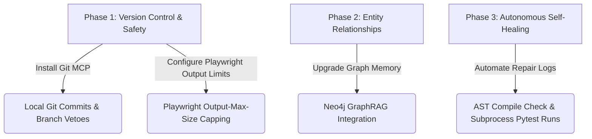

# Keystone Sovereign: Developer Tools & MCP Integration Roadmap

> [!IMPORTANT]
> **Owner:** Wayne Stevenson / Keystone Empire  
> **Date:** June 21, 2026  
> **Status:** Draft (OKF v0.1 Compliant)  
> **Context:** Strategic review of recently published GitHub source code, developer toolkits, self-healing agent architectures, and newly released MCP servers to advance the capabilities of the Keystone Sovereign fleet.

---

## 🔍 Part 1: High-Priority MCP Servers for Immediate Integration

The following Model Context Protocol (MCP) servers are recommended to be added to `mcp_config.json`:

### 1. Official Git MCP Server (`mcp-server-git`)
*   **What it is:** A local Git integration maintained by the Model Context Protocol steering group.
*   **Capabilities:** Exposes tools like `git_status`, `git_diff`, `git_commit`, `git_add`, `git_reset`, `git_log`, and branch/checkout controls.
*   **Purpose:** Allows the self-evolution engine to version-control changes, perform branches before attempting edits, and revert commits if a unit test fails.
*   **Configuration:**
    ```json
    "git": {
      "command": "uv",
      "args": ["run", "--package", "mcp-server-git", "mcp-server-git"]
    }
    ```

### 2. Official Managed GitHub MCP Server (`github-mcp-server`)
*   **What it is:** Hosted by GitHub (`github/github-mcp-server`) with native Copilot and OAuth support.
*   **Capabilities:** Full access to remote GitHub repositories, code search, pull requests, issue tracking, and actions (CI/CD monitoring).
*   **Purpose:** Connects the agent fleet to GitHub to push code fixes, open pull requests for reviews, and monitor local deployment workflow actions autonomously.

### 3. Obsidian Built-In MCP Plugin (`obsidian-mcp-plugin`)
*   **What it is:** Obsidian community plugin that exposes your active notes directly as an MCP server using stdio/HTTP.
*   **Capabilities:** Reads, writes, and searches vault notes directly without running external REST APIs or local WSL proxies.
*   **Purpose:** Simplifies multi-agent setup and reduces resource consumption by eliminating the WSL Graphthulhu proxy.

---

## ⚡ Part 2: Vector Brain & RAG Advancements

### 1. Qdrant ACORN-1 Predicate Subgraph Traversal
*   **Concept:** Qdrant integrates the ACORN-1 algorithm to solve "filtered Approximate Nearest Neighbor (ANN)" limitations in Hierarchical Navigable Small World (HNSW) graphs.
*   **Keystone Implementation:** Payload keyword indexing is configured on `memory_layer` with `acorn=models.AcornSearchParams(enable=True)`. Future step: Automate index creation on new namespaces created by subagents.

### 2. Dual-Engine GraphRAG (Qdrant + Neo4j/SQLite)
*   **Concept:** Combined vector search (semantic chunk retrieval) and graph databases (structural entity-relationship data).
*   **Keystone Integration:** SQLite graph memory layer (`graph_history.db`) successfully boosts recall. Future step: Migrate SQLite graph schema to a permanent Neo4j database to build a complete, visual knowledge graph of the Keystone Empire.

---

## 🛡️ Part 3: Self-Healing Agent OS Architectures

### 1. Self-Healing Loops (Observe ➔ Diagnose ➔ Repair ➔ Learn)
*   **Insight:** Production-ready self-healing agents record error cards in a persistent "known-fixes" memory database, mapping error stack traces to successful repair strategies rather than merely retrying failed operations.
*   **Keystone Alignment:** Configured within `self_evolution.py` and `correction_journal.json`.
    *   **Auto-Patching:** Agent runs automated AST parser checks and `pytest` in a subprocess, applying code edits and committing them via the Git MCP server only after tests pass.
    *   **Fallback Strategies:** Automated fallback mapping (e.g., if a 1080p video upscale returns 404, fall back to 720p; if Qdrant times out, fall back to local SQLite).

---

## 📅 Part 4: Implementation Roadmap (Next Steps)



1.  **Immediate Setup (Local Git):** Register `mcp-server-git` to version-control the `00_Engine` folder, rendering all self-evolution edits reversible.
2.  **Next Up (Neo4j Migration):** Move SQLite `graph_history.db` entity relationships to a dedicated local Neo4j container to visualize and query relationship maps.
3.  **Long-Term (n8n & Self-Healing):** Deploy automated n8n workflows to trigger local script self-healing when background processes raise warnings.

---
📁 **See also:** [[INDEX|← Directory Index]] · [[29_OKF_AND_SYSTEM_UPGRADE_MASTER_PLAN|← Master Upgrade Plan]]