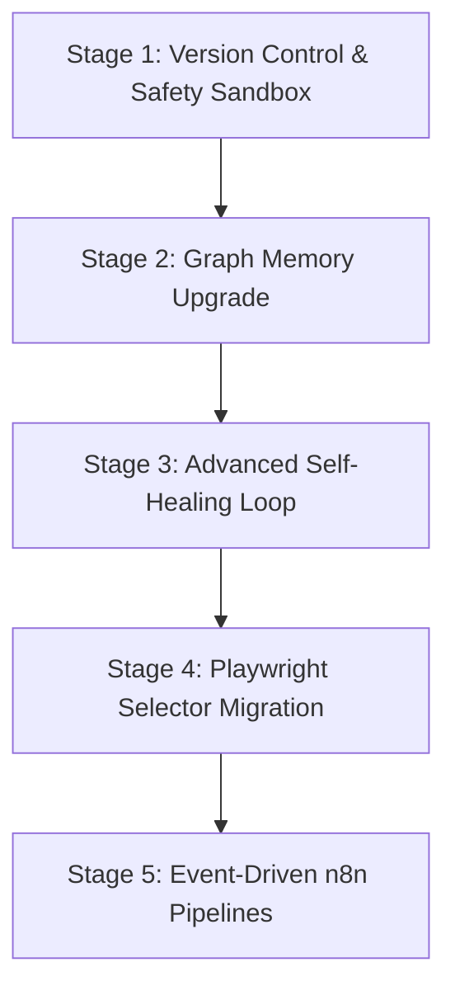

# Keystone Sovereign: Master Build Blueprint

> [!IMPORTANT]
> **Owner:** Wayne Stevenson / Keystone Empire  
> **Date:** June 21, 2026  
> **Status:** Draft (OKF v0.1 Compliant)  
> **Context:** Master engineering roadmap outlining the implementation details, configurations, and commands for our next sequential system stages.

---

## 🗺️ Stage-by-Stage Build Sequence



---

## 🛠️ Stage 1: Version Control & Safety Sandbox (Git MCP)

**Objective:** Wire Git commands directly into the agent's context to enable automated sandboxing, branch-level testing, and commit rollbacks.

### Step 1.1: Install & Register Git MCP Server
*   Add the Git server implementation to [mcp_config.json](file:///C:/Users/Curtis/.gemini/config/mcp_config.json):
    ```json
    "git": {
      "command": "npx",
      "args": ["-y", "@modelcontextprotocol/server-git"]
    }
    ```
*   Verify the server launches cleanly using the MCP inspector.

### Step 1.2: Initialize Local Git Repository
*   Navigate to `00_Engine` and initialize Git:
    ```bash
    git init
    git add .
    git commit -m "initial baseline"
    ```

### Step 1.3: Integrate Sandbox Branches in `self_evolution.py`
*   Modify `self_evolution.py` to create a temporary branch before attempting edits:
    ```python
    import subprocess
    
    def checkout_sandbox_branch(branch_name):
        subprocess.run(["git", "checkout", "-b", branch_name])
    ```

### Step 1.4: Automated Rollback on Fail
*   If syntax verification or tests fail, checkout the main branch and discard changes:
    ```python
    def rollback_sandbox(branch_name):
        subprocess.run(["git", "checkout", "main"])
        subprocess.run(["git", "branch", "-D", branch_name])
    ```

---

## 🗄️ Stage 2: Graph Memory Upgrade (Neo4j GraphRAG)

**Objective:** Transition SQLite entity relation graphs to a Neo4j database to support high-performance visual relationships.

### Step 2.1: Spin up local Neo4j Docker Instance
*   Add Neo4j to our `docker-compose.yml`:
    ```yaml
    neo4j:
      image: neo4j:5.20-community
      ports:
        - "7474:7474"
        - "7687:7687"
      environment:
        - NEO4J_AUTH=neo4j/keystonesovereign
    ```
*   Run `docker compose up -d neo4j`.

### Step 2.2: Migrate SQLite Data to Neo4j Nodes
*   Create a migration script `migrate_sqlite_to_neo4j.py` reading triples from `graph_history.db` and writing Cypher queries:
    ```cypher
    MERGE (a:Entity {name: $source})
    MERGE (b:Entity {name: $target})
    MERGE (a)-[r:RELATION {type: $relation}]->(b)
    ```

### Step 2.3: Update `keystone_brain_v2_mcp.py` to Query Cypher
*   Integrate `neo4j` driver in the brain MCP, combining vector similarity searches with Cypher traversals (fetching 1st and 2nd-degree neighbors) to build the context prompt.

---

## 🧬 Stage 3: Advanced Self-Healing Loop (AST & Pytest)

**Objective:** Veto any code edits that do not compile or fail tests before they are merged.

### Step 3.1: Enforce AST Compile Verification
*   Add pre-write compile gates to `self_evolution.py` using `ast.parse`:
    ```python
    import ast
    
    def verify_syntax(code_str):
        try:
            ast.parse(code_str)
            return True
        except SyntaxError as e:
            print(f"Syntax Error: {e}")
            return False
    ```

### Step 3.2: Execute Pytest Subprocess
*   Run the suite dynamically:
    ```python
    def verify_test_suite():
        res = subprocess.run(["pytest", "tests/"], capture_output=True, text=True)
        return res.returncode == 0, res.stdout
    ```

### Step 3.3: Write Correction Journal Patch Logs
*   Write failed attempts, error tracebacks, and successful patch files directly to `.learnings/corrections/` to build a database of repair scripts.

---

## 🌐 Stage 4: Playwright Selector Migration (Accessibility Tree)

**Objective:** Stabilize browser automation scripts against visual layout changes.

### Step 4.1: Enforce latest Playwright MCP
*   Confirm Playwright configuration uses `@playwright/mcp@latest` with `--output-max-size` caps active.

### Step 4.2: Replace Index-based Card Selectors
*   Refactor card selection routines to query node snapshots using the accessibility tree:
    ```typescript
    // Instead of locating cards[12], look up by name:
    const WayneCard = page.locator('role=button[name="Wayne"]');
    await WayneCard.click();
    ```

---

## 🔗 Stage 5: Event-Driven n8n Pipelines

**Objective:** Transition cron jobs and manual scripts to event-driven webhooks.

### Step 5.1: Build Webhook Router
*   Expose `n8n_workflows/keystone_gemini_davinci_render.json` to handle content rendering calls.
*   Setup webhook endpoints mapping payload types to specific brand actions.

---
📁 **See also:** [[INDEX|← Directory Index]] · [[32_DEV_TOOLS_AND_MCP_INTEGRATION_ROADMAP|← Dev Roadmap]] · [[33_SYSTEM_EVOLUTION_GAP_AND_ADVANCEMENT_ANALYSIS|← Gap Analysis]]