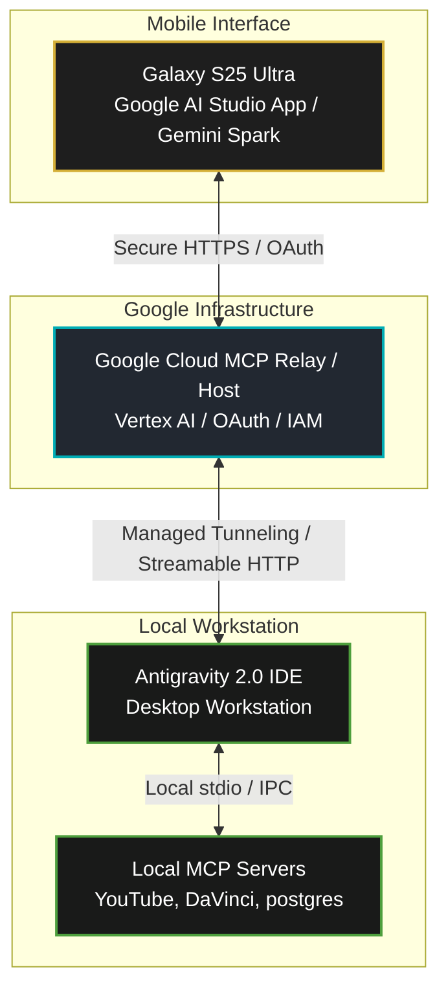

# Google I/O 2026: Google Cloud MCP Integration & Phone Orchestration Plan

> [!IMPORTANT]
> **Prepared For:** Wayne Stevenson / Keystone Empire  
> **Date:** May 19, 2026  
> **Key Announcement:** Google Cloud Managed Model Context Protocol (MCP) & Google AI Studio Native MCP Integration  
> **Core Concept:** Replaces local network tunnels (localtunnel, ngrok) with a secure, 24/7 Google Cloud-managed MCP bridge connecting a Galaxy S25 Ultra directly to a workstation's Antigravity environment.

---

## 🌐 Part 1: What is the New "MCP Cloud Connection" standard?

Google's architectural shift introduces native **remote MCP servers and relays** integrated directly into **Google Cloud** and **Google AI Studio**.

The bridge connects mobile interfaces directly to local developer environments:

---

## 🛠️ Part 2: How It Replaces Fragile "Pairing Links"

This architecture replaces standalone node servers and temporary public address mapping (`localtunnel` / `ngrok` mapped to local ports):

1. **Google Cloud-Hosted Entry Point:** Hosted on Google Cloud via Cloud Run or Google Cloud's managed MCP registry.
2. **Enterprise Security:** Mobile device authenticates using primary **Google Account credentials (IAM / OAuth2)**.
3. **No Open Ports:** Workstation connects outbound to Google Cloud's managed MCP relay via a secure, persistent websocket connection.
4. **Bidirectional Action:** Voice/text requests to the mobile Gemini/AI Studio client execute on local workstation custom servers (`youtube_mcp.py`, `davinci-resolve-mcp`) and stream results back in real time.

---

## 🚀 Part 3: The Keystone MCP Architecture

Three primary **MCP Server Silos** run 24/7 on the local workstation and register dynamically with Google Cloud:

### 1. 🎬 YouTube Content Engine MCP (`youtube_mcp.py`)
*   **Workstation Resources:** Full API access to YouTube channels, local scripts, and draft metadata.
*   **Phone Capabilities:** Request analytics, draft community posts, and respond to comments remotely.

### 2. 🎛️ DaVinci Resolve Video MCP (`server.py` in `davinci-resolve-mcp`)
*   **Workstation Resources:** Scripting modules for video editing, B-roll rendering, and audio recomposition.
*   **Phone Capabilities:** Execute workstation rendering commands (e.g., *"Auto-assemble the B-roll select reel for the Squamish build using the charcoal preset"*).

### 3. 🏗️ Construction & Database MCP (`keystone-brain`)
*   **Workstation Resources:** Supabase Vector DB containing business blueprints, building code specifications, and project checklists.
*   **Phone Capabilities:** Query local documentation, retrieve peptide schedule protocols, or update physical project entries on-site.

---

## 📅 Part 4: Step-by-Step Transition Plan

### 📥 Step 1: Pre-Register for the AI Studio Mobile App
On the Galaxy S25 Ultra, opt-in for the **Google AI Studio Mobile App (Developer Preview)** via the Google Play Store.

### 🔑 Step 2: Configure Workspace & OAuth Credentials
Configure Google Workspace MCP authentication in `MCP_Multiplexer/[[AGENTS|agents]].json` using the active Google OAuth Client ID to establish the mobile-to-workstation handoff.

### 🌉 Step 3: Spin Down the Temporary Pairing Server
Terminate the legacy standalone pairing server (`task-441`) and the localtunnel background task (`task-1825`) to transition fully to the Google Cloud MCP infrastructure.

---

> [!TIP]
> **Status:** The Cloud-managed MCP architecture is documented and integrated into the master repository. Shutting down the legacy localtunnel services will complete the migration.

---
📁 **See also:** ← Directory Index

**Related:** [[20260615_SYS_google_indexing_api_integration]] · [[20260609_MCP_TOOLS_deep_research_into_google_workspace_mcp_integration_—_gmail,]]