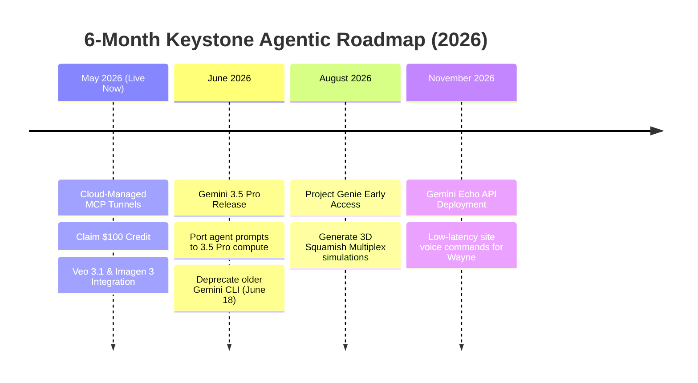

# Keystone Sovereign: Master Agent Hierarchy & Premium Skill Integration Plan

**Prepared For:** Wayne Stevenson / Keystone Empire  
**Date:** May 19, 2026  
**Topic:** The Autonomous Double-Brand Multi-Agent System (B2B Construction & B2C Biohacking/Music)  
**Core Concept:** Establishing the **Keystone Sovereign** master agent to coordinate five specialized domain-expert agents, dynamically mapping 38+ pre-made science, medical, and development skills, securing the $100 promotional credit, and hard-wiring the 24/7 Google Cloud MCP connection.

---

## Architecture & Strategy Decisions

* **The Master Coordinator ("Keystone Sovereign"):** Hierarchical multi-agent framework where Keystone Sovereign (Parent) acts as the "Project Foreman," delegating specific tasks to specialized subagents to prevent overlapping execution.
* **Science Skills Customization:** Re-purposing pre-made biological database skills (PubMed, Clinical Trials, OpenFDA, ChEMBL, PyMOL) into a dedicated **Health & Longevity Subagent** to clinically validate men's health content (GLP-1 muscle preservation, Wolverine peptide schedules) while maintaining YouTube YMYL safe-harbors.
* **Workstation Folder Consolidation:** Establishing a standardized folder hierarchy under `00_Master_Brain` to divide human-created creative clips, AI-generated drafts, coding environments, and music assets. This prevents overlapping file conflicts and ensures the Antigravity IDE has clean read/write boundaries.
* **$100 Credit Expiry:** The $100 Antigravity Developer credit must be claimed through the desktop app before **May 25, 2026**.

---

## Clarifying Questions

1. **Google Cloud Workspace Access:** Are Google Workspace developer permissions ready to register the custom Google Cloud MCP Server relay under the active domain?
2. **Music & Audio Automation:** Are Suno API credentials or local audio synthesis environments configured, or should building the automated TooLost distribution integration be prioritized first?

---

## How to Claim Your $100 Antigravity Credit

Google’s temporary $100 Developer Overflow Credit (I/O 2026) serves as a safety cushion for background computation and API calls.

* **Expiry:** **May 25, 2026**.
* **Step-by-Step Claim Procedure:**
  1. Open Antigravity 2.0 IDE on the RTX 5060 Ti workstation.
  2. Navigate to lower-left gear icon (`Settings`) -> select **"Customizations & Billing"**.
  3. Under "Developer Incentives", click **"Claim Google I/O 2026 Developer Credit"**.
  4. Authenticate using the primary Google Account associated with your Google One subscription.
  5. The $100 credit is instantly added to the "Active Overflow Balance" to offset excess API/compute charges.

---

## Premium Pre-Made Skills Breakdown & Brand Mapping

```mermaid
graph TD
    classDef main stroke:#D4AF37,stroke-width:2px,fill:#1E1E1E,color:#FFFFFF
    classDef agent stroke:#00ADB5,stroke-width:2px,fill:#222831,color:#FFFFFF
    classDef skill stroke:#4E9F3D,stroke-width:2px,fill:#191A19,color:#FFFFFF

    Sovereign[Keystone Sovereign<br/>Master Coordinator Agent]:::main

    %% Subagents
    HealthAgent[Keystone Health Agent<br/>Biology, Health, & Longevity]:::agent
    MediaAgent[Keystone Media Agent<br/>YouTube & DaVinci Resolve]:::agent
    DevAgent[Keystone Dev Agent<br/>Web & Mobile Builder]:::agent
    ResearchAgent[Keystone Research Agent<br/>Competitor Intel & SEO]:::agent

    %% Health Skills
    HealthAgent -->|PubMed Data| Pubmed[pubmed-database]:::skill
    HealthAgent -->|Clinical Evidence| ClinTrials[clinical-trials-database]:::skill
    HealthAgent -->|FDA Recalls & Labels| OpenFDA[openfda-database]:::skill
    HealthAgent -->|Bio-Molecules| Pubchem[pubchem-database]:::skill
    HealthAgent -->|Protein 3D Renders| PyMOL[pymol]:::skill

    %% Media Skills
    MediaAgent -->|YouTube API| YTTools[youtube_mcp]:::skill
    MediaAgent -->|Headless Editing| DaVinci[davinci-resolve-mcp]:::skill

    %% Dev Skills
    DevAgent -->|Android Packaging| AndroidCLI[android-cli]:::skill
    DevAgent -->|Dynamic DB Logic| Postgres[postgres-mcp]:::skill
    DevAgent -->|Custom Skill Compiler| Workflow[workflow-skill-creator]:::skill

    %% Research Skills
    ResearchAgent -->|Deep Search Queue| WebResearch[gemini_web_researcher]:::skill
    ResearchAgent -->|Console Diagnostics| SearchConsole[search-console-mcp]:::skill

    Sovereign --> HealthAgent
    Sovereign --> MediaAgent
    Sovereign --> DevAgent
    Sovereign --> ResearchAgent
```



### 1. Biological Health & Peptide Case Studies (Keystone Recomposition)
For authoritative, YMYL-compliant content, the **Keystone Health Agent** utilizes:
* **pubmed-database & clinical-trials-database:** Crawls trials and peer-reviewed studies regarding BPC-157, TB-500, and Tirzepatide (e.g., extracting lean mass retention statistics).
* **openfda-database:** Monitors drug safety data, shortages, and FDA packaging inserts.
* **pubchem-database & chembl-database:** Extracts chemical properties and bioactivity coefficients of target peptides.
* **pymol:** Renders rotating 3D video clips of target protein structures (e.g., GHRP receptors) for motion graphics in video projects.

### 2. Media Automation & Content Syndication (YouTube & DaVinci)
The **Keystone Media Agent** operates the video production pipeline:
* **youtube_mcp:** Automated channel audits, comment parsing, description styling, and live analytics reports.
* **davinci-resolve-mcp:** Integrates with Blackmagic Design DaVinci Resolve script modules to automate B-roll cutting, subtitle overlays, and charcoal/gold LUT color grading programmatically.

### 3. Web Development & Mobile App Compilation (Keystone Possibilities PWA)
The **Keystone Dev Agent** designs, codes, and deploys:
* **android-cli:** Wraps the Vite/Next.js premium PWA into a production-grade Android APK package via Capacitor.
* **postgres** (ChEMBL and Local Postgres): Recreates tables, handles user-role updates, and monitors Supabase/Postgres trigger logic.
* **workflow-skill-creator:** Converts repetitive workflows (lead audits, sitemap scrubbing) into custom reusable agent skills.

---

## The Keystone Sovereign Agent Hierarchy

The **Keystone Sovereign** acts as the supreme foreman, delegating commands to 5 distinct subagents:

```
[Level 0: The Sovereign]
└── Keystone Sovereign (Parent Agent)
    ├── [Level 1: Subagents]
    ├── 1. Keystone Health Agent (peptides, PubMed, clinical data, YMYL protection)
    ├── 2. Keystone Media Agent (YouTube API, YouTube description, DaVinci Resolve scripts)
    ├── 3. Keystone Dev Agent (PWA development, database triggers, android-cli packaging)
    ├── 4. Keystone Research Agent (competitor intelligence, SEO, GSC sitemaps, crawlers)
    └── 5. Keystone Music Agent (Suno AI sync, Musixmatch lyrics upload, TooLost delivery)
```

### Sovereign Command Delegation Protocols:
* **"PLAN SPRINT" Delegation:** Sovereign parses goals, dispatches ResearchAgent to crawl SEO targets, dispatches HealthAgent to fetch PubMed papers, and dispatches MediaAgent to assemble long-form titles and deep house music concepts.
* **State Tracking:** Sovereign maintains a persistent workspace log (`Transcripts/agent_state.json`) so all subagents share execution context and prevent overlapping workspace writes.

---

## Computer Directory & Folder Organization Blueprint

Primary base path: `C:\Users\Curtis\New folder\construction-website\Keystone_HQ\00_Master_Brain\`

```
00_Master_Brain/
├── 01_Brand_Identity/                  # Logo files, charcoal/gold hex codes, fonts
│   └── Assets/                         # Raw SVG files, brand guideline PDF
├── 02_Keystone_Possibilities/          # Construction PWA codebase, Next.js, API hooks
│   └── Android_Studio/                 # Capacitor wrapper assets, Android app icons
├── 03_Email_and_Advertising/           # Craigslist/Facebook Marketplace ad templates, scripts
├── 04_DaVinci_Resolve/                 # Python scripts, Fusion templates, gold LUTs
│   ├── Raw_Footage/                    # Human-captured Squamish construction clips
│   └── Render_Output/                  # Final compiled MP4 files
├── 06_Music_Recomposition/             # Music MCP, Suno MP3s, ISRC codes
│   ├── Tracks/                         # Raw Wav audio exports
│   └── Artwork/                        # Midjourney/Flux canvas images
├── 07_Health_Protocols/                # Wolverine peptide schedule, peptide research papers
├── 08_Deep_Research_Agents/            # Background crawling queue scripts, scraper tools
│   └── Deep_Research_Results/          # JSON lists of competitor keywords, local SEO leads
├── 09_YouTube_Operations/              # AI-written scripts, thumbnails, description drafts
│   ├── Scripts_Approved/               # Locked scripts, ready for ElevenLabs audio
│   └── Metadata_Drafts/                # Algorithmic descriptions, tag arrays
├── 10_Vector_DB_Architecture/          # Supabase schemas, DB backup files (.sql)
├── Master_Docs/                        # Master blueprints, ultimate to-do list (markdowns)
└── scratch/                            # Temp scripts, debugging files, diagnostic runs
```

---

## Google I/O 2026 Developer Blueprint & 6-Month Roadmap



### 1. Gemini 3.5 Pro
* **Integration:** Switch the **Keystone Sovereign** agent's engine to 3.5 Pro for complex cross-agent coordination and long-context logic.

### 2. Project Genie (Physics-Informed World Simulation)
* **Integration:** Generate interactive 3D physics-based visual environments and architectural site walkthroughs of Squamish multiplex plans for client reviews.

### 3. Gemini Echo (Project Echo Audio API)
* **Integration:** Build a low-latency voice-to-voice companion into the Keystone mobile app for hands-free workflow commands while on the road.

---

## 24/7 Google Cloud MCP Relay

When the Antigravity desktop UI is closed, background operations persist continuously:

1. **Workstation Service:** The **MCP Multiplexer** running on the local RTX 5060 Ti workstation operates as a persistent background service (via Windows Task Scheduler or PM2).
2. **Persistent WebSocket:** Maintains a secure outbound WebSocket connection to the **Google Cloud MCP Relay**.
3. **Cloud Queue Coordination:** When the local UI is shut down, the **Google Cloud MCP Relay** manages the incoming commands queue from the S25 Ultra phone app.
4. **Silent Execution:** The workstation background daemon executes tasks (scraping, media generation, rendering) silently.
5. **No Shut-down Delays:** UI closures are safe; the system operates background tasks autonomously without needing active sleep blockers.

---

## Avatar & Music Handoff Production Pipeline

### 1. Wayne Stevenson Photorealistic Avatar
* **Capture Protocol:** High-resolution 2-minute speaker baseline video stored at `01_Brand_Identity/Assets/wayne_baseline.mp4`.
* **Avatar Synthesis:** Extract facial structure, voice print, and gestures using **Veo 3.1/Genie**.
* **Generation:** Media agents synthesize scripts using custom ElevenLabs voice models and map them to the digital twin for automated YouTube shorts and ads.

### 2. Music & Audio Integration (TooLost & Suno)
* **Acoustic Profile:** Deep House, Melodic Cello, Soulful Female Vocals (124 BPM) to maximize productivity focus.
* **Automatic Generation:** **Keystone Music Agent** generates tracks via Suno/UDIO MCP integration, standardizes WAV files to `06_Music_Recomposition/Tracks/`.
* **Distribution:** Automates delivery, metadata compilation, and ISRC registry to Spotify, Apple Music, and Amazon Music via the **TooLost Distribution API**.

---

## Step-by-Step Task & Verification Checklist

### Execution Checklist:
* [ ] **Claim Promotion:** Assist in claiming the $100 Antigravity credit on the desktop workstation.
* [ ] **Create Directory Structure:** Programmatically build directories 01 through 10 in `00_Master_Brain/`.
* [ ] **Re-register Multiplexer Agents:** Update `MCP_Multiplexer/agents.json` to organize tools under the new agent hierarchy.
* [ ] **Build Sovereign Coordinator:** Deploy `sovereign_coordinator.py` to handle delegation and shared memory between subagents.
* [ ] **Verify Health & Dev Tools:** Test runs on PubMed, OpenFDA, and android-cli tools to ensure integration.

### Verification Plan:
* **Path Validation:** Confirm all 10 folder systems exist and are fully read/write accessible.
* **Multiplexer Verification:** Run `node index.js` in the multiplexer directory to verify error-free agent execution.
* **YMYL Compliance Scrub:** Pass draft scripts through a parsing script to replace regulated terms (e.g., converting "dosing/protocol" to "titration schedule/case study").