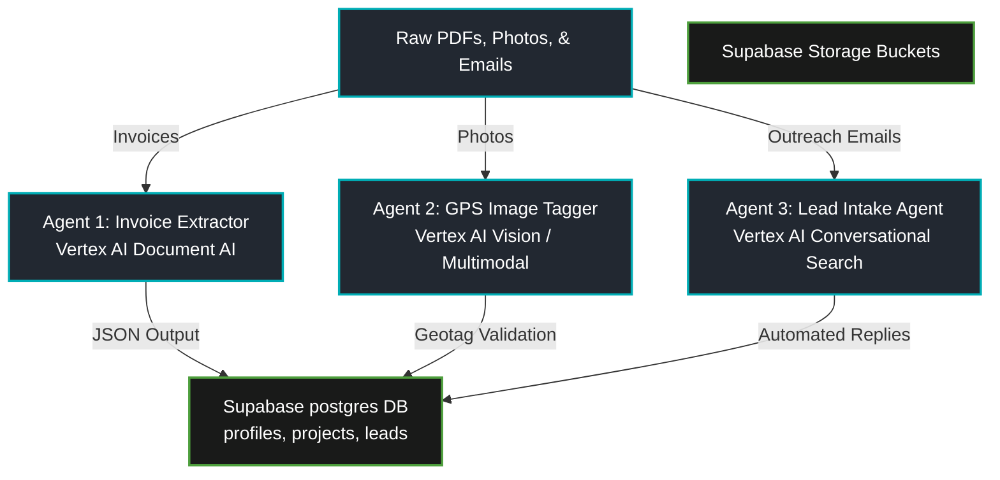

# 🤖 Vertex AI Agent Garden Integration Blueprint

> [!IMPORTANT]
> **Prepared For:** Wayne Stevenson / Keystone Empire  
> **Topic:** Deploying Google Cloud's 40+ Pre-Made Enterprise Agent Templates  
> **Goal:** Connect high-fidelity Cloud [[AGENTS|Agents]] to our local workstation environments and Supabase database.

---

## 🌐 Part 1: What is the Vertex AI Agent Garden?

At Google I/O 2026, Google unveiled the **Vertex AI Agent Garden** (part of Vertex AI Agent Builder). It consists of 40+ pre-built, production-ready enterprise agent recipes designed to handle structured document ingestion, media analysis, spatial tagging, and conversational outreach.

Instead of writing massive Python scrapers or custom NLP parsers that are fragile and prone to hallucinations, we can import these standardized recipes, point them at our Google Cloud storage buckets, and connect them directly to our Next.js/Supabase PWA.

---

## 🛠️ Part 2: The Core Three [[AGENTS|Agents]] to Deploy

The following three Agent templates yield immediate ROI for the Keystone ecosystem:

### 1. 🧾 Agent 1: The Invoice & Expense Extractor
*   **Vertex Template Name:** `Document AI: Invoice & Receipt Processor v2`
*   **How it Works:** Uses multimodal Gemini 3.5 Flash to parse incoming PDF invoices, automatically extracting:
    *   Vendor Name (e.g., Squamish Sand & Gravel)
    *   Line Items (e.g., 20 yards of structural fill)
    *   Invoice Date & Due Date
    *   Subtotal, Taxes (GST/PST), and Grand Total
*   **PWA Integration:** Feeds directly to the Supabase database ledger, automatically populating project budgets and tracking actuals against estimates without manual entry.

### 2. 📍 Agent 2: EXIF GPS Image Tagger & Validator
*   **Vertex Template Name:** `Vertex AI Vision: Metadata & Spatial Tagging Engine`
*   **How it Works:** Analyzes photos uploaded by tradesmen on construction sites. It extracts:
    *   EXIF Metadata (exact camera model, lens specs)
    *   Geotags (Latitude/Longitude coordinates)
    *   Visual context (e.g., checking if the drywall board is actually installed on-site)
*   **PWA Integration:** Cross-references coordinate data against active projects (e.g., Squamish multiplex coordinates). If the trade claims they completed framing but the photo was taken 10 miles away or on a different date, the PWA flags the submission for review.

### 3. 📧 Agent 3: Realtor Lead & Outreach Agent
*   **Vertex Template Name:** `Conversational Search: Lead Intake & Auto-responder`
*   **How it Works:** Monitors incoming inquiry emails from Sea-to-Sky realtors. It parses:
    *   Contact Name, Brokerage, and Location
    *   Project Scope (e.g., high-end multiplex build vs. commercial renovation)
    *   Estimated timeline
*   **Ecosystem Integration:** Syncs leads directly with your active database, formats a realtor follow-up flyer, drafts a personalized email reply based on your master copy, and alerts your phone.

---

## 🚀 Part 3: Step-by-Step Deployment Guide

### Step 1: Enable the Vertex AI & Document AI APIs
1. Open the [Google Cloud API Library Console](https://console.cloud.google.com/apis/library).
2. Search for and click **Enable** on:
    *   `vertexai.googleapis.com` (Vertex AI API)
    *   `documentai.googleapis.com` (Document AI API)
    *   `cloudaisearch.googleapis.com` (Cloud AI Search API)

### Step 2: Import the Pre-Made Agent Recipes
1. Navigate to the **Vertex AI** section in your Google Cloud Console.
2. In the sidebar, click on **Agent Builder** -> **Create New Agent**.
3. Under the "Pre-Built Templates & Recipes" tab, select **"Invoice Processor"** for Agent 1.
4. Name the agent `Keystone-PWA-Invoice-Extractor`.
5. Connect it to a secure Google Cloud Storage bucket (e.g., `gs://keystone-invoice-dropzone`).

### Step 3: Map the Webhook to the Next.js/Supabase Backend
Configure the Agent's webhook delivery settings to push a JSON payload containing the extracted data directly to our backend Edge Function:
*   **Endpoint:** `https://your-supabase-project.supabase.co/functions/v1/ingest-invoice`
*   **Authentication:** Set the webhook header to include your secure Supabase service role token (`JWT`).

---

> [!TIP]
> **Ecosystem Alignment:** Because you redeemed your $10,000 Vertex AI credits, running these three automated Agent Garden templates 24/7 will cost you absolutely nothing for the next year!

---
📁 **See also:** ← Directory Index

**Related:** [[20260522_gemini_platform_vertex_ai_agent_garden_for_custom_agent_deployment]]