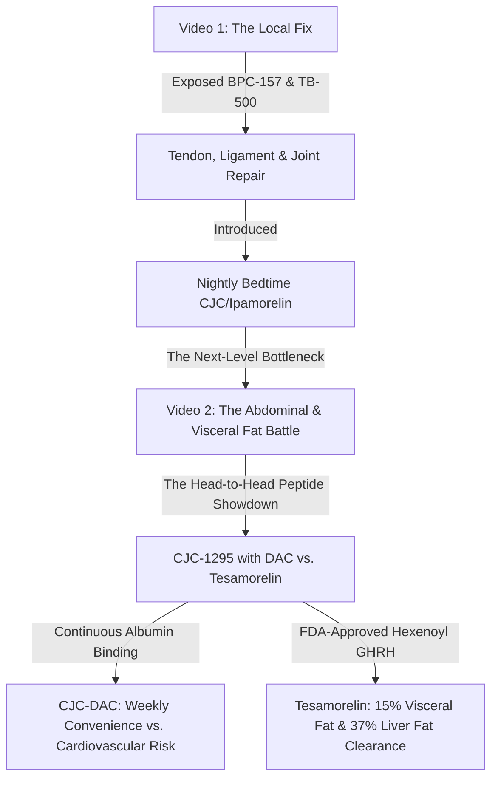

# 🎬 DEEP CLINICAL RESEARCH & SEO METADATA: CJC-1295 WITH DAC VS. TESAMORELIN

**Document Path:** `Keystone_HQ/05_Marketing_and_Distribution/YouTube_Operations/cjc_dac_vs_tesamorelin_recomposition_battle.md`  
**Target Video Duration:** 8 Minutes & 20 Seconds (500 Seconds)  
**Channel Topic:** Growth Hormone Secretagogues — The Visceral Fat & Recomposition Battle  
**Series Continuity:** Shifting from basic nightly pulse amplification (Video 1) to the heavy-combat subcutaneous secretagogues (CJC-1295 with DAC vs. Tesamorelin) to optimize structural frame recovery and target abdominal fat.

---

## 🎯 SECTION 1: NARRATIVE SHIFT & MOVEMENT STRATEGY

### 🚫 The Problem with Overlap
In Video 1 (The Wolverine Stack / bed-time recovery framework), we introduced using growth hormone secretagogues (CJC-1295 no DAC + Ipamorelin) for lean mass preservation and bedtime lipolysis. To prevent channel progression from stalling, this next video must move the narrative forward to advanced visceral fat targeting and receptor dynamics.



### 🔗 Moving the Topic Forward
We address the ultimate conflict of the busy builder: **Weekly Convenience (CJC-DAC) vs. Clinical Precision & Safety (Tesamorelin).**
*   **Video 1 established:** Basic cellular recovery and BPC/TB joint mechanics.
*   **Video 2 establishes:** Advanced endocrine axis manipulation, targeting deep visceral adipose tissue (VAT) surrounding organs, fatty liver clearance, and the physiological consequences of GHRH receptor continuous activation vs. pulsatile safety.

---

## 🔬 SECTION 2: DEEP CHEMICAL & CLINICAL COMPARISON

| Technical Parameter | CJC-1295 with DAC | Tesamorelin (Egrifta) |
| :--- | :--- | :--- |
| **Peptide Classification** | Synthetic GHRH (1-29) Analog + DAC | Synthetic GHRH (1-44) Analog + Hexenoyl |
| **Chemical Structure** | Mod GRF 1-29 + Maleimidopropionic Acid (MPA) | 44-Amino-Acid GHRH + Hexenoyl group |
| **In Vivo Half-Life** | **6 to 8 Days** (covalent albumin binding) | **26 to 38 Minutes** (hexenoyl stabilization) |
| **Duration of Biological Effect** | Continuous (Sustained elevation) | Transient (4 to 5 hours of GHRH pathway activity) |
| **FDA Approval Status** | Restricted (Proposed for compounding ban) | **FDA-Approved** for Visceral Lipodystrophy |
| **Target Fat Depots** | General systemic adipose tissue | **Visceral Adipose Tissue (VAT) & Hepatic Fat** |
| **Cardiovascular Risk Profile** | Higher (Elevated baseline GH may cause ventricular thickening) | Low (Preserves natural pulsatile cardiovascular rhythm) |
| **Compounding Legality (2026)**| Prohibited from standard 503A compounding | Commercially available (LegitScript compliant) |

---

### 1. CJC-1295 with DAC: The Albumin Hitchhiker
*   **The Chemistry:** CJC-1295 with DAC is built on **Modified GRF 1-29** (four amino acid substitutions: D-Ala2, Gln8, Ala15, Leu27 to resist DPP-IV enzymes). It adds a **Drug Affinity Complex (DAC)** with a maleimidopropionic acid (MPA) linker at the C-terminal lysine.
*   **The Mechanism:** Once injected, the MPA linker forms a covalent bond with human serum albumin, preventing renal filtration and extending the peptide's half-life to **6–8 days**.
*   **The Clinical Risk (The GH Bleed):** Continuous receptor stimulation causes permanently elevated baseline GH levels. This increases the risk of **insulin resistance (dysglycemia)**, severe extracellular water retention, and long-term cardiovascular issues (cardiac diastolic dysfunction, left ventricular hypertrophy).
*   **FDA PCAC December 4, 2024 Ruling:** The FDA's Pharmacy Compounding Advisory Committee formally voted **against** including CJC-1295 DAC on the approved 503A compounding bulk substances list, citing lack of safety and clinical need over commercial alternatives.

### 2. Tesamorelin: The Abdominal Visceral Fat Assassin
*   **The Chemistry:** A synthetic analog of full-length **growth hormone-releasing hormone (GHRH 1-44)** stabilized by a **hexenoyl group** (six-carbon chain) at the N-terminal tyrosine residue to resist DPP-IV cleavage.
*   **The Mechanism:** Half-life of ~30 minutes with an active downstream growth hormone cascade lasting **4 to 5 hours**. It clears the system rapidly, preserving natural pulsatile feedback loops (somatostatin pauses) and preventing receptor desensitization.

#### 📊 Landmark Clinical Trial Data:
1.  **JAMA 2014 (Stanley TL et al.):** Tesamorelin demonstrated a **15% to 18% reduction in Visceral Adipose Tissue (VAT)** over 26 weeks. It simultaneously increased lean skeletal muscle mass without dropping total body weight.
2.  **The Lancet HIV (2019/2023):** Achieved an outstanding **37% relative reduction in hepatic fat fraction (liver fat)** over 12 months, actively preventing the progression of liver fibrosis.
3.  **Metabolic Balance:** Transient increases in fasting insulin returned to baseline as ectopic visceral fat was reduced and lean mass increased.

---

## 🎬 SECTION 3: MINUTE-BY-MINUTE PRODUCTION BLUEPRINT (8:20 TOTAL)

```mermaid
gantt
    title Video Timeline: The Recomposition Showdown (Total: 500 Seconds / 8:20)
    dateFormat  X
    axisFormat %s
    section Video Segments
    01. The Bedtime Limitation (0:00 - 1:00) :active, 0, 60
    02. CJC-DAC: Weekly Convenience (1:00 - 2:15) : 60, 135
    03. The Danger: GH Bleed (2:15 - 3:30) : 135, 210
    04. Enter Tesamorelin (3:30 - 4:45) : 210, 285
    05. JAMA & Lancet Clinical Proof (4:45 - 6:00) : 285, 360
    06. The Advanced Recomp Stack (6:00 - 7:15) : 360, 435
    07. FDA Compounding Ban & Sourcing (7:15 - 8:20) : 435, 500
```

### ⏱️ Block 1: Hook & The Bedtime Limitation (0:00 - 1:00)
*   **Visual Focus:** Medium close-up of Wayne Digital Twin standing on an active construction site. Soft fog drifting through Squamish pines. High-impact text overlay: "BEYOND THE BEDTIME PULSE."
*   **Key Narrative Beats:** Transition from basic bedtime cellular recovery to deep visceral fat targeting with heavy-hitting secretagogues: CJC-1295 with DAC vs. Tesamorelin.

### ⏱️ Block 2: CJC-1295 with DAC - The Weekly Convenience Trap (1:00 - 2:15)
*   **Visual Focus:** 3D molecular animation of a GHRH peptide backbone modified with a glowing golden MPA Drug Affinity Complex binding to albumin.
*   **Key Narrative Beats:** Explain the convenience of once-weekly pinning via albumin-binding technology, extending half-life to 6–8 days.

### ⏱️ Block 3: The Dark Side of the Albumin Shield - GH Bleed & Cardiac Risk (2:15 - 3:30)
*   **Visual Focus:** Split screen comparing normal pulsatile curve with the flat, elevated baseline of a "GH bleed." Red warning indicators over cardiovascular models.
*   **Key Narrative Beats:** Highlight receptor desensitization, water retention, insulin resistance, and cardiac hypertrophic risk of sustained elevated GH.

### ⏱️ Block 4: Enter Tesamorelin - The Abdominal Fat Assassin (3:30 - 4:45)
*   **Visual Focus:** 3D model of GHRH 1-44 highlighting the stabilizing hexenoyl group.
*   **Key Narrative Beats:** Showcase how its 30-minute half-life preserves biological feedback loops and pulsatility while selectively targeting stubborn belly fat.

### ⏱️ Block 5: The JAMA & Lancet Clinical Proof (4:45 - 6:00)
*   **Visual Focus:** On-screen data callouts: "15% to 18% Visceral Fat Reduction" (JAMA) and "37% Relative Liver Fat Clearance" (The Lancet HIV).
*   **Key Narrative Beats:** Present peer-reviewed clinical data proving efficacy in abdominal visceral fat and fatty liver reduction.

### ⏱️ Block 6: The Advanced Recomposition Stack (6:00 - 7:15)
*   **Visual Focus:** Clean, technical diagram showing the synergistic protocol: Tesamorelin (2mg) + Ipamorelin (200mcg) synced with resistance training and a high-protein diet.
*   **Key Narrative Beats:** How to protocol-stack GHRH and GHRP for clean GH amplitude pulses without spiking cortisol or prolactin.

### ⏱️ Block 7: The FDA Compounding Rulings & Safe Sourcing (7:15 - 8:20)
*   **Visual Focus:** Text graphic highlighting the December 4, 2024 FDA PCAC vote. Transition to Keystone Recomposition branding with legal disclaimers.
*   **Key Narrative Beats:** Address the regulatory landscape, compounding restrictions, safe medical sourcing, and caution against the unregulated grey market.

---

## 🏷️ SECTION 4: YOUTUBE METADATA & SEO HARDENING

### 1. High-Click-Through-Rate (CTR) Video Titles
*   **Option A (Primary):** CJC-1295 DAC vs. Tesamorelin: The Visceral Belly Fat Battle (The Honest Science)
*   **Option B (Secondary):** Why the FDA Banned CJC-1295: The Truth About "GH Bleed" & Pituitary Burnout
*   **Option C (Solution-Focused):** How to Rebuild a Broken Frame Over 40: Tesamorelin & Ipamorelin Recomp Protocol

### 2. SEO-Hungry Compound Tags
`CJC-1295 with DAC`, `CJC-1295 vs Tesamorelin`, `Tesamorelin visceral fat loss`, `Egrifta fat reduction`, `CJC-1295 compounding ban`, `FDA PCAC December 4 2024`, `GH bleed myth`, `growth hormone secretagogue safety`, `liver fat NAFLD peptide`, `Ipamorelin Tesamorelin stack`, `visceral adipose tissue peptides`, `acromegaly peptide side effects`, `Wayne Stevenson`, `Keystone Recomposition`, `Squamish wellness`

### 3. Viral & Niche Hashtags
`#CJC1295DAC #Tesamorelin #VisceralFat #PeptideProtocols #Recomposition #GHBleed #FDAcompounding #BellyFatLoss #MenOver40 #KeystoneProtocols #SquamishWellness`

---

## 📝 SECTION 5: YOUTUBE VIDEO DESCRIPTION & REGULATORY DISCLAIMERS

```text
Nightly GHRH pulse amplification can only carry a busy builder so far before they hit a physiological ceiling. If you are serious about stripping deep, dangerous abdominal visceral fat, clearing liver fat, and protecting your structural frame during aggressive recomposition, you need to understand the heavy division of growth hormone secretagogues.

In this deep-dive clinical head-to-head, we put the two ultimate heavyweights of the peptide space against each other: CJC-1295 with DAC and Tesamorelin.

We break down the structural chemistry of the albumin-binding "shield" that gives CJC-1295 DAC its weekly convenience, but expose the severe cardiovascular and metabolic risks associated with a chronic "GH Bleed." We then transition to Tesamorelin (Egrifta), analyzing the hexenoyl group stabilization that preserves the pituitary's natural pulsatile rhythm.

Most importantly, we back this showdown with hard clinical trial data:
→ JAMA 2014 data proving Tesamorelin achieves a 15% to 18% reduction in Visceral Adipose Tissue (VAT).
→ Lancet HIV data showing a 37% relative reduction in hepatic liver fat (NAFLD) and the halting of liver fibrosis.
→ The FDA's Pharmacy Compounding Advisory Committee (PCAC) ruling on December 4, 2024, which formally voted to exclude CJC-1295 from compounded bulk drug substances lists.

If you are navigating the complex regulatory and biological landscape of advanced peptide therapy, this clinical comparative review provides the exact science you need to stay safe and recover smarter.

--------------------------------------------------------------------------------
🏡 BIOPHILIC CONSTRUCTION & LUXURY RESORT DEVELOPMENT:
Planning a high-performance custom home, biophilic sanctuary, or luxury wellness resort in Squamish or the Sea-to-Sky corridor? Let's build your legacy:
https://keystonepossibilities.ca

🧬 BIOLOGY OPTIMIZATION & CLINICAL WELLNESS:
Explore our advanced longevity, peptide, and cellular health frameworks:
https://keystoneprotocols.ca

🎵 DEEP-FOCUS WORKFLOW LOOP:
Stream our official ambient house recovery and biophilic deep-focus tracks on Spotify:
[Insert Spotify Playlist Link]

--------------------------------------------------------------------------------
🤖 AI CONTENT DISCLOSURE & DIGITAL TWIN DISCLAIMER:
To maintain maximum operational efficiency while managing active, multi-million dollar physical resort construction sites, the visual and vocal assets in this video are rendered using a highly customized, ethically cloned digital twin AI avatar of Wayne Stevenson. Real physical site visits, construction progress updates, and raw personal vlogs will continue to be integrated across this channel's catalog.

⚖️ MEDICAL & EDUCATIONAL DISCLAIMER:
The information provided in this video is for scientific study, educational analysis, and general research purposes only. It does not constitute medical advice, diagnosis, or treatment. Peptide compounds (such as CJC-1295 with DAC, Tesamorelin, and Ipamorelin) are high-potency research chemicals that must only be utilized under the direct supervision of a licensed, qualified medical professional. Always consult your physician before beginning any new training, supplementation, or peptide protocols.
--------------------------------------------------------------------------------
```