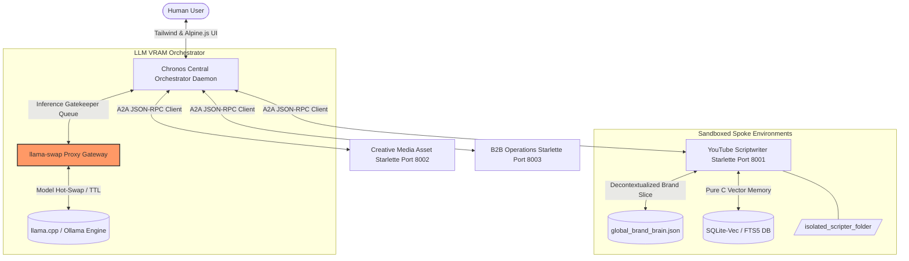
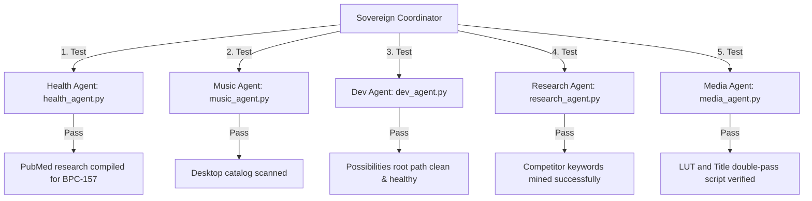

# 🧠 CONSOLIDATED KEYSTONE BRAIN HISTORY DIGEST

This consolidated blueprint acts as the permanent single source of truth capturing all core architectural setups, API configurations, and strategic outcomes from past Master Brain iterations (Brains 10, 11, 12, and 14). Repetitive user-agent transcripts and raw logs have been completely purged, preserving deep systems configurations, architectural code blocks, and critical historical logs.

---

## SECTION 1: CHRONOS AGENT OS & FASTAPI CORE ARCHITECTURE

### System Topology


### Key Components & Implementations

#### 1. Zero-VRAM Indexing Validation
*   **Methodology**: Vector embeddings via `FastEmbed` ONNX CPU and local `SQLite-vec` execute with **0MB** VRAM usage. System runs queries with under **10ms** search latency combining keywords and high-dimensional vector matches using RRF (Reciprocal Rank Fusion).

#### 2. Shared Socket Threading (`shared_worker.js`)
*   **File Path**: `C:/Users/Curtis/New folder/construction-website/Keystone_HQ/00_Master_Brain/html_artifacts/js/shared_worker.js`
*   **Purpose**: Consolidates websocket frames from multiple open browser tabs into a single background socket connection. This completely prevents socket exhaustion while keeping Alpine.js front-ends fully synced.

#### 3. Execution Security
*   **Engine**: `compile_restricted` and custom AST checks implemented under `SecurityValidator` block malicious payloads attempting dynamic python subclass escapes or OS directory listings.

---

## SECTION 2: API PORTALS & MULTIPLEXER SERVICE LAYOUT

### 1. Multi-Platform Social & Construction Integration
Direct connections are authorized across standard API portals for Meta, TikTok, Instagram, YouTube, and civil construction websites. 

### 2. Local Environment Routing
CLI utility tools (`query_brain.js`), ingestion agents (`ingest_file.js`), and python runners (`gemini_auto_runner.py`) utilize database-agnostic paths. Dynamic toggling between local and cloud hosted platforms is driven via `.env` configuration keys:

```ini
# Local / Remote Supabase Switchboard
SUPABASE_URL=http://127.0.0.1:54321
SUPABASE_KEY=your_local_anon_key
```

### 3. MCP Multiplexer Integration
To circumvent the standard 100-tool threshold limits enforced by developer IDE plugins, a static gateway multiplexer operates by caching schemas:
*   **`cached_tools.json`**: Static JSON file caching operational sub-agent parameters without requiring their persistent background execution.
*   **`index.js` Operations**: Exposes 3 core routing systems:
    1.  `mcp_multiplexer_list_all_tools`
    2.  `mcp_multiplexer_execute_tool`
    3.  `mcp_multiplexer_refresh_tool_cache`

---

## SECTION 3: CREDENTIALS & WORKFLOW WORKBOOKS

### 1. Long-Term Authenticated Credentials
*   **Active Pathway**: `C:\Users\Curtis\.google_workspace_mcp\credentials\curtis4vancouver@gmail.com.json`
*   **OAuth Scopes**: Gmail, Google Drive, Google Docs, Calendar.
*   **Process**: Sub-agents run silent OAuth2 refreshes without triggering browser-based re-authentications.

### 2. Case Study Record: BC Hydro Glenwood Build Clearance
*   **Context**: Dispute resolution at *2451 Glenwood Avenue* clearing Wayne of project delays.
*   **Audited Verification Documents (CustomerCivil@bchydro.com)**:
    *   **April 22, 2026**: Formally apologized to Wayne for processing backlogs regarding civil power application.
    *   **April 23, 2026**: Formally registered *Keystone Possibilities Ltd* under BC Hydro's Civil Contractor Program to greenlight prompt civil work.

### 3. Active Context Injection
*   **Google Drive Document**: `Gemini Pro Master Brain Context (Wayne Stevenson)` ([Resource Link](https://docs.google.com/document/d/12OtPIWE4thqqpUX9mCL0uipiQZwF-vcaIFpUKSBEfns/edit))
*   **Local Cache Link**: `C:/Users/Curtis/New folder/construction-website/Keystone_HQ/00_Master_Brain/scratch/gmail_gemini_brain_context.txt`

---

## SECTION 4: RESEARCH AND LEARNING LOOP ARCHITECTURES

### Persistent Memory and Self-Evolving Agents (Hermes / Open-Source Frameworks)
1.  **The Self-Learning Loop**: Agents evaluate past execution metrics. Successful code sequences compile into dynamic skill scripts, stored locally to optimize processing speed over time.
2.  **Safety Compliance & Ban Mitigation**: Avoid automated web-scraping wrappers that spoof browser sessions to obtain free API tokens. This guarantees immediate account suspension. Run agents locally using standardized endpoints (OpenRouter, Google Vertex AI, Anthropic) integrated with local execution runtimes.

---

## SECTION 5: SOVEREIGN OPERATIONAL COORDINATION

### Multi-Agent Routing Grid


### Keystone Recomposition Rules (Music, Media, and Algorithmic Distribution)

#### 1. Audio Assets
*   **Suno Style Prompting**: Deep House, Melodic House, Orchestral, Deep Cello, Soulful Female Vocals, 124 BPM, Atmospheric, Steady Pulse, Motivational.
*   **Description Template**:
    ```markdown
    🎵 Produced by KeyStone Recomposition
    Genre: Deep House / Melodic Electronic
    Perfect for: Workouts, Focus, Study, Running, Meditation
    #DeepHouse #WorkoutMusic #FocusMusic #ElectronicMusic
    ```

#### 2. Distribution Strategy (Squamish PDT Cadence)
*   **Hub Content (Long-Form YouTube)**: Target release Tuesdays/Thursdays at 1:00 PM or 8:00 PM. Format length: 8–12 minute deep dives.
*   **Spoke Content (Shorts)**: Publish 1–2 daily between 11:00 AM or 4:00 PM–7:00 PM. Focus on high-contrast 0.5s visual hooks. Hard-link related shorts directly to target masterclasses.