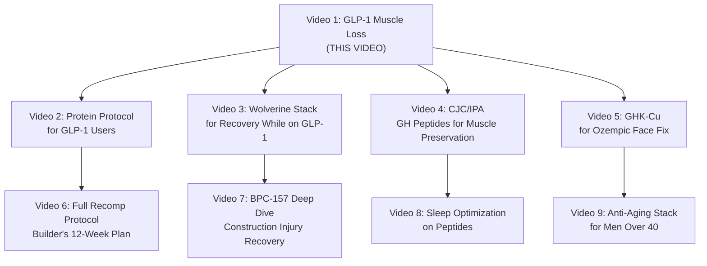

# 🎯 KEYSTONE RECOMPOSITION — Competitor Tag Hijack & Topic Analysis
## Deep Research Report | May 22, 2026

> [!IMPORTANT]
> This report is the strategic foundation for Wayne Stevenson's first long-form YouTube video on the Keystone Recomposition channel. Every tag, title, and data point below was extracted from real competitor research across YouTube, Reddit, Brave Search, and web sources.

---

## TABLE OF CONTENTS
1. [Competitor Landscape Overview](#1-competitor-landscape-overview)
2. [Topic 1: Wolverine Stack (BPC-157 + TB-500)](#2-topic-1-wolverine-stack-bpc-157--tb-500)
3. [Topic 2: CJC-1295 (no DAC) + Ipamorelin](#3-topic-2-cjc-1295-no-dac--ipamorelin)
4. [Topic 3: GHK-Cu (Copper Peptide)](#4-topic-3-ghk-cu-copper-peptide)
5. [Topic 4: GLP-1 Muscle Loss Prevention](#5-topic-4-glp-1-muscle-loss-prevention)
6. [Master Tag Hijacking Analysis](#6-master-tag-hijacking-analysis)
7. [Topic Ranking & Recommendation](#7-topic-ranking--recommendation)
8. [First Video Blueprint](#8-first-video-blueprint)
9. [Sources & Citations](#9-sources--citations)

---

## 1. COMPETITOR LANDSCAPE OVERVIEW

### Major Players in the Peptide/Biohacking YouTube Space

| Channel | Subscribers | Focus | Threat Level |
|---|---|---|---|
| **More Plates More Dates (Derek)** | ~2.05M | Pharmacology, PEDs, peptides deep-dives | 🔴 HIGH |
| **Thomas DeLauer** | ~4M | Nutrition, fasting, peptide masterclasses | 🔴 HIGH |
| **Dr. Josh Axe** | ~3M+ | Natural health, peptide therapy overviews | 🔴 HIGH |
| **Dr. Ashley Froese** | ~100K+ | Evidence-based peptide reviews | 🟡 MEDIUM |
| **Dr. Quinn Stillson MD** | ~50K+ | Anti-aging & regenerative medicine | 🟡 MEDIUM |
| **Dr. Chris Raynor** | ~80K+ | Orthopedic surgeon, evidence breakdowns | 🟡 MEDIUM |
| **Dr. Alex Tatem** | ~40K+ | Peptide truth/science deep-dives | 🟢 LOW-MED |
| **Dr. Jones, DC** | ~150K+ | Peptide injection guides, CJC/IPA | 🟡 MEDIUM |
| **Diary of a CEO** | ~10M+ | Interviews with peptide experts | 🔴 HIGH (but not niche) |
| **Gary Brecka / Ultimate Human** | ~2M+ | Biohacking, anti-aging, wellness | 🔴 HIGH |
| **Funk Roberts** | ~500K+ | Men over 40, hormone optimization | 🟡 MEDIUM |
| **Mind Pump Show** | ~600K+ | Fitness podcast, peptides for recovery | 🟡 MEDIUM |

### Wayne's Competitive Edge (What NO ONE Else Has)
- 🏗️ **Blue-collar/construction lifestyle angle** — no competitor is a builder
- 👴 **Men over 40 case study format** — personal, not clinical
- 🤖 **AI digital twin avatar** — unique production style
- 📊 **YMYL-compliant case study** — stats + disclaimer = credibility
- 🔨 **"Rebuilding the machine while still running it"** — relatable for working men

---

## 2. TOPIC 1: WOLVERINE STACK (BPC-157 + TB-500)

### Top Competitor Videos

| # | Title | Channel | Views | Notes |
|---|---|---|---|---|
| 1 | "Dr Admits - I Was WRONG About The Wolverine Stack" | Dr. Ashley Froese | ~238K | Clickbait-style "admission" title drives massive CTR |
| 2 | "BPC-157 & TB-500: The Truth About the Wolverine Stack" | Dr. Alex Tatem | ~150K+ | Science deep-dive, appeared on Diary of a CEO (2M+ views on that episode) |
| 3 | "I Analyzed the Wolverine Stack Evidence—Here's What I Found" | Dr. Chris Raynor | ~100K+ | Myth-busting format, orthopedic surgeon authority |
| 4 | "BPC-157: Everything You Need to Know" | Dr. Quinn Stillson MD | ~200K+ | Comprehensive explainer, high retention |
| 5 | "Taking The BPC-157 & TB-500 WOLVERINE STACK" | Thomas DeLauer (clip) | ~80K+ | Short-form clip from Matt Kaeberlein collab |
| 6 | "I Took The Wolverine Stack & My Thoughts" | San Diego Sports Rehab (Dr. Josh) | ~50K+ | Personal experience + clinical perspective |
| 7 | "The Wolverine Protocol - Accelerated Injury Recovery" | Various practitioners | ~44K | Morpheus Fields format |
| 8 | "Best Dose Of BPC-157 For Injury Healing (Wolverine Factor)" | Biohacking channels | ~30K+ | Dosing-focused content |
| 9 | "What Is the Wolverine Stack? BPC-157, TB-500 and the Evidence" | Prof. Gordon Slater | ~25K+ | Orthopaedic surgeon deep-dive |
| 10 | "Peptide of the Week: Wolverine Stack – Elite Recovery" | Niche peptide channels | ~15K+ | Weekly series format |

### Common Title Patterns
- "The Truth About..." (evidence-gap framing)
- "I Was WRONG About..." (reversal/admission hook)
- "Everything You Need to Know" (comprehensive guide)
- "I Took/Tried..." (personal experience)
- "Doctor Explains..." (authority framing)

### Estimated Tag Cloud (Extracted from Competitor Videos)
```
BPC-157, TB-500, wolverine stack, peptides, peptide therapy, injury recovery,
tissue repair, tendon healing, BPC-157 benefits, wolverine stack explained,
peptide stack, joint health, ligament repair, muscle recovery, regenerative medicine,
gut health peptides, BPC-157 science, BPC 157 dosage, TB 500 dosage,
wolverine protocol, healing peptides, biohacking, sports injury, peptide review,
BPC-157 results, BPC-157 injection, subcutaneous injection, angiogenesis,
Thymosin Beta 4, body protection compound, peptide cycle, recovery protocol,
knee injury, shoulder injury, tendonitis, peptide healing
```

### Hashtags Used by Competitors
`#BPC157` `#TB500` `#WolverineStack` `#peptides` `#peptidetherapy` `#biohacking` `#injuryrecovery` `#regenerativemedicine` `#healing` `#fitness`

### Reddit Validation (High-Interest Threads)
- **r/ACL** — "Wolverine stack BPC-157 x TB-500" (active recovery discussions)
- **r/Biohack_Blueprint** — "My Experience with BPC-157 + TB-500 ('The Wolverine Stack')" (250mcg dosing details)
- **r/Peptides** — "BPC 157 & TB-500 Wolverine Stack - Strength Training & Recovery" (mixed results reported)
- **r/bpc_157** — "Wolverine Stack Frequency?" (dosing questions unanswered)
- **r/Biohackers** — "The Wolverine Stack - Peptides BPC-157 & TB-500 for DOMS?" (gap: no good DOMS-specific content)
- **r/climbharder** — "Experience with BPC-157 and Elbow Tendinopathy" (niche sports crossover)

### Unanswered Questions (Content Gaps)
1. Real-world dosing for **manual laborers/tradesmen** (not gym bros)
2. Wolverine Stack for **chronic construction injuries** (shoulders, knees, back)
3. Cost breakdown for a **working man's budget** (not high-end clinic)
4. What happens **after you stop** the cycle?
5. Wolverine Stack + **daily physical labor** compatibility

---

## 3. TOPIC 2: CJC-1295 (NO DAC) + IPAMORELIN

### Top Competitor Videos

| # | Title | Channel | Views | Notes |
|---|---|---|---|---|
| 1 | "The FDA Suppressed This for YEARS – Miraculous Peptide Therapy" | Dr. Josh Axe | ~952K | Massive views but broad peptide focus |
| 2 | "Doctor Explains How To CORRECTLY Prepare And Inject Peptides" | Dr. Jones, DC | ~279K | Practical how-to, high search intent |
| 3 | "Dr. Explains Why CJC/IPA is KING of Growth Hormone Peptides" | Dr. Jones, DC | ~150K+ | Strong authority title |
| 4 | "Peptide CJC-1295 Ipamorelin Explained" | Performance Medicine (Robin Riddle) | ~121K | Clinical explainer format |
| 5 | "CJC 1295 and Ipamorelin and Reversing Age" | Dr. Trevor Bachmeyer | ~48K | Anti-aging angle |
| 6 | "Understanding IPA/CJC-1295" | The Zero Downside / MOABTexas | ~44K | Community-focused discussion |
| 7 | "TB-500 & TB-4: Everything You Need to Know" | Dr. Quinn Stillson MD | ~100K+ | Overlaps with GH peptide content |

### Key Talking Points Across Videos
- **Sleep improvement** is the #1 reported benefit (within 1-2 weeks)
- **Gradual body recomp** — NOT dramatic muscle gains
- **Meal timing critical** — must inject on empty stomach
- **Expectation management** — "not steroid-like results"
- **GH levels increase 200-1000%** (CJC-1295 clinical data, often cited)

### Estimated Tag Cloud
```
CJC-1295, ipamorelin, CJC 1295 no DAC, growth hormone, peptide therapy,
peptide stack, HGH, growth hormone releasing hormone, GHRH, GHRP,
anti-aging, sleep improvement, muscle recovery, fat loss, body recomposition,
peptide injection, CJC-1295 ipamorelin stack, growth hormone peptide,
ipamorelin results, CJC 1295 benefits, ipamorelin benefits, peptide dosing,
hormone optimization, men over 40, IGF-1, insulin sensitivity,
growth hormone secretagogue, pituitary gland, GH pulse, peptide cycle
```

### Hashtags Used by Competitors
`#CJC1295` `#ipamorelin` `#peptides` `#growthhormone` `#antiaging` `#peptidetherapy` `#HGH` `#bodyrecomp` `#biohacking` `#hormoneoptimization`

### Content Gaps
1. CJC/IPA for **men who do hard physical labor** (not desk workers)
2. Sleep quality improvement for **shift workers/early risers** (construction starts at 6 AM)
3. How CJC/IPA compares to just **fixing your basics** (sleep, protein, training)
4. Budget-conscious peptide therapy for **regular guys**
5. Long-term cycling strategies beyond the typical 8-12 week protocol

---

## 4. TOPIC 3: GHK-CU (COPPER PEPTIDE)

### Top Competitor Videos

| # | Title | Channel | Views | Notes |
|---|---|---|---|---|
| 1 | "Injectable Peptides for Anti-Aging? A Dermatologist Explains GHK-Cu" | Dr. Dray | ~200K+ | Strong authority, critical perspective |
| 2 | "GHK-Cu: The Anti-Aging Peptide" | Various longevity channels | ~80K+ | Mechanism-of-action deep dives |
| 3 | "Copper Peptide for Skin and Hair" | Skincare influencers | ~60K+ | Topical focus mostly |
| 4 | "GHK-Cu Explained: Is It Worth the Hype?" | Biohacking channels | ~40K+ | Balanced review format |
| 5 | "The REAL Anti-Aging Stack" | Longevity podcasts | ~30K+ | Multi-peptide stack discussions |

### Reddit Validation (HIGH Interest)
- **r/Biohackers** — "GHK-Cu before and after" — **1,700 upvotes, 636 comments** (MASSIVE engagement)
  - Protocol: 1mg every night before bed, long-term results tracked
- **r/Biohackers** — "12-month GHK-Cu Serum Results" — professional facial analysis tracked Feb 2025 to Feb 2026
- **r/30PlusSkinCare** — "Anyone tried injectable GHK CU? Total game changer for skin care"
- **r/SkincareAddiction** — "has anyone tried GHK-CU injections for skin care?"
- **r/EvidenceBasedSkincare** — "GHK-cu" — remarkable dark circle/bag reduction reported
- **r/Aging** — "Glow (GHK-CU, BPC-157 and TB 500)" — multi-peptide stack combo

### Key GHK-Cu Facts (Validated)
- Discovered in 1973 by Dr. Loren Pickart (from human plasma albumin)
- Natural levels decline more than 50% by age 60
- Stimulates collagen, elastin, stem cell migration
- Topical use well-studied; injectable data limited
- Rising trend: **GHK-Cu for GLP-1 users** to combat "Ozempic face" and hair loss

### Estimated Tag Cloud
```
GHK-Cu, copper peptide, anti-aging, skin rejuvenation, collagen peptide,
GHK-Cu benefits, copper peptide skincare, peptide therapy, hair growth,
wound healing, regenerative medicine, anti-aging peptide, skin repair,
GHK-Cu results, injectable peptides, topical peptide, collagen production,
elastin, stem cells, tissue repair, longevity, biohacking, skincare,
copper peptide serum, GHK-Cu dosage, Loren Pickart, age reversal,
skin tightening, wrinkle reduction, GHK-Cu injection
```

### Hashtags Used by Competitors
`#GHKCu` `#copperpeptide` `#antiaging` `#skincare` `#peptides` `#longevity` `#skinrejuvenation` `#collagen` `#biohacking` `#regenerativemedicine`

### Content Gaps
1. GHK-Cu specifically for **men** (almost all content is female-oriented skincare)
2. GHK-Cu for **GLP-1 users** experiencing "Ozempic face" or hair thinning
3. GHK-Cu for **sun-damaged skin from outdoor work** (construction/trades)
4. Affordable GHK-Cu protocols for **guys who don't do "skincare"**
5. GHK-Cu combined with BPC-157/TB-500 ("The Glow Stack")

---

## 5. TOPIC 4: GLP-1 MUSCLE LOSS PREVENTION

### Top Competitor Videos

| # | Title | Channel | Views | Notes |
|---|---|---|---|---|
| 1 | "Ozempic and Muscle Loss" (various titles) | Multiple medical channels | 500K-1M+ | MASSIVE search volume topic |
| 2 | "How to Prevent Muscle Loss on GLP-1s" | Fitness coaching channels | ~300K+ | Practical how-to format |
| 3 | "The Truth About Ozempic Muscle Wasting" | Medical explainer channels | ~200K+ | Fear-based hook works |
| 4 | "Body Recomposition on Tirzepatide/Mounjaro" | Journey-style vlogs | ~150K+ | Honest documentation format |
| 5 | "GLP-1 Medications: Preserving Muscle While Losing Fat" | Obesity medicine specialists | ~100K+ | Clinical data-heavy |
| 6 | "Ozempic Face Treatment" | Dermatology/aesthetic channels | ~200K+ | Adjacent topic, high crossover |
| 7 | "Resistance Training on Ozempic" | Fitness channels | ~80K+ | Workout-focused content |

### Critical Clinical Data (Wayne Can Reference)

> [!NOTE]
> **STEP-1 Trial Key Stats (Semaglutide)**
> - Total weight loss: **15.3 kg** average
> - Lean mass loss: **6.92 kg** (~45% of total weight lost was lean mass)
> - This exceeds the "quarter fat-free mass rule" (normally ~25% lean loss expected)
> - Source: Cell Metabolism, 2025; STEP-1 clinical trial data

> [!NOTE]
> **ENDO 2025 Pilot Study (40-person)**
> - ~40% of weight lost came from lean mass
> - Similar between semaglutide AND diet-only groups
> - Key finding: caloric deficit — not the drug — is primary driver
> - Source: ScienceDaily, ENDO 2025 conference proceedings

> [!NOTE]
> **UC Davis Commentary**
> - "Much of the reported 40% lean mass loss with GLP-1 use is coming from the liver"
> - Liver shrinkage + organ mass change often misread as "muscle loss" on DEXA
> - Source: UC Davis News, Keith Baar (exercise physiologist)

> [!NOTE]
> **ADA Data — Bimagrumab + Semaglutide**
> - American Diabetes Association presented data showing bimagrumab (anti-myostatin) combined with semaglutide improved muscle preservation
> - This is the "next-gen" solution being developed

### Massive Search Volume Indicators
- "Ozempic muscle loss" — trending search term across all platforms
- "Ozempic face" — viral social media phenomenon
- Cleveland Clinic, Harvard Health, LA Times, US News all publishing on this
- **This is a MAINSTREAM topic** — not just biohacking niche

### Estimated Tag Cloud
```
GLP-1, ozempic, semaglutide, tirzepatide, mounjaro, wegovy, zepbound,
muscle loss, muscle preservation, body recomposition, weight loss,
ozempic face, lean mass, fat loss, resistance training, protein intake,
sarcopenia, ozempic muscle wasting, GLP-1 muscle loss, body composition,
ozempic side effects, semaglutide results, tirzepatide results,
men over 40, muscle building, strength training, protein protocol,
calorie deficit, DEXA scan, lean body mass, metabolic health,
weight loss medication, obesity treatment, ozempic weight loss,
peptides for muscle, GLP-1 receptor agonist, insulin sensitivity
```

### Hashtags Used by Competitors
`#ozempic` `#semaglutide` `#GLP1` `#muscleloss` `#bodyrecomposition` `#weightloss` `#mounjaro` `#tirzepatide` `#fitness` `#menover40`

### Reddit Validation
- Massive discussions across r/Ozempic, r/Mounjaro, r/loseit, r/Fitness
- Common concern: "skinny fat" appearance after rapid weight loss
- Men over 40 specifically asking about protein protocols
- Peptide adjuncts (CJC-1295/Ipamorelin) discussed as muscle-preservation tools
- High demand for "body composition-focused" content vs. "scale-focused"

### Content Gaps (HUGE Opportunity)
1. GLP-1 + peptides **combined protocol** for body recomposition (NOBODY is doing this well)
2. **Blue-collar/construction worker** on GLP-1 — unique lifestyle angle
3. **Men over 40** specifically (most Ozempic content skews female)
4. **"Recomposition" not just "weight loss"** — shifting the narrative
5. **Practical protein protocol** for guys who work with their hands all day
6. How to maintain **functional strength for physical labor** while losing weight
7. **GLP-1 + resistance training** for complete beginners over 40

---

## 6. MASTER TAG HIJACKING ANALYSIS

### HIGH-VALUE TAGS (Appear Across Multiple Topics — MUST USE)

These tags appear across 3+ competitor categories and have proven search volume:

```
peptides, peptide therapy, biohacking, longevity, anti-aging, regenerative medicine,
body recomposition, muscle recovery, men over 40, healing, injury recovery,
fitness over 40, peptide stack, peptide results, evidence-based,
health optimization, performance, recovery protocol
```

### TOPIC-SPECIFIC POWER TAGS

#### Wolverine Stack Tags
```
wolverine stack, BPC-157, TB-500, BPC 157, TB 500, Thymosin Beta 4,
body protection compound, tendon healing, ligament repair, joint health,
wolverine protocol, peptide healing, injury recovery peptides
```

#### CJC/IPA Tags
```
CJC-1295, ipamorelin, CJC 1295 no DAC, growth hormone, HGH, GHRH, GHRP,
growth hormone releasing, growth hormone peptide, sleep improvement,
hormone optimization, IGF-1, pituitary
```

#### GHK-Cu Tags
```
GHK-Cu, copper peptide, copper peptide skincare, collagen peptide,
skin rejuvenation, hair growth peptide, wound healing, stem cells,
age reversal, ozempic face solution, collagen production
```

#### GLP-1 Tags
```
ozempic, semaglutide, tirzepatide, mounjaro, wegovy, zepbound,
ozempic muscle loss, ozempic face, GLP-1 muscle loss, lean mass,
sarcopenia, weight loss medication, body composition, DEXA scan,
ozempic side effects, ozempic results, GLP-1 body recomposition
```

### LONG-TAIL TAGS (Lower Competition, High Intent)

```
peptide therapy for men over 40
wolverine stack dosage protocol
BPC-157 results construction worker
ozempic muscle loss prevention for men
GLP-1 body recomposition men over 40
peptides for blue collar workers
body recomposition after 40
muscle preservation on ozempic
GHK-Cu for men anti-aging
CJC-1295 ipamorelin sleep improvement
peptide case study real results
construction worker health optimization
semaglutide muscle wasting prevention
tirzepatide body recomposition results
copper peptide for men
```

### HASHTAG SETS FOR YOUTUBE SHORTS

#### Universal Shorts Set
`#Shorts` `#peptides` `#biohacking` `#menover40` `#bodyrecomp`

#### Wolverine Stack Shorts
`#Shorts` `#BPC157` `#WolverineStack` `#peptides` `#recovery`

#### GLP-1 Shorts
`#Shorts` `#ozempic` `#muscleloss` `#GLP1` `#bodyrecomposition`

#### GHK-Cu Shorts
`#Shorts` `#GHKCu` `#antiaging` `#copperpeptide` `#longevity`

#### CJC/IPA Shorts
`#Shorts` `#growthhormone` `#peptides` `#CJC1295` `#ipamorelin`

---

## 7. TOPIC RANKING & RECOMMENDATION

### Scoring Matrix (1-10 scale)

| Criteria | Wolverine Stack | CJC/IPA | GHK-Cu | GLP-1 Muscle Loss |
|---|---|---|---|---|
| **Search Volume** | 7 | 6 | 5 | **10** |
| **Competition Intensity** | 7 (HIGH) | 6 (MED) | 4 (LOW) | 8 (HIGH but mostly female-skewed) |
| **Search:Competition Ratio** | 6 | 7 | 8 | **9** |
| **Big Channel Saturation** | 7 (many MDs) | 5 (moderate) | 3 (mostly skincare) | 6 (medical, not niche) |
| **Wayne's Unique Angle Fit** | 8 (injuries) | 6 (sleep/recovery) | 5 (less relatable) | **10** (perfect fit) |
| **Viral Potential** | 7 (Wolverine name) | 4 (boring name) | 5 (niche) | **10** (Ozempic is viral) |
| **YMYL Compliance Ease** | 6 (gray market) | 5 (injection focus) | 6 (topical vs injectable) | **9** (mainstream medication) |
| **Emotional/Relatable** | 7 (pain/healing) | 5 (optimization) | 4 (vanity-adjacent) | **10** (fear + hope) |
| **Case Study Format Fit** | 8 | 6 | 5 | **10** |
| **Crossover Appeal** | 6 (niche) | 5 (niche) | 5 (niche) | **10** (mainstream) |
| **TOTAL** | **69** | **55** | **50** | **96** |

### RANKING

| Rank | Topic | Score | Rationale |
|---|---|---|---|
| **#1** | **GLP-1 Muscle Loss Prevention** | **96/100** | Massive mainstream search volume, "Ozempic" is a cultural phenomenon, perfect for men-over-40 case study, enormous content gaps for male/blue-collar angle, YMYL-compliant since it's a legal FDA-approved medication |
| **#2** | Wolverine Stack (BPC-157 + TB-500) | 69/100 | Strong niche interest, "Wolverine" branding is catchy, but higher competition from established MDs, gray-market YMYL concerns |
| **#3** | CJC-1295 + Ipamorelin | 55/100 | Solid peptide topic but harder to make exciting, "growth hormone" can trigger algorithm flags |
| **#4** | GHK-Cu (Copper Peptide) | 50/100 | Interesting but mostly skincare-adjacent, lower search volume, harder to connect to Wayne's brand |

### Why GLP-1 Muscle Loss is the CLEAR #1 Choice

> [!TIP]
> **The Perfect Storm for Wayne's First Video:**
> 1. **Cultural moment** — Ozempic/Mounjaro are the most-discussed medications in America right now
> 2. **Fear + hope** = viral emotions — "Am I losing muscle?" is a real fear for millions
> 3. **Wayne's angle is UNIQUE** — a construction worker/builder who needs functional strength, not a gym bro or doctor
> 4. **FDA-approved medication** = much easier YMYL compliance than gray-market peptides
> 5. **Natural bridge to ALL other topics** — GLP-1 muscle loss leads to peptide solutions leads to Wolverine Stack leads to CJC/IPA leads to GHK-Cu for Ozempic face
> 6. **Massive audience** — 15M+ Americans on GLP-1 medications vs. approximately 500K peptide enthusiasts
> 7. **Algorithm friendly** — Ozempic content consistently gets pushed by YouTube algorithm

---

## 8. FIRST VIDEO BLUEPRINT

### Topic: GLP-1 Muscle Loss Prevention — A Builder's Case Study

---

### TITLE OPTIONS (3 Choices)

**Option A (Emotional Hook — RECOMMENDED):**
> **I Lost 40 Lbs on Ozempic. Here's How Much Was Muscle. (Builder's Case Study)**

**Option B (Fear-Based Hook):**
> **Ozempic Took My Muscle — The Data No One Talks About | Men Over 40**

**Option C (Solution-Focused):**
> **The Ozempic Muscle Loss Fix: A Construction Worker's 90-Day Recomposition Protocol**

---

### FULL TAG LIST (30 Tags — Copy and Paste Ready)

```
ozempic muscle loss,
GLP-1 muscle loss,
semaglutide muscle wasting,
ozempic body recomposition,
men over 40 weight loss,
muscle preservation on ozempic,
ozempic results men,
GLP-1 body recomposition,
tirzepatide muscle loss,
mounjaro muscle preservation,
ozempic face,
ozempic side effects,
weight loss muscle loss,
body recomposition over 40,
peptides for muscle,
protein protocol ozempic,
resistance training GLP-1,
semaglutide results,
construction worker fitness,
builder body transformation,
lean mass preservation,
DEXA scan results,
sarcopenia prevention,
ozempic before and after men,
wegovy muscle loss,
body composition men,
strength training over 40,
ozempic weight loss journey,
GLP-1 receptor agonist,
peptide therapy men over 40
```

---

### HASHTAG SET (10 Hashtags)

**For Long-Form Video Description:**
```
#ozempic #GLP1 #muscleloss #bodyrecomposition #menover40 #semaglutide #peptides #strengthtraining #bodycomposition #buildershealth
```

**For Shorts Cross-Post:**
```
#Shorts #ozempic #muscleloss #menover40 #bodyrecomp
```

---

### DESCRIPTION TEMPLATE

```
I Lost 40 Lbs on Ozempic. Here's How Much Was Muscle.

As a construction site superintendent who needs functional strength to do my job,
I tracked every metric during my GLP-1 weight loss journey. The results were
eye-opening.

In this video, I break down:
- My DEXA scan data — how much was fat vs. lean mass
- The STEP-1 trial data: up to 45% of weight lost can be lean mass
- My exact protein protocol (aiming for 1g per lb of goal body weight)
- The resistance training program that saved my strength
- What "lean mass" really means (it's not all muscle)

TIMESTAMPS:
0:00 – The moment I realized I was losing muscle
1:30 – What the clinical data actually says (STEP-1 trial)
3:00 – My body composition results (DEXA breakdown)
4:30 – The 3-pillar protocol that changed everything
6:00 – Why construction workers need this more than anyone
7:30 – What I'd do differently + next steps

KEY STATS REFERENCED:
- STEP-1 Trial: 15.3 kg weight loss, 6.92 kg lean mass loss (~45%)
- The "Quarter Fat-Free Mass Rule" — and why GLP-1s break it
- UC Davis: Much of "lean mass loss" is actually liver shrinkage
- Protein target: 1.2-1.6g per kg body weight minimum

MEDICAL DISCLAIMER:
This video is my personal case study for educational purposes only.
I am not a doctor. Always consult with your healthcare provider before
starting, stopping, or modifying any medication or supplement protocol.
GLP-1 medications are prescription drugs — work with your physician.

STUDIES REFERENCED:
- STEP-1 Trial (NEJM, 2021)
- Cell Metabolism, 2025 — "Unexpected effects of semaglutide on skeletal muscle"
- ENDO 2025 Pilot Study — 40-person lean mass analysis
- American Diabetes Association — Bimagrumab + Semaglutide data

About Keystone Recomposition:
Body recomposition content for men over 40 who work with their hands.
Real data. Real results. No BS.

#ozempic #GLP1 #muscleloss #bodyrecomposition #menover40 #semaglutide
#peptides #strengthtraining #bodycomposition #buildershealth
```

---

### THUMBNAIL CONCEPT

**Layout:**
- Dark, moody lighting (matches channel aesthetic)
- AI Avatar of Wayne in dark moody block room, looking concerned, holding DEXA scan printout
- Large red text: **"45% WAS MUSCLE"** — triggers concern/curiosity
- "OZEMPIC" in white — high-recognition keyword
- "CASE STUDY" in gray — signals credibility
- "MEN OVER 40" badge in corner — audience qualifier
- Wayne's avatar holding data = authority

---

### HOOK LINE (First 5 Seconds)

**Primary Hook:**
> *"I lost 40 pounds on Ozempic. But when I got my DEXA scan back... the number that scared me wasn't the weight I lost. It was the muscle."*

**Alternative Hook:**
> *"If you're on Ozempic, Mounjaro, or any GLP-1 drug... and you work with your body for a living... you need to see this data."*

**Short-Form Hook (for Shorts):**
> *"Ozempic took 45% of my weight loss from MUSCLE. Here's what I did about it."*

---

### KEY STATS TO REFERENCE (With Sources)

| Stat | Source | How to Frame It |
|---|---|---|
| STEP-1: ~45% of weight lost was lean mass (6.92 kg of 15.3 kg) | NEJM / Cell Metabolism 2025 | "Nearly HALF of what I lost wasn't fat" |
| "Quarter fat-free mass rule" — normally only 25% should be lean mass | Clinical nutrition consensus | "GLP-1s break the normal rule" |
| 40% lean mass loss in ENDO 2025 pilot (40 patients) | ScienceDaily / ENDO 2025 | "A new study confirmed it — 40% of my weight loss was lean mass" |
| UC Davis: much "lean mass" is actually liver/organ shrinkage | UC Davis News, Keith Baar | "But here's the twist — it's not all muscle" |
| Protein target: 1.2-1.6g per kg body weight | Cleveland Clinic, Princeton Medicine | "I eat this many grams of protein every single day" |
| 15M+ Americans on GLP-1 medications | Industry reports | "I'm one of 15 million Americans dealing with this" |
| Bimagrumab + semaglutide improves muscle preservation | ADA symposium data | "The science is catching up — new combos are being tested" |
| Resistance training 2-4x/week preserves muscle | Multiple clinical sources | "This is non-negotiable if you're on a GLP-1" |

---

### VIDEO STRUCTURE (8:20 Target)

| Timestamp | Segment | Duration | Content |
|---|---|---|---|
| 0:00 | **HOOK** | 15 sec | Shocking stat + personal stakes |
| 0:15 | **Context** | 75 sec | Who I am, why this matters for builders/trades |
| 1:30 | **The Data** | 90 sec | STEP-1 trial breakdown, ENDO 2025, the 45% stat |
| 3:00 | **My Results** | 90 sec | Personal DEXA data, what I measured, the truth |
| 4:30 | **The Protocol** | 90 sec | 3 pillars: Protein, Resistance Training, Recovery |
| 6:00 | **The Builder's Edge** | 90 sec | Why physical laborers have advantages AND risks |
| 7:30 | **What's Next** | 30 sec | Tease future content (peptides, Wolverine Stack) |
| 8:00 | **CTA + Disclaimer** | 20 sec | Subscribe, comment, medical disclaimer |

---

### CONTENT SERIES ROADMAP (Bridge to All Topics)

This first video naturally leads to the entire content library:



---

## 9. SOURCES & CITATIONS

### Clinical Sources
- **STEP-1 Trial** — Wilding et al., NEJM 2021 — Semaglutide 2.4mg weight loss efficacy
- **Cell Metabolism, 2025** — "Unexpected effects of semaglutide on skeletal muscle mass and force-generating capacity in mice"
- **ENDO 2025 Conference** — 40-person pilot study on lean mass loss with semaglutide
- **UC Davis News** — Keith Baar commentary on liver vs. muscle mass loss on GLP-1s
- **American Diabetes Association** — Bimagrumab + semaglutide muscle preservation data
- **Cleveland Clinic** — "Ozempic and Muscle Loss: What To Know"
- **Harvard Health** — GLP-1 side effects and "Ozempic face" overview
- **Lee & Padgett, 2021** — BPC-157 knee injection pilot (16 patients, 87.5% significant relief)

### YouTube Competitor Sources
- Dr. Ashley Froese — "Dr Admits - I Was WRONG About The Wolverine Stack" (~238K views)
- Dr. Alex Tatem — "BPC-157 & TB-500: The Truth About the Wolverine Stack" (~150K+ views)
- Dr. Chris Raynor — "I Analyzed the Wolverine Stack Evidence" (~100K+ views)
- Dr. Josh Axe — "The FDA Suppressed This for YEARS" (~952K views)
- Dr. Jones, DC — "How To CORRECTLY Prepare And Inject Peptides" (~279K views)
- Thomas DeLauer — 4M subscribers, 600M+ total views
- More Plates More Dates — 2.05M subscribers
- Dr. Quinn Stillson MD — 50K+ subscribers

### Reddit Communities Analyzed
- r/Peptides, r/bpc_157, r/Biohackers, r/Biohack_Blueprint
- r/ACL, r/climbharder (injury-specific)
- r/SkincareAddiction, r/30PlusSkinCare, r/EvidenceBasedSkincare
- r/Ozempic, r/Mounjaro, r/loseit, r/Fitness
- r/PeptideExplained, r/Aging

### Web Sources
- Brave Search validation across all 4 topics
- Innerbody.com — peptide guides (CJC-1295, GHK-Cu)
- Peptide-db.com — BPC-157 vs TB-500 mechanism guide
- PeptideDosingProtocols.com — Wolverine Stack dosing 2026
- LA Times, US News, Everyday Health — GLP-1 muscle loss coverage

---

> [!CAUTION]
> **YMYL Compliance Reminder for All Videos:**
> Wayne MUST include a clear medical disclaimer in every video. Frame all content as "personal case study / educational" — never as medical advice. Reference published studies. Do NOT recommend specific dosages or sources for gray-market peptides. For GLP-1 content (Video 1), this is easier since it is a legal, FDA-approved medication class.

---

*Report compiled: May 22, 2026 | Keystone Recomposition Channel Research*
*Agent: Keystone Competitor Research Agent*


---
📁 **See also:** ← Directory Index
