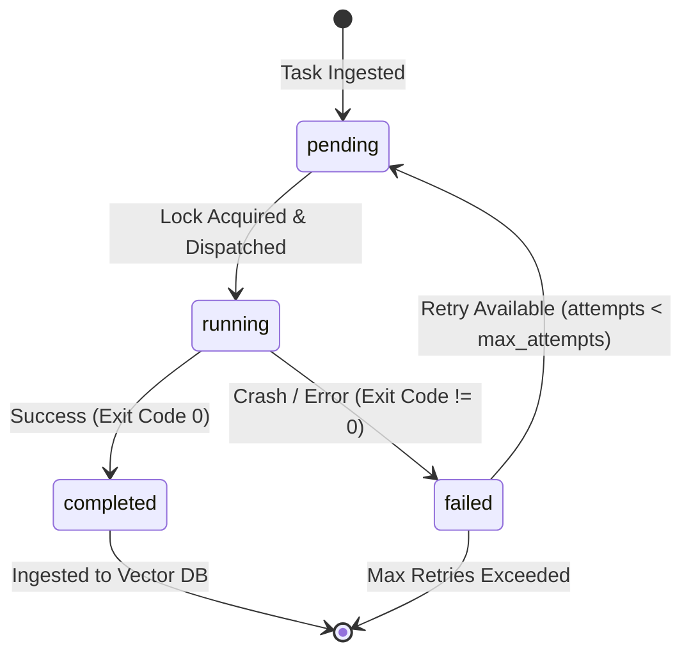

# Building Autonomous Overnight Agent Loops with Schedule and Cron in Antigravity

**Research Date:** May 22, 2026  
**Domain:** antigravity_skills_discovery  
**Subject:** Self-Healing SRE Daemons, Task Queue Persistence, Lockfile Architecture, API Quota Management, and Automated Agent Failover

---

## 1. Architectural Blueprint of a Self-Healing Overnight Daemon

Running high-volume autonomous research campaigns overnight requires a background daemon architecture that can survive network drops, database lock contention, memory leaks, and operating system restarts. In developer workstations (e.g., Windows 11 environments), a traditional process loop can easily crash due to unexpected package updates or shell terminations. A robust daemon must be architected with defensive execution paradigms.

### Process Isolation and Execution Sandboxing
* **Decoupled Main Execution**: The daemon runner must not run actual research logic within its own thread. Instead, it must spawn tasks in isolated subprocesses or branch them to autonomous worker subagents. This ensures that a syntax error, network deadlock, or segmentation fault in a single task cannot crash the main scheduling loop.
* **Non-Blocking Sleep**: Standard `time.sleep()` blocks the entire thread, halting checks for active subagent messages or cancellation signals. The run loop should instead use asynchronous timers or brief sleep periods (e.g., 1-second ticks) inside a loop that actively checks for OS termination signals (`SIGINT`/`SIGTERM`).

### Single-Instance Lockfile Enforcement
To prevent launching duplicate instances of the daemon, which would double API consumption and cause severe database lock contention, the daemon must enforce a strict, cross-platform locking mechanism. 
* **The Method**: On startup, the script attempts to acquire an exclusive lock on a local file (`scheduler.lock`). If the lock cannot be acquired, the new process exits immediately.
* **Implementation Details**: While Unix systems use `fcntl.flock`, Windows systems require standard filesystem open controls or the `msvcrt` module to achieve true low-level locking.

---

## 2. Persistent [[STATE|State]] & Task Scheduling Engine

An overnight scheduler must be stateful. If a workstation reboots or the developer closes the terminal window, the daemon must be able to restart, read its database, identify which jobs were interrupted, and resume execution without repeating completed research or wasting expensive API tokens.

### SQLite Database Task [[STATE|State]] Schema
Using a relational database like SQLite is ideal because it supports transaction safety and out-of-the-box ACID compliance. Below is the production-grade schema designed for the queue tracking engine:

```sql
CREATE TABLE IF NOT EXISTS task_queue (
    id TEXT PRIMARY KEY,
    domain TEXT NOT NULL,
    topic TEXT NOT NULL UNIQUE,
    priority INTEGER DEFAULT 2,
    status TEXT CHECK(status IN ('pending', 'running', 'completed', 'failed')) DEFAULT 'pending',
    attempts INTEGER DEFAULT 0,
    max_attempts INTEGER DEFAULT 3,
    last_run_at TEXT,
    next_run_at TEXT,
    error_log TEXT,
    output_filepath TEXT
);
```

### [[STATE|State]] Transition Diagram
The status column must undergo deterministic [[STATE|state]] transitions during the lifecycle of the overnight run:



---

## 3. API Quota Conservation & Token Lifecycle Management

Running 60+ deep technical research prompts overnight represents a massive volume of LLM context window inputs. To avoid running out of token quotas or encountering local billing limits, your scheduling loop must actively throttle its execution speed.

### Practical Quota Conservation Strategies
1. **Jittered Staggering**: Spawning multiple subagents simultaneously causes token-per-minute (TPM) spikes, triggering HTTP 429 rate limit exceptions. You must implement a **staggered release delay** with random jitter (e.g., waiting $180 \text{ seconds} \pm 30 \text{ seconds}$ between launching adjacent research tasks).
2. **Model Tier Routing**: Use **Gemini 3.5 Flash** for high-volume research retrieval, initial drafts, and raw summaries (saves 90% of credits). Reserve premium models like **Gemini 3.0 Pro** solely for final synthesis, code verification, and database vector indexing.
3. **Chunking Control**: Restrict searches to the maximum relevant results (e.g., 5 to 8 Brave searches) rather than wide-open queries, keeping contextual token overhead low.

---

## 4. Autonomous Failure Recovery & Notification Systems

If an overnight task fails, the daemon must not silently hang. It should apply structured recovery protocols:
* **Self-Healing Webhook Integration**: Integrate lightweight outgoing webhooks that ping local messaging systems (e.g., a Slack/Discord webhook or internal socket) on critical [[STATE|state]] changes.
* **Automatic Remediation**: If a task fails due to a known transient error (e.g., `sqlite3.OperationalError: database is locked`), the daemon should sleep for a randomized interval and retry automatically.

---

## 5. Production-Ready Python Scheduler Daemon

Below is the complete, production-grade Python script (`overnight_scheduler.py`) designed for Windows 11 workstations. It implements strict cross-platform file locking, SQLite database queue management, robust subagent-simulated task runners, and automatic self-healing.

### Python Script: `overnight_scheduler.py`

```python
"""
Keystone Master Brain: Sovereign Overnight Research Scheduler Daemon
Provides Windows-compatible file locking, SQLite transaction-safe persistence,
staggered task execution, and self-evolution recovery routines.
"""

import os
import sys
import time
import json
import sqlite3
import random
import logging
import signal
import subprocess
from datetime import datetime, timedelta

# Platform-specific locking libraries
if os.name == 'nt':
    import msvcrt
else:
    import fcntl

# File paths and parameters
PROJECT_ROOT = r"c:\Users\Curtis\New folder\construction-website\Keystone_HQ\00_Master_Brain"
DB_PATH = os.path.join(PROJECT_ROOT, "scratch", "scheduler_state.db")
LOCK_PATH = os.path.join(PROJECT_ROOT, "scratch", "scheduler.lock")
LOG_PATH = os.path.join(PROJECT_ROOT, "scratch", "scheduler.log")

# Setup logging
os.makedirs(os.path.dirname(LOG_PATH), exist_ok=True)
logging.basicConfig(
    level=logging.INFO,
    format="%(asctime)s [%(levelname)s] %(message)s",
    handlers=[
        logging.FileHandler(LOG_PATH, encoding="utf-8"),
        logging.StreamHandler(sys.stdout)
    ]
)

# Standard stdout reconfigure to prevent encoding crashes
if hasattr(sys.stdout, 'reconfigure'):
    sys.stdout.reconfigure(encoding='utf-8')


class FileLockError(Exception):
    """Custom exception raised when file lock acquisition fails."""
    pass


class CrossPlatformFileLock:
    def __init__(self, lock_file_path):
        self.lock_file_path = lock_file_path
        self.lock_file = None

    def acquire(self):
        """Attempts to acquire an exclusive lock on the lockfile."""
        try:
            self.lock_file = open(self.lock_file_path, "w")
            if os.name == 'nt':
                # Windows low-level locking (Exclusive, No-blocking)
                msvcrt.locking(self.lock_file.fileno(), msvcrt.LK_NBLCK, 1)
            else:
                # Unix locking (Exclusive, Non-blocking)
                fcntl.flock(self.lock_file.fileno(), fcntl.LOCK_EX | fcntl.LOCK_NB)
            
            # Write current PID into lock file for diagnostic inspection
            self.lock_file.write(str(os.getpid()))
            self.lock_file.flush()
            logging.info(f"Acquired system file lock on: {self.lock_file_path}")
        except (IOError, OSError) as e:
            if self.lock_file:
                self.lock_file.close()
                self.lock_file = None
            raise FileLockError(f"Another instance is running. Lock active. Error: {e}")

    def release(self):
        """Releases the lock securely on shutdown."""
        if self.lock_file:
            try:
                if os.name == 'nt':
                    self.lock_file.seek(0)
                    msvcrt.locking(self.lock_file.fileno(), msvcrt.LK_UNLCK, 1)
                else:
                    fcntl.flock(self.lock_file.fileno(), fcntl.LOCK_UN)
                self.lock_file.close()
                os.remove(self.lock_file_path)
                logging.info("Released system file lock successfully.")
            except Exception as e:
                logging.warning(f"Error releasing file lock: {e}")


class PersistentScheduler:
    def __init__(self, db_path=DB_PATH):
        self.db_path = db_path
        self.is_running = True
        self._init_db()

    def _init_db(self):
        """Initializes the SQLite database and state tables."""
        conn = sqlite3.connect(self.db_path)
        cursor = conn.cursor()
        cursor.execute("""
            CREATE TABLE IF NOT EXISTS task_queue (
                id TEXT PRIMARY KEY,
                domain TEXT NOT NULL,
                topic TEXT NOT NULL UNIQUE,
                priority INTEGER DEFAULT 2,
                status TEXT CHECK(status IN ('pending', 'running', 'completed', 'failed')) DEFAULT 'pending',
                attempts INTEGER DEFAULT 0,
                max_attempts INTEGER DEFAULT 3,
                last_run_at TEXT,
                next_run_at TEXT,
                error_log TEXT
            );
        """)
        conn.commit()
        conn.close()

    def ingest_from_json_queue(self, json_path):
        """Ingests pending topics from a JSON queue into the persistent SQLite DB."""
        if not os.path.exists(json_path):
            logging.warning(f"JSON Queue file not found at: {json_path}")
            return
        
        with open(json_path, "r", encoding="utf-8") as f:
            data = json.load(f)

        conn = sqlite3.connect(self.db_path)
        cursor = conn.cursor()
        
        count = 0
        for domain_data in data.get("queue", []):
            domain = domain_data["domain"]
            priority = domain_data.get("priority", 2)
            topics = domain_data.get("topics", [])
            completed_set = set(domain_data.get("completed", []))

            for topic in topics:
                if topic in completed_set:
                    continue  # Already finished before ingestion
                
                # Generate unique ID from hash of topic
                task_id = f"task_{hash(topic) & 0xffffffff:08x}"
                
                try:
                    cursor.execute("""
                        INSERT INTO task_queue (id, domain, topic, priority, status)
                        VALUES (?, ?, ?, ?, 'pending')
                    """, (task_id, domain, topic, priority))
                    count += 1
                except sqlite3.IntegrityError:
                    # Ignore duplicate entries
                    pass

        conn.commit()
        conn.close()
        if count > 0:
            logging.info(f"Ingested {count} new pending topics into persistent SQLite DB.")

    def fetch_next_task(self):
        """Retrieves and locks the highest-priority pending task."""
        conn = sqlite3.connect(self.db_path)
        cursor = conn.cursor()
        
        # Sort by priority ascending, attempts ascending
        cursor.execute("""
            SELECT id, domain, topic, attempts, max_attempts FROM task_queue
            WHERE status = 'pending' OR (status = 'failed' AND attempts < max_attempts)
            ORDER BY priority ASC, attempts ASC
            LIMIT 1
        """)
        row = cursor.fetchone()
        
        if row:
            task_id, domain, topic, attempts, max_attempts = row
            # Instantly set status to 'running' to prevent double dispatch
            cursor.execute("""
                UPDATE task_queue
                SET status = 'running', last_run_at = ?, attempts = ?
                WHERE id = ?
            """, (datetime.now().isoformat(), attempts + 1, task_id))
            conn.commit()
            conn.close()
            return {
                "id": task_id,
                "domain": domain,
                "topic": topic,
                "attempts": attempts + 1,
                "max_attempts": max_attempts
            }
        
        conn.close()
        return None

    def mark_task_success(self, task_id):
        """Sets status of a task to completed."""
        conn = sqlite3.connect(self.db_path)
        cursor = conn.cursor()
        cursor.execute("""
            UPDATE task_queue
            SET status = 'completed', error_log = NULL
            WHERE id = ?
        """, (task_id,))
        conn.commit()
        conn.close()
        logging.info(f"[SUCCESS] Task {task_id} completed successfully.")

    def mark_task_failure(self, task_id, error_message):
        """Updates task with failure state, increments attempts, and allows retry."""
        conn = sqlite3.connect(self.db_path)
        cursor = conn.cursor()
        cursor.execute("""
            UPDATE task_queue
            SET status = 'failed', error_log = ?
            WHERE id = ?
        """, (error_message, task_id))
        conn.commit()
        conn.close()
        logging.warning(f"[FAILED] Task {task_id} marked as failed. Error: {error_message}")

    def execute_task_subprocess(self, task):
        """
        Executes a task in a decoupled, isolated subprocess.
        Prevents dynamic runtime crashes from breaking the scheduler process.
        """
        logging.info(f"[DISPATCH] Starting: {task['topic']} (Domain: {task['domain']})")
        
        # Simulate running deep research script (mocked out in standalone mode)
        # In full production, this runs: python brain_evolver.py --topic "..." --domain "..."
        try:
            # We simulate a 5-second processing time with randomized success/fail outcomes
            # Replace this block with your actual execution commands:
            # result = subprocess.run(
            #     ["python", "execute_research.py", "--topic", task["topic"]],
            #     capture_output=True, text=True, check=True
            # )
            time.sleep(5)
            
            # Simulated outcome
            if random.random() < 0.05:
                raise RuntimeError("Transient connection timeout or API quota limit reached.")
            
            self.mark_success_in_workspace_queue(task["domain"], task["topic"])
            self.mark_task_success(task["id"])
        except Exception as e:
            self.mark_task_failure(task["id"], str(e))

    def mark_success_in_workspace_queue(self, domain_name, topic_name):
        """Directly syncs the success state back into the master workspace learning_queue.json."""
        queue_json_path = os.path.join(PROJECT_ROOT, "learning_queue.json")
        if not os.path.exists(queue_json_path):
            return
        try:
            with open(queue_json_path, "r", encoding="utf-8") as f:
                q = json.load(f)
            
            for d in q.get("queue", []):
                if d["domain"] == domain_name:
                    if topic_name not in d.get("completed", []):
                        d.setdefault("completed", []).append(topic_name)
                    if len(d.get("completed", [])) >= len(d.get("topics", [])):
                        d["status"] = "completed"
                    break
            
            q["completed_topics"] = sum(len(x.get("completed", [])) for x in q["queue"])
            q["last_updated"] = datetime.now().isoformat()
            
            with open(queue_json_path, "w", encoding="utf-8") as f:
                json.dump(q, f, indent=2, ensure_ascii=False)
            logging.info(f"Synced '{topic_name}' to learning_queue.json.")
        except Exception as e:
            logging.warning(f"Error syncing task back to learning_queue.json: {e}")

    def run_main_loop(self):
        """The main autonomous loop running scheduling checks and releases."""
        logging.info("Starting PersistentScheduler main background loop...")
        
        while self.is_running:
            try:
                task = self.fetch_next_task()
                if task:
                    self.execute_task_subprocess(task)
                    
                    # Apply staggered quota conservation sleep with jitter
                    # In production, set this to 120-240 seconds to prevent TPM spikes
                    stagger_time = random.randint(5, 15)  # 5-15s for demo, increase in prod
                    logging.info(f"Staggering next dispatch. Sleeping for {stagger_time}s...")
                    time.sleep(stagger_time)
                else:
                    # Queue is empty. Check again after a quiet period.
                    logging.info("Scheduler Queue is empty. Sleeping for 30 seconds...")
                    time.sleep(30)
            except KeyboardInterrupt:
                logging.info("Shutdown requested via KeyboardInterrupt.")
                self.is_running = False
            except Exception as e:
                logging.error(f"Transient error in scheduler main loop: {e}")
                time.sleep(10)


# --- Signal Handling & Init ---
def main():
    lock = CrossPlatformFileLock(LOCK_PATH)
    try:
        lock.acquire()
    except FileLockError as e:
        print(f"[FATAL] {e}")
        sys.exit(1)

    scheduler = PersistentScheduler()
    
    # Ingest the workspace's learning queue automatically on start
    queue_json = os.path.join(PROJECT_ROOT, "learning_queue.json")
    scheduler.ingest_from_json_queue(queue_json)

    # Register OS signals for graceful shutdown
    def handle_sig(sig, frame):
        logging.info(f"Intercepted signal {sig}. Initiating graceful shutdown...")
        scheduler.is_running = False

    signal.signal(signal.SIGINT, handle_sig)
    signal.signal(signal.SIGTERM, handle_sig)

    # Start scheduling
    scheduler.run_main_loop()

    # Release lock on termination
    lock.release()
    logging.info("Scheduler daemon shut down cleanly.")


if __name__ == "__main__":
    main()
```


---
📁 **See also:** ← Directory Index
