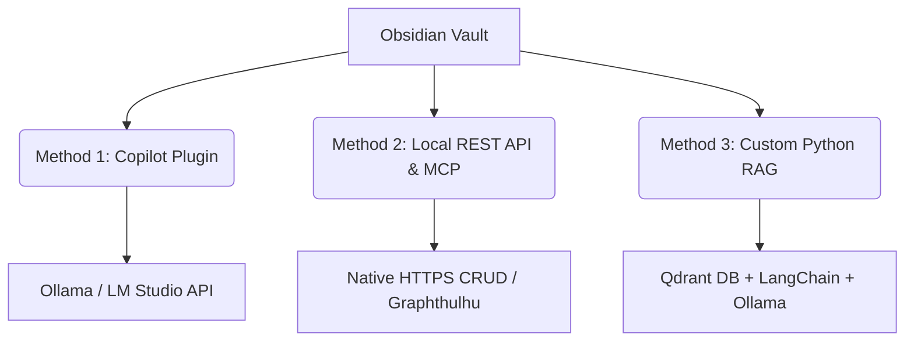
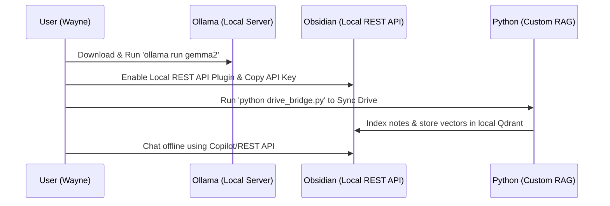

# 📊 2026 ARCHIVE REPORT: Local AI Failover, Open-Source Agent Frameworks, and MCP Swarm Research
> **Date:** June 14, 2026  
> **Author:** Antigravity Master Brain Fleet Swarm  
> **Status:** ARCHIVED (Episodic Memory Indexed)  
> **Target Vault:** [Research_Archives](file:///c:/Users/Curtis/New%20folder/construction-website/Keystone_HQ/00_Master_Brain/Research_Archives)

---

## ── EXECUTIVE SUMMARY ──────────────────────────────────────────────────

In response to Wayne Stevenson's directive, a coordinated agent swarm conducted deep research into the mid-2026 landscape of **Local AI Failover (Gemma 2)**, **Open-Source Agent Frameworks** (similar to Nous Research's Hermes Agent), and the **Model Context Protocol (MCP)** ecosystem.

This report compiles the swarm's findings into a structured archive. It defines:
1. **What we can do today** with our existing hardware and workspace capabilities.
2. **What we need** (hardware upgrades, API keys, software modifications) to achieve absolute sovereignty and local agent autonomy.
3. **Specific codebase transplant targets** from advanced repositories to upgrade our self-learning (`self_learning.py`) and memory retrieval (`hybrid_retrieval.py`) layers.

---

## ── SECTION 1: LOCAL GEMMA SETUP & OBSIDIAN INTEGRATION ───────────

To insulate our workspace against cloud API shutdowns or government intervention, we can run a localized instance of Google's **Gemma 2** and connect it directly to our Obsidian vault.

### 1. Local Inference Engine Options on Windows

#### Method A: Ollama (Recommended / Easiest)
Ollama runs as a native Windows background service, managing model loading, GPU acceleration, and exposing an OpenAI-compatible API.
*   **Setup Steps**:
    1.  Download the Windows installer from [ollama.com](https://ollama.com) and install it.
    2.  Open PowerShell and run the pull commands:
        *   *Gemma 2 (9B - Balanced)*: `ollama run gemma2`
        *   *Gemma 2 (27B - Deep Reasoning)*: `ollama run gemma2:27b`
        *   *Gemma 2 (2B - Ultra-Light)*: `ollama run gemma2:2b`
    3.  Once running, Ollama hosts an API server at `http://127.0.0.1:11434` (OpenAI compatibility endpoint: `http://127.0.0.1:11434/v1`).

#### Method B: llama.cpp (Advanced / Memory Optimized)
llama.cpp is a pure C/C++ implementation that offers granular control over CPU/GPU offloading and custom quantizations.
*   **Setup Steps**:
    1.  Install llama.cpp using Windows Package Manager: `winget install llama.cpp` (or download CUDA-enabled binaries from the [llama.cpp GitHub Releases](https://github.com/ggerganov/llama.cpp)).
    2.  Download the desired quantized Gemma 2 model in **GGUF** format (e.g., from Hugging Face repository `bartowski/gemma-2-9b-it-GGUF`).
    3.  Launch the local server:
        ```bash
        llama-server.exe -m path/to/gemma-2-9b-it-Q4_K_M.gguf -c 8192 --port 8080
        ```

#### Method C: vLLM (For High-Throughput Production Serving)
vLLM does not officially support Windows natively. It must be run via **WSL2** or **Docker Desktop**.
*   **Setup Steps**:
    1.  Enable WSL2 (`wsl --install`) and install a Linux distribution (Ubuntu).
    2.  Install NVIDIA CUDA Toolkit inside the WSL2 Ubuntu environment.
    3.  Install vLLM: `pip install vllm`
    4.  Run the server pointing to the Gemma 2 Hugging Face ID:
        ```bash
        python -m vllm.entrypoints.openai.api_server --model google/gemma-2-9b-it
        ```

---

### 2. Methods for Connecting Local LLMs to Obsidian

We identified three distinct integration methods, listed in order of complexity:



#### Method 1: Copilot for Obsidian Plugin (Easiest UI)
Allows you to override cloud API keys and point your Obsidian chat UI directly to your local Ollama or LM Studio instance.
1.  Install the **Copilot** community plugin in Obsidian.
2.  Go to **Settings > Copilot** and under **Model Provider**, select `Ollama` or `Custom OpenAI Compatible`.
3.  Set the **Base URL** to `http://127.0.0.1:11434/v1` and use model name `gemma2`.
4.  No API key is required (input any placeholder string like `local`).

#### Method 2: Obsidian Local REST API Plugin (Secure CRUD & MCP Server)
Provides a secure HTTPS server on port `27124` allowing local [[AGENTS|agents]] to perform Create, Read, Update, and Delete actions on notes, and execute Obsidian commands.
1.  Install the **Local REST API** plugin (by CoddingtonBear) and enable it.
2.  Go to settings, enable HTTPS, and copy the auto-generated **Authorization Token**.
3.  This plugin includes native support for the **Model Context Protocol (MCP)**, allowing MCP-compliant [[AGENTS|agents]] to index and search notes programmatically.

#### Method 3: Custom Python RAG (Vector Database Integration)
For programmatic autonomous [[AGENTS|agents]], we run a custom Python pipeline that indexes notes to our local Qdrant instance.
1.  Run Qdrant via Docker: `docker run -d -p 6333:6333 -p 6334:6334 qdrant/qdrant`
2.  Run an embedding model locally: `ollama pull nomic-embed-text`
3.  Use a Python script (utilizing LangChain or LlamaIndex) to split markdown files, vectorize them using Ollama's embeddings, and ingest them into Qdrant.
4.  The local agent queries the local Qdrant collection, retrieves relevant notes, and formats them as context prompts for Gemma 2.

---

## ── SECTION 2: OPEN-SOURCE AGENT FRAMEWORKS & TRANSPLANT TARGETS ──

To build self-improving [[AGENTS|agents]], we don't need to write everything from scratch. We can inspect high-end open-source frameworks and transplant their architectures directly into our current codebase.

### 1. Framework Analysis

#### A. Nous Research - Hermes Agent
*   **Repository:** [https://github.com/NousResearch/hermes-agent](https://github.com/NousResearch/hermes-agent)
*   **Core METAPHOR:** The "Filing Cabinet" Pattern.
*   **Key Concept:** It starts with a blank slate. If it encounters a task it cannot do, it writes a custom script, tests it, and saves it as a static `SKILL.md` instruction folder inside its directory, conforming to the [agentskills.io](https://agentskills.io) standard. It also manages a lightweight, FTS5-enabled SQLite database for session memory.
*   **Transplant Target:** Look at `skills/` directory for skill-parsing routines. Hermes implements **progressive disclosure**, reading only skill names/descriptions at boot to minimize token count. It only reads the full script and markdown instructions when the user request triggers that specific skill.

#### B. Letta (formerly MemGPT)
*   **Repository:** [https://github.com/letta-ai/letta](https://github.com/letta-ai/letta)
*   **Core METAPHOR:** The LLM "Operating System" (RAM vs. Disk).
*   **Key Concept:** Divides agent memory into **Core Memory** (in-context, writeable blocks like RAM containing user profiles and agent persona) and **Archival/Recall Memory** (out-of-context database storage like Disk). It gives the agent specific tool functions (`core_memory_append`, `core_memory_replace`) to edit its own prompt context on the fly.
*   **Transplant Target:** Read `letta/memory.py` for RAM/Disk [[STATE|state]] definitions, and search `letta/functions/` for the background `summarize_messages` function which automatically compresses older messages in the queue when tokens fill up.

#### C. GenericAgent (lsdefine)
*   **Repository:** [https://github.com/lsdefine/GenericAgent](https://github.com/lsdefine/GenericAgent)
*   **Core METAPHOR:** Skill Crystallization.
*   **Key Concept:** A minimalist Python framework (~3,000 lines). It uses only 9 atomic tools (file read/write, code execution, web scan) to handle any task. When a task is completed successfully, it "crystallizes" the trajectory and saves it to its L3 memory layer.
*   **Memory Tiers**: 
    *   *L0 (Meta Rules)*: Immutable system prompt constraints.
    *   *L1 (Stable Facts)*: Long-term domain facts.
    *   *L2 (Session Context)*: Conversation history.
    *   *L3 (Task Skills)*: Crystallized SOPs.
    *   *L4 (Working Memory)*: Instant task parameters.
*   **Transplant Target:** Study `agent_loop.py` (~100 lines) which handles loop safety, tool execution, and crystallization checks.

#### D. Mem0 (Embedchain)
*   **Repository:** [https://github.com/mem0ai/mem0](https://github.com/mem0ai/mem0)
*   **Core METAPHOR:** Persistent Fact Graph.
*   **Key Concept:** Automatically extracts facts from conversations, checks for contradictions, updates outdated memories, and builds a semantic user/agent relationship graph.
*   **Transplant Target:** Look at the prompts in `mem0/memory/` used to direct the LLM to extract facts, deduplicate records, and resolve conflicting statements.

#### E. OpenViking
*   **Repository:** [https://github.com/volcengine/OpenViking](https://github.com/volcengine/OpenViking)
*   **Core METAPHOR:** Filesystem Context Database.
*   **Key Concept:** Maps agent tools, execution histories, and memories directly to a nested folder structure, performing context compression by only loading the path branch corresponding to the active task.

---

### 2. Codebase Upgrade Mapping for Keystone Master Brain

We can integrate these open-source features directly into our local infrastructure files:

#### 1. Upgrade `self_learning.py` (GenericAgent's Skill Crystallization)
*   **Current [[STATE|State]]:** `self_learning.py` relies on manual triggers to save insights or corrections.
*   **Transplant Plan:** Write a parser in `self_learning.py` that reads the latest log files from `Cognitive_Substrates_Console/` or `Transcripts/`. If a multi-step task succeeds, the script should automatically extract the exact command sequences, format them with YAML frontmatter, and save them as a new skill inside the [Skill_Vault/](file:///c:/Users/Curtis/New%20folder/construction-website/Keystone_HQ/00_Master_Brain/Skill_Vault) folder.

#### 2. Upgrade `hybrid_retrieval.py` (OpenViking's Hierarchical Loading)
*   **Current [[STATE|State]]:** Performs flat, brute-force vector queries across entire collections.
*   **Transplant Plan:** Implement **progressive folder-scoped retrieval**. Group vectors inside Qdrant by parent namespaces and folders (e.g. `construction/bill44`, `wellness/peptides`). Before querying, the retrieval engine checks the task context, narrows the search scope to that specific directory branch, and avoids searching irrelevant vector nodes, saving context tokens.

---

## ── SECTION 3: THE 2026 MODEL CONTEXT PROTOCOL (MCP) ECOSYSTEM ──────

The Model Context Protocol has formalized how agentic systems interface with external databases, platforms, and code compilers. 

### Key Ecosystem Standards and Tools
1.  **Crawler-mcp (crawler.sh)**: A game-changer for autonomous research. Unlike standard python-based scraping wrappers that crash on React/Next.js pages, `crawler-mcp` is a compiled binary that crawls entire sites, renders client-side JavaScript locally, and extracts clean, RAG-ready Markdown.
2.  **Bumblebee (Perplexity)**: A read-only supply-chain security scanner. It audits developer configurations (like `mcp_config.json` and `.mcp.json` files) to check for security vulnerabilities, path traversals, or un-sandboxed stdio execution.
3.  **Totalum MCP**: Bridges the gap between code editing and deployment. It allows coding [[AGENTS|agents]] to spin up local or remote Docker containers, manage Postgres databases, and host completed websites.
4.  **SkillsLLM**: A curated registry and marketplace for agent skills, CLI scripts, and verified MCP endpoints. Every listing is audited daily using Semgrep and dependency scanners.
5.  **MCP Bundles (mcpbundles.com)**: A hosted gateway that aggregates hundreds of third-party API connections into a single, pre-authenticated endpoint. It manages OAuth and secrets centrally, eliminating local config overhead.
6.  **Google Workspace MCP**: Google's official Workspace integration, allowing [[AGENTS|agents]] to read/write Google Docs, manage Google Sheets, query Gmail, and update calendars via OAuth desktop client credentials.

---

## ── SECTION 4: CAPABILITY MATRIX & SYSTEM REQUIREMENTS ──────────────

To implement a fully local, resilient agentic setup, we map out **what we can do today** with our current setup versus **what we need to acquire/install**.

### 1. Hardware Requirements (The VRAM Gate)

Agentic workflows require long context windows (storing MCP schemas, directory maps, and conversation chains). This makes GPU Video RAM (VRAM) the absolute gatekeeper of local speed:

*   **VRAM Spillage Penalty**: If the model size + context size exceeds the GPU's VRAM, the engine offloads computation to system RAM. This causes speed to drop from a fluid **30+ tokens/sec** to an unusable **1–3 tokens/sec**.
*   **Recommended Hardware Configuration**:
    *   **GPU**: NVIDIA GeForce **RTX 3090** or **RTX 4090** (24GB VRAM). The RTX 3090 is the most cost-effective local AI card. Two RTX 3090s (48GB VRAM) allow running Gemma 2 27B at full precision.
    *   **RAM**: 64GB+ DDR5 (to host loaded models and avoid system bottlenecks during multi-agent loops).
    *   **Storage**: 1TB+ NVMe M.2 SSD (loading 15-50GB models from an HDD is extremely slow).
    *   **Compute Architecture**: Stick to NVIDIA GPUs. Ollama, llama.cpp, and vLLM rely on native CUDA for Windows acceleration.

---

### 2. Capability Matrix ("What We Can Do" vs "What We Need")

| Feature / Goal | What We Can Do Now (With Current Stack) | What We Need (Requirements for Upgrade) |
|---|---|---|
| **Local LLM Serving** | Run Gemma 2 (2B / 9B) locally on CPU or mid-tier GPU using Ollama on Windows. | A dedicated **NVIDIA GPU with 24GB VRAM** (e.g. RTX 3090/4090) to run Gemma 2 27B at 30+ t/s. |
| **Obsidian Chat** | Connect Ollama to Obsidian using the Copilot plugin or BMO Chatbot plugin over localhost. | Install and configure **Obsidian Local REST API** for full CRUD capabilities and MCP-server hooks. |
| **Self-Learning / Evolution** | Manually record insights/rules via `self_learning.py` and run compaction. | Write an automated **trajectory crystallizer script** in `self_learning.py` to auto-generate `.md` skills. |
| **Context Management** | Query flat vector databases across the entire Qdrant workspace. | Upgrade `hybrid_retrieval.py` with **hierarchical scope filters** (OpenViking model) to search folder branches. |
| **Web Crawling** | Use standard API fetching or browser automation via Playwright/DevTools. | Install the binary for **`crawler-mcp`** to enable headless, local-first JavaScript-to-Markdown rendering. |
| **Google Workspace Sync** | Sync files via the local `drive_bridge.py` script. | Complete OAuth setup for official **Google Workspace MCP** using Desktop client Credentials. |

---

## ── IMPLEMENTATION ROADMAP (FAIL-SAFE BACKUP SYSTEM) ──────────────────

To set up a local, offline version of your current smart assistant, execute these steps in order:



1.  **Serve Gemma 2 Locally**: Download Ollama and pull `gemma2`. Keep the background service active.
2.  **Enable Vault API Access**: Install the "Local REST API" community plugin in Obsidian. Copy the API key.
3.  **Localize Vector DB**: Keep the local Docker Qdrant container running. Run `python drive_bridge.py` to ingest the latest Google Drive files from Spark into the local Qdrant instance.
4.  **Configure Local Fallback**: In the local agent's code, add a fallback router: if cloud APIs fail, switch the LLM endpoint to `http://localhost:11434/v1` and use model `gemma2`.
5.  **Transplant Skill Crystallizer**: Add the crystallization logic to `self_learning.py` so that local executions compile successful workflows into markdown files within `Skill_Vault/`, keeping the local assistant smart.


---
📁 **See also:** ← Directory Index

**Related:** [[20260615_SYS_local_multi_agent_frameworks_integration]] · [[02_gemini_agent_local_integration]] · [[20260613_AGENT_ARCH_how_do_the_most_advanced_ai_agent_frameworks_in_2026_impleme]]
